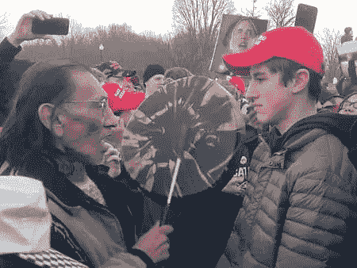

# Everipedia 互联网文化综述#4:推特暴民和表象的变化无常

> 原文：<https://medium.com/hackernoon/internet-culture-roundup-4-twitter-mobs-and-the-fickleness-of-appearances-cf0d935ff127>

## 已故的伟大喜剧演员和文化评论家乔治·卡林曾说过:“永远不要低估大群体中愚蠢的人的力量。”

在本周的 Everipedia 互联网文化综述中，我们来看看一个面临 Twitter 暴民愤怒的高中生，一个崭露头角的嘻哈时尚引领者，一个不幸事件中的营销天才，一个明星四分卫的可能模特女友，以及阿富汗最大的音乐明星。

Nathan Phillips and Nicholas Sandmann standing face to face

## 尼古拉斯·桑德曼

在一段高中学生尼古拉斯·桑德曼戴着“让美国再次伟大”帽子对美国原住民内森·菲利普斯傻笑的视频剪辑出现后，推特上出现了特朗普时代最糟糕的情况。在没有过多了解细节的情况下，在[出现了情况的进一步证据](https://reason.com/blog/2019/01/20/covington-catholic-nathan-phillips-video)以及一些媒体如[华盛顿邮报](https://archive.is/bEDwv)、[大西洋](https://www.theatlantic.com/ideas/archive/2019/01/julie-irwin-zimmerman-i-failed-covington-catholic-test/580897/)和[其他](https://www.nytimes.com/2019/01/21/opinion/covington-march-for-life.html)被迫撤回他们最初的报道并为他们的快速判断道歉后，事件的最初叙述被颠倒了。尽管有理由对这一事件进行更彻底的调查，但显而易见的是，新闻机构失败得很惨，记者们未能对他们的报道进行最基本的尽职调查。更不用说事件发生后，这些青少年和一个被误认为是桑德曼的人所面临的威胁。桑德曼的案例表明，Twitter 如今拥有扩散虚假信息的危险力量，作为我们在该平台上看到的任何信息的消费者，我们都应该保持警惕。

Tiffany Calver performing at an event

## [蒂芙尼·卡尔弗](https://everipedia.org/wiki/lang_en/tiffany-calver/)

随着德雷克的英国和欧洲巡回赛的到来，已经宣布英国 DJ 和时尚大师蒂芙尼·卡尔弗将开放 6 God 和 Tory Lanez。卡尔弗最近成为 1Xtra 的说唱节目的主持人，该节目还在英国首屈一指的嘻哈电台节目 BBC Radio 1 播出。她是主持该节目的第一位女性，该节目之前由查理·斯洛特和蒂姆·韦斯特伍德主持。年仅 24 岁的卡尔弗从西米德兰兹郡的一个小镇搬到伦敦[后，已经完成了很多工作，包括为碧昂斯和 Jay-Z 的巡回演唱会开演唱会。卡尔弗的事业肯定会蒸蒸日上，她被传统媒体认为是一个“](https://www.nssmag.com/en/music/16693/tiffany-calver)[引人注目的](https://hackernoon.com/internet-culture-roundup-3-not-notable-enough-thats-how-mafia-works-b9ccf26402dc)人物只是时间问题。

A headshot of Oren Aks

## [柳文欢 Aks](https://everipedia.org/wiki/lang_en/oren-aks/)

在 2017 年春天之前，千禧一代营销 meme agency Jerry Media(他是热门 Instagram 账户如 Fuck Jerry 的背后)被赋予了一生的工作，即在巴哈马推广一种被称为 Fyre Festival 的独家音乐节体验。杰里媒体指定柳文欢阿克处理营销战略，以执行 Fyre 节创始人比利麦克法兰和杰·鲁的愿景。利用影响者的力量，Aks 组织了一场运动，阻止了人们的新闻滚动，这可能会在未来被商学院研究。尽管营销活动取得了巨大成功，但电影节本身却是一场彻底的灾难。我记得我亲眼看到了第一条关于巴哈马群岛发生的混乱的推文，并看到了一个立即登上页面的机会，在接下来的几周里，故事出现了 Fyre Festival 是如何化为乌有的。

差不多两年后，网飞和 Hulu 上的决斗纪录片上映了，讲述了 Fyre Festival。尽管杰里媒体是网飞制作的幕后黑手，但阿克什(Fyre 音乐节后 6 个月离开杰里媒体)向 Hulu creation 讲述了他的故事。Fyre Festival 的崩溃打击了许多在我们这个时代有价值的模因点；影响者文化的巨大力量，千禧一代对它的消费，以及影响者和他们影响的人都明确希望成为比他们自己更大的事物的一部分。麦克法兰利用了这一点，Fyre 音乐节的失败显示了这种文化的潜在缺点。这里的教训是:永远不要相信外表。

Christen Harper pictured in one of her photos on Instagram

## 克里斯腾·哈珀

当你是一个出现在职业足球比赛中的模特时，人们很自然地会猜测他们是否会与球场上的某个球员发生浪漫关系。本周有传言称，洛杉矶公羊队的四分卫贾里德·戈夫正在和威廉敏娜的模特克里斯汀·哈珀约会，因为她参加公羊队比赛的照片被泄露了。戈夫显然试图将这段关系保密，只告诉了几个亲密的朋友和家人。不管这是不是真的，这位女演员/模特应该会受到大量的关注，尤其是在亚特兰大超级碗之前。谁知道呢，说不定她还会赶上大赛呢！

A picture of Abdul Salam Maftoon

## [阿卜杜勒·萨拉姆·马夫图恩](https://everipedia.org/wiki/lang_en/abdul-salam-maftoon/)

在阿富汗东北部的偏远山区，你最不可能找到加拿大总理贾斯廷·特鲁多的翻版。然而，由于阿富汗版的美国偶像，阿富汗之星，我们被介绍给这样一个人！Abdul Salam Maftoon 是巴达赫尚省的一名贫穷劳工，但他用达里语和普什图语演唱的浪漫民歌却让他的国家着迷。他认为，他与特鲁多的相似之处增加了他获胜的机会，并在今年晚些时候参加决赛。马图恩表示希望有一天能见到首相。老实说，如果他的请求被大量转发，如果有一天他这么做了，我不会感到惊讶。