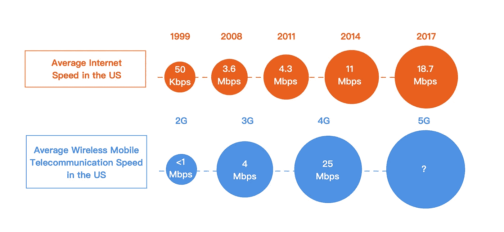
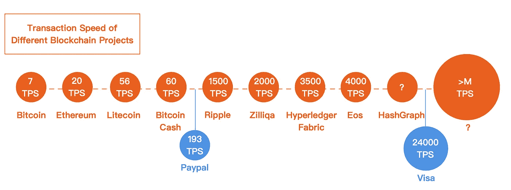
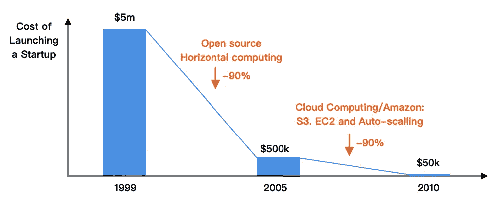
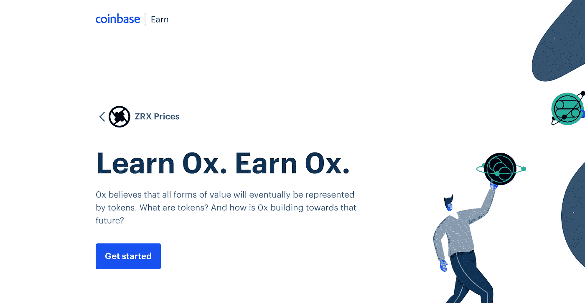

# 互联网 vs 区块链革命:早期的挑战(第三部分)

> 原文：<https://medium.com/hackernoon/internet-vs-blockchain-revolution-challenges-in-the-early-days-part-3-e8e26dd2ab57>

*本文是互联网 vs 区块链革命系列文章的一部分。如果你有兴趣阅读其他文章，* [*看看这个帖子*](/@remi.gai/internet-vs-blockchain-revolution-article-series-introduction-7f6ca1592796) *。*

在新兴技术的早期阶段，通常存在可扩展性、成本和教育方面的挑战，限制了突破性应用的开发和大规模采用。然而，随着时间的推移，这些挑战通常会得到解决，因为我们已经见证了互联网的发展，我们应该预计区块链也会有类似的技术进步。

# 可扩展性和成本:

尽管今天的互联网连接速度很快，但早期的互联网面临着可扩展性和成本方面的挑战。1996 年 8 月 7 日， *AOL* 的互联网服务因无法支持大量的互联网用户而中断了 19 个小时。那时，越来越多的美国人每天都生活在网上，AOL 是美国最大的互联网服务提供商，其他竞争者包括 Prodigy、CompuServe 和 T21。互联网本身并没有崩溃，但访问它的能力暂时停止了，这对许多开始习惯在日常生活中上网的人来说是一件大事。这类似于 2017 年 12 月在区块链世界发生的事情，其中 [CryptoKitties](https://medium.com/u/c8b1419b5d28?source=post_page-----e8e26dd2ab57--------------------------------) 的激增了[以太坊](https://medium.com/u/d626b3859bc9?source=post_page-----e8e26dd2ab57--------------------------------)上的链上交易量，阻塞了网络。大多数用户无法在区块链上完成交易，除非他们愿意支付高额的汽油费，这在社区中造成了很多混乱和困扰。虽然[以太坊](https://medium.com/u/d626b3859bc9?source=post_page-----e8e26dd2ab57--------------------------------)网络堵塞让我们许多人意识到目前区块链技术在服务更复杂的用例方面缺乏可扩展性，但在互联网和区块链的早期，这两次可扩展性的失败表明了这些技术在几年内对早期采用者的重要性，以及对更好的可扩展性解决方案的需求，以支持不断增长的用户群和需求。

Average Internet and Wireless Mobile Telecommunication Speed in the US

互联网早期启动一家创业公司的高额网络费用和成本与区块链行业的现状也类似。当时，上网的过程需要一个调制解调器和一条电话线，所有的在线服务都维护着一个本地调制解调器网络，供人们拨号上网。当时最受欢迎的在线服务是美国在线，每月收费 9.95 美元，可以无限制访问 5 个小时，每增加一个小时收费 2.95 美元，以今天的标准来看，这是非常有限的。然而，随着时间的推移，与 *DSL* 的宽带连接最终到来，提升了互联网速度，到 2014 年，互联网速度比 1999 年快了 200 倍，便宜了 90%。同样，我们也见证了无线移动通信速度的增长，从 2G 技术的不到 1Mbps 到 4G 技术的 25Mbps，使新服务通过移动电话变得可行和实用，如音乐和视频流。随着时间的推移，围绕可伸缩性和成本的限制逐渐消除，允许更复杂和带宽密集型的应用变得实用和可行。

Transaction Speed of Various Blockchain Projects

在区块链世界，我们仍然处于技术开发周期的早期，可扩展性和成本方面的挑战阻碍了更复杂的用例和大型用户群的实用性。低可伸缩性意味着开发人员或用户将不得不支付更高的费用来出价高于队列中的其他事务，以减少等待时间。截至 2019 年 2 月，[以太坊](https://medium.com/u/d626b3859bc9?source=post_page-----e8e26dd2ab57--------------------------------)的平均交易费用约为 0.13 美元，其中更复杂的 dapps，如链上游戏，将迅速积累高额交易费用。虽然不是每个操作都需要在链上运行，但仍然迫切需要区块链具有可伸缩性，以支持不断增长的 dapps，以及生活在同一个账本上的所有日常交易( *Visa* 每秒处理 24，000 笔交易)。许多项目正在研究不同的方法来提高区块链的交易速度，在可伸缩性、安全性和分散性之间进行可变的权衡。随着最近 mainnet 推出的 [EOS](https://medium.com/u/146fb2cf2a1d?source=post_page-----e8e26dd2ab57--------------------------------) 和 [TRON](https://medium.com/u/7c2f78c9d321?source=post_page-----e8e26dd2ab57--------------------------------) (分别为 4000 和 750 TPS)，我们已经看到在过去几个月中发布的更复杂的 dapps 越来越多，我们预计这一趋势将继续下去，因为更多可扩展的区块链正在该领域部署。总的来说，正在探索不同的扩展解决方案，如新型数据结构(分片、Tangle、DAG、Coda 等)。)、第 2 层解决方案(侧链、离链、散列时间锁等。)，以及更高效的共识算法(POS、DPOS、Casper、Avalanche、Hashgraph 等)。)将逐渐增加带宽并降低区块链上的交易成本，从而在未来几年内实现新的使用案例和服务。

*The decrease in the cost of launching a Startup from 1999–2010 (Source:* [*Mark Suster*](https://medium.com/u/946f534320f7)*)*

此外，我们预计在区块链创业的成本也会随着时间的推移而降低。在互联网革命期间，创业的平均成本也逐年大幅下降，从 1999 年的 500 万美元降至 2005 年的 50 万美元和 2010 年的 5 万美元。第一波成本降低是由于*开源*(这意味着 UNIX、web 服务器和 Oracle 数据库无需许可证)和*水平计算*(这意味着无需购买昂贵的 Sun 服务器& EMC 存储)的出现。然后，第二波成本下降是由于*云计算*的成熟，由 AWS 推广，提供网络存储(S3)、处理能力(EC2)以及根据云上的流量(自动扩展)来扩大或缩小规模的能力。据 Gartner 称，部署企业区块链概念验证的起始成本为 275，000 美元，最高可达数百万美元。根据区块链([以太坊](https://medium.com/u/d626b3859bc9?source=post_page-----e8e26dd2ab57--------------------------------)、 [NEO](https://medium.com/u/95d056302ecb?source=post_page-----e8e26dd2ab57--------------------------------) 、 [EOS](https://medium.com/u/146fb2cf2a1d?source=post_page-----e8e26dd2ab57--------------------------------) 等)的不同，公共区块链上简单 dapps 的部署和交易费用可以让你花费 30-85k 美元([有趣的细分在此](https://ylv.io/how-much-does-it-costs-to-run-dapp-in-2018/))，目前的区块链人才稀缺且昂贵(平均 15 万美元)。与互联网的发展类似，随着区块链交易速度变得更具可扩展性、更便宜、企业端的全栈平台(BaaS hosting — [Kaleido](https://medium.com/u/209f16e6ac4a?source=post_page-----e8e26dd2ab57--------------------------------) 、 *AWS* 、 *Azure* 、*甲骨文*等)、开发平台(NoOps — [Esprezzo](https://medium.com/u/728ecc55271a?source=post_page-----e8e26dd2ab57--------------------------------) )、中间件([omniduty](https://medium.com/u/a4de5639b1e9?source=post_page-----e8e26dd2ab57--------------------------------))和开发工具(【T26)

# 教育:

教育是采用新技术、降低准入门槛和帮助“跨越鸿沟”(由[杰弗里·摩尔](https://medium.com/u/38b787a1e466?source=post_page-----e8e26dd2ab57--------------------------------)创造的术语)的重要驱动力。在鸿沟出现之前，技术通常被视为外来物，一旦真正跨越了鸿沟，它就被认为可以安全使用。在互联网发展的早期，[来自 *AOL* 的 Jan Brandt](https://medium.com/u/80238f4be042?source=post_page-----e8e26dd2ab57--------------------------------) 被聘为营销副总裁以扩大其用户基础。在市场调查期间，她意识到人们不知道如何使用电脑就像“有人拿了一个电脑鼠标，开始像遥控器一样指向电脑”，所以回到基础很重要。向消费者推销一种在线服务优于另一种的优点，不如教育消费者什么是在线服务重要。美国在线实施的营销策略是发送试用盘和光盘给人们试用，结果证明是非凡的，人们注册并提供他们的信用卡。美国在线对这一战略进行了大量的再投资，以至于 CD 随处可见，在人们的邮箱里，在新电脑上，在杂志上，在电影租赁时免费赠送，等等。因此，一度全球生产的 50%的 CD 都有美国在线的标志。这一举措帮助 AOL 超越了竞争对手，并在过去几年里将其用户群从 20 万增长到 2500 万。总的来说，AOL 的活动是一个很好的例子，它通过主动降低准入门槛，帮助推动了“不太懂技术”的早期用户的采用。

*Learn and Earn 0x program from Coinbase*

为了与加密货币世界进行比较，我们已经看到了许多教育下一代加密和区块链采用者的计划，如大型会议，如 *Consensus、*德勤*或 *IBM* 举办的*企业教育，开发人员教育，如 [ConsenSys Academy](https://medium.com/u/62149170daa2?source=post_page-----e8e26dd2ab57--------------------------------) ，以及大学教育，如*block chain Education Network(*[Ben](https://medium.com/u/786b94810d8d?source=post_page-----e8e26dd2ab57--------------------------------))。许多公司也试图通过活动和营销活动免费发放代币或冷钱包。最近，[比特币基地](https://medium.com/u/b9034df3e57a?source=post_page-----e8e26dd2ab57--------------------------------)推出了一个[学习和获得加密程序](https://www.coinbase.com/earn/0x)，为完成他们的教育课程提供加密货币奖励。目前，与区块链的互动仍然有很多摩擦，并要求你有一些基础知识(私人/公共密钥，天然气/交易费等)。)相比传统支付解决方案，如 *Venmo* 或 *Paypal，*更不用说密钥管理和交易带来的不可逆转的风险了。我们仍处于该行业的早期，全球采用率不到 1%，对普通民众进行加密货币、区块链和密钥管理方面的教育对于该行业的发展至关重要。像美国在线和比特币基地这样的大公司已经做好准备，通过免费 CD 试用和加密货币提供额外的激励，积极帮助降低进入门槛，进一步推动采用。

总的来说，不可否认的是，在过去几年中，区块链行业在解决可扩展性、成本和教育方面的挑战方面取得了重大进展。虽然我们仍处于这一技术周期的早期，但我们有信心区块链将像互联网一样成熟，逐渐变得更加可扩展，更加实惠，更适合大规模采用。

____

互联网革命的事实基于 *Brian McCullough* 写的书*“互联网是如何发生的”*。马克·吐温曾经说过，“历史不会重演，但会押韵”。我们试图在互联网和区块链革命之间找出一些相似之处，以帮助企业家和投资者更好地理解技术生命周期。请在下面留下您的想法和评论，希望这个文章系列能够提供一些关于区块链行业的有价值的观点。

作者:雷米·盖

**资料来源:** 书*《互联网是如何发生的》*，作者*布莱恩·麦卡洛*。
[https://www . LinkedIn . com/pulse/reply-un ending-chasm-how-survive-Geoffrey-Moore/](https://www.linkedin.com/pulse/reply-unending-chasm-how-survive-geoffrey-moore/)
[https://www.coinbase.com/earn/0x](https://www.coinbase.com/earn/0x)
[https://bothsidesofthetable . com/why-has-seed-investing-declined-and-this-mean-for-the-future-6a 9572357130](https://bothsidesofthetable.com/why-has-seed-investing-declined-and-what-does-this-mean-for-the-future-6a9572357130)
[https://bothsidesofthedtable . com/a](https://bothsidesofthetable.com/a-deep-dive-into-what-has-really-changed-in-venture-capital-f5d225f7f8)