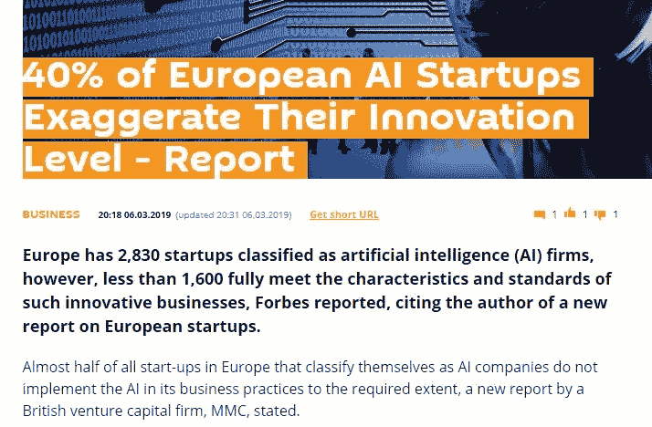

# 介绍:法克艾公司

> 原文：<https://medium.com/hackernoon/introducing-fakeai-companies-610d81d0f466>

## 最近几天，网络上疯传一项新的研究**，发现 40%声称使用人工智能的欧洲公司并没有真的这样做。哇哦。**

****

**这项研究调查了大约 2830 家公司，这些公司将自己定义为以某种方式使用人工智能的公司，但当 MMC 的研究团队进入时，他们发现确实没有证据表明使用了机器学习或任何类似人工智能的东西。这些公司为什么这么做？**大多数人只是说这帮助他们从投资者那里筹集了更多的资金。****

**我们从中学到了什么？答:并不是每家在名字中加入“人工智能”的公司都在幕后做人工智能的工作。**

**B.需要对通过独立开发算法来使用 AI 的公司和使用现成包或现成货架产品的公司进行非常显著的区分。**

**不要误会我的意思，最后一个选择没有错。相反，我甚至鼓励相当多的公司和组织不要发明轮子，而使用我们今天拥有的各种解决方案。不是每个人都需要像谷歌、脸书、亚马逊等这样的庞大算法。我们已经取得了如此巨大的进步，即使是“货架产品”也能提供巨大的价值。**

****

**最后一个或许也是最重要的教训是，如果我们愿意或不愿意，几乎每个公司都会在未来十年成为人工智能公司——不管它愿意或不愿意。**

**不是因为吸引投资者或在公众眼中性感，而是因为它将成为一个标准，利用你拥有的数据做一些有用的事情。使用真正的人工智能的障碍将会消失，我们不会对此大惊小怪。**

**正如今天几乎每家公司都是“互联网公司”——我们都很清楚一切都在互联网上运行，所以我们甚至不提它。这正是人工智能在未来几年的情况，这是科技世界的自然发展。**