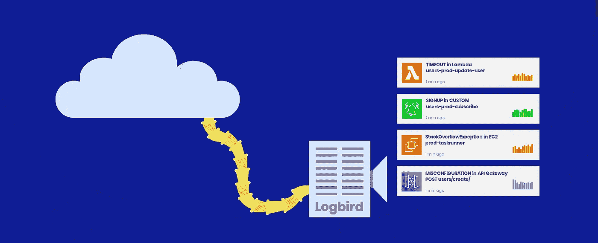
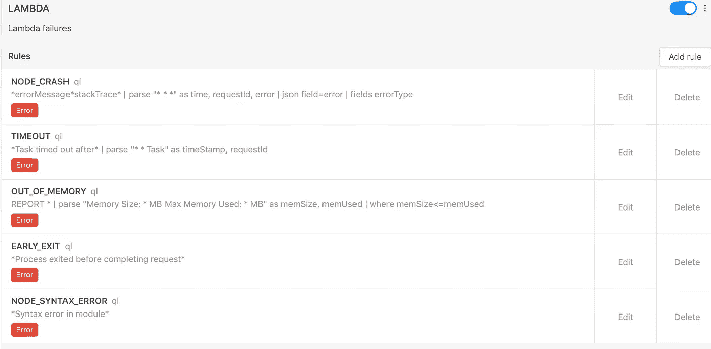
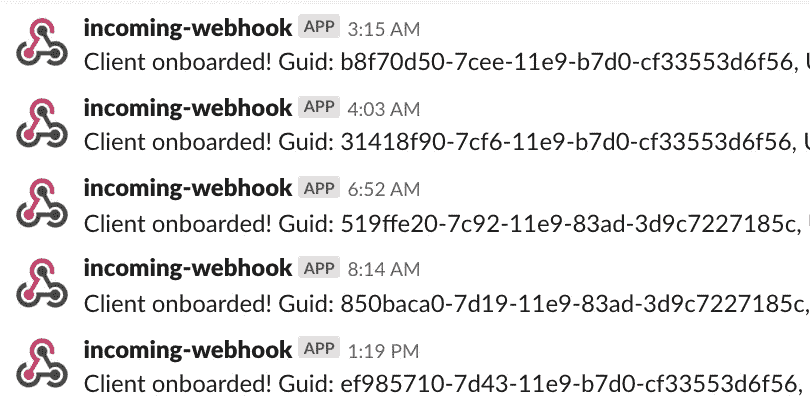
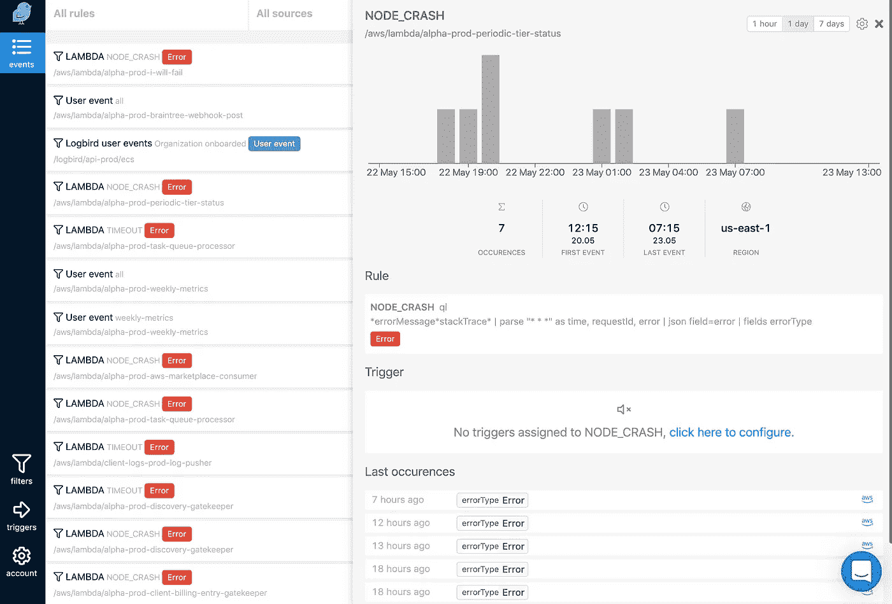

# 为什么我们要为云日志构建网关

> 原文：<https://medium.com/hackernoon/introducing-logbird-log-gateway-for-the-cloud-2ec5a0b07495>

Recognize and trigger activity for events in your logs.

今天，我们要介绍的是[日志鸟](https://logbird.io)。为事件过滤日志流并为这些事件触发活动的服务。这将使开发人员能够轻松地从日志中捕捉任何事件，将其可视化并通知其他应用程序。发现分布式应用程序中的技术问题、跟踪业务事件、自动化工作流甚至以异步方式在应用程序之间进行通信将变得很容易。

# 第一个用例:错误检测

Logbird 是由 [Dashbird](https://dashbird.io) 背后的团队构建的——一个无服务器监控平台，拥有超过 25 万个受监控的 Lambda 函数。开发人员在构建无服务器应用程序时最常见的问题之一是跟踪托管服务的故障。Logbird 通过简化云错误检测解决了这个问题。您可以从 Lambda、API Gateway、AppSync、Fargate 等服务流式传输日志，过滤它们的故障，并在出现问题时获得通知。

Here’s a filter to catch all errors from Lambda functions (running Node.js).

# 但是，如果您可以使用日志进行交流，会怎么样呢？

收集用户活动/业务事件的数据发生在应用程序的不同部分，可能会很复杂，并且涉及不同分析服务之间的大量通信。使用 Logbird，开发人员可以以 JSON 格式注销事件，并将所有内容收集在一个地方，业务人员可以很容易地跟踪事件并将事件发送到外部服务。 [Dashbird](https://dashbird.io) 使用 Logbird 来跟踪客户的注册、支付和其他活动，并自动与销售和营销工具进行通信。

Logbird sending information to slack for each signup.

# 新的事件源

在一个混合应用程序的世界中，部分是无服务器的，部分是容器/虚拟机/其他，在新旧之间编排工作流可能会很复杂。然而，日志提供了一个有趣的机会，通过简单地注销一个关键字或一个命令来启动执行流。由于 Logbird 支持从日志行中提取数据，开发人员甚至可以构建异步数据插入流，在后台发出数据库请求。剩下的就看你的想象力和用例了。

# 它是如何工作的？

**分析服务之间的一个关键区别是，Logbird 可以允许更便宜的处理，因为它不必保留原始日志。**

Logbird 通过自动集成 AWS CloudWatch 和 HTTP 端点来支持日志获取，您可以使用 FluentD 等服务发送日志。

为了过滤，Logbird 开发了自己的查询语言(受 SumoLogic 的查询语言的启发),但也支持正则表达式、glob 模式和普通单词匹配。为了更容易地跟踪已知的云事件，我们正在启动一个[公共过滤器库](https://logbird.io/docs/rules/rule-library)，向社区开放供贡献。

Logbird 目前支持 SNS 触发器。

# 今天上市

我们自己一直在使用 Logbird，并与一些公司合作，引导他们走向成功。今天，我们以测试版的形式向全世界开放，你可以[在这里](https://logbird.io)注册。此外，请查看我们的[过滤器库](https://logbird.io/docs/rules/rule-library)，并在此自由投稿[。](https://github.com/dashbird/filters)