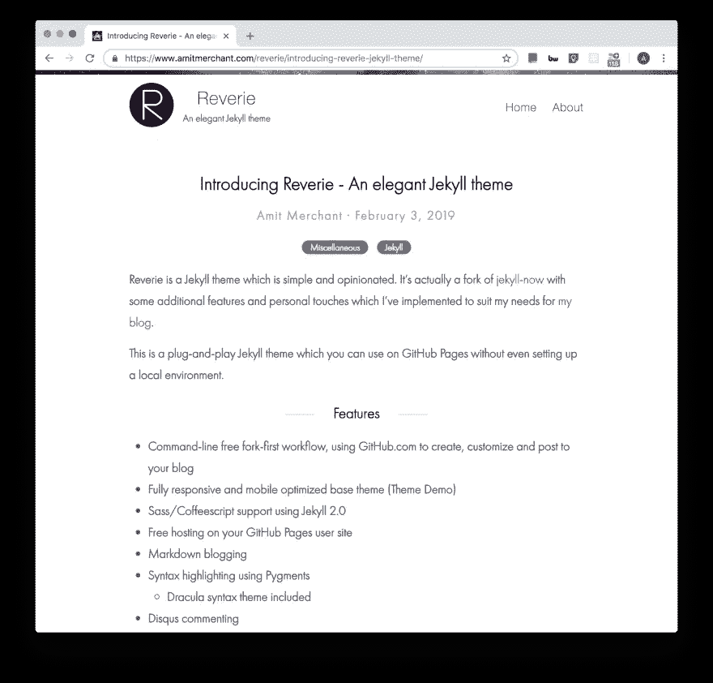

# 引入幻想——一个荒谬优雅的 Jekyll 博客主题

> 原文：<https://medium.com/hackernoon/introducing-reverie-a-ridiculously-elegant-jekyll-theme-for-blogging-a4dd996ce98d>


[幻想](https://github.com/amitmerchant1990/reverie)是由[化身](https://jekyllrb.com/)驱动的主题，简单而固执。它实际上是 [jekyll-now](https://github.com/barryclark/jekyll-now) 的一个分支，具有一些额外的特性和[个人风格](https://github.com/amitmerchant1990/amitmerchant1990.github.io)，我已经实现了这些特性以适应我的博客的需求。

> [*主题演示*](https://www.amitmerchant.com/reverie/introducing-reverie-jekyll-theme/)

这是一个即插即用的 Jekyll 主题，你可以在 GitHub 页面上使用，甚至不需要设置本地环境。



# 特征

*   命令行免费 fork-first 工作流，使用 GitHub.com 创建，定制和张贴到您的博客
*   全面响应和移动优化的基本主题(主题演示)
*   使用 Jekyll 2.0 支持 Sass/Coffeescript
*   GitHub Pages 用户网站上的免费托管
*   Markdown 博客
*   优雅的排版
*   Futura PT 字体(与 https://pixar.com 使用的字体相同)
*   使用 Pygments 突出显示语法
*   [德拉库拉语法主题](https://draculatheme.com/)收录
*   问题评论
*   SEO 优化
*   谷歌分析集成
*   对帖子进行分类
*   显示最近 GitHub 提交的主页小部件
*   简单讯息聚合订阅

# 在 GitHub 页面上使用幻想

# 步骤 1)将幻想转移到您的用户存储库中

Fork [this repo](https://github.com/amitmerchant1990/reverie) ，然后将存储库重命名为`yourgithubusername.github.io`。

你的 Jekyll 博客通常可以在 https://yourgithubusername . github . io 上立即看到(如果不是，你通常可以通过完成步骤 2 来强制构建)

# 步骤 2)定制和查看您的站点

通过编辑`_config.yml`文件，输入你的网站名称、描述、头像和许多其他选项。你可以在这里轻松打开谷歌分析跟踪、Disqus 评论和社交图标。

对`_config.yml`(或存储库中的任何文件)进行更改将迫使 GitHub Pages 用 jekyll 重建您的站点。几秒钟后，您的重建网站将在[https://yourgithubusername . github . io](https://yourgithubusername.github.io/)上可见——如果没有，请按照 GitHub 的建议等待十分钟，它很快就会出现。

# 发布你的第一篇博客文章

创建一个名为`/_posts/2019-2-13-Hello-World.md`的新文件来发布你的第一篇博客文章。这就是你发表第一篇博文所需要做的一切！这个[降价备忘单](https://github.com/adam-p/markdown-here/wiki/Markdown-Cheatsheet)在写帖子的时候可能会派上用场。

> 你也可以在 GitHub.com 的浏览器中添加额外的帖子！只需点击 `*/_posts/*` *中的新建文件按钮即可创建新内容。只需确保在每篇新博文的顶部包含* [*前置*](http://jekyllrb.com/docs/frontmatter/) *模块，并确保博文的文件名采用以下格式:年-月-日-标题. md*

# 在遐想中使用类别

你可以根据`categories`对你的内容进行分类。为此，你只需要在事情前面加上`categories`就像下面这样:

对于添加单个类别:

```
categories: JavaScript
```

要添加多个类别:

```
categories: [PHP, Laravel]
```

已归类的内容可以通过以下网址显示:[https://yourgithubusername.github.io/categories/](https://yourgithubusername.github.io/categories/)

# 简易资讯聚合

你的博客生成的 [RSS 源](https://en.wikipedia.org/wiki/RSS)可以在[https://yourgithubusername.github.io/feed](https://yourgithubusername.github.io/feed)找到。你可以在[这里](https://www.amitmerchant.com/feed)看到 RSS 提要的例子。

# 网站地图

你的博客生成的网站地图可以在 https://yourgithubusername.github.io/sitemap 找到。

# 许可证

该主题带有麻省理工学院的许可证。