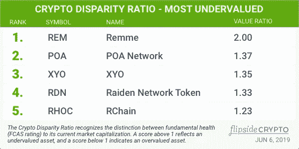
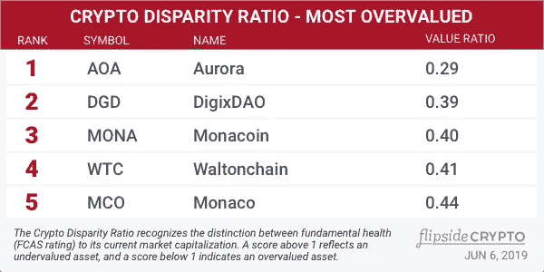

# 加密货币差异率

> 原文：<https://medium.com/hackernoon/introducing-the-cryptocurrency-disparity-ratio-d2a41a4ee251>

## 基本面健康和市值严重错位的加密货币。

与我们在 [CoinMarketCap](https://medium.com/u/61618ab68590?source=post_page-----d2a41a4ee251--------------------------------) 的朋友一起，每周我们都会制作**加密差异比率。**

> 加密差异率承认基本面健康( [FCAS](https://www.flipsidecrypto.com/fcas-explained) 评级)和当前市值之间的区别。高于 1 的分数反映资产被低估，低于 1 的分数表明资产被高估。

2019 年 6 月 6 日:五大 CDR **被低估**加密资产:

1.  [Remme](https://medium.com/u/e4a3ec27e22f?source=post_page-----d2a41a4ee251--------------------------------) (2.0)
2.  [早教网](https://medium.com/u/c6dce655e286?source=post_page-----d2a41a4ee251--------------------------------) (1.37)
3.  [XYONetwork](https://medium.com/u/b4e9c6cedfce?source=post_page-----d2a41a4ee251--------------------------------) (1.35)
4.  [雷电网络](https://medium.com/u/b92c9d83819e?source=post_page-----d2a41a4ee251--------------------------------) (1.33)
5.  [链家控股](https://medium.com/u/82b3d25834c6?source=post_page-----d2a41a4ee251--------------------------------) (1.23)

2019 年 6 月 6 日:五大 CDR **被高估**加密资产:

1.  极光官员(AOA) (.29)
2.  [Digix](https://medium.com/u/319ba551e007?source=post_page-----d2a41a4ee251--------------------------------) (.39)
3.  MonaCoin (.40)
4.  华而不实
5.  摩纳哥硬币([Crypto.com](https://medium.com/u/2b1ce056272a?source=post_page-----d2a41a4ee251--------------------------------))(. 44)

根据 FCAS 评级，为了确定那些最被低估和高估的资产，当前市值被转换为标准化百分位数，以便可以在 1000 点的范围内直接进行比较。

[当前 FCAS]与[当前标准化市值]的比率提供了一个相对的高/低分:

*   值超过 1 表示*资产被低估*(即 FCAS 高于市值表示的值);
*   低于 1 的值表示*被高估的*资产(其 FCAS 低于我们的预期)。

*免责声明。做你自己的研究，做一个明智的、有思想的、体贴的、成熟的、总体上头脑冷静的投资者。含义:此处包含的信息无意作为建议或信用分析的来源，也不构成投资建议。*