# UI2CODE 介绍:一个自动的颤振 UI 代码生成器

> 原文：<https://medium.com/hackernoon/introducing-ui2code-an-automatic-flutter-ui-code-generator-7e0a575c193>

## 在人工智能的帮助下，阿里巴巴的先宇科技团队正在开发一种智能工具，以 100%的准确率将视觉 UI 设计呈现为抖动代码


正如我们在最近一篇关于基于人工智能的算法开发的文章中所探讨的，自动化正在迅速地从开发人员可以处理的东西变成可以做开发人员工作的东西。虽然这种转变的程度在未来几年仍有待观察，但今天的一个主要焦点是人工智能如何处理应用程序开发的重复和乏味方面，以便人类开发人员可以将精力集中在其他地方。

Now, developers at Alibaba’s Xianyu(闲鱼) second-hand trading platform have launched the UI2CODE project to apply deep learning technology in converting visual user interface images to client-side code. With clear component, position, and layout features that suit the scope of machine learning, UI vision research presents an especially promising area for exploring these technologies’ uses in automatic code generation.

在这篇介绍 Xianyu 正在进行的工作的文章中，我们将探讨 UI2CODE 如何分析 GUI 元素和 UI 布局结构，从而为应用程序的整体设计生成 Flutter 代码。

> *延伸阅读:*
> 
> [*UI2code:如何微调背景和前景分析*](/@alitech_2017/ui2code-how-to-fine-tune-background-and-foreground-analysis-fb269edcd12c)

# 项目的基础

UI2CODE 的早期工作始于 2018 年 3 月，当时先宇技术团队对其技术可行性进行了初步研究。从那时起，该项目经历了三轮重构，通过各种机器学习代码生成程序来满足商业设置的标准。

UI2CODE 的核心原则是划分和控制 UI 开发特性，以避免过多鸡蛋放在一个篮子里的情况。为此，我们根据三个核心需求评估了它所包含的解决方案。首先，为了视觉复原的精度，它们的输出不能有哪怕一个像素的偏差。其次，尽管机器学习受制于概率，但它们的结果必须达到 100%的准确性标准。最后，解决方案必须易于维护；对于工程师来说，可理解和可修改只是一个起点，合理的布局结构对于确保流畅的界面操作至关重要。

# 运行结果

经过几轮重构，Xianyu 团队确定 UI2CODE 的关键功能是解决提要流卡片的自动生成，提要流卡片也可以在页面级自动生成。下面的视频展示了 UI2CODE 插件的运行结果:

下面的部分探索了使 UI2CODE 能够生成这些结果的设计和过程原则。

# 架构设计和流程分解

下图概述了 UI2CODE 的架构设计。

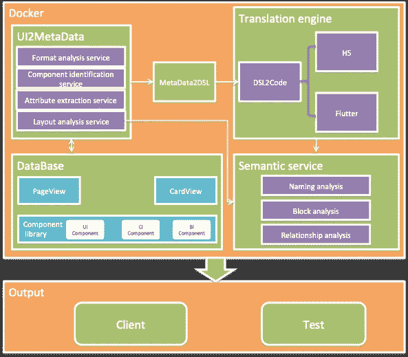

有了它，系统的过程可以简单地概括为如下所示的步骤:

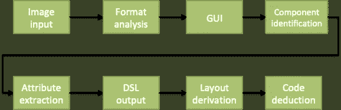

这个过程大致对应四个步骤。首先，使用深度学习技术从视觉草稿中提取 GUI 元素。接下来，使用深度学习技术来识别存在的 GUI 元素的类型。第三，使用递归神经网络技术生成 DSL。最后，使用语法树模板匹配生成相应的颤振代码。

以下部分详细讨论了 UI2CODE 系统中的关键步骤。

# 背景/前景分析

UI2CODE 中背景/前景分析的唯一目的是切片，它可以直接确定 UI2CODE 输出的准确性。

下面的白色背景用户界面提供了一个简单的例子:

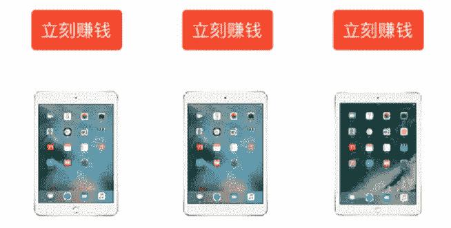

将该 UI 读入内存后，将对其执行二进制化，如下所示:

```
def image_to_matrix(filename):
    im = Image.open(filename)
    width, height = im.size
    im = im.convert("L")
    matrix = np.asarray(im)
    return matrix, width, height
```

结果是一个二维矩阵，它将该 UI 中白色背景的值转换为零:

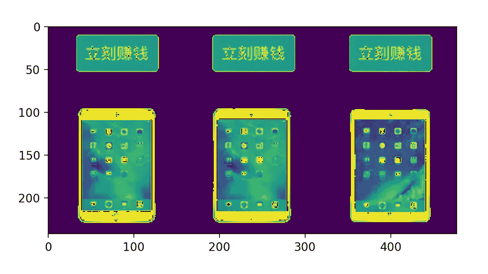

只需要五个切割来分离所有的 GUI 元素。有各种方法将它们分开；下面显示了一个横切代码片段，比实际的切割逻辑稍微简单一些，实际的切割逻辑本质上是一个递归过程:

```
def cut_by_col(cut_num, _im_mask):
    zero_start = None
    zero_end = None
    end_range = len(_im_mask)
    for x in range(0, end_range):
        im = _im_mask[x]
        if len(np.where(im==0)[0]) == len(im):
            if zero_start == None:
                zero_start = x
        elif zero_start != None and zero_end == None:
            zero_end = x
        if zero_start != None and zero_end != None:
            start = zero_start
            if start > 0:
                cut_num.append(start)
            zero_start = None
            zero_end = None
        if x == end_range-1 and zero_start != None and zero_end == None and zero_start > 0:
            zero_end = x
            start = zero_start
            if start > 0:
                cut_num.append(start)
            zero_start = None
            zero_end = None
```

客户端 UI 基本上是一个垂直流布局，可以先横切再垂直切割:

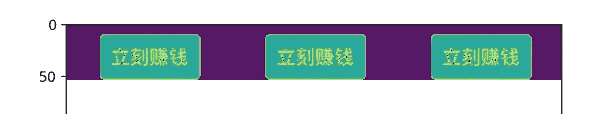

此时，切割点的 X 和 Y 坐标被记录，并将形成组件位置关系的核心。切片之后，这产生了两组数据:六个 GUI 元素图片和它们对应的坐标系记录。在随后的步骤中，使用分类神经网络进行成分识别。

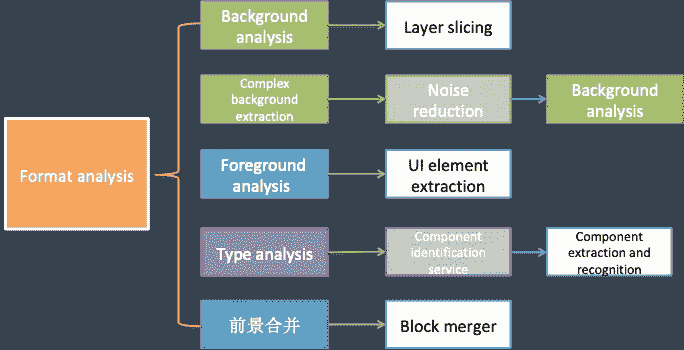

在实际生产过程中，背景/前景分析变得更加复杂，主要是在处理复杂背景方面。

# 元件识别名

在识别成分之前，必须收集样本成分用于训练。进一步的，TensorFlow 中提供的 CNN 模型和 SSD 模型用于这个阶段的增量训练。

UI2CODE 根据各种类型对 GUI 元素进行分类，包括图像、文本、形状/按钮、图标、价格等，然后将这些元素分类为 UI 组件、CI 组件和 BI 组件。UI 组件主要是针对颤振原生组件的分类；CI 组件主要是对先宇的自定义 UIKIT 进行分类；BI 组件主要用于具有特定业务相关性的提要流卡片的分类。

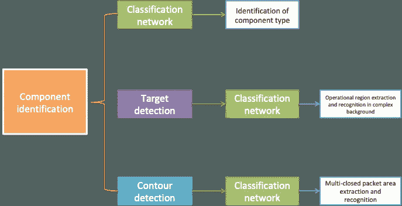

元件识别的反复校正需要全局特征反馈，通常采用卷积神经网络。以下面的屏幕截图为例，深红色文本的两个字符(翻译为“全新”)构成了图像的 richtext 部分。同时，相同的形状样式可以出现在按钮或图标中。

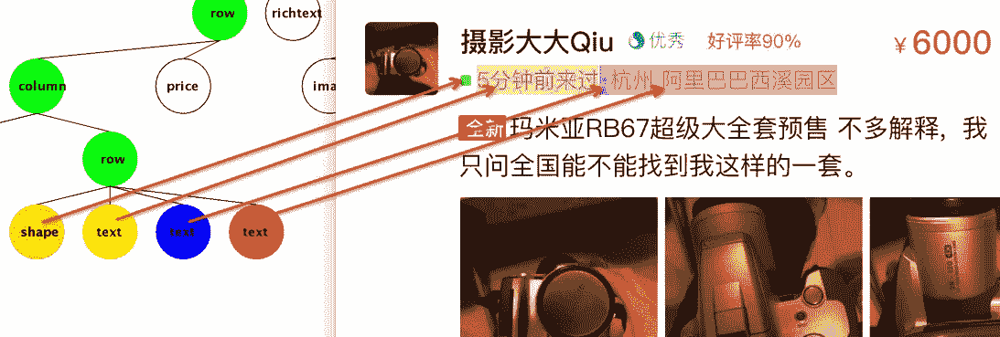

# 属性提取

在各种各样的技术点中，UI2CODE 的属性提取步骤可以总结为处理组件的三个方面:形状和轮廓、字体属性和尺寸。

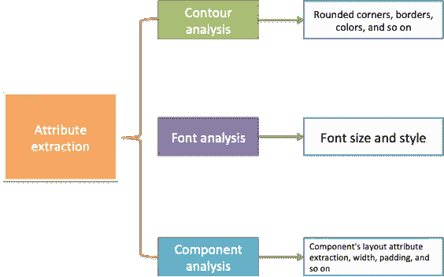

在属性提取之后，所有 GUI 信息的提取被有效地完成。GUI DSL 按如下方式生成:


该数据使得能够执行布局分析。这里，文本属性的提取是最复杂的因素。

# 布局分析

在 UI2CODE 的早期阶段，由于样本量小，在转移到规则实现之前，Xianyu 团队使用四层 LSTM 网络进行训练和学习。规则实现还具有相对简单的优点；第一步切片中五个切的顺序是行和列，规则实现的缺点是布局比较死板，需要结合 RNN 进行提前反馈。

下面的视频展示了通过四层 LSTM 机制预测布局结构的结果；这里，UI 布局结构类似于建筑物的框架，而 UI 层代码恢复类似于使用 GUI 属性的室内设计。

# 代码生成和插件

人工智能本质上是一个概率问题，而自动生成的代码要求非常高的恢复度和 100%的准确性。由于概率动力学很难达到这种程度的准确性，因此需要一个可编辑的工具来使开发人员能够快速理解和修改 UI 布局结构。

为此，鲜宇团队为 UI2CODE 生成的 DSL 树实现了基于模板的匹配方法，其中代码模板的内容由经验丰富的 Flutter 技术专家定义。到目前为止，这已被证明是代码实现的最佳方法。

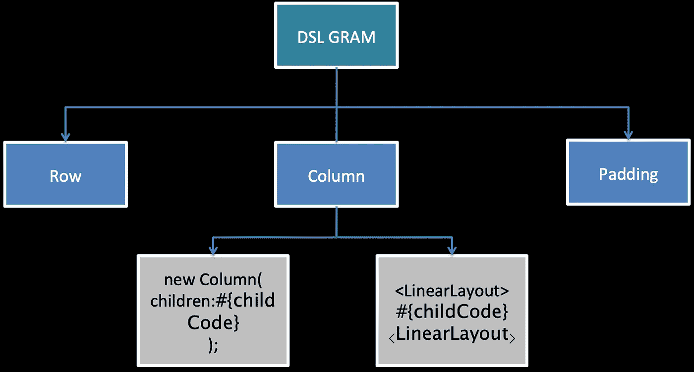

在代码模板中引入了一些标签，并使用 Intellij 插件来检索和替换 Flutter 项目中相应的 UIKIT，以提高代码重用性。

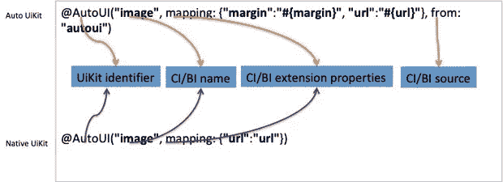

整个插件项目需要提供定制的 UIKIT 功能，包括检索、替换、验证、创建、修改和 DSL 树的图形识别。总之，这类似于 ERP 系统，需要时间来改进。

# 关键要点

在本文介绍的五个关键组件中，有四个与机器视觉问题有关，并通过人工智能联系在一起。将代码发布到在线环境中提出了极其严格的要求，而人工智能的概率性质在这方面提出了一个重大挑战。为了继续解决这些问题并实施解决方案，先宇技术团队选择专注于机器视觉能力，同时使用人工智能技术作为构建完整 UI2CODE 系统的补充，并继续专注于人工智能技术，以使 UI2CODE 成为代码生成的理想自动化工具。

**(Original article by Chen Yongxin 陈永新 )**

> *延伸阅读:*
> 
> [*UI2code:如何微调背景和前景分析*](/@alitech_2017/ui2code-how-to-fine-tune-background-and-foreground-analysis-fb269edcd12c)

# 阿里巴巴科技

关于阿里巴巴最新技术的第一手深度资料→脸书: [**“阿里巴巴科技”**](http://www.facebook.com/AlibabaTechnology) 。推特: [**【阿里巴巴技术】**](https://twitter.com/AliTech2017) 。