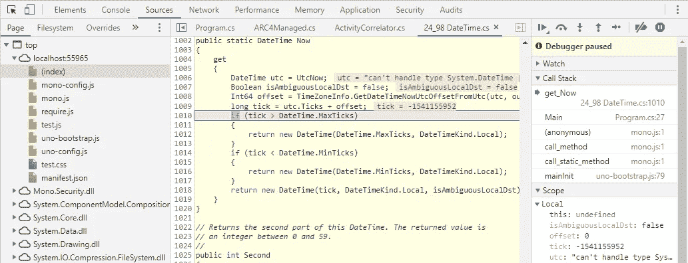
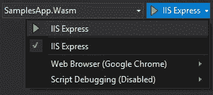
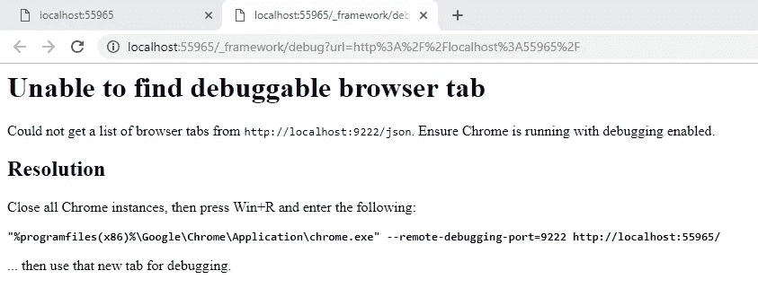
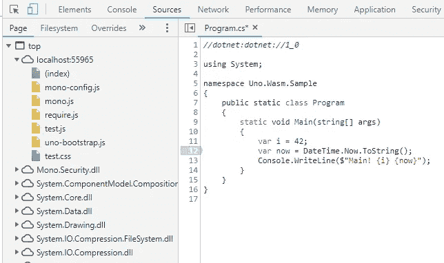
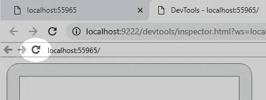
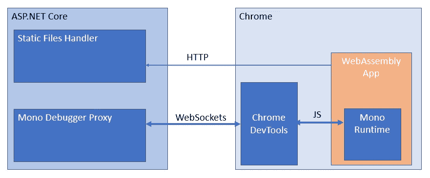

# 介绍 Uno WebAssembly 项目和调试

> 原文：<https://medium.com/hackernoon/introducing-uno-webassembly-projects-and-debugging-f360d4776df3>


Uno 平台对 WebAssembly 的支持进展稳定，mono 运行时对调试体验的支持也有很大改进。

我们增加了对更好的 Visual Studio 项目集成的支持，以及实验性的调试体验。

下一个版本的 [Uno Visual Studio 插件](https://marketplace.visualstudio.com/items?itemName=nventivecorp.uno-platform-addin)将包含新的项目格式和调试器，但是您可以今天使用 Uno 平台的[最新实验版本](https://github.com/nventive/Uno/releases)来尝试它。

# Visual Studio 的 WebAssembly 项目支持

最初，对 WebAssembly 的支持是由 Uno 通过创建. NET Standard 2.0 项目完成的，依赖于 mono 提供的 python 服务器的使用。这个服务器的唯一目的是提供带有`application/wasm` mime 类型的文件，这可以通过一个普通的 WebApp 项目来完成。

由于 mono-wasm 调试器已经取得了很大进展，我们决定研究改进 Visual Studio 对 Uno WebAssembly 项目的支持的第一步。就集成而言，更新的体验是开发人员所期望的。它类似于普通的 Web 项目:现在按 Ctrl+F5 在您的首选浏览器中启动 WebAssembly 项目。

对于大多数 web 项目，刷新网页就足以让应用程序获得新的更改。

在项目定义中使用标准`Microsoft.NET.Sdk.Web`提供了所有的集成特性，比如发布到 Azure 或其他支持的目标:

```
<Project Sdk="Microsoft.NET.Sdk.Web">
  <PropertyGroup>
    <OutputType>Exe</OutputType>
    <TargetFramework>netstandard2.0</TargetFramework>
    <WasmHead>true</WasmHead>
    <DefineConstants>__WASM__</DefineConstants>
  </PropertyGroup> <ItemGroup>
    <PackageReference Include="Uno.UI" Version="1.42.0-dev.395" />
    <DotNetCliToolReference Include="Uno.Wasm.Bootstrap.Cli" Version="1.0.0-dev.112" />
  </ItemGroup>
```

对于那些已经在运行 WebAssembly Uno 项目的人来说，除了在顶部添加`Microsoft.NET.Sdk.Web`和将新的`DotNetCliToolReference`添加到`Uno.Wasm.Bootstrap.Cli`之外，没有太多需要做的更改，这使得 Visual Studio 集成成为可能。

# 在 WebAssembly 中调试 C#

Mono 团队在调试体验方面已经工作了一段时间，最近的改进使它更容易使用。它仍然是试验性的，但仍然对调试 WebAssembly 项目有很大的帮助。

只有一个重要的限制:调试只适用于 Chrome。它使用的是 Chrome DevTools 协议。

调试器提供对所有本地源代码的访问，以及[支持源代码链接的程序集](https://docs.microsoft.com/en-us/dotnet/standard/library-guidance/sourcelink)当可用时，提供单步执行、断点、堆栈跟踪遍历、本地变量和监视。目前，局部变量监视仅限于原语和字符串。

为了给你一个调试体验的例子，这是一个从普通用户程序进入单声道源代码树中的`DateTime.Now`属性的步骤:



Mono 团队最近增加了从 Mono 二进制文件的调试信息中获取源文件的能力，这使得调试器很容易获取已发布二进制文件的准确源文件。

一点警告，调试体验非常粗糙的边缘。调试器可能会频繁崩溃(Chrome 称 WebSocket 断开连接),因为还有许多非阳光路径场景尚未测试。这意味着您可能无法设置断点、进入或跳出某些特定的代码段(例如分部方法)。

# 使用 WebAssembly C#调试器

*   从 Uno 解决方案模板创建一个 Uno 平台跨目标应用程序(详见本文末尾)
*   将 Wasm 项目设置为启动项目

确保

*   在调试工具栏中启用了 IIS Express
*   Chrome 是活跃的网络浏览器



*   按下 *Ctrl+F5*
*   一旦你的应用程序被加载，按 Alt+Shift+D，一个新的标签将会打开
*   你会得到一个错误信息，告诉你 Chrome 还没有打开



*   关闭所有 chrome 实例，使用提供的命令行再次运行 Chrome
*   同样，一旦你的应用程序被加载，按 Alt+Shift+D，一个新的标签将会打开。
*   现在你将打开 Chrome DevTools，列出所有。“源”选项卡上的净加载程序集:



*   现在，您可以在可用的源文件中设置断点
*   由于应用程序的初始化已经开始，你可以刷新原来的网站标签，或者使用 Chrome DevTools 的预览部分中较小的刷新按钮:



# 它是如何工作的？

应用程序的结构有点复杂，一幅图比千言万语更能说明问题:



调试器代理是 Mono 的 ASP.NET 核心组件，嵌入在开发过程中使用的 ASP.NET 核心静态文件服务器中。它的作用主要是提供对 PDB 文件的访问，解释 Chrome DevTools 调试器命令，并将其翻译回来供 mono-wasm 运行时理解。这包括设置断点、获取观察值、获取源文件等…

目前，Uno 平台正在使用一个定制的调试代理，它增加了对单声道源和源链接以及其他修复的支持。这些将很快进入主 Mono 库。

如果你熟悉 Blazor，你会注意到调试器体验非常相似，事实上，ASP.NET 核心集成层直接受到 Blazor 0 . 7 . 0 调试器支持实现的启发。

# 下一步是什么？

我们已经使用调试器几天了，它让我们提高了故障排除的速度。拥有适当的堆栈跟踪和变量监视总是很有帮助的。写作可能会失败。

我们将继续与 mono 团队合作，改善 mono-wasm 应用程序的部署和调试体验。

让我们知道你的想法！

