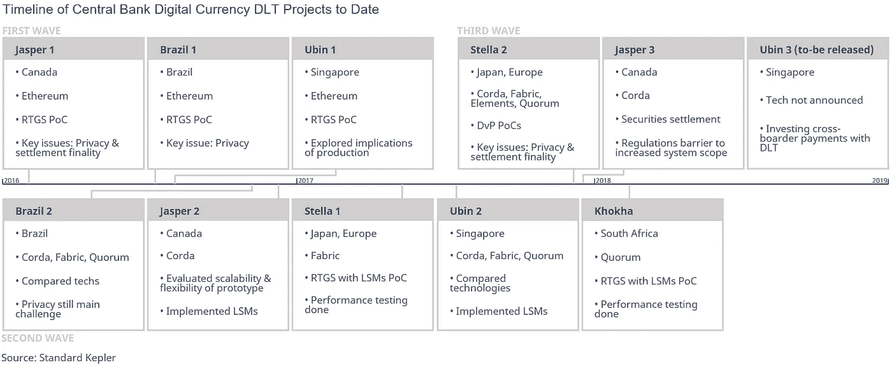
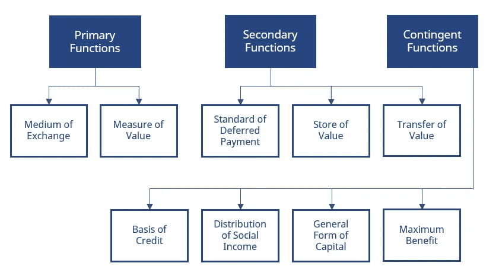
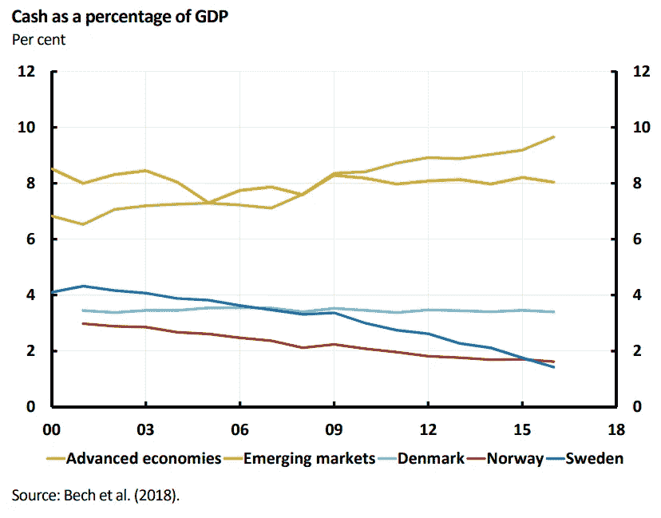
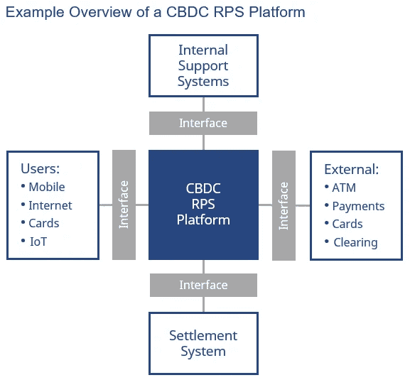
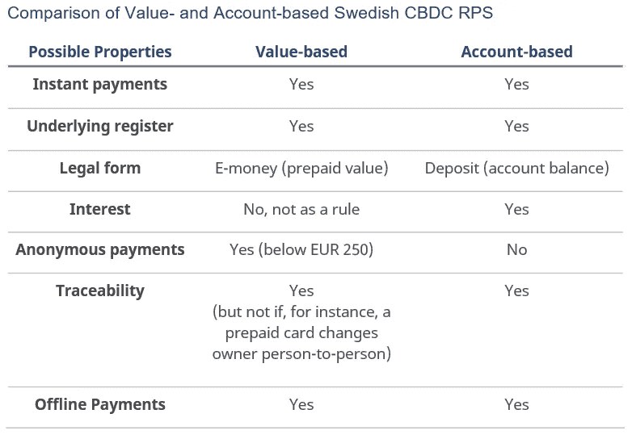
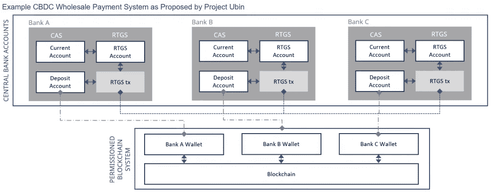

# 央行数字货币介绍(1/2)

> 原文：<https://medium.com/hackernoon/introduction-to-central-bank-digital-currencies-1-2-7058165480bc>

## 根据标准开普勒研究

> 这是标准开普勒研究的央行数字货币系列的 1/2

figure 1, Timeline of Central Bank Digital Currency Projects

# 介绍

我们之前已经将中央银行数字货币(CBDC)确定为分布式账本技术(DLT)更有前景的潜在应用之一。从*图 1* 中可以明显看出，为了评估区块链在未来支付系统中的适用性，许多 CBDC 项目已经启动。金融市场基础设施是负责提供金融交易的清算、结算和记录的极其重要的机构。FMI 是金融机构之间的可信第三方，使用集中的分类帐来记录和跟踪交易。FMI 运营商对提高 FMI 效率的技术表现出极大的兴趣，迄今为止，CBDC DLT 公司已经启动了三个主要的探索性项目。对于这种未来的支付系统，通常假设有许多好处。据推测，通过提高结算自动化程度，可以降低金融部门的后台成本。预计在信息的可靠性和可追溯性以及更短的结算时间方面会有进一步的优势。然而，CBDC DLT 项目至今表明，该技术目前还不成熟，无法实现这些改进。

由于其对金融稳定的至关重要性，FMIs 平衡了许多重大风险。这些风险包括治理和法律风险、信贷和流动性风险、结算风险和运营风险。在保持 DLT 技术优势的同时，还必须为系统参与者提供适当的透明度和隐私。这导致了一系列的折衷，尤其是在系统隐私、弹性和可伸缩性之间。现有的 CBDC 项目表明，Corda 以弹性为代价实现了隐私和可伸缩性，Hyperledger Fabric 以弹性和隐私为代价实现了隐私，Quorum 的零知识证明以可伸缩性为代价实现了隐私。应该仔细研究 CBDC·DLT 的项目，因为它们让我们更接近于确定 DLT 的核心价值主张。随着央行数字货币领域的进一步发展，我们将努力更新这份基础报告。

# 零售支付系统

## 钱是什么？

术语“加密货币”意味着与中央银行发行的既定货币相似。这又引出了加密货币是否应该被视为货币的问题。世界上最古老的中央银行(瑞典央行)热衷于强调“货币理论和如何创造一个有效的货币体系可以在社会有史以来试图解决的具体问题的基础上得到理解”。货币存在着不同的定义，现代的定义已经发展到可以解决以前物物交换系统中的许多痛点。

# **金属主义**

将货币与潜在商品的价值联系起来。这些商品通常是金属，因此得名。金属主义的一个核心观点是，有限的金属供应和不断增加的挖掘成本是自然膨胀的极限。比特币在金属主义中找到了灵感，对比特币的总供应量进行了类似但数字的限制。

# **宪章主义**

是另一种定义货币的理论。根据宪章主义，货币的价值来源于一个国家发行的法定货币。因此，宪章主义将维持货币体系运转的间接责任赋予了国家。

# **功能主义**

对货币的主流现代解释进一步建立在宪章主义的基础上。根据功能主义，货币必须满足三个功能标准才能被认为是货币。货币必须充当 1)支付手段，2)记账单位，3)价值储存手段。支付手段是指货币实际上可以用来支付卖方以换取货物，从而避免必须偿还卖方使用货物或服务。

作为支付手段意味着货币必须作为经济中不同商品和服务的公认的价值尺度。最后，作为价值货币的储存手段，应该提供价格稳定，人们花钱或不花钱的决定不应该受到货币价值波动的影响。

*参见图 2，了解现代货币预期功能的更多细节。*

中央银行通常负责确保货币能够发挥这三个核心功能。一个例子是中央银行经常设定的通货膨胀目标，其目标是保持货币的价值储存功能。一些中央银行认为，加密货币不应被视为货币，大多数加密货币既不与可交易商品的价值挂钩，也不是由国家发行的。

加密货币进一步努力满足与功能主义相关的一些标准，例如:必须容易确定货币的价值，货币必须在支付中被广泛接受，货币必须耐用并表现出价格稳定性。

figure 2

这并不是说加密货币不能由国家发行(有些国家发行过)，也不是说它们不能与实物商品的价值挂钩(有些国家发行过)。但是，为了让 crypto 将大规模采用视为零售支付工具，他们必须满足功能主义的标准，并且实现价格稳定、足够的价格透明度以及买家和卖家对 crypto 的广泛认可的道路是漫长而艰难的。

更困难的是，人们对加密货币的主要兴趣是为了投机目的，而不是为了进行交易。此外，央行也不太可能认可央行缺乏货币决策(如调节供给)权力的货币(加密货币)。

出于建立零售支付系统的目的，央行数字货币(CBDC)作为比特币和比特币现金等值得关注的替代品进入了市场。拟议的零售 CBD 不仅有潜力满足功能主义的标准，而且还准备解决现代经济中存在的一些进一步的问题，包括过度依赖私人提供商和零售支付基础设施的所有者。

## 零售支付系统和 DLT

CBDC 驱动的零售支付系统(RPS)已经被提出作为许多问题的解决方案。这些问题有些与使用现金的成本有关，有些则与缺乏现金有关。请注意，CBDC RPS 可以在没有 DLT 的情况下设计，而 DLT 只是这种系统的一个可能的底层数据库基础设施。

在方案 A 中，一些国家已经考虑将 CBDC RPS 作为减少现金使用的一种方式。目标是减少与处理现金相关的财务和环境成本，以及由现金促成的黑色经济。在情景 B 中，瑞典等国家近年来现金使用大幅减少。

现金目前仅占瑞典 GDP 的 1%多一点，相比之下，欧洲的平均水平为 GDP 的 10%(见*图 3* )。一半的瑞典零售商进一步预计，他们最迟将于 2025 年停止接受现金。央行担心，现金使用和现金供应的这种减少可能导致公众难以获得央行的无风险资金，并增加私人数字零售支付系统之间的金融基础设施整合。

这反过来会导致支付市场更加低效和脆弱，降低对货币支付系统的信任度。

figure 3, Graph Source: The Swedish Central Bank, E-krona project 1

CBDC RPS 被认为是上述两种情况的解决方案。“数字美元”平台可以让公众持有由央行发行和担保的数字美元。该平台将与用户接口(通过互联网，卡，物联网等)。)、结算系统、内部支持系统以及外部系统如 ATM 公司和支付服务提供商(见*图 4* )。

figure 4

与实物美元的处理成本相比，这种数字美元的相关成本可能很小，而且数字美元可以为中央银行提供可追溯性，以限制黑市。数字美元还将为公众提供一个有保障的 RPS，它(不同于大多数现有的 RPS)不是由私人行为者经营的。

设计 CBDC RPS 有两种主要方法。它可以是基于账户的(存在央行的账户中)或基于价值的(存储在应用程序或卡上)。这两种方法都需要一个底层的登记簿来跟踪交易和所有权，这意味着使用是可追踪的。DLT 被认为是一个可能的选择，但“从纯粹的技术角度来看，(瑞典央行)目前看不到任何可以阻止围绕中央登记册建立 e-krona 解决方案的东西。”

预计 CBDC RPS 将在未来吸引更多的关注，尽管主要是在现金使用量较低的利基市场(大多数国家仍有大量现金使用，一个显著的例子是美国)，或者存在大量黑市。在 RPS 的设计中，仍然需要做出一些重要的决定:

> 数字美元应该有利息吗？应该基于账户还是基于价值？

数字美元可以让银行挤兑变得更容易。这样的安逸到底合不合意？对数字美元(特别是附息美元)的强劲需求也可能耗尽商业银行，导致发行信贷的能力下降。这些决定将给金融体系带来一系列新的潜在风险，必须对这些风险进行仔细评估。

目前，基于价值的无息美元似乎是最有可能的概念验证候选货币。引用德意志银行(Deutsche Bank)2018 年的一份报告，“消费者很难找到自愿转向加密欧元的令人信服的理由——至少目前是这样。”

figure 5

# 批发支付系统

## 批发支付系统和 DLT CBDC

批发支付系统(WPS)的原型比 CBDC 零售支付系统(RTS)更广泛、更快速。这可能是因为通过 CBDC WPS 可以节省更多的成本。此外，私营金融机构和中央银行的利益在 CBDC WPS 的发展中通常是一致的，而 CBDC RTS 被视为私营金融机构运营的现有 RTS 的可能竞争者。

批发支付系统“处理银行间、国家间大额、大量实时支付以及由中央银行管理的相关清算和结算系统，整合了各种全球公认的标准。”CBDC WPS 考虑如何利用数字货币来提高 WPS 的效率。Ubin 项目提出了 WPS 的简化实施示例，并在*图 6 中进行了概述。*

在这个提议的系统中，银行在中央银行有一个特殊的存款账户。银行可以将资金从银行的 RTGS 账户存入这个存款账户。该存款的余额反映在许可的区块链系统上的数字货币钱包中。因此，将资金转移到存款帐户会在钱包中创建数字货币(在这种情况下是存款收据)，而从存款帐户中提款会烧掉钱包中的存款收据。有存款账户的银行可以在区块链的银行钱包之间转移存款收据。

figure 6, example CBDC wholesale payment system as proposed by project Ubin

这样的系统可以在 DLT 周围设计，系统的细节取决于选择的数字账本技术。最常考虑的选项是 R3 的 Corda、Hyperledger 的 Fabric 和 JP Morgan 的 Quorum，我们将在下一部分介绍这些选项。

到目前为止，已经开发了几个 WPS 概念验证。在这些项目中使用这些系统测试的概念普遍证明，DLT 能够以与现有 RTGS 交易量相匹配的速度执行交易，并具有终结性，尽管这往往以有限的隐私或系统弹性为代价。需要进一步发展，以实现这些方面之间更有效的平衡。

人们还必须注意到，一个成熟的 CBDC WPS 应该包括流动性管理和信贷扩展功能。这两个函数的概念是存在的，但是被认为超出了 CBDC 主题的介绍范围。

随着越来越多的金融市场参与者考虑引入基于 DLT 的系统，互操作性的复杂性和新业务模式的潜力都在增加。

*原载于 2019 年 1 月 21 日*[*【https://www.standardkepler.com】*](http://standardkepler.com/en)*。*

> Standard Kepler 是亚洲领先的区块链金融服务提供商，除了整体咨询、加密交易和托管服务之外，还提供不断变化的市场研究见解。我们为能够提供专业服务而深感自豪，这些服务因我们的诚实和技术驱动而值得信赖。总部设在香港，标准开普勒的管理团队曾服务于摩根大通、麦格理资本、道富银行和毕马威。

参考

加拿大银行；加拿大付款；R3。2017.碧玉计划:大纲。

加拿大银行；加拿大付款；R3。2017.Jasper 项目:加拿大与 DLT 在国内银行间支付结算方面的试验。

加拿大银行。2018.Jasper 项目:分布式批发支付系统可行吗？

加拿大银行；TMX 集团；加拿大付款；埃森哲；R3。2018.第三阶段:使用 DLT 进行证券结算。

科达。2018.*Corda 平台简介。*

德意志银行研究。2018.*我们为什么要使用加密欧元？*

欧洲中央银行。2018.日本央行/欧洲央行关于 DLT 的联合研究项目。

超级账本。2018.*Hyperledger 简介。*

JP 摩根。*法定人数白皮书。*

新加坡金融管理局；德勤；美银美林；BCS 信息系统；瑞士瑞信银行；星展银行；汇丰银行。摩根大通；三菱 UFJ 金融集团；华侨银行；R3；新加坡交易所；大华银行。2017.【Ubin 项目；分布式分类帐上的 SGD。

新加坡金融管理局；新加坡银行协会；新加坡金融管理局。2017.【Ubin 项目二期。

新加坡金融管理局；SGX；安泉资本；德勤；纳斯达克。2018.Ubin 项目:DLT 的交货与付款。南非储备银行。2018.*项目 Khokha:探索 DLT 在南非银行间支付结算中的应用。*

瑞典中央银行。2017.*瑞典央行的 ekrona 项目报告 1。*

瑞典中央银行。2018.*瑞典央行的 ekrona 项目报告 2。*

瑞典中央银行。2018.*经济评论:比特币和其他加密资产是钱吗？还有更多。*