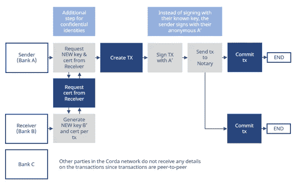
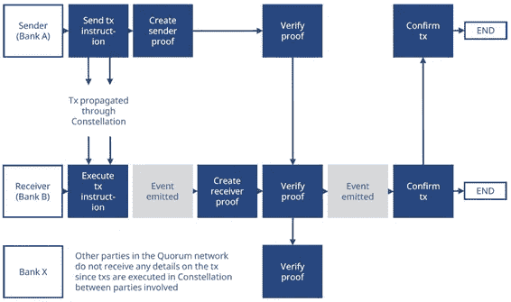
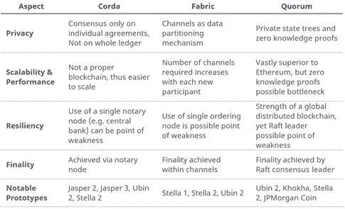

# 中央银行数字货币介绍(2/2)

> 原文：<https://medium.com/hackernoon/introduction-to-central-bank-digital-currencies-2-2-31228c20835b>

## 根据标准开普勒研究

*这是 2/2 的央行数字货币系列由* [*标准开普勒研究*](https://www.standardkepler.com/en)

在[上一篇文章](https://hackernoon.com/introduction-to-central-bank-digital-currencies-1-2-7058165480bc)中，我们讨论了中央银行数字货币作为基于 DLT 的系统的潜在用例之一。

在本文中，我们将详细介绍如何实施 CBDC，以及银行为什么想要这样做。通过在四个不同方面比较基于 DLT 的系统的三个最可能的选项( **Corda、Hyperledger Fabric 和 Quorum**):**1。)** **隐私，2。)可扩展性&性能，3。)弹性和 4。)终局。**

# R3 的 CORDA

Corda 认为，区块链的本质是"*确保不同参与者持有的数据在应用操作来更新数据时保持一致，并且这形成了构建可靠交易的基础。这种观点允许 Corda 在不使用区块链的情况下追求 DLT 的优势。*

" *[Corda]深受区块链系统的启发，但其设计选择并未使传统的区块链不适用于许多金融交易。Corda 将其分类帐定义为一组不可变的状态对象。该分类账充当 Corda 平台的可靠单一来源，但它并不使该分类账上的交易或条目全球可见。取而代之的是使用加密散列来识别各方和数据，并确保只有作为协议一部分的各方才能看到相关的分类帐细节。*

Corda 寻求在协议各方之间就具体协议的发展状态达成共识。这种“按协议”的方法与寻求就整个分类账的状态达成共识的系统(如比特币)形成对比。使用消耗现有状态对象并创建新状态对象的 tx 来应用对 Corda 分类帐的更新(不涉及本地加密货币)。交易的有效性可以由各方通过运行合同代码来独立检查。然而，需要预先确定的观察节点来达成唯一性共识。重要的是，这个观察者节点只检查消耗的输入状态，而不需要看到事务的全部内容。科达没有采矿的概念。

Figure 1, Transaction Flow of Fund Transfers in R3 Corda (by [KEPLERLAB.IO](https://keplerlab.io/))

在 Corda 上，状态对象代表各方之间的协议。本协议受链接到法律条文的合同代码管辖。事务在整个生命周期中依次转换状态对象，事务协议使各方能够在没有中央控制器的情况下协调行动。结合起来，这些组件被称为 CorDapps，需要由开发人员在平台上构建。

> Corda 及时提醒我们，区块链只是实现分布式分类账的一种方式，但并不是所有的分布式分类账都必须采用区块链。超级分类帐结构和定额是建立分布式分类帐的另外两种方法。CBDC 项目 Ubin 2 有趣地比较了这三者，这个比较我们以后还会谈到。

# 超分类帐结构

Hyperledger Fabric 是由 Linux 基金会托管的 Hyperledger 系列项目的一部分。这些项目都被设计成模块化的，目的是为客户和开发人员提供更大的灵活性。理论上，这允许开发人员在不影响系统其余部分的情况下试验不同的组件，允许使用类似乐高的方法从一组固定的组件中为不同的问题构建解决方案。Fabric 还运行用通用编程语言编写的分布式应用程序，而不依赖于本地加密货币。

渠道的概念也是结构的核心。该系统建立在参与者之间的双边渠道网络上，每个双边渠道形成一个分类账。通过建立这样的信道，可以在信道内并且远离其他系统参与者来维护数据隐私。出于交易记录和监控的目的，可以在通道中包括第三方，例如货币管理机构。还可以建立多边渠道，如新加坡 Ubin 项目，通过多边融资和净额结算渠道将参与银行联系起来。这种资金渠道允许参与者在他们各自的渠道级账户之间转移资金。注意，随着每个新的系统参与者的增加，双向信道的数量增加，从而系统的复杂性也增加。

Figure 2, Transaction Flow of Fund Transfers in Hyperledger Fabric (by [KEPLERLAB.IO](https://keplerlab.io/))

任何看到在金融市场基础设施中使用的区块链都必须提供即时终结性，从而使工作证明和股权证明等共识算法变得不可行。Fabric 通过系统背书和订购者来防止双重花费攻击。参与节点根据系统认可策略(由链码定义)验证事务，以确保事务及其签名的有效性(参见图 2)。订购者将认可的交易打包成块，并将这些块广播给渠道参与者。随后，在将交易提交至分类帐之前，这些系统会对交易进行验证。还可以包括允许多节点订购服务的共识机制。

几个概念验证的中央银行数字货币(CBDC)系统已经建立在 Hyperledger 架构上，最著名的是新加坡 Ubin 2 和 T2 日欧 Stella 1 2 T3。

# 摩根大通的法定人数

实现适当的隐私级别是区块链企业的核心要求。区块链如何做到这一点是一个有许多可能答案的问题，从双边渠道的相对简单到数据密集型零知识证明交易的使用。JP 摩根的 Quorum 计划在以太坊已经完成的工作基础上再接再厉，将以太坊变成一个“企业级分布式账本和智能合约平台”。

法定网络中的所有节点运行同一组组件。但是，这些组件与以太坊有些不同。最重要的是引入私有状态树。法定区块链(就像以太坊一样)以状态的形式保存信息，事务修改区块链上的状态。法定节点有一个公共和个人私有状态树，公共状态树存储普通以太坊交易和加密私有智能合同变更的散列。

Zcash 背后的团队开发的零知识安全层(ZSL)是 Quorum 的另一个核心组件。ZSL 允许在网络上转移资产，而不暴露发送者、接收者或资产的数量。初始余额、交易金额和最终余额的散列值由发送方和接收方提交给离线的证明生成器。它们随后被提交给法定链以供网络上的其他节点验证，随后交易被确认并且余额被更新。

Figure 3, Transaction Flow of Fund Transfers in JP Morgan’s Quorum (by [KEPLERLAB.IO](https://keplerlab.io/))

因此，法定人数要求私有和公共智能合同交易。私有契约允许双方之间的私有交易，而公共交易用于在法定网络上分发用于验证的 ZSL 证明。Quorum 下的交易流程如图 3 所示，Ubin Phase 2 白皮书本身对此进行了最简洁的描述:“*资金转账的支付指令从发送方的 dApp 发起。dApp 调用私有契约来生成私有事务。然后，发送方的 dApp 调用一个公共事务，该事务将由法定网络上的所有节点执行。公共交易是用支付指令金额的散列创建的，该散列将被用作生成和验证证据的输入。因为公共事务被传播到网络中的所有节点，所以进行散列来维护数据隐私。*

事务终结是企业环境中另一个至关重要的特征。金融机构通常无法处理概率终结性，因此以太坊工作证明下的概率终结性不适合企业应用程序。Quorum 引入了达成共识的替代方法，新加坡金融管理局为批发结算目的评估的方法是“Raft”。Raft 已经在 Kubernetes 等软件中使用了很多年。它依赖于一个领导者的概念，这个领导者提出一些其他人认可的建议。这意味着没有分叉，因此存在事务终结。Raft 还可以设置比以太坊更快的时间段。

到目前为止，我们已经介绍了 **R3 的 Corda** 、**的 Hyperledger Fabric** 和 **JP Morgan 的 Quorum** ，接下来，我们将根据它们在支持批发支付系统方面的适用性，简要比较这三个产品。

# 比较 CORDA、结构和定额

到目前为止，已经进行了几个 CBDC 概念验证和原型项目(见第 1 部分)。这些项目通常由中央银行牵头，但与金融机构(他们使用现有的金融市场基础设施)和企业级分布式总账技术的开发商合作。以下是三个最突出的竞争者(Corda、Fabric、Quorum)之间的简要比较，主要基于以前 CBDC 项目的发现。

**隐私:** Corda 仅寻求在协议各方之间就特定协议的发展状态达成共识，而不是寻求就全球分布式分类账的状态达成一致。Hyperledger Fabric 提供了在各方之间建立共享渠道(每个渠道都是一个分类帐)的能力，渠道内的交易对外部各方是私有的。值得注意的是，渠道参与者可以查看渠道级别的账户余额。出于合规目的，监管机构(如中央银行)可以包括在渠道中。Quorum 通过公共和个人私有状态树实现隐私，公共状态树存储普通以太坊交易和加密私有智能合同更改的散列。因此，Quorum 提供并要求私有和公共智能合约交易。私有契约允许双方之间的私有交易，而公共交易用于在法定网络上分发用于验证的零知识证明。

**可扩展性&性能:**由于其设计原因，Corda 并不是一款真正的区块链。这不仅缓解了隐私问题，而且与传统 DLT 相比，使扩展变得更加容易。添加新的参与者只需要在现有网络中安装新的节点。在 Fabric 中，需要[N x (N-1) / 2] + M 个通道来运行，其中 N =参与节点的数量，M =多边通道的数量。网络的复杂性随着每个新参与者的增加而增加，参与者需要在每个渠道的各个渠道级账户之间维护和转移资金。由于是一个许可网络，Quorum 大大提高了以太坊的性能，但是在运行零知识证明的速度方面还有进一步提高的空间。

**弹性:**虽然 Corda 可以在单个银行节点离线的情况下继续运营，但使用单个公证节点(如中央银行)来实现唯一性共识是一个潜在的弱点。这可以通过由多方操作的公证节点来纠正，尽管代价是增加了复杂性。Fabric 涉及一个区块链，但是需要一个订购者将事务订购成块。Ubin 2 原型建立在单一订购者的基础上，这引入了单点故障。多节点订购服务可以解决这个问题。将私有事务的散列传播到全局分类帐提高了仲裁的弹性。这种中央分类账的使用确保了显著的弹性，并且在经过测试的 Raft 共识方法下，共识领导人可以随着每笔交易而轮换，以增加弹性。在 CBDC 的使用场景中，这可能是也可能是不可能的，因此共识领袖可能构成弱点。

**终结:**对金融服务提供商至关重要。公证人节点的使用确保了 Corda 中某些事务的终结性，公证人签名指示输入状态迄今为止是未用完的。Fabric 的 ordered 节点将交易排序到一个块中，并将其发送给渠道参与者，以便提交给共享渠道分类帐。交易在承诺后完成。与 Quorum 一起尝试的 Raft 共识方法依赖于共识领导者在验证后将块提交给链。一旦提交了一个块，这个链就不能逆转，因为不涉及到挖掘的概念，因此就实现了终结。

Figrue 4, A Brief Summary of Corda, Fabric, and Quorum

*原载于*[*https://www.standardkepler.com*](http://standardkepler.com/en)

> Standard Kepler 是亚洲领先的区块链金融服务提供商，除了整体咨询、加密交易和托管服务之外，还提供不断变化的市场研究见解。我们为能够提供专业服务而深感自豪，这些服务因我们的诚实和技术驱动而值得信赖。总部设在香港，标准开普勒的管理团队曾服务于摩根大通、麦格理资本、道富银行和毕马威。

参考

加拿大银行；加拿大付款；R3。2017.碧玉计划:大纲。

加拿大银行；加拿大付款；R3。2017.*贾斯珀项目:加拿大与 DLT 在国内银行间支付结算方面的试验。*

加拿大银行。2018.*贾斯珀项目:分布式批发支付系统可行吗？*

加拿大银行；TMX 集团；加拿大付款；埃森哲；R3。2018.第三阶段:使用 DLT 进行证券结算。

科达。2018.*Corda 平台:简介。*

德意志银行研究。2018.*我们为什么要使用加密欧元？*

欧洲中央银行。2018. *Stella:日本央行/欧洲央行关于 DLT 的联合研究项目。*

超级账本。2018.*Hyperledger 简介。*

JP 摩根。*法定人数白皮书。*

新加坡金融管理局；德勤；美银美林；BCS 信息系统；瑞士瑞信银行；星展银行；汇丰银行。摩根大通；三菱 UFJ 金融集团；华侨银行；R3；新加坡交易所；大华银行。2017.*Ubin 项目；分布式分类帐上的 SGD。*

新加坡金融管理局；新加坡银行协会；新加坡金融管理局。2017.Ubin 项目二期。

新加坡金融管理局；SGX；安泉资本；德勤；纳斯达克。2018.Ubin 项目:DLT 的交货与付款。南非储备银行。2018.项目 Khokha:探索在南非使用 DLT 进行银行间支付结算。

瑞典中央银行。2017.瑞典央行的 ekrona 项目报告 1。

瑞典中央银行。2018.瑞典央行的 ekrona 项目报告 2。

瑞典中央银行。2018.经济评论:比特币和其他加密资产是钱吗？