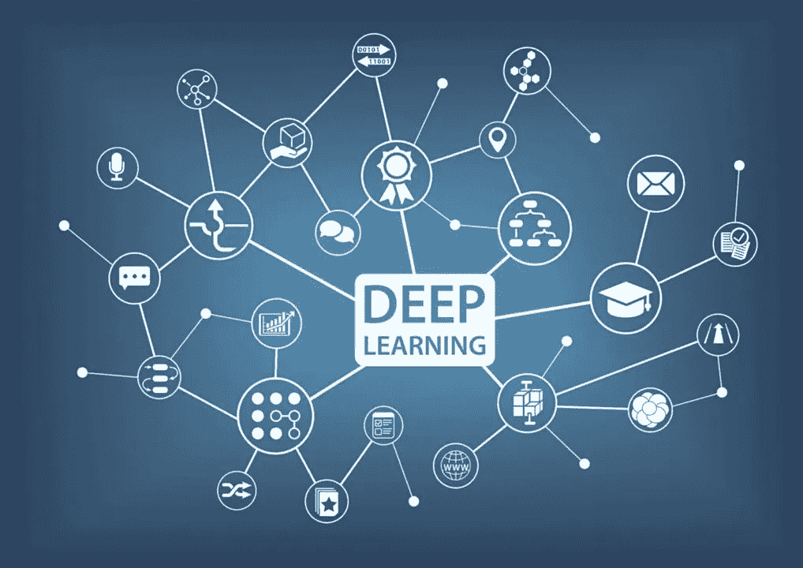
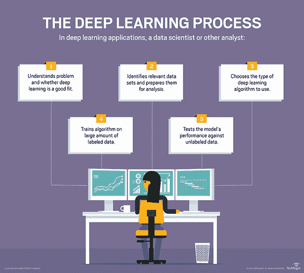
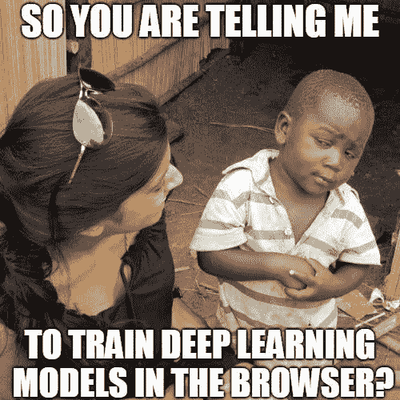
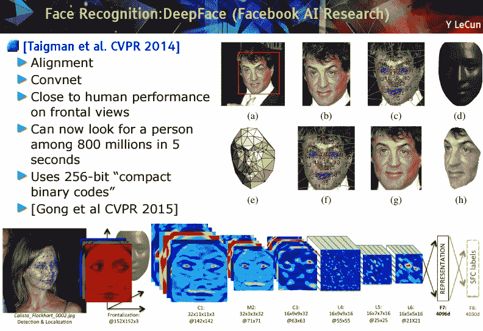

# 深度学习简介

> 原文：<https://medium.com/hackernoon/introduction-to-deep-learning-9064d6b87a51>

## 游戏改变者

Credit For The Image Goes To: [https://www.digitalocean.com/](https://www.digitalocean.com/)

Deep Learning**已经成为许多新应用的主要驱动力，现在是时候来看看为什么会这样了。我们已经使用了这么长时间的这么多其他选项，为什么要使用深度学习呢？**

深度学习现在很受欢迎，因为它简单而且有效。好吧，你可能认为深度学习很容易，也很有效，但它是什么呢？我很高兴你问了，让我们直接开始吧。😄

> 深度学习是机器学习的一个子集，其中人工神经网络，受人脑启发的算法，从大量数据中学习。与我们如何从经验中学习类似，深度学习算法将重复执行一项任务，每次都稍微调整一下以改善结果。
> 
> 我们称之为“深度学习”,是因为神经网络有各种(深度)层来实现学习。几乎任何需要“思考”才能解决的问题都是深度学习可以学会解决的问题。

深度学习不同于传统的机器学习技术，它们可以从图像、视频或文本等数据中自动学习表示，而不需要引入手工编码的规则或人类领域知识。它们高度灵活的架构可以直接从原始数据中学习，当提供更多数据时，可以提高它们的预测准确性。例如，在面部识别中，图像中的像素如何创建线条和形状，这些线条和形状如何创建面部特征，以及这些面部特征如何排列成一张脸。

> *深度学习改变了你对表示你正在用分析解决的问题的想法。它从告诉计算机如何解决问题转移到训练计算机自己解决问题*

例如，被称为卷积神经网络的深度学习模型可以使用大量(数百万)图像进行训练，例如包含猫的图像。这种类型的神经网络通常从其获取的图像中包含的像素进行学习。它可以对代表猫特征的像素组进行分类，爪、耳朵和眼睛等特征组表明图像中存在猫。

深度学习与常规的机器学习有着本质的不同。在这个例子中，领域专家将需要花费相当多的时间来设计传统的机器学习系统，以检测代表猫的特征。利用深度学习，所需要的只是向系统提供非常大量的猫图像，系统可以自主学习代表一只猫的特征。

Credit For The Image Goes To: TechTarget

我们每天生成的数据量是惊人的——目前估计有 2.6 万亿字节，这是使深度学习成为可能的资源。由于深度学习算法需要大量的数据来学习，数据创建的增加是近年来深度学习能力增长的一个原因。除了更多的数据创建，深度学习算法还受益于当今更强的计算能力。

深度学习也有助于发现系外行星和新药，以及检测疾病和亚原子粒子。它从根本上增强了我们对生物学的理解，包括基因组学、蛋白质组学、代谢组学、免疫组学等等。

# 深度学习解决什么样的问题？

如上所述，深度神经网络擅长基于大量非结构化数据进行预测。这意味着他们在语音和图像识别等领域表现最佳，在这些领域，他们处理杂乱的数据，如录制的语音和照片。

# 应该用 always 深度学习而不是机器学习吗？

不，因为从计算的角度来看，深度学习可能非常昂贵。对于非平凡的任务，训练深度神经网络通常需要使用高端 GPU 集群处理大量数据很多很多小时。

鉴于顶级 GPU 的购买成本可能高达数千美元，或者在云中的租金高达每小时 5 美元，直接跳到深度学习是不明智的。

如果问题可以使用更简单的机器学习算法来解决，如贝叶斯推理或线性回归，这种算法不需要系统处理数据中分层特征的复杂组合，那么这些计算要求低得多的选项将是更好的选择。

深度学习也可能不是基于数据进行预测的最佳选择。例如，如果数据集很小，那么有时简单的线性机器学习模型可能会产生更准确的结果——尽管一些机器学习专家认为，经过适当训练的深度学习神经网络仍然可以在少量数据的情况下表现良好。

# 深度学习有哪些弊端？

一个大的缺点是他们需要训练的数据量，脸书最近宣布，它已经使用 10 亿张图像，通过图像识别系统实现了破纪录的性能。当数据集如此之大时，训练系统还需要访问大量的分布式计算能力。这是深度学习的另一个问题，训练的成本。由于数据集的大小和必须运行的训练周期的数量，训练通常需要访问高性能和昂贵的计算机硬件，通常是高端 GPU 或 GPU 阵列。无论你是构建自己的系统还是从云平台租赁硬件，这两种选择都不太可能便宜。

深度神经网络也很难训练，因为所谓的消失梯度问题，神经网络中的层数越多，情况就会越糟。随着更多层的增加，消失梯度问题可能导致花费难以置信的长时间来训练神经网络达到良好的精度水平。

# 为什么深度神经网络很难训练？

如上所述，由于神经网络的层数，深度神经网络很难训练。网络中神经元之间的层数和链接数量如此之多，以至于很难计算训练过程中每一步需要做出的调整——这个问题被称为消失梯度问题。

Credit For The Image Goes To: [makeameme.org](http://makeameme.org)

另一个大问题是训练深度学习神经网络所需的大量数据，训练语料的大小通常为 Pb。

# 深度学习投入多少钱？

这取决于你的方法，但通常会花费你数百美元以上，这取决于机器学习任务的复杂性和你选择的方法。

# 存在哪些深度学习技术？

有各种类型的深度神经网络，其结构适合于不同类型的任务。例如，卷积神经网络(CNN)通常用于计算机视觉任务，而递归神经网络(RNNs)通常用于处理语言。每一层都有自己的专业，在 CNN 中，初始层专门用于从图像中提取不同的特征，然后将这些特征输入到更传统的神经网络中，以允许对图像进行分类。与此同时，rnn 与传统的前馈神经网络不同，它们不仅将数据从一个神经层馈送到下一个神经层，而且还具有内置的反馈回路，其中一层的数据输出被传递回其上一层，从而为网络提供了一种记忆形式。还有一种更特殊形式的 RNN，包括所谓的存储单元，专门用于处理输入之间存在滞后的数据。

最基本的神经网络类型是多层感知器网络，即上面在手写图形示例中讨论的类型，其中数据在神经元层之间前馈。每个神经元通常会使用一个激活函数来转换输入的值，该函数会将这些值转换为一种形式，在训练周期结束时，该形式将允许网络计算出距离做出准确预测还有多远。

有大量不同类型的深度神经网络。没有一个网络天生就比另一个更好，它们只是更适合学习特定类型的任务。

最近，生成对抗网络(GANS)正在扩展使用神经网络的可能性。在这种架构中，两个神经网络进行战斗，生成器网络试图创建令人信服的“假”数据，鉴别器试图区分假数据和真实数据。随着每个训练周期的进行，生成器在产生虚假数据方面变得更好，鉴别器在识别这些虚假数据方面变得更加敏锐。通过在训练期间使两个网络相互对抗，两者都可以实现更好的性能。GANs 已经被用于执行一些非凡的任务，例如将这些 dashcam 视频从白天变成夜晚或者从冬天变成夏天，如下图所示，并且具有从将低分辨率照片变成高分辨率替代物以及从书面文本生成图像的应用。然而，GAN 有其自身的局限性，这使得它们的工作具有挑战性，尽管正在通过开发更健壮的 GAN 变体来解决这些问题。

有哪些深度学习软件框架？

有各种各样的深度学习软件框架，这些框架允许用户使用一系列不同的编程语言来设计、训练和验证深度神经网络。

一个受欢迎的选择是谷歌的 TensorFlow 软件库，它允许用户用 Python、Java、C++和 Swift 编写，可用于广泛的深度学习任务，如图像和语音识别，并可在广泛的 CPU、GPU 和其他处理器上执行。它有很好的文档记录，并且有许多可用的教程和实现模型。

另一个流行的选择，尤其是对初学者来说，是 PyTorch，这是一个框架，它提供了开发人员熟悉的命令式编程模型，并允许开发人员使用标准的 Python 语句。它与从 CNN 到 RNNs 的深度神经网络一起工作，并在 GPU 上高效运行。

在众多其他选项中，有微软的认知工具包、MATLAB、MXNet、Chainer 和 Keras。

# 深度学习用例示例

# 机器人学

机器人领域最近的许多发展都是由人工智能和深度学习的进步推动的。例如，人工智能使机器人能够感知和响应他们的环境。这种能力增加了他们可以执行的功能范围，从在仓库地板上导航到分拣和处理不平整、易碎或混杂在一起的物体。像捡草莓这样简单的事情对人类来说是一件容易的事情，但对机器人来说却非常困难。随着人工智能的进步，这种进步将增强机器人的能力。

人工智能的发展意味着我们可以期待未来的机器人越来越多地被用作人类的助手。它们不仅仅被用来理解和回答问题，就像今天使用的一些一样。他们还将能够根据语音命令和手势采取行动，甚至预测工人的下一步行动。今天，协作机器人已经与人类并肩工作，人类和机器人各自执行最适合他们优势的单独任务。

# 农业

人工智能有可能彻底改变农业。今天，深度学习使农民能够部署能够看到并区分作物和杂草的设备。这种能力允许除草机有选择地在杂草上喷洒除草剂，而不影响其他植物。使用深度学习支持的计算机视觉的农业机器甚至可以通过选择性地喷洒除草剂、化肥、杀菌剂、杀虫剂和生物制剂来优化田地中的单个植物。除了减少除草剂的使用和提高农场产量，深度学习还可以进一步扩展到其他农业操作，如施肥、灌溉和收获。

# 医学成像和医疗保健

由于高质量数据的可用性和卷积神经网络对图像进行分类的能力，深度学习在医学成像中特别有效。例如，深度学习在皮肤癌分类方面可以像皮肤科医生一样有效，如果不是更有效的话。几家供应商已经获得了 FDA 对用于诊断目的的深度学习算法的批准，包括用于肿瘤学和视网膜疾病的图像分析。深度学习还通过从以下方面预测医疗事件，在提高医疗质量方面取得了重大进展

# 虚拟助手

无论是 Alexa 还是 Siri 或 Cortana，在线服务提供商的虚拟助手都使用深度学习来帮助理解你的讲话以及人类与它们交互时使用的语言。

# 翻译

同理，深度学习算法可以自动在语言之间进行翻译。这对旅行者、商人和政府官员来说是非常重要的。

顺便说一句，看看谷歌翻译的这个有趣的失败(对于所有你引发的比伯粉丝来说，现在不是我的错，是谷歌的错，好吗？！:] )

# 无人驾驶送货卡车、无人机和自动驾驶汽车的愿景

自动驾驶汽车理解道路现实以及如何对它们做出反应的方式，无论是停止标志、街道上的球还是另一辆车，都是通过深度学习算法实现的。算法接收的数据越多，它们在信息处理中就越能像人类一样行事——知道被雪覆盖的停车标志仍然是停车标志。

# 聊天机器人和服务机器人

由于深度学习，为许多公司提供客户服务的聊天机器人和服务机器人能够以智能和有帮助的方式回答越来越多的听觉和文本问题。

# 图像彩色化

以前，将黑白图像转换成彩色图像是由人手精心完成的任务。今天，深度学习算法能够使用图像中的上下文和对象来给它们着色，以基本上重建彩色的黑白图像。结果令人印象深刻且准确。

# 面部识别

Credit For The Image Goes To: Yann LeCun

深度学习正被用于面部识别，不仅用于安全目的，还用于标记脸书帖子上的人，在不久的将来，我们可能能够通过使用我们的面部来支付商店里的商品。面部识别深度学习算法面临的挑战是，即使他们改变了发型，长出或剃掉了胡子，或者由于光线不好或障碍物而拍摄的图像很差，也要知道这是同一个人。

# 深度学习的未来

今天，有各种各样的神经网络体系结构针对特定类型的输入和任务进行了优化。卷积神经网络非常擅长对图像进行分类。深度学习架构的另一种形式是使用递归神经网络来处理顺序数据。卷积和递归神经网络模型都执行所谓的监督学习，这意味着它们需要获得大量数据来学习。未来，更复杂类型的人工智能将使用无监督学习。大量研究致力于无监督和半监督学习技术。

强化学习与深度学习略有不同，在深度学习中，代理仅通过奖励和惩罚在模拟环境中反复试验来学习。这个领域的深度学习扩展被称为深度强化学习(DRL)。在这一领域已经取得了相当大的进展，正如 DRL 程序在古代围棋比赛中击败人类所证明的那样。

设计神经网络架构来解决问题是非常困难的，因为要调整许多超参数和选择许多损失函数来优化，所以变得更加复杂。已经有许多研究活动来自主学习好的神经网络架构。学会学习，也被称为元学习或 AutoML，正在稳步前进。

当前的人工神经网络是基于 20 世纪 50 年代对人类大脑如何处理信息的理解。自那以来，神经科学取得了长足的进步，深度学习架构变得如此复杂，以至于它们似乎表现出了网格细胞等结构，这些结构存在于用于导航的生物神经大脑中。神经科学和深度学习都可以从思想的交叉授粉中受益，这些领域很有可能在某个时候开始融合。

# 结论

现在有了深度学习和 GPU，我们可以以实用的速度实现更高的精度！就学习曲线而言，深度学习也更容易实现。许多开源软件非常容易使用，获得一个简单的语言翻译器、聊天机器人或图像识别器并不太困难。更少复杂的数学和编码，更多制作酷的东西！

**如果你想联系我，顺便说一句，你知道一个好笑话，你可以在** [**Twitter**](https://twitter.com/ikac_Ilija) **或** [**LinkedIn 上联系我。**](https://www.linkedin.com/in/ilijamihajlovic/)

感谢阅读！😄 🙌