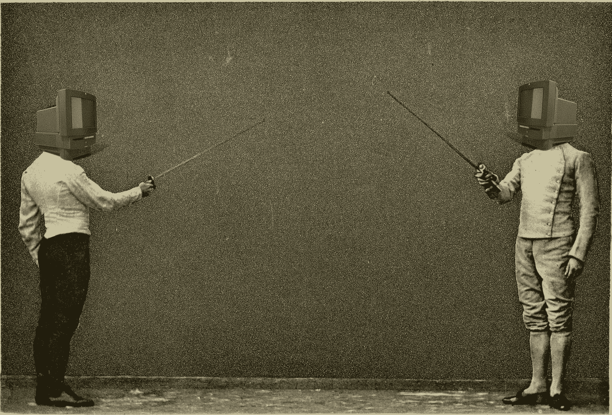
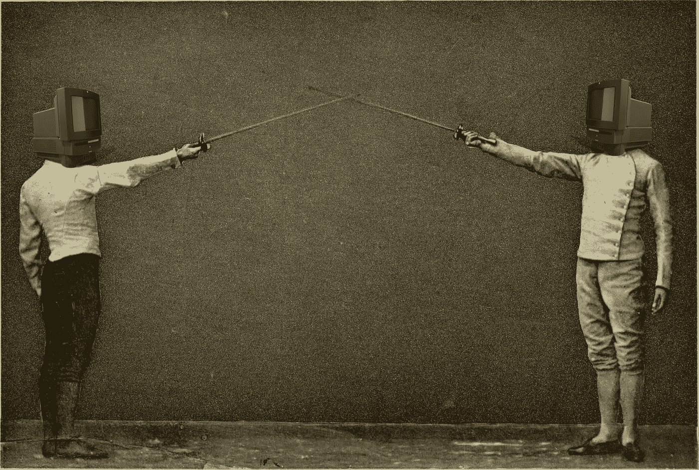
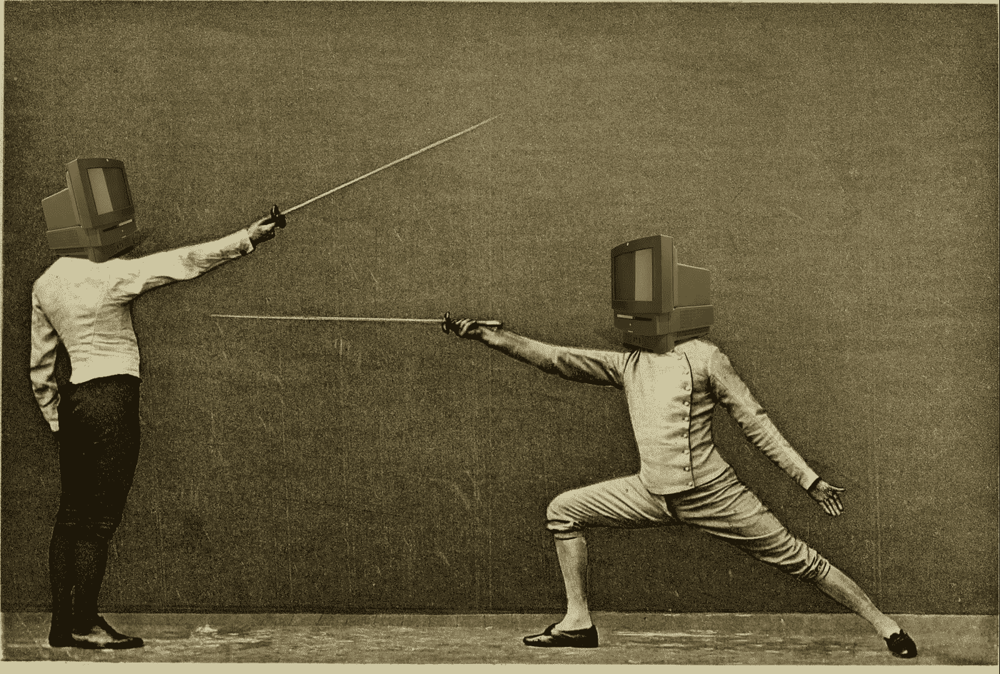

# 人工创造力

> 原文：<https://medium.com/hackernoon/introduction-to-gans-6384b7fe789f>

## 生成对抗网络及其潜力介绍

Illustration from *Fencing* (Pollock et al., 1890); modified by the author. Image retrieved from [Wikimedia Commons](https://commons.wikimedia.org/wiki/File:Fencing_(1890)_(14778122934).jpg).

## 教授计算机创造力

它始于一家酒吧。伊恩·古德菲勒和他在蒙特利尔大学的博士生们一起庆祝 2014 学年的结束。他们的谈话集中在人工智能研究的前沿:合成数据生成；具体来说，就是允许计算机产生逼真图像的方法。与机器已经掌握的一切相比，这个问题似乎不值得人工智能研究中一些最优秀的头脑关注。然而，他们认识到计算机的缺点的深刻含义，这些缺点隐藏在它所能完成的一切之下。

机器学习算法在识别*现有*数据中的模式，并将这种洞察力用于分类和预测等任务方面非常有效。当被要求生成*新的*数据时，计算机往往会陷入困境。一种算法可以击败国际象棋特级大师，或者对信用卡交易是否可能是欺诈性的进行分类；相比之下，任何试图与亚马逊的 Alexa 或苹果的 Siri 聊天的尝试都注定要失败。事实上，人类最基本和最重要的能力——例如欢乐的对话或原创作品的制作——甚至可以让最复杂的超级计算机陷入数字痉挛。

伊恩的同事试图设计复杂的统计方法来帮助计算机掌握构成图像的各种元素——他们认为这是生成逼真数据的先决条件。他们推断，为了创造某种东西，计算机必须首先理解它。伊恩避开了让研究人员提高算法对图像的理解的艰难方法，走上了一条新的道路；他想出了一种方法来指导另一种算法进行教学。通过这样做，Ian 利用了机器擅长的领域(识别现有数据)来克服它们不擅长的领域(生成新数据)。

> Ian 利用机器擅长的(识别现有数据)来克服它们不擅长的(产生新数据)。

Illustration from *Fencing* (Pollock et al., 1890); modified by the author. Image retrieved from [Wikimedia Commons](https://commons.wikimedia.org/wiki/File:Fencing_(1890)_(14593767100).jpg).

## 竞争对手

伊恩从酒吧回家后实现的机器学习模型被称为 GAN(生成对抗网络)。单词“**生成性**”表示模型的总体目的:创建新数据。GAN 将学习生成的数据取决于训练集的选择-例如，如果我们希望 GAN 像达芬奇一样绘画，我们将使用达芬奇艺术作品的训练数据集。

术语“**对抗性**”指的是构成 GAN 框架的两种算法之间类似游戏的竞争动态:生成器和鉴别器。生成器的目标是创建与训练集中的真实数据无法区分的示例。在我们的例子中，这意味着生产看起来像达芬奇的画。鉴别器的目标是将生成器产生的假样本与来自训练数据集的真实样本区分开。在我们的例子中，鉴别者扮演一个艺术专家的角色，评估被认为是达芬奇画作的真实性。这两个网络不断试图智胜对方:生成器在创建令人信服的数据方面做得越好，鉴别器就需要更好地区分真实的例子和虚假的例子。

最后，单词“**网络**”*T5”表示最常用于表示生成器和鉴别器的机器学习模型类别:神经网络。顾名思义，这些模型大致受人脑的启发——类似于神经系统，它们使用一组相互连接的节点或“神经元”来处理它们的计算。*

尽管支持 gan 的数学相当复杂，但有许多现实世界的类比可能使它们背后的直觉更容易理解。上面，我们讨论了一个艺术伪造者(“创造者”)试图愚弄艺术专家(“鉴别者”)的例子。伪造者制造的假画越有说服力，艺术专家就越能确定它们的真实性。在相反的情况下也是如此:艺术专家越能辨别一幅特定的画是否是真迹，伪造者就越需要提高自己的技艺以避免被当场抓住。

另一个经常用来描述甘斯的隐喻——伊恩自己也喜欢用——是一个伪造货币的罪犯(“发电机”)和一个试图抓住他的侦探(“鉴别者”)。伪钞看起来越像真的，侦探就越能发现它们，反之亦然。

Illustration from *Fencing* (Pollock et al., 1890); modified by the author. Image retrieved from [Wikimedia Commons](https://commons.wikimedia.org/wiki/File:Fencing_(1890)_(14593769280).jpg).

## 挥舞着双刃剑

自从 Ian 和他的合著者发表了一篇详细介绍他的发明的论文以来，GANs 一直被学术界和行业专家誉为深度学习中最重要的创新之一。脸书大学人工智能研究主任 Yann LeCun 甚至说，GANs 及其变体是“过去 20 年中深度学习领域最酷的想法”

这种兴奋情有可原。GANs 已经取得了长期以来被认为是人工系统不可能取得的显著成果，例如生成照片般逼真的图像或将马变成奔跑的斑马的视频片段的能力——所有这些都不需要大量精心标记的训练数据。与机器学习领域的其他进步不同，GANs 吸引了研究人员和更广泛的公众的想象力，这些进步可能在研究人员中家喻户晓，但只会引起其他任何人的好奇。事实上，他们已经被纽约时报、T2、英国广播公司、T4、科学美国人和许多其他著名媒体报道过。作为这项技术魅力的又一证明，一幅由甘创作的肖像画最近在佳士得拍卖行以超过 40 万美元的价格售出。

一些焦点集中在这项技术的潜在危害上。在一篇标题恰当的关于甘斯的文章的结尾——“人工智能‘猫捉老鼠的游戏’如何产生可信的假 photos"⁴”——《纽约时报》记者凯德·梅斯和基思·柯林斯讨论了甘斯被利用来创造和传播令人信服的错误信息的令人担忧的前景，包括世界领导人声明的虚假视频片段。麻省理工学院技术评论旧金山分社社长马丁·贾尔斯回应了他们的担忧，并提到了另一个潜在的风险:在熟练的黑客手中，GANs 可以被用来以前所未有的规模探测和利用系统漏洞。⁵

GANs 的其他应用不那么不祥，甚至是有益的。在线巨头亚马逊正在试验利用 GANs 进行时尚推荐——通过分析无数服装，系统将学习生产与任何给定风格匹配的新商品。⁶在医学研究中，gan 用于增加数据集，以改善诊断 accuracy⁷，甚至帮助新药发现。⁸在游戏开发中，GANs 可以被用来动态地创建新的游戏关卡和角色——而不需要人类程序员和用户体验设计师。⁹·甘斯也被视为实现所谓的“人工通用智能”的重要垫脚石，⁰是一个能够匹配人类认知能力的人工系统，以获取几乎任何领域的专业知识——从走路涉及的运动技能到创作十四行诗所需的语言和创作技能。

当未来的历史学家回顾伊恩和他的朋友出去喝酒的决定性的一天时，他们是否会希望他呆在家里，以及两个决斗神经网络的想法从未在他脑海中出现，这仍有待观察。只有未来几年才能告诉我们，对 GANs 被滥用的担忧是否会被证明是合理的，或者任何实验性应用是否会找到改善患者生活、优化创造性工作流程或开创有感知能力的超级计算机时代的方法。可以肯定的是，GANs 开启了大量的研究方向和应用，其影响将不仅限于学术界。也许，甘酒是在酒吧里发明的，因为在这一切结束之前，我们可能都需要喝一杯。

# 参考

1.  [https://www . technology review . com/s/610253/the-gan father-the-man-whos-given-the-gift-of-imagination/](https://www.technologyreview.com/s/610253/the-ganfather-the-man-whos-given-machines-the-gift-of-imagination/)
2.  [https://www . wired . com/2017/04/Google-dueling-neural-networks-spar-get-smarter-no-humans-required/](https://www.wired.com/2017/04/googles-dueling-neural-networks-spar-get-smarter-no-humans-required/)
3.  [https://www . nytimes . com/2018/10/25/arts/design/ai-art-sold-christies . html](https://www.nytimes.com/2018/10/25/arts/design/ai-art-sold-christies.html)
4.  [https://www . nytimes . com/interactive/2018/01/02/technology/ai-generated-photos . html](https://www.nytimes.com/interactive/2018/01/02/technology/ai-generated-photos.html)
5.  [https://www . technology review . com/s/610253/the-gan father-the-man-whos-given-the-gift-of-imagination/](https://www.technologyreview.com/s/610253/the-ganfather-the-man-whos-given-machines-the-gift-of-imagination/)
6.  [https://www . technology review . com/s/608668/Amazon-has-developed-an-ai-fashion-designer/](https://www.technologyreview.com/s/608668/amazon-has-developed-an-ai-fashion-designer/)
7.  Maayan Frid-Adar，Eyal Klang，Michal Amitai，Jacob Goldberger:“使用 GAN 增强合成数据以改善肝脏病变分类”，2018 年； [arXiv:1801.02385](http://arxiv.org/abs/1801.02385) 。
8.  [https://pubs.acs.org/doi/10.1021/acs.molpharmaceut.8b00930](https://pubs.acs.org/doi/10.1021/acs.molpharmaceut.8b00930)
9.  [https://news . developer . NVIDIA . com/ai-helps-video-game-developers-create-new-levels/](https://news.developer.nvidia.com/ai-helps-video-game-developers-create-new-levels/)
10.  (1)[https://synced review . com/2018/11/13/open ai-founder-short-term-agi-is-a-serious-ability/](https://syncedreview.com/2018/11/13/openai-founder-short-term-agi-is-a-serious-possibility/)和(2)[https://code . FB . com/ml-applications/a-path-to-unsupervised-learning-through-adversarial-networks/](https://code.fb.com/ml-applications/a-path-to-unsupervised-learning-through-adversarial-networks/)