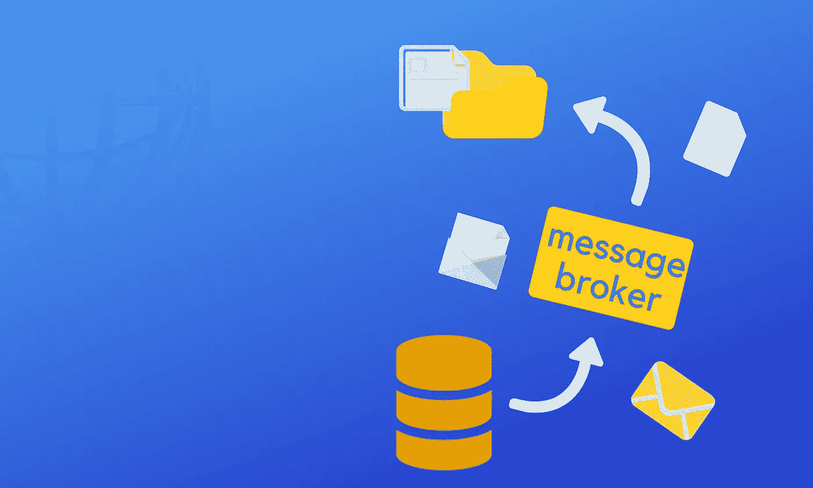
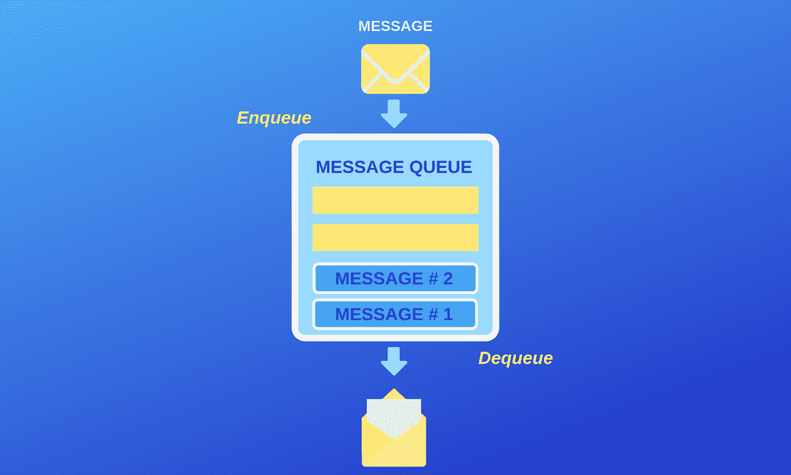
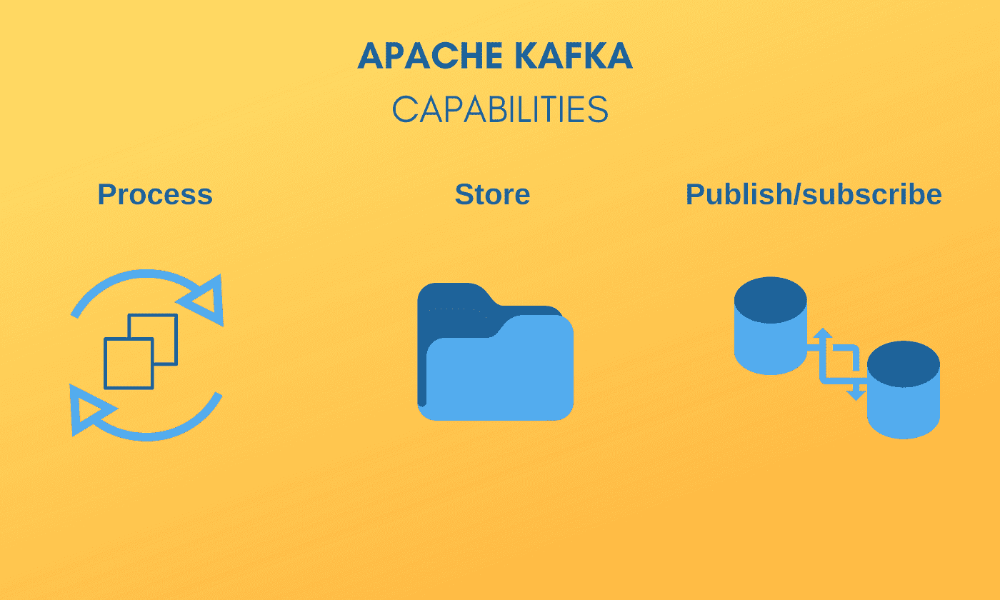

# 消息代理简介:第 1 部分:Apache Kafka vs RabbitMQ

> 原文：<https://medium.com/hackernoon/introduction-to-message-brokers-part-1-apache-kafka-vs-rabbitmq-8fd67bf68566>

*越来越多的设备接入网络，催生了一个新名词，* ***【物联网】*** *。它来源于机器对机器的通信，意味着一组能够相互交互的设备。提高系统集成的必要性导致了消息代理的发展，这对数据分析和商业智能尤其重要。在本文中，我们将研究 2 个大数据工具:Apache Kafka 和 Rabbit MQ。*

Original published at [freshcodeit.com](https://freshcodeit.com)

# **消息经纪人为什么会出现？**

你能想象目前世界上的数据量吗？如今，大约有 120 亿台“智能”机器连接到互联网。考虑到地球上大约有 70 亿人，我们几乎每人拥有 1.5 台设备。到 2020 年，他们的数量将显著增加到 2000 亿，甚至更多。随着技术的发展，智能房屋和其他自动化系统的建立，我们的日常生活变得越来越数字化。

# **消息代理用例**

作为数字化的结果，软件开发者面临着成功的数据交换的问题。假设您有自己的应用程序。例如，它是一个在线商店。所以，你永远在你的技术范围内工作，有一天你需要让应用程序与另一个交互。在以前，您可以使用简单的“入点”进行机器对机器的通信。但是现在我们有专门的信息经纪人。它们使数据交换过程简单可靠。这些工具使用不同的协议来确定消息格式。协议显示了消息应该如何传输、处理和使用。

# **简明扼要的信息传递**

> *维基百科断言消息代理*“将消息从发送方的正式消息协议翻译成接收方的正式消息协议”。

像这样的程序是计算机网络的重要组成部分。它们确保信息从 A 点传输到 b 点。

Original published at [freshcodeit.com](https://freshcodeit.com)

## **何时需要消息代理？**

1.  如果您想要控制数据馈送。例如，任何系统中的注册数量。
2.  当任务是将数据放入几个应用程序并避免直接使用它们的 API 时。
3.  像交易系统一样按照规定的顺序完成流程的必要性。

因此，我们可以说消息代理可以做 4 件重要的事情:

*   **划分**出版商和消费者
*   **存储**消息
*   **路由**消息
*   **检查**并整理信息

有**自部署**和**基于云的**消息工具。在这篇文章中，我将分享我与第一种类型合作的经验。

# **消息中介阿帕奇卡夫卡**

**定价:**免费

**官网:**[https://kafka.apache.org/](https://kafka.apache.org/)

**有用资源:** [文档](https://kafka.apache.org/documentation.html)，[书籍](https://data-flair.training/blogs/apache-kafka-books/)

**优点:**

*   容易拿起
*   强大的事件流平台
*   容错和可靠的解决方案
*   良好的可扩展性
*   免费社区分布式产品
*   多租户
*   适合实时处理
*   非常适合大数据项目

缺点:

*   缺乏现成可用的元素
*   缺乏完整的监控设备
*   对阿帕奇动物园管理员的依赖
*   没有路由
*   邮件数量不断增加的问题

网飞、易贝、优步、纽约时报、PayPal 和 Pinterest 有什么共同点？所有这些伟大的企业都曾经或正在使用世界上最流行的消息代理程序 Apache Kafka。

## **卡夫卡的故事发展**

凭借实时处理和大数据项目的众多优势，这种异步消息传递技术已经征服了世界。怎么开始的？

2010 年，LinkedIn 的工程师们面临着将基础设施中的大量数据整合到 lambda 架构中的问题。它还包括 Hadoop 和实时事件处理系统。

至于传统的消息经纪人，他们没有满足 Linkedin 的需求。这些解决方案又重又慢。因此，工程团队开发了可扩展的容错消息传递系统，没有太多的花哨功能。新的队列管理器已经迅速转变为一个成熟的事件流平台。

## **阿帕奇卡夫卡能力**

这项技术之所以流行，很大程度上是因为它的兼容性。让我们看看。我们可以将 Apache Kafka 用于各种系统。它们是:

*   web 和桌面定制应用程序
*   微服务、监控和分析系统
*   任何需要的汇或源
*   NoSQL、甲骨文、Hadoop、SFDC

借助 Apache Kafka，您可以成功创建数据驱动的应用程序，并管理复杂的后端系统。下图显示了这个队列管理器的 3 个主要功能。

Original published at [freshcodeit.com](https://freshcodeit.com)

如你所见，阿帕奇·卡夫卡能够:

1.  **发布和订阅**具有出色可伸缩性和性能的记录流，这使其适合全公司使用。
2.  **持久存储**流，跨多个节点分发数据以实现高可用性部署。
3.  **在数据流到达时对其进行处理，允许您聚合、创建窗口参数、执行数据流内的数据连接等。**

## **APACHE KAFKA 关键术语和概念**

首先，您应该了解分布式提交**日志**的抽象。这个令人困惑的术语对于消息代理来说至关重要。许多 web 开发人员过去常常在登录特性的上下文中考虑“日志”。但是 Apache Kafka 是基于*日志数据结构*的。这意味着日志是一个按时间排序的、仅附加的数据插入序列。至于其他概念，它们是:

*   **主题**(存储的记录流)
*   **记录**(它们包括一个键、一个值和一个时间戳)
*   **API**([生产者 API](https://kafka.apache.org/documentation.html#producerapi) ，[消费者 API](https://kafka.apache.org/documentation.html#consumerapi) ，[流 API](https://kafka.apache.org/documentation/streams) ，[连接器 API](https://kafka.apache.org/documentation.html#connect) )

客户端和服务器的交互使用简单有效的 [TCP 协议](https://kafka.apache.org/protocol.html)实现。这是语言不可知的标准。所以，客户端可以用你想要的任何语言编写。

## **卡夫卡作品原理**

有两种主要的消息传递模式:

1.  [排队](http://en.wikipedia.org/wiki/Message_queue)
2.  [发布-订阅](http://en.wikipedia.org/wiki/Publish%E2%80%93subscribe_pattern)

两者各有利弊。第一种模式的优势是有机会轻松扩展处理。另一方面，队列不是多用户的。第二种模式提供了向多个消费者群体广播数据的可能性。同时，在这种情况下，缩放更加困难。

Apache Kafka 神奇地结合了这两种数据处理方式，获得了两者的优点。应该提到的是，这个队列管理器比传统的消息代理提供了更好的排序保证。

## **卡夫卡的怪癖**

Kafka 结合了消息传递、存储和处理的功能，它不是一个普通的消息代理。这是一个强大的事件流平台，每天能够处理数万亿条消息。Kafka 对于存储和处理过去的历史数据以及实时工作都很有用。您可以使用它来创建流应用程序，以及流数据管道。

如果你想跟随 Kafka 用户的步骤，你应该注意一些细微差别:

*   消息没有单独的 id(它们通过日志中的偏移量来寻址)
*   系统不会检查每个主题或消息的消费者
*   Kafka 不维护任何索引，也不允许随机访问(它只是从偏移量开始按顺序传递消息)
*   系统没有删除，也没有在用户空间缓冲消息(但是有各种各样的[可配置存储策略](https://www.cloudkarafka.com/blog/2018-05-08-what-is-kafka-retention-period.html)

## **结论**

作为实时统计和大数据项目的完美开源解决方案，这个消息代理有一些弱点。问题是这需要你做很多工作。你会觉得缺少插件和其他可以在你的代码中简单重用的东西。

当您需要优化处理大量数据(每秒 100，00 0 条消息或更多)时，我推荐您使用这个多重发布/订阅和排队工具。在这种情况下，阿帕奇卡夫卡会满足你的需求。

# **消息代理 RabbitMQ**

**定价:**免费

**官网:**[**https://www.rabbitmq.com**](https://www.rabbitmq.com)

**有用的资源:** [**工具**](https://www.rabbitmq.com/devtools.html) **，** [**最佳实践**](https://www.rabbitmq.com/best-practices.html)

**优点:**

*   适用于许多编程语言和消息协议
*   可以在不同的操作系统和云环境中使用
*   易于开始使用和部署
*   提供使用各种开发工具的机会
*   现代内置用户界面
*   提供集群，并且非常擅长
*   扩展到每秒大约 500，000 多条消息

**缺点:**

*   非事务性(默认情况下)
*   需要 Erlang
*   可以通过代码完成的最小配置
*   处理大量数据的问题

下一个非常流行的解决方案写在 [Erlang](https://en.wikipedia.org/wiki/Erlang_(programming_language)) 中。由于它是一种简单的、通用的、函数式编程语言，由许多现成的组件组成，这个软件不需要大量的手工工作。RabbitMQ 被称为“传统的”消息代理，适用于广泛的项目。它被成功地用于新的创业公司和著名企业的发展。

该软件构建在[开放电信平台](https://en.wikipedia.org/wiki/Open_Telecom_Platform)框架上，用于集群和故障转移。您可以找到许多使用队列管理器的客户端库，它们是用所有主流编程语言编写的。

## **rabbit MQ 发展的故事**

最古老的开源消息代理之一可以用于各种协议。许多 web 开发人员喜欢这个软件，因为它有用的特性、库、开发工具和指令。

2007 年，Rabbit Technologies Ltd .开发了该系统，最初实现了 AMQP。这是一个开放的有线协议，用于具有复杂路由功能的消息传递。AMQP 确保了在 Java 生态系统之外使用消息代理解决方案的跨语言灵活性。事实上，RabbitMQ 与 Java、Spring、.NET、PHP、Python、Ruby、JavaScript、Go、Elixir、Objective-C、Swift 等诸多技术。众多的插件和库是该软件的主要优势。

## **RABBITMQ 功能**

RabbitMQ 是作为一般用途的消息代理创建的，它基于发布-订阅通信模式。根据您的喜好，消息传递过程可以是同步的，也可以是异步的。因此，消息代理的主要特性是:

*   支持多种协议和消息队列，可变的队列路由，不同类型的交换。
*   集群部署确保了完美的可用性和吞吐量。该软件可以在不同的地区使用。
*   使用傀儡，波什，厨师和码头工人进行部署的可能性。与最流行的现代编程语言兼容。
*   在私有云和公共云中进行简单部署的机会。
*   可插拔认证，支持 TLS 和 LDAP，授权。
*   许多建议的工具可以用于持续集成、操作度量，并与其他企业系统一起工作。

## **RABBITMQ 工作原理**

作为一个以经纪人为中心的程序，RabbitMQ 在生产者和消费者之间提供保证。如果你选择这个软件，你应该使用瞬时消息，而不是持久消息。

该程序使用代理来检查消息的状态，并验证交付是否成功完成。消息代理假定消费者通常在线。

至于消息排序，消费者将在发布的订单本身中获得消息。发布的顺序受到一致的管理。

## **RABBITMQ 特性**

这个消息代理的主要优势是完美的插件集，以及良好的可伸缩性。许多 web 开发人员喜欢清晰的文档和定义良好的规则，以及使用各种消息交换模型的可能性。事实上，RabbitMQ 适用于其中的 3 种:

1.  **直接**交流模式(话题一对一的个人交流)
2.  **话题**交换模式(每个消费者都会收到一条发送到特定话题的消息)
3.  **扇出**交换模型(所有连接到队列的消费者都得到消息)。

这里可以看出卡夫卡和 RabbitMQ 的差距。如果消费者没有连接到 RabbitMQ 中的扇出交换，消息将会丢失。同时，卡夫卡允许避免这一点，因为任何消费者都可以阅读任何信息。

## **结论**

至于我，我喜欢 RabbitMQ，因为我有机会使用许多插件。它们节省时间，加快工作速度。您可以轻松调整过滤器、优先级、消息排序等。就像 Kafka 一样，RabbitMQ 需要您部署和管理软件。但是它有方便的内置 UI，并允许使用 SSL 来获得更好的安全性。至于应对大数据负载的能力，这里 RabbitMQ 不如 Kafka。

综上所述，Apache Kafka 和 RabbitMQ 确实值得有技巧的软件开发人员关注。我希望，我的文章能帮助你找到适合你的项目的大数据技术。如果您还有任何问题，欢迎您通过[联系 Freshcode](https://freshcodeit.com/contact) 专家。在下一篇评论中，我们将比较其他强大的消息传递工具，ActiveMQ 和 Redis Pub/Sub。

*原文* [***消息经纪人简介。第一部分:阿帕奇卡夫卡 vs 拉比泰姆 Q***](https://freshcodeit.com/blog-introduction-to-message-brokers-part-1-apache-kafka-vs-rabbitmq) *发表于*[***freshcodeit.com***](https://freshcodeit.com/)*。*