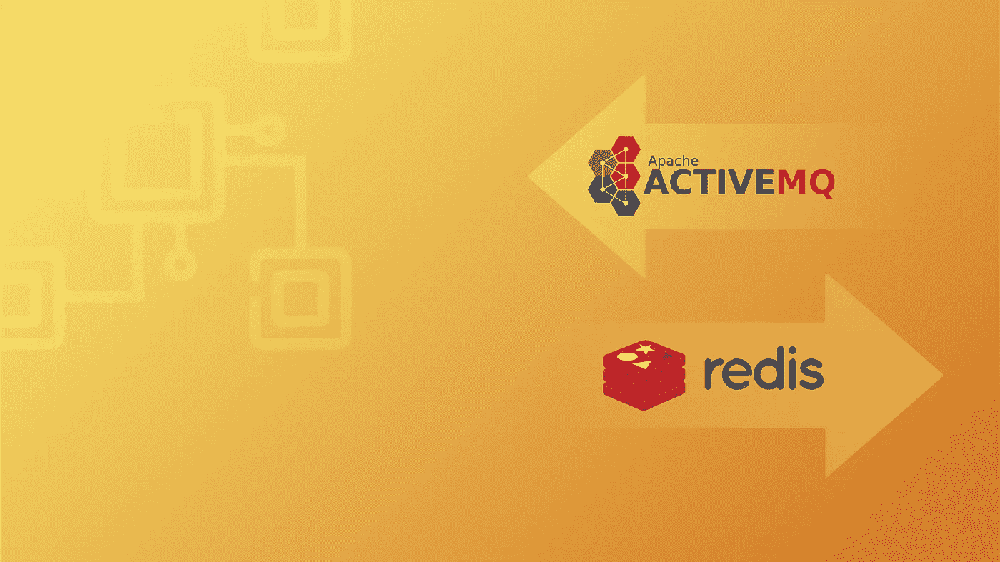
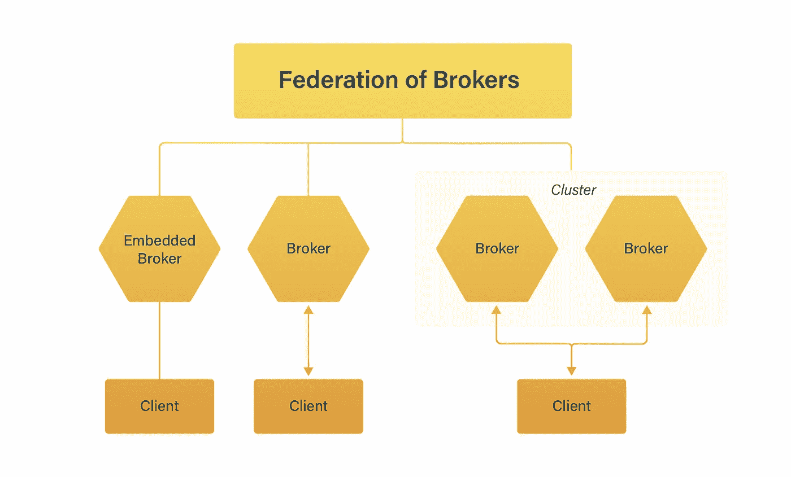
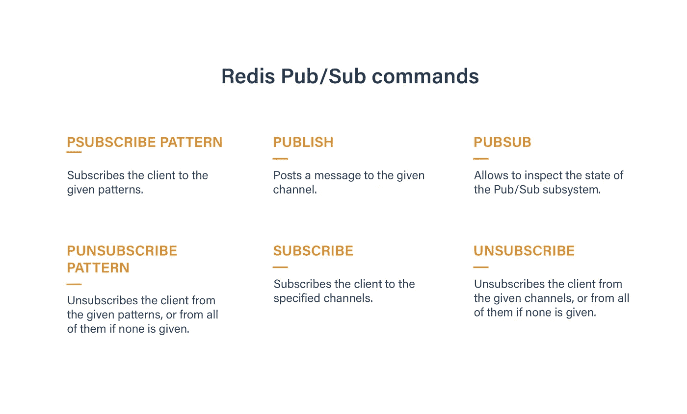

# 消息代理简介:第 2 部分:ActiveMQ 与 Redis 发布/订阅

> 原文：<https://medium.com/hackernoon/introduction-to-message-brokers-part-2-activemq-vs-redis-pub-sub-dd9e173e27a5>

## 在之前对最流行的消息传递系统的概述中，我们讨论了 Apache Kafka 与 RabbitMQ。现在，让我们看看功能不太强大，但仍然非常有用的消息代理。

我们会考虑 **ActiveMQ** 和 **Redis Pub/Sub** 的利弊。尽管这些解决方案不太适合处理大数据，但它们为创建小型企业分析工具提供了坚实的基础。

# **阿帕奇 ActiveMQ**

**定价:**免费

**官方网站:**http://activemq.apache.org

**有用资源:** [AmazonMQ](https://aws.amazon.com/amazon-mq/?nc1=h_ls)

**优点:**

*   动态队列创建的机会
*   队列管理的 Web 用户界面
*   代理可以通过 XML 进行配置
*   产品得到积极维护

**缺点:**

*   消息必须发送到队列或主题

ActiveMQ 是用 Java 编写的 Apache 产品。不需要处理海量数据的开发人员通常更喜欢这种简单可靠的开源解决方案。消息代理由于其快速的工作以及与许多协议和先进技术的兼容性而变得流行。

## **ActiveMQ 开发的故事**

在 ActiveMQ 开发的开始，有两个原因启动这个项目:

1.  那个时代最流行的信息工具的高价。
2.  在一个完全符合 J2EE T21 的系统上工作的必要性(与 Apache 的许可兼容)。

与其竞争对手(EMS/TIBCO、SonicMQ、WebSphereMQ)不同，消息传递系统将可访问性与有用且有效的特性结合在一起。因此，它在主要行业的大公司中很受欢迎。LogicBlaze 在 2004 年开发了免费的消息代理。它是由 CodeHaus 主办的。2007 年，该系统被捐赠给 ASF。它的创始人继续开发产品。ActiveMQ 今天得到了积极的维护。

## **ActiveMQ 功能**

面向消息的中间件为 Java 开发人员提供了极好的机会。该系统基于 JMS 标准规范，支持异步通信。因此，它允许程序员在企业项目中组织快速稳定的消息传递过程。我可以定义消息传递系统的 3 个关键优势。

1.  **兼容性:**可以将 ActiveMQ 与其他主流消息工具结合使用。我指的是[亚马逊简单排队服务](https://aws.amazon.com/sqs/)，[阿帕奇卡夫卡](https://www.datadoghq.com/blog/monitoring-kafka-performance-metrics/)， [RabbitMQ](https://www.datadoghq.com/blog/rabbitmq-monitoring/) 。此外，还有机会使用[亚马逊 MQ](https://aws.amazon.com/amazon-mq/) 。它是 ActiveMQ 的实现，与 AWS 云解决方案集成。

**2。便利:**消息代理基于 JMS API。因此，创建、传输和接收消息的过程由统一的标准决定。除了 Java，ActiveMQ 客户端可以用其他编程语言编写。分别是 Python，Node.js，Ruby。

**3。灵活性:**消息传递系统工作足够快，有助于使用企业集成模式和其他现代解决方案。同时，它很容易接近和习惯。消息代理的简单配置是实现企业项目的一个重要优势。而且 ActiveMQ 支持很多协议(WebSockets、 [AMQP](https://en.wikipedia.org/wiki/Advanced_Message_Queuing_Protocol) 、REST、 [OpenWire](https://en.wikipedia.org/wiki/OpenWire_(binary_protocol)) 、 [STOMP](https://en.wikipedia.org/wiki/Streaming_Text_Oriented_Messaging_Protocol) 、MQTT 等)。

## **ActiveMQ 工作原理**

就像其他消息传递系统一样，该程序将数据从一个应用程序(生产者)传输到另一个应用程序(消费者)。因此，其架构包括:

*   经纪人
*   目标应用程序
*   客户端应用程序

消息代理通过以下两种目的地之一路由每条消息:

1.  首先是一个**队列**。这是点对点消息传递的一部分，其中只有一个消费者。
2.  第二个是一个**主题**，包含在“发布/订阅”消息中，意味着几个消费者的参与。

## **ActiveMQ 特性**

由于消息传递的异步过程，消费者应用程序不需要立即接收消息。ActiveMQ 将这两项任务分开:

*   制作人的任务是创建和发送信息
*   **消费者的**取货任务

因此，这些应用程序是相互独立的。一旦生产者向代理发送消息，生产者的任务就完成了。消费者应用程序是否或何时获取信息并不重要。这种类型的消息传递被称为**松耦合**，为开发人员提供了一些好处。

*   **生产力:**生产者不需要等待消费者或经纪人的信号。所以，发送消息的过程非常快。该系统能够实现巨大的吞吐量。
*   **适应性:**即使客户端应用暂时不可用(突然添加到系统中，或发生变化)，消息传递过程也不会中断或停止。
*   异构性:独立的客户端可以用任何合适的语言编写，因为它们彼此不交互。

总而言之，我推荐 Apache ActiveMQ 作为一个**混合**和**灵活**的消息代理。特别适合企业项目。ActiveMQ 在复杂的结构中相对容易建立，表现出良好的可靠性和高吞吐量。

# **Redis 发布/订阅**

**定价:**免费

**官网:** [https://redis.io](https://redis.io/)

**有用资源:** [教程](https://www.tutorialspoint.com/redis/redis_quick_guide.htm)

**优点:**

*   灵活性(重新路由消息、跟踪详细的服务器内指标等)
*   简单的安装、配置和维护
*   对数据库的高速访问
*   快速、基于集合的操作的绝佳选择

**缺点:**

*   具有挑战性的群集配置，尤其是具有多个写入节点的群集
*   持久性会影响性能
*   缺乏高级安全选项和访问控制

高级数据库是用 c 语言编写的。首先，Redis 执行存储数据的功能，但它也提供了传递消息的机会。它有助于创建快速、可伸缩的应用程序。Redis 是在 BSD 3 条款许可下发布的，在为中小型企业开发技术解决方案方面很受欢迎。

## **的故事** Redis Pub/Sub **开发**

创建于 2009 年的**RE**mote**D**Ictionary**S**server 仍然是一个开源项目。其创始人在自己的欧洲创业公司工作。这是一个实时 web 日志分析器，需要增加可伸缩性。在使用传统数据库时，面对工作负载的一些挑战，程序员开始开发 Redis 的第一个版本。他将这个项目开源，并得到了 Ruby 社区的支持。Instagram 和 GitHub 是首批采用新数据库的伟大项目。上一个程序版本包括一个新的数据结构，用于存储多个字段和字符串值，具有自动的、基于时间的序列。

## Redis Pub/Sub **工作原理**

Redis 发布/订阅实现了队列应用程序的消息传递系统，它使用 3 个主要术语:

1.  **发布者**(发送消息)
2.  **用户**(接收消息)
3.  **频道**(链接发布者和订阅者)

Original published at [freshcodeit.com](https://freshcodeit.com)

同样重要的是，单个用户的频道数量不受限制。同时，发布者能够在一个通道上向任意数量的订阅者发送消息。由于发布者/订阅者平台中的所有消息都是一次性的，因此在没有确定订阅者的情况下，它们会被删除。

*注意:你应该知道“redis-cli”一旦进入订阅模式就不会接受任何命令。只能用 Ctrl-C 退出模式*

## Redis 发布/订阅**特性**

就像 ActiveMQ 一样，Redis 发布/订阅发布者和订阅者是相互独立的。因此，当其中的第一个发送消息时，它不知道哪个接收器连接到该通道。对于订阅频道而不了解其他发布者的接收者来说也是如此。

这项技术的主要优势之一是有机会使用用不同语言编写的客户端。你可以阅读完整的[列表](https://redis.io/clients)。它包括诸如 Ruby、Python、PHP、Objective-C、Node.js、Java、Clojure、C++、C#等流行的解决方案。

在您的基础设施中使用 Redis 的 Pub/Sub，您将享受到快速的消息传递和进程间的通信。代理的**简单性**和**性能**使其在广泛的用例中广受欢迎。考虑到著名的数据库和缓存特性，Redis 可以成为您未来项目的便利技术。

在这里，我们结束了我们的**自我部署**消息传递系统之旅。让我知道你是否喜欢这样的评论和你对所有这些技术的看法。

*原文* [***消息经纪人简介。第二部分:ActiveMQ vs Redis Pub/Sub***](https://freshcodeit.com/freshcode-post/introduction-to-message-brokers-activemq-vs-redis-pub-sub)**发布于*[***freshcodeit.com***](http://freshcodeit.com)*。**