# 机器学习栈简介

> 原文：<https://medium.com/hackernoon/introduction-to-the-machine-learning-stack-f5b64bba7602>

Introduction to the machine learning stack

数据科学是推动人工智能(AI)和机器学习(ML)最新进展的潜在力量。这导致了 ML 库的巨大增长，并使得像 Python 这样的成熟编程语言比以往任何时候都更受欢迎。

将它们放在一起是有意义的(即使它们不可互换)，因为有大量的重叠。在某些方面，我们可以说数据科学是关于产生洞察力的，而人工智能是关于产生行动的，而 ML 则专注于做出预测。

为了更好地理解 AI 和 ML 中数据科学的内部工作，你必须深入下面列出的机器学习工程栈，以理解它是如何使用的。

作为我们对跳板的[人工智能/机器学习职业轨迹](https://www.springboard.com/workshops/ai-machine-learning-career-track/?utm_source=hackernoon&utm_medium=article&utm_term=hackernoon1)(第一个有工作保障的在线机器学习课程)研究的一部分，我们已经精选了这些工具和所需的资源。

## **CometML**

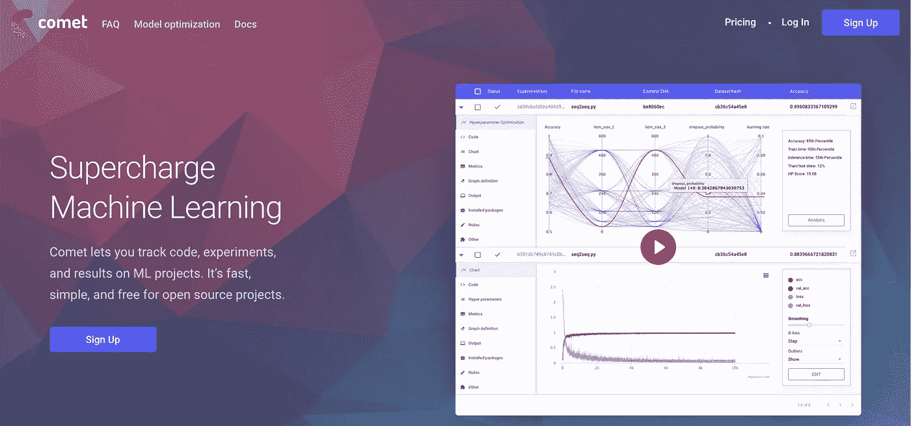

CometML

CometML 是一个较新的产品，旨在为机器学习做 GitHub 为代码做的事情。GitHub 因其在组织工作流和维护项目版本控制方面的灵活性而闻名，多个开发人员在同一个代码库上工作。同样，CometML 允许数据科学家和开发人员高效地跟踪、比较和协作机器学习实验。当你训练你的模型时，CometML 跟踪并绘制结果。它还跟踪代码更改并导入它们。

开发人员可以将 CometML 集成到大多数机器学习库中，包括 PyTorch、Keras 和 Scikit-learn，因此不会中断现有的工作流程。你只需要一个新的辅助服务来帮助你更深入地了解你的实验。您可以在任何 jupyter 笔记本中部署 CometML，只需两行代码。

要开始，你只需建立一个免费帐户，将彗星跟踪代码添加到你选择的机器学习应用程序中，然后像往常一样运行你的实验。

Comet 与 GitHub 和其他 git 服务提供商合作。一旦你完成了一个项目，你可以直接向你的 GitHub 库生成一个 pull 请求。

更多信息，请查看 [Comet 的文档](https://www.comet.ml/docs/)，这份面向用户的[备忘单](/comet-ml/comet-ml-cheat-sheet-supercharge-your-machine-learning-experiment-management-7786e08f8e9e)，以及 Comet.ml 首席执行官 Gideon Mendels 的[数据委员会演示文稿](https://www.youtube.com/watch?v=qdFX-DYslt0)。

## **Dask-ML**

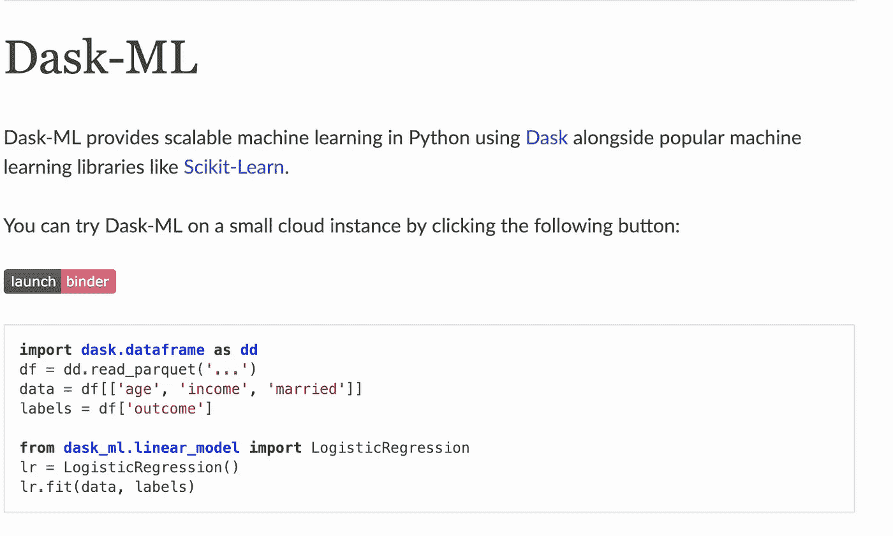

Dask-ML

Dask -ML 旨在为分析提供高级并行性，同时提升 Pandas 和 NumPy workflows 等工具的大规模性能。它还通过将低级 API 暴露给内部任务调度程序来执行高级计算。

对于机器学习项目，Dask-ML 是克服长训练时间和大数据集的有用工具。事实上，通过用 Dask-ML 数组替换 NumPy 数组，可以更容易地扩展算法。Dask-ML 利用 Dask 工作流来准备数据。然后，它可以快速部署到类似 TensorFlow 的工具上，与 Dask-ML 一起移交数据。

查看这些 Dask-ML 资源:

*   [stack overflow 上的 Dask 问题](https://stackoverflow.com/questions/tagged/dask)
*   [利用 Dask 的可扩展机器学习](https://www.youtube.com/watch?v=tQBovBvSDvA)
*   [为什么是 Dask？](http://docs.dask.org/en/latest/why.html)

## **码头工人**

Docker

Docker 在机器学习栈中的作用是简化安装过程。对于数据科学家来说，这对于那些花费大量时间试图解决配置问题的人来说是天赐之物。Docker 背后的主要思想很简单:如果它在 Docker 容器中工作，那么它将在任何机器上工作。

这个开源软件平台使得在流行的操作系统上使用容器来开发、部署和管理虚拟机变得更加容易。由于其强大的联合工具生态系统，您可以编写一个 Docker 文件来构建一个 [Docker 映像](https://hub.docker.com/r/sachinruk/ml_class/)，它包含了任何给定项目所需的大多数库和工具。

[DockerHub](https://hub.docker.com/) 就是 GitHub 之于 Git。这个平台使得分享你的 Docker 图片和帮助其他人完成他们的项目变得更加容易。然而，Docker 的真正潜力只有在机器学习加入到组合中时才能实现。

例如，你可以[使用带有容器的应用程序，通过面部识别在社交媒体平台上搜索数百万张个人资料图片](https://blog.machinebox.io/a-customer-uses-machine-box-to-wrangle-profile-photos-e1158262ac5)。在这种情况下，Docker 简化了工作，使其可扩展，并允许企业专注于他们的目标。

我们可以说 ML 被 Docker 革新了，因为它允许创建有效的应用程序架构。

如果之前没用过 Docker，最好从 [Docker 方位](https://docs.docker.com/get-started/)开始。

## **GitHub**

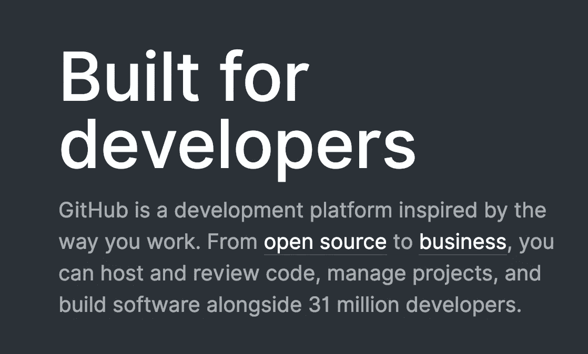

Github

[GitHub](https://github.com/) 是一个 Git 存储库托管服务和开发平台，商业和开源社区都可以在这里托管、管理项目、审查代码和开发软件。GitHub 得到了超过 3100 万开发人员的支持，它提供了一个高度用户友好的、基于 web 的图形界面，使得管理开发项目变得更加容易。

有几个协作功能，如基本的任务管理工具、wikis 和访问控制。无论你是初学者还是资深专业人士，这个平台都有丰富的资源为你服务。

在 freeCodeCamp 上有一篇关于 Git 以及如何使用它提交/保存协作文件的介绍[。](https://medium.freecodecamp.org/what-is-git-and-how-to-use-it-c341b049ae61)

对你下一个项目有帮助的 ML 资源有:

*   [令人惊叹的数据科学库](https://github.com/bulutyazilim/awesome-datascience)
*   [GPT-2——open ai 开创性的语言模型](https://github.com/openai/gpt-2)
*   [迭代/DVC](https://github.com/iterative/dvc)
*   [OpenML](https://github.com/openml/OpenML)
*   [SC-FEGAN](https://github.com/JoYoungjoo/SC-FEGAN)

## **Hadoop**

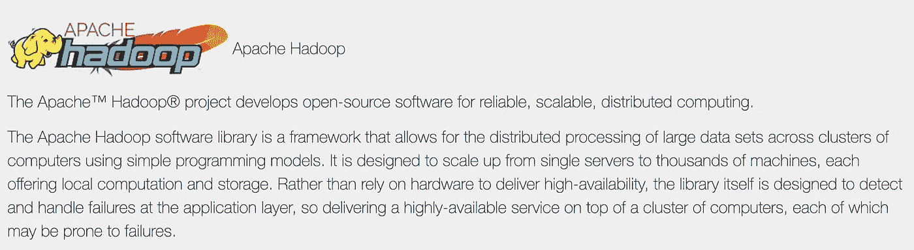

Apache Hadoop

Hadoop 是一个 Apache 项目，它可以被描述为一个软件库和框架，支持使用简单的编程模型对来自多台计算机的大型数据集进行分布式数据处理。

事实上，Hadoop 可以从一台计算机扩展到数千台提供计算能力和本地存储的商用系统。Hadoop 框架由以下模型组成:

*   Hadoop 分布式文件系统(HDFS)
*   Hadoop 常见
*   Hadoop 纱线
*   Hadoop MapReduce

您还可以通过以下型号进一步扩展 Hadoop 的功能和范围:

*   安巴里
*   Avro
*   卡桑德拉
*   水道
*   储备
*   驭象者
*   猪
*   Sqoop

Hadoop 非常适合那些希望利用 ML 快速处理大型复杂数据集的公司。可以在 Hadoop 的 MapReduce 中实现机器学习，快速识别模式和深刻见解。

为了实现这一点，你必须在 Hadoop 上运行 [ML library Mahout](http://mahout.apache.org/) 。要了解更多关于在 Hadoop 上使用 Mahout 的信息，请查看以下资源:

*   [从源代码构建 Mahout](https://mahout.apache.org/developers/buildingmahout)
*   [GitHub 上的阿帕奇看象人](https://github.com/apache/mahout)
*   [Apache Mahout 新手教程](https://www.youtube.com/watch?v=zvfKH9Yb0s0&list=PL9ooVrP1hQOGbSzIhdjb47SFMDc6bK6BW)

## **Keras**

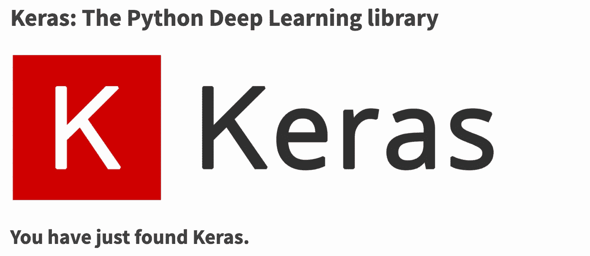

Keras

[Keras](https://keras.io/) ，用 Python 写的，是一个高级神经网络 API。Keras 由谷歌的人工智能研究员和软件工程师 Franç ois Chollet 编写，他是 Wysp 的创始人。

使用 Keras，您可以在 CNTK、TensorFlow 或 Theano 上轻松运行实验。它非常适合需要深度学习库的项目，该库通过模块化和可扩展性来适应快速原型制作。它还支持递归和卷积网络，并在 CPU 和 GPU 上无缝运行。

为了更好地了解这是如何工作的，请查看对 Chollet 的采访。你也可以在 GitHub 上找到[更多的 Keras 资源。](https://github.com/fchollet/keras-resources)

## **路易吉**

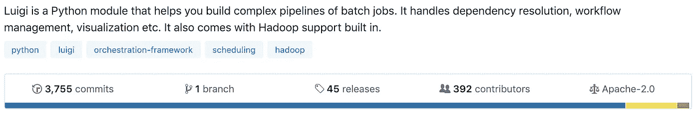

Luigi

Luigi 是一个 Python 框架，在 Spotify 内部使用。使用该工具，您可以构建批处理作业的复杂管道，并有效地管理依赖关系解析、可视化、工作流等。

它的建立是为了解决与长时间运行的批处理过程相关的挑战，其中失败是不可避免的。Luigi 使自动化和管理长时间运行的任务变得更加容易，比如向/从数据库转储数据、Hadoop 作业和运行 ML 算法。

像 Cascading、Hive 和 Pig 这样的工具可以有效地管理数据处理的底层方面，但 Luigi 可以帮助您将它们链接在一起。例如，您可以用 Java 将 Hadoop 作业缝合在一起，从数据库中转储一个表，用 Python 将 Hive 查询或 Spark 作业缝合在一起。Luigi 负责工作流管理，您可以专注于任务和 it 依赖项。

有用的 Luigi 资源包括:

*   [生产就绪数据——使用 Python 和 Luigi 进行科学研究](https://www.youtube.com/watch?v=jRkW5Uf58K4)
*   [使用 Luigi 和 Scikit-Learn 的机器学习管道](https://www.youtube.com/watch?v=RCdms8eGid8&list=PLVTW-2BVv9Pg8QsBTWSkgCJ9NOm-Cypbq)

## **熊猫**

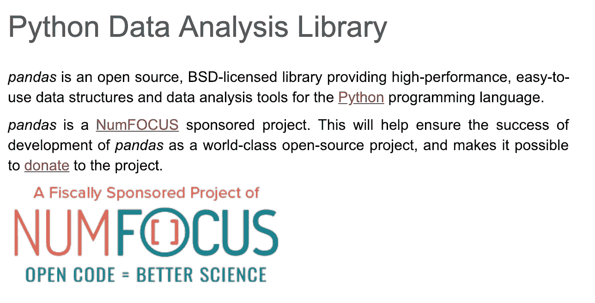

Pandas

对于用 Python 编码的数据科学家来说，[熊猫](https://pandas.pydata.org/)是一个重要的工具，通常是许多大数据项目的主干。事实上，对于任何考虑从事数据科学或机器学习的人来说，学习熊猫将是至关重要的，因为它是清理、转换和分析数据的关键。

通过将 CSV 文件中的信息提取到数据帧或表格中，可以让您轻松熟悉数据。它还可以执行计算、可视化，并在存储之前清理数据。后者对于 ML 和自然语言处理至关重要。

查看这个[熊猫教程](https://appdividend.com/2019/01/16/python-pandas-tutorial-example-python-data-analysis-library/)了解更多。

## **PyTorch**

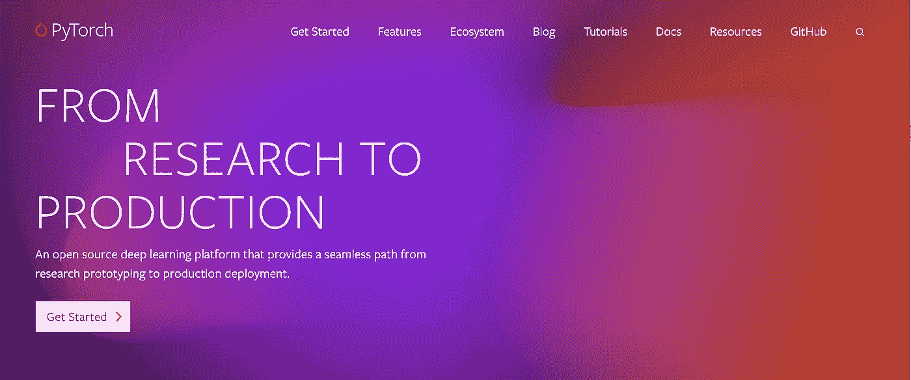

PyTorch

[PyTorch](https://pytorch.org/) 是用 Python 写的，是 Python 的 Torch 库(用 Lua 写的)的继承者。PyTorch 由脸书开发，被 Salesforce、Twitter 和牛津大学等主要公司使用，为 DL 平台提供了最大的灵活性和速度。

它也是 NumPy 的替代品，因为它可以更好地利用 GPU 的能力。因为它是基于系统属性的，比如操作系统或者软件包管理器，所以安装非常容易。PyTorch 可以从命令提示符安装在类似于 [PyCharm](https://www.jetbrains.com/pycharm/) on 的 IDE 中。

PyTorch 擅长以简单明了的方式显示过程，包括大量预先准备好的模型和易于合并的特定部分。

为了深入了解人工智能中的 [PyTorch](https://pytorch.org/) ，[来听一下对脸书人工智能研究实验室的研究工程师](https://twimlai.com/twiml-talk-70-pytorch-fast-differentiable-dynamic-graphs-python-soumith-chintala/)[sou Smith chint ala](https://www.linkedin.com/in/soumith)的采访。GitHub 平台上还有更多 [PyTorch 教程](https://github.com/yunjey/pytorch-tutorial)。

## **火花**

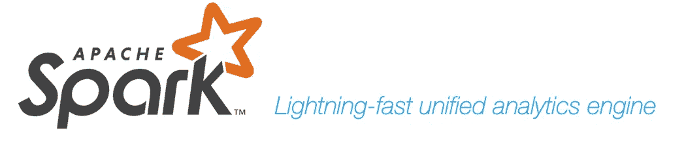

Apache Spark

Apache project Spark 可以被描述为一个开源的、通用的、分布式数据处理引擎。这是一个高度灵活的工具，可以用来访问各种来源的数据，如亚马逊 S3、卡珊德拉、HDFS 和 OpenStack。

如果和 Hadoop 比较，Spark 的内存处理可以快 100 倍，在磁盘上运行大概快 10 倍。您可以使用它在本地计算机的独立计算机上处理数据，甚至在输入数据集远大于计算机内存时构建模型。事实上，Spark 对于 ML 来说是完美的，因为它的内存处理能够提供近乎实时的分析。

Spark 还带有一个交互模式，因此用户可以立即获得他们的查询和操作的反馈。虽然它也擅长批处理，但它超越了基于机器的学习、处理交互查询、流式工作负载和实时数据处理能力方面的竞争。

如果你已经熟悉 Hadoop，你可以很容易地将 Spark 添加到你的军火库中，因为它是高度兼容的(甚至在 Hadoop 的项目页面上被列为一个模块)。

Spark 是用户友好的，因为它带有以下 API:

*   Java 语言(一种计算机语言，尤用于创建网站)
*   计算机编程语言
*   斯卡拉
*   Spark SQL(非常类似于 SQL 92)

这份来自微软的[综合指南](https://docs.microsoft.com/en-us/sql/big-data-cluster/train-and-create-machinelearning-models-with-spark?view=sqlallproducts-allversions)演示了如何用 Spark 训练和创建 ML 模型。

## **scikit-learn**

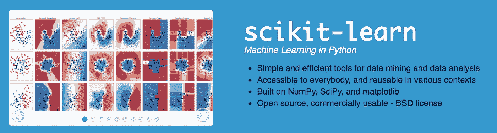

scikit-learn

[Scikit-learn](https://scikit-learn.org/) 是一个用于 Python 的开源 ML 库，具有支持 k 邻居、随机森林和向量机的算法。它还支持 Python 的数字和科学库，如 NumPy 和 [SciPy](https://www.scipy.org/) 。

到目前为止最干净和最简单的 ML 库，Scikit-learn 容纳了监督和非监督算法的广泛选择。该工具以工程思维设计，高度用户友好、功能强大且灵活，适用于运行端到端的 ML 研究项目。

要了解更多关于如何在 ML 中使用 Scikit-learn 的信息，您可以浏览以下资源:

*   [sci kit 简介-了解](https://jakevdp.github.io/PythonDataScienceHandbook/05.02-introducing-scikit-learn.html)
*   [学习 Scikit 中的模型构建-学习](https://www.geeksforgeeks.org/learning-model-building-scikit-learn-python-machine-learning-library/)

## **张量流**

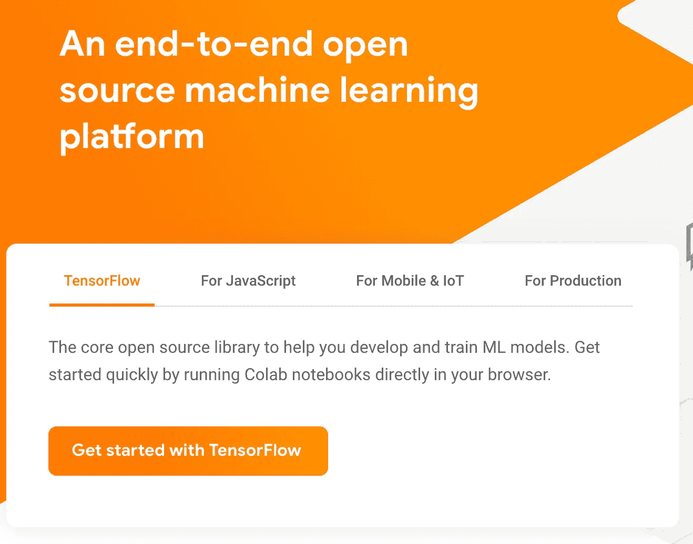

开发开源编程库 [TensorFlow](https://www.tensorflow.org/) 是为了帮助 ML 算法构建和训练框架和神经系统，以模仿人类的感知、思维和学习。一些[谷歌的领先产品](https://www.zdnet.com/article/google-announces-neural-machine-translation-to-improve-google-translate/)，尤其是[谷歌翻译](https://translate.google.com/)，利用了 TensorFlow。

它通过使用不同的推进策略来降低数字发音的计算要求，同时提高整体性能。然而，TensorFlow 可能比 Keras 或 PyTorch 更具挑战性，需要大量的标准编码。

TensorFlow 资源:

*   [面向初学者的 TensorFlow 深度学习](https://www.youtube.com/watch?v=_NMI8peAmNA)
*   【TensorFlow 入门:机器学习教程
*   [张量流教程](https://www.tensorflow.org/tutorials)

显然，机器学习工程师的工具箱是强大的。可用的技术财富是相当重要的，而且可能是压倒性的。然而，如果你是一名 Python 开发人员，掌握 ML 栈的主要组件会相当容易。如果你觉得你需要一些帮助，跳板提供了精心策划的课程，工作保证，以及与机器学习专家的无限通话，包括通过[人工智能/机器学习职业轨道](https://www.springboard.com/workshops/ai-machine-learning-career-track/?utm_source=hackernoon&utm_medium=article&utm_term=hackernoon1)的你自己的私人导师。