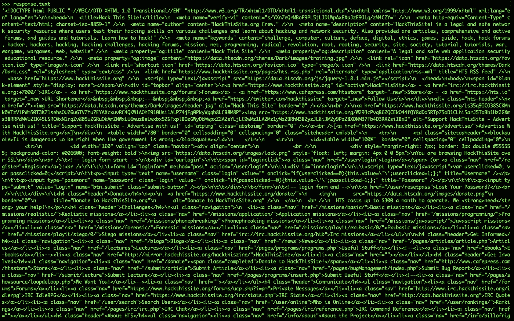
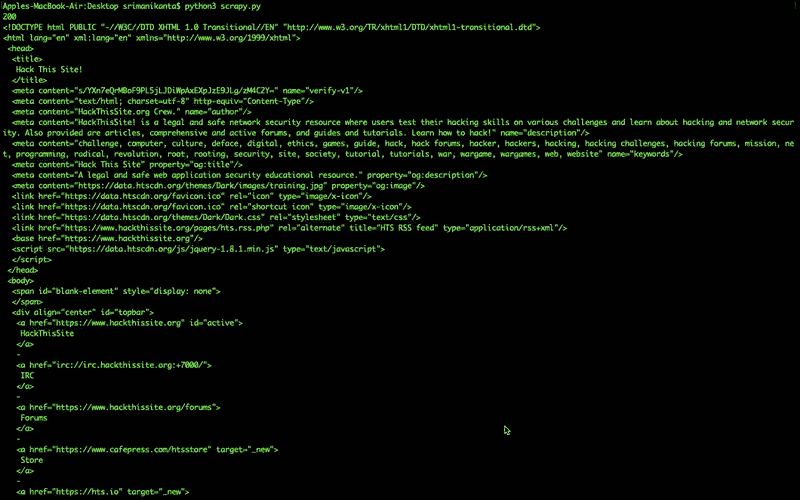
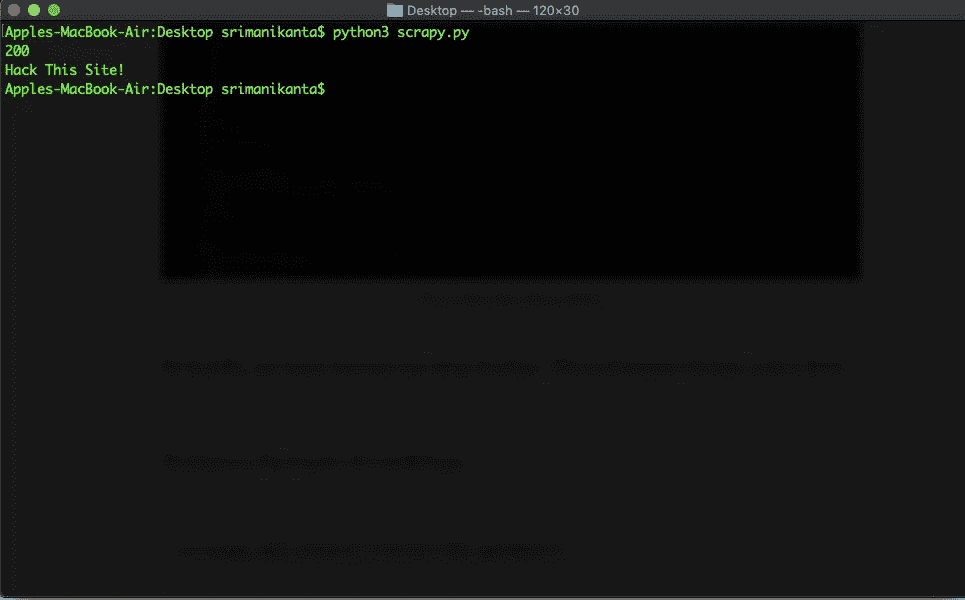
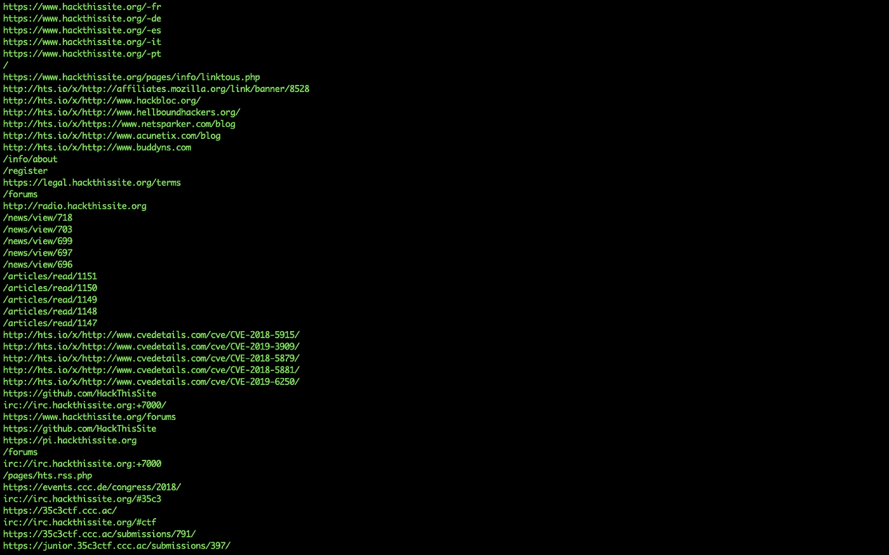

# 使用 Python 的 Web 抓取简介

> 原文：<https://medium.com/hackernoon/introduction-to-web-scraping-using-python-89b15b57150c>

## 摘要:这是一个关于如何借助 python 内置模块 Requests 和 Bs4 来抓取 web 的快速教程。


Photo by [Charles 🇵🇭](https://unsplash.com/@charlesdeluvio?utm_source=medium&utm_medium=referral) on [Unsplash](https://unsplash.com?utm_source=medium&utm_medium=referral)

作为一名数据科学家，收集数据的最有效方式之一是借助*网络搜集。*

## 网页抓取

这是一种从网络上获取数据到我们的本地机器上的技术，以对其执行特定的数据分析或数据可视化操作，从而从该数据中获得有用的见解。 ***也称为 Web 收割(或数据抽取)。***

在本文中，我们将借助两个名为 Requests 和 bs4(Beautiful Soup)的黄金库来抓取 web。选择这两个库的原因是它们比其他可用的库更加强大和灵活。这两个库在 StackOverflow 上也有一个很好的社区，如果你是这个 web 抓取之旅的新手，它可以提供帮助。

在这篇文章结束的时候，你一定会有很多关于网络抓取的知识。

**先决条件**

需要 HTML 标签和 CSS 选择器的基础知识。

从 web 捕获数据开始于向 web 发送一个请求，请求从哪个网站捕获数据。这个任务是在 ***请求*** 模块的帮助下完成的。

要向网站发出请求，首先我们需要在 python 中导入请求模块。它不是 python 中的内置模块。我们需要在 ***pip 的帮助下安装那个包。***

```
>>>import requests  # Module imported Sucessfully.# To make a request>>> response = requests.get('[https://www.hackthissite.org/](https://www.hackthissite.org/)')# The response variable will contain the response of that request object.
```

为了检查请求对象的状态，我们需要使用请求模块中的 ***status_code*** 属性。

```
>>>response.status_code
```

如果状态代码值的结果是 200，那么您得到了网站的成功响应。否则，你会得到一个糟糕的网页响应。问题可能出在 web URL 或服务器上。

## 请求的类型

在请求模块的帮助下，主要有六种类型的请求是可能的。

1.  get()请求
2.  post()请求
3.  put()请求
4.  delete()请求
5.  head()请求
6.  options()请求

向网页发出任何请求的语法是—

```
requests.methodName('url')
```

但是最流行的请求网页的方法是只使用 get()和 post()方法。

要将任何类型的敏感数据与 URL 一起发送，如登录凭证等，那么 post()请求更为可取，因为 HTTP get()请求不能为发送到 web 页面的请求提供任何安全性。

```
r = requests.post**(**'https://facebook.com/post'**,** data = **{**'key'**:**'value'**})**
```

## 响应结果

我们请求的响应内容是在文本属性的帮助下获得的。

```
>>>response.text
```

上述语句将产生如下所示的结果—



Don’t be afraid of that result because it is the initial response from the webpage

从上面的图像中，我们可以得出结论，我们将网页内容下载到了本地机器上。为了使内容更加灵活和有用，我们需要借助漂亮的汤库。这个库帮助我们从可用的数据中获得有用的见解。

```
# Importing the beautiful soup library
>>>import bs4
```

为了使我们的原始 HTML 数据更加漂亮，我们需要借助一些解析器来解析我们的内容。经常使用的解析器是—

1.  lxml
2.  HTML5lib
3.  XML 解析器
4.  HTML.parser

但是最灵活、最流行的是 lxml 解析器。它可以非常快速有效地解析数据。

```
>>>soup_obj = bs4.BeautifulSoup(response.text,'lxml')
# The soup_obj will us to fetch the our required results# To make our previous data more understandable we will use prettify() on soup_obj>>>soup_obj.prettify()
```

结果将会是—



The output from Soup Object

最后，我们又前进了一步。数据的提取从这里开始—

要提取网页的名称，我们需要使用选择器和适当的 HTML 标签来获得结果

```
>>>soup_obj.select('title')[0].getText()
```



Title Output

要从该网页中提取所有链接，您需要找到页面中的所有锚标签，并将结果存储到一个变量中。在 for 循环迭代的帮助下，它完成并打印结果

```
>>>links = soup_obj.find_all('a')
# find_all() will help to fetch all the details of the selected tag.>>>for link in links:
...    print(link.get('href'))
...# get() is used to extract the specific content from the tag
```



The output of extracting links

这是一个从网页获取链接的简单例子。如果您想从网页中提取一些其他数据，请选择与您的内容相关的适当标签，并借助 soup 对象获取结果。起初，这感觉很难，但当你在做的时候，你肯定能在几分钟内找到任何类型的网站。

## 放弃

✋:没有管理员的许可，你不应该进行网站抓取。这可能会导致非法活动。公司中的数据科学家通常在他们自己的网页和业务上进行网络抓取，他们没有在其他公司网站上进行任何非法行为。所以要小心。如果你造成任何损坏，我不负责。✋

## 我在本教程中使用的网页是免费的，所以没有任何问题。使用这类网站来学习或提高你的技能。

## 结论

从上面所有的例子，我想现在你可以很容易地使用 Request 和 bs4 库。您可以借助不同的 HTML 标签从 web 中提取不同类型的内容，并将这些数据存储到 CSV 文件或文本文件中。只需对数据应用 python 文件操作，将其保存到本地机器中。

希望这能帮助你以一种简单的方式学习 python 中的 web 抓取。

**如果你喜欢这篇文章，请点击拍手，给我留下你宝贵的反馈。**