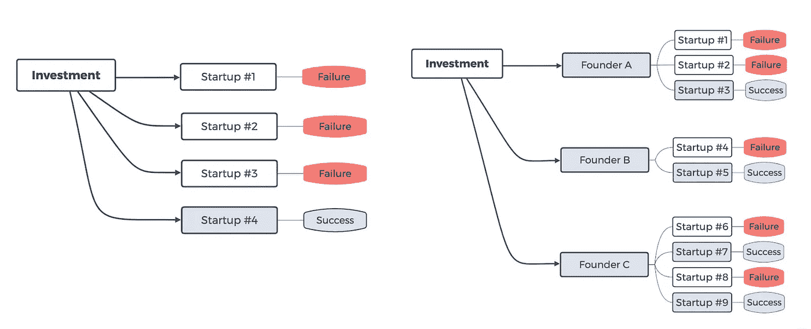
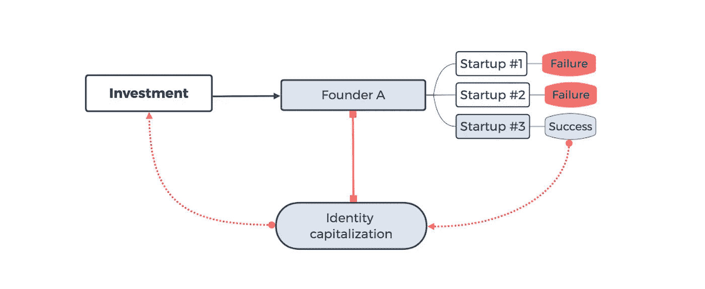

# 投资于人，而不是公司:以身份为中心的投资模式

> 原文：<https://medium.com/hackernoon/invest-in-people-not-companies-identity-centric-investment-model-579413c65f17>

根据保罗·a·冈帕斯和安娜·科夫纳的 T2 研究，连续创业者是现代商业世界的关键驱动力。与第一次创业的人相比，那些成功过一次的人在下一次创业中成功的几率要高出 30%。这使得企业家过去的表现是未来成功的有力指标。[1]

**以身份为中心的投资模式**是一种金融资产模式，它利用了个人成功的反复性。该模型创造了一个生态系统，在这个生态系统中，个人(如企业家)成为投资本身的对象。[2]

Figure 1: VC model (left) and Identity-centric investment model (right)

*图 1* 显示了对个人成功的投资创造了一个利用多次“突破”尝试的机会。个人的全面成功是通过一生的商业努力、个人项目和外部投资积累起来的。

# 身份大写和 HCBA

[诺贝尔经济学奖得主西奥多·舒尔茨](https://en.wikipedia.org/wiki/Theodore_Schultz)在上世纪 60 年代发明了反映人的能力价值的[人力资本](https://en.wikipedia.org/wiki/Human_capital)概念。他指出，人力资本就像任何其他类型的资本一样，可以通过教育和提高福利而成倍增加。

换句话说，人力资本是个人技能组合的经济价值。人力资本的概念认识到，不是所有的劳动都是平等的，个人技能的质量可以通过投资来提高。一个人的教育、经验和天生的能力可以量化，并具有经济价值。

**人力资本支持资产(HCBA)** 是一种围绕以身份为中心的投资模式构建的金融工具。它为个人提供了一个通过股权融资为自己的努力提供资金的机会，而这在以前是只有公司才能获得的。它为投资者提供了一个机会，促进当前和未来商业领袖的终身成长，并从他们的成就中受益。

Figure 2: Identity capitalization

*图 2* 通过 HCBA 展示了身份资本化模型以及个人成功与生成资本之间的直接关系。与企业模式的主要区别在于，资本并不局限于特定的项目，而是局限于个人(例如企业家)。

> “HCBA 为个人创造了一个独特的机会，为他们自己的努力和理想筹集资金。它为投资者提供了一个同样独特的机会，从他们选择支持的个人的早期和晚期成功中增加他们的财富。”—高盛前副总裁 Vlas Lezin

身份资本化和 HCBA 的增长标准与传统资本模型中的标准一致，在传统资本模型中，公司资本化的增长与资产的总市值相关，即[内在价值](https://en.wikipedia.org/wiki/Intrinsic_value_(finance))和投资者对未来收益的信心。

# HCBA 的内在价值

## 以个人名誉担保

在现代社会，个人声誉往往等同于品牌声誉。随着互联网让企业变得更加可见，企业领导人成为他们企业的直接代表。一个人鲁莽的推文或漫不经心的评论会引发混乱，给公司带来巨大损失。

HCBA 旨在将个人声誉、品牌、技能和过往记录的价值货币化。企业家精神和其他努力所创造的一生的持续成功体现在个人资产的代表性增长中。

## 股息支付

虽然个人业绩记录为市场升值提供了直接支持，但硬货币与某种资产挂钩，提供了更好的稳定性、更清晰的预期和合理的增长。因此，HCBA 有许多固有的支付红利的模式。

在这些模式中，投资者和 HCBA 发行者可以协商一个互利的方案，将一个人成功的直接财务表现传递给他或她的支持者。

# 投资回报率

HCBA 投资的回报由传统股票市场的两大力量驱动:*市场升值和股息支付*。随着 HCBA 背后的个人达到新的验证结果，他或她的个人资产价值随着 HCBA 市场价格增长。

HCBA 发行人的直接动机是遵守首次上市期间商定的条款，因为这种模式只允许在当前投资者确认持续遵守这些条款后支付募集资金和后续发行。

此外，单个 HCBA 发行者可以决定回购部分发行在外的股票，从而推高价格。股息支付也起着重要作用——未来现金流可以贴现为现值，并根据增长进行调整，以确定 HCBA 的内在价值。

# 资产流动性

与其他早期投资不同，HCBAs 是在传统的交易所模式下交易的，在这种模式下，每种上市资产都可以在任何给定的时间进行买卖。

# 结论

现代技术最终达到了一个阶段，我们看到更少的中介和更直接的点对点互动。HCBA 和以身份为中心的投资模式最终创造了一个互利的生态系统，让每个人都可以通过他们的网络推动风险投资，并从个人成功中受益。

# 参考

1.  Gompers Paul A .，Kovner Anna，Lerner Josh，Scharfstein David S. (2006 年)。"创业和风险投资中的技能与运气:来自连续创业者的证据. "。*社会科学研究网。*从 https://papers.ssrn.com/sol3/papers.cfm?abstract_id=933932[取回](https://papers.ssrn.com/sol3/papers.cfm?abstract_id=933932)
2.  戈尔尤诺夫·基里尔，勒津·弗拉什。(2019).身份基金立场文件。从 https://identity.fund/position-paper[取回](https://identity.fund/position-paper)
3.  加顿·埃里克。(2017).“加大人力投资的理由。”。《哈佛商业评论》。检索自[https://HBR . org/2017/09/the-case for investing-more-in-people](https://hbr.org/2017/09/the-case-for-investing-more-in-people)