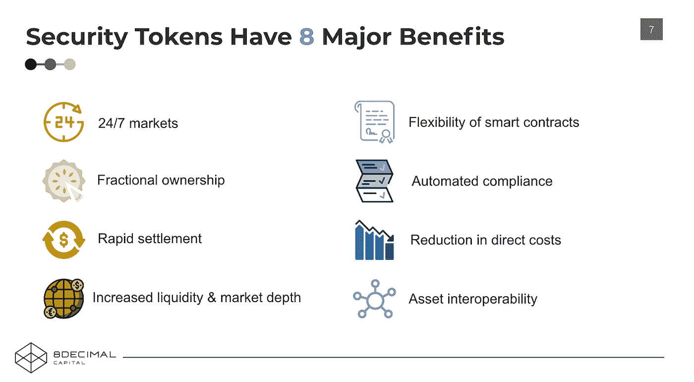
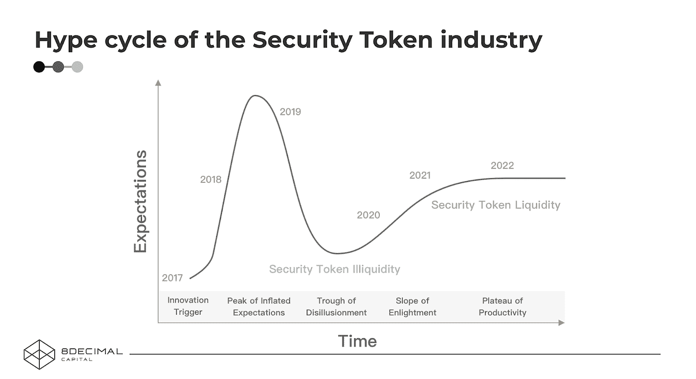
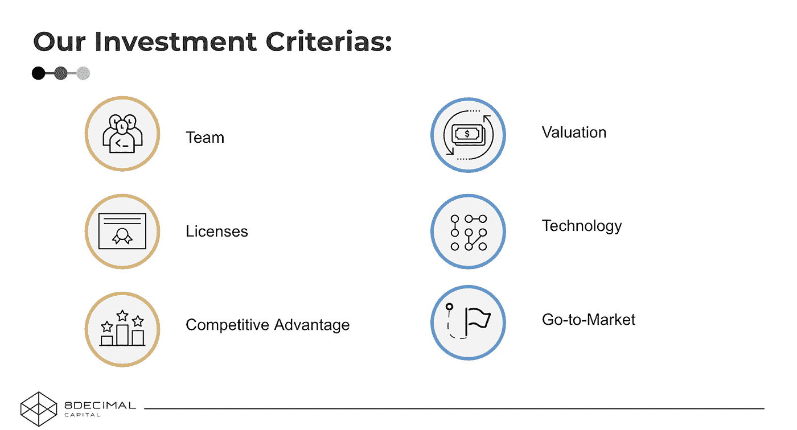
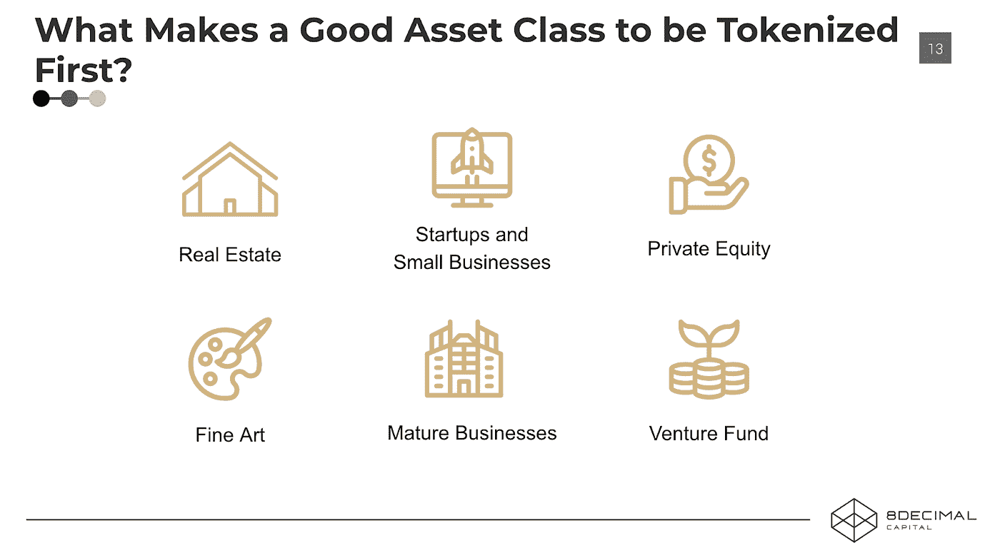

# 投资安全令牌生态系统

> 原文：<https://medium.com/hackernoon/investing-in-the-security-token-ecosystem-6a75e750beef>

我很高兴在 2019 年 1 月在伦敦举行的*安全令牌实现*会议上发表了主题为“*投资安全令牌生态系统*”的演讲。下面是这次演讲的一些主要观点的总结。如果您有兴趣了解更多关于我们对该领域投资的见解和观点，请点击这里查看[的完整视频演示](https://www.youtube.com/watch?v=Wko4bZtEQmA)。

# **I)安全令牌的主要优势:**

透明性&可编程性:在不同方之间建立信任对于地方、国家和全球都至关重要。区块链是“谁拥有什么”的终极上限表，是之前所有交易的记录。此外，通过智能合约，我们可以对合规性进行编程，以便在投资者合规的情况下，交易可以自动完成，否则将会出现阻止交易的错误。这可以使交易速度更快、成本更低。

**流动性:**目前，买家和卖家找不到对方，需要通过他们的基金经理来完成交易，因为所有的合同规则都强制要求“谁在交易/什么资产/交易在哪里进行”。这可能需要几个月或几年的时间来平仓，给投资者带来很大风险。

**24/7 市场&可移植性:**区块链允许数字资产可移植到不同的平台和交易所，因为它们共享相同的技术层。这是不可能的，因为目前每个科技公司都是一个封闭的系统。通过利用一个我们都可以信任的公共层，我们可以建立一个真正的全球市场。

**降低成本:**在电子邮件出现之前，人们使用蜗牛邮件发送信息，你必须打印出信息，放入信封，支付 0.50 美元，等待 3 天邮件才能送达。后来有了电子邮件，只需点击一下，你就可以立即发送信息，速度快一个数量级，更便宜，也更简单。同样，通过令牌化，您可以让证券具有电子格式，从而大幅降低成本，便于在不同交易所交易和互操作。

事实上，发行代币比传统方式更便宜、更简单，我们可以从本质上实现以前不实用的用例及商业模式。例如，在电子邮件之前，你不会写信给某人安排午餐，但现在你可以通过电子邮件做到这一点。这是我们经常思考的问题，尤其是新技术可能会催生新的行业和商业模式。

这在市场上还不存在，但例如，象征性的运动队，让我们说凯尔特人队。现在，你可以将球队的所有权出售给一个主要投资者，但如果成本足够低，你可以将球队的 10%令牌化并出售给 2000 人，这是单一类别股权的最大持有人，令牌可以允许分红，资本增值，并有其他有趣的功能，如优先购买包厢座位，赛后与球员见面等。如果你现在就去做，管理每个人的资产将是一个相当复杂和昂贵的过程。这非常符合我们在网飞和 Spotify 看到的一些消费者趋势，即消费者更喜欢体验而不是产品所有权。有了安全代币，你可以让球迷或主流投资者拥有他们最喜欢的球队的所有权，并有可能获得新的体验。

**结论:**

总的来说，8 Decimal Capital 正在寻求一种进化，而不是一场革命:我们期待一个混合的数字世界，而不是一个纯粹的数字世界，因为我们仍然需要中央当局为我们提供最终的保护。这种混合世界将传统商业世界与新技术结合在一起，而没有完全取代当前的商业结构。

我们认为令牌化证券不会取代所有的金融服务。令牌化证券只会提供更好的工具。比如 Salesforce 并没有取代销售人员，只是简单的为销售人员提供了更好的工具。同样，令牌化证券可以帮助公司、经纪人和投资银行更有效地筹集资金，但它们仍将存在。因此，安全令牌不会消除所有的中间人，但会使过程更有效地工作。

# II)安全令牌空间的宣传周期:

这是受 Gartner 通常为新兴技术创建的炒作周期图的启发。

**前期**

截至目前，我们仍处于安全令牌生态系统的早期阶段，其中不同的发行解决方案和交换仍在开发和测试中。我们认为，从技术和监管的角度来看，STO 生态系统的成长和成熟需要大约 4 年的时间，允许传统系统的可持续过渡。在这个领域变得更加成熟之前，大多数 STs 的早期采用者将来自加密货币领域，而不是传统机构。随着今年不同的 sto 和交易所的推出，我们预测流动性的缺乏(通过一些证券交易所的低流动性以及围绕实施复杂用例和证券法的挑战可以看出)将使我们更接近这一数字现实，并减少围绕 sto 的整体宣传和期望。

**安全令牌流动性差:**

我们与数十个推出证券代币交易所的项目交谈过，我们总是问他们同一个问题“你将如何为你平台上上市的代币创造流动性？”通常，他们在回答这个问题时会提到他们将与之合作的做市机构。在我们看来，这种方法不会产生空间中所需的结果。做市商机构可以为那些退出头寸的人创造流动性，但如果买方没有真正的实质性需求，他们将无法出售代币获利。在流动性出现之前，该领域的参与者最好专注于更传统的经纪自营商模式，通过将伟大的项目与投资者联系起来获取费用，并尽量减少令牌化的需求，直到行业变得更加成熟。

**采用之路:**

未来，纳斯达克等主要传统交易所也将在 2019 年开发自己的解决方案，以促进安全令牌的交易。我们已经看到最近的一个项目，由洲际交易所(ICE)创建的 Bakkt，它是包括纽约证券交易所在内的几个全球交易所的运营商，刚刚筹集了超过 1 . 82 亿美元的资金，使消费者和机构能够购买、出售、存储和消费数字资产。他们很容易提供安全令牌。

我们如何知道这个行业已经达到了成熟阶段？总的来说，在技术方面，区块链技术在可用性方面仍然有很多摩擦，我们需要更多用户友好的 UI/UX。我们知道，当使用基于区块链的技术时，行业已经足够成熟，可以像使用常规的主流软件一样使用，这样我们就可以更专注于投资项目的质量，而不是专注于处理技术的短期局限性。随着时间的推移，更高效的技术和新法规将会出现，并有助于推动传统企业的增长和采用。

# III)我们对安全令牌相关项目的投资标准:

这些是我们在该领域投资的几个高级标准。然而，我们的决定还取决于本文中没有讨论的因素，我们将考虑这个框架之外的替代优势。

**团队:**由于大多数项目都处于早期阶段，我们非常关注团队的背景。我们更喜欢在金融或密码行业工作过的团队，有以前的创业&经验。在安全令牌交换的情况下，理想情况下，创建者拥有两者的组合。总体而言，现有的加密货币交易所更熟悉加密交易，但它们往往没有必要的许可证，而传统交易所则相反。

**许可证:**我们已经看到许多项目从那些拥有安全令牌友好立法的小地方获得许可证。由于政府的规模，这些国家能够比更大的国家更快地适应。然而，我们更希望许可证来自较大的国家，如美国、新加坡和欧洲国家，而不是像直布罗陀、毛里求斯和马耳他这样的小地方。大国会给公司带来更高的可信度，而且与 ico 不同，世界各地的许多监管机构都对 STO 市场表现出积极的情绪，甚至是 SEC，因此针对数字资产的具体监管变得更加官方只是时间问题。

此外，了解项目从哪里获得许可证也很重要，无论是 ATS(替代交易系统许可证)、RIA(注册投资顾问许可证)、BD(经纪交易商许可证)还是 RAE(清算和交易执行许可证)。我们还关注他们是拥有自己的许可证还是使用第三方的许可证，通常是为了收入分成。如果是来自第三方，那么我们希望获得更多关于合作条款的细节。

**竞争优势:**综合考虑所有因素，我们正试图选出最有可能在这个新兴市场取得成功的公司。与红杉资本的唐·瓦伦丁采取的方法类似，我们真的专注于了解新兴市场，它可能如何发展，并关注该领域的不同参与者。我们的工作本质上是确定哪些公司能够很好地适应这个市场。

**估值:**我们已经看到很多证券代币交易所和发行平台估值过高。我们认为这可能是由于加密货币牛市之前的估值膨胀和狂热。如果只是一个没有任何牌照和技术，有想法的团队，估值应该在 1000 万美元以下。如果他们确实在许可证或技术方面有优势，那么估值可以达到 2000 万美元，根据牵引力，可以达到 4000 万美元。

**技术:**这可能不是最重要的组成部分，因为我们还处于早期，一旦一个更好的解决方案被证明更成功，你可以相当快地转换并赶上技术。但它有助于理解企业家如何考虑令牌化，以及在考虑合规性要求(投资者白名单、智能合约中的交易权限、在出现重大问题时帮助重新发布安全令牌的后门等)时投入了多少精力。)、监管限制(围绕数据的 GDPR)、披露、隐私等。

重要的是要理解，与加密货币不同，安全令牌不代表所有权，而是所有权的记录。这从根本上说是不同的，也是必要的，因为如果投资者丢失了他/她的私人钥匙或去世了，你应该能够取消代币所有权并发行新的代币。如果一家公司还在，它的股票不可能凭空消失。这也是为什么我们认为未来将是一个混合模式，而不是一个完全数字化的模式。例如，这种后门机制在 Harbor 是可用的。

**走向市场:**我们有自己的观点，但我们始终保持开放的心态，倾听企业家如何计划应对这个行业，他们如何看待这个空间，以及发布产品的时机，以建立可持续的业务。例如，如果该行业尚不成熟，无法提供流动性，那么在这个阶段，专注于寻找伟大的项目，将它们标记出来，并从传统投资者那里筹集资金可能更有意义，然后一旦该行业成熟并拥有更多流动性，就推出交易所业务。基本上是根据行业的成长性和成熟度来打造公司。

# IV)哪种类型的资产最适合首先进行令牌化？

由于我们处于行业的早期，确定哪些资产首先进行令牌化更有意义是很重要的，因为不同的资产会有它们自己的需求和摩擦。

我们最近向 20 家合作伙伴渠道发出了一份调查问卷，询问他们在令牌化产品框架内更愿意投资什么。大多数受访者更喜欢房地产和产生固定收益的资产。他们最不想要的就是实际权益。人们目前正在寻找更稳定的资产，即使回报率只有 3-5%。他们更喜欢模型清晰的东西，例如，如果你购买并租赁飞机，你可以很容易地预测收入，而不是投资于初创公司的股权。

在这个时间点进行令牌化是有意义的，也是资本密集型的事情，当投资者的身份不太重要时，只要它们是合法的。例如，房地产就是一个很好的例子，在这个例子中，你可以分解成更小的投资单元，从世界各地的投资者那里聚集资金，降低投资科技初创公司的资本成本。此外，早期科技创业公司不会喜欢投资者围绕他们的股票进行交易，投机可能会抬高或扼杀他们的估值，并影响他们的增长。安全令牌不是新的 ICO。它更适合收入更稳定的公司，在这种情况下，代币的价值可以得到正确评估。

我们认为，另一个考虑首先标记哪个资产类别的好方法，是基于你需要知道多少投资者方面的信息，才能做到这一点。你需要的信息越少，在采纳过程中的摩擦就越少。货币是最容易标记的，因为你不需要知道投资者的信息(没有人跟踪谁拥有现金)，其次是商品，然后是房地产，最后是股权，这是最复杂的资产，需要最多的 KYC/反洗钱。这是 TrustToken 采取的方法，它首先专注于稳定的硬币。就目前而言，你不需要知道持有 TUSD 的每个人的身份，就像你不需要知道谁持有现金一样，但这可能会在未来发生变化。

最后，这一点现在经常被平台忽略。我们认为今年推出的许多安全令牌质量不会很高，因为许多人都在追逐炒作，并利用这个机会筹集资金。然而，归根结底，要想让一个项目具有流动性，它仍必须从根本上保持强劲，提供真正的价值，否则，即使是象征性的形式，它仍将是一种没有投资者愿意购买或交易的非流动性资产。

请告诉我你的意见，如果你对这个话题有任何问题，请随时联系我，remi@8dcapital.com。