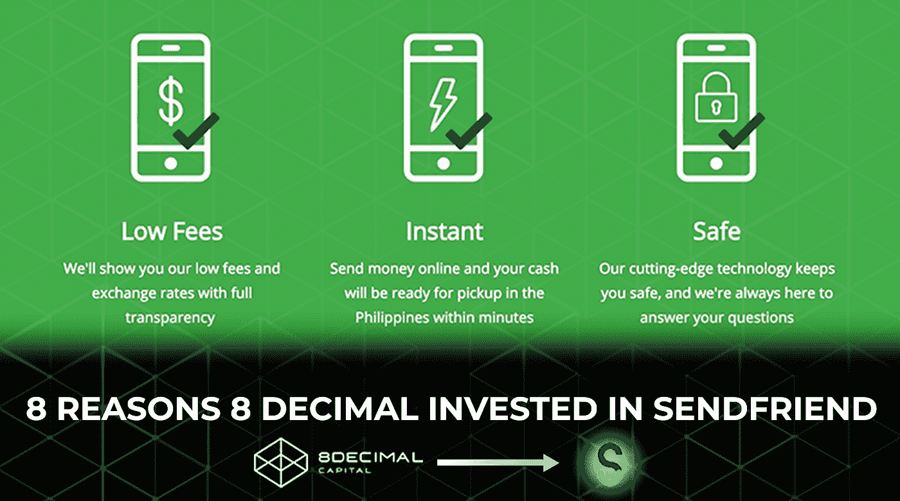
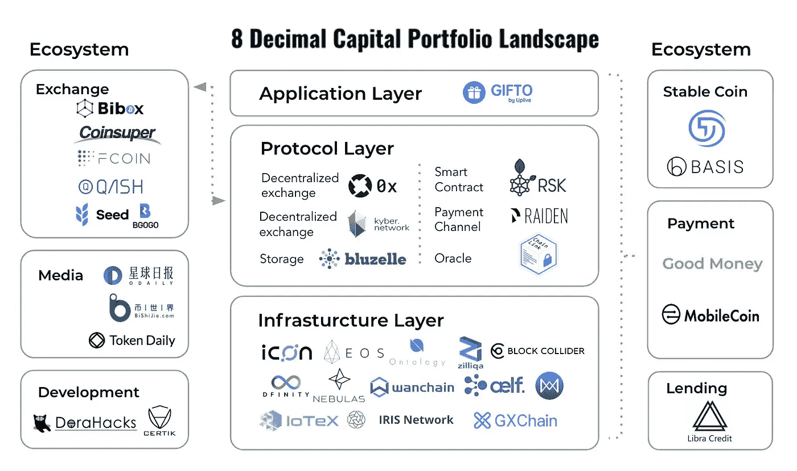

# 投资备忘录:我们投资 SendFriend 的 8 个理由

> 原文：<https://medium.com/hackernoon/investment-memo-8-reasons-8-decimal-invested-in-sendfriend-781e47cf2406>

作者:卡迪姆·克拉克，投资经理

1.  **团队**

SendFriend 有一个强大的团队，原因很多。首席执行官 David Lighton 在汇款领域拥有深厚的背景，他曾在世界银行的海地和区块链从事金融普惠工作，拥有麻省理工学院媒体实验室的工作经验，并了解与该领域相关的复杂法律环境。首席技术官 Joel Kosloski 在多家公司的汇款领域拥有 13 年的经验。最近，Joel 在 MoneyGram(支付汇款领域的第二大公司)担任企业架构高级总监兼首席企业架构师。*CRO·大卫·安德森领导着走向市场的努力，他最初是在哈佛商学院的课堂上认识大卫·l 的。总体而言，整个团队在汇款领域以及整个行业都拥有丰富的技术经验。*

***2。为什么是区块链？***

*SendFriend 利用区块链技术为数百万移民工人降低全球汇款成本，这些移民工人由于银行系统的摩擦而为国际汇款支付了过高的费用。目前的现有银行，如 Western Union、Xoom、MoneyGram 和 Remitly，都使用 SWIFT、代理行和外汇交易所的组合进行国际外汇转账。相反，SendFriend 使用区块链。SendFriend 汇款比竞争对手更快更便宜。SendFriend 最近与 Ripple 合作开发了美菲走廊，并与 Coins.ph 合作开发了分销系统。区块链为国际支付的处理提供了卓越的速度和透明度，SendFriend 将是第一家以合规方式为消费者带来这一好处的美国公司。*

***3。定时***

*区块链地区的企业经常在时间上挣扎。如果当前的技术不能完全支持他们的应用，那么企业就不会成功。然而，SendFriend 的时机是正确的，使用区块链进行汇款的所有基础设施都已经开发出来了。*

***4。其他投资者***

*SendFriend 将受益于他们最著名的两个支持者，由 Techstars 和 Ripple 支持的 Barclays Accelerator 所产生的网络效应。SendFriend 是从 750 多名申请人中挑选出来的 10 家初创公司之一，申请人参加了由 Techstars 计划提供支持的 Barclays Accelerator，在此期间，SendFriend 获得了资金。SendFriend 不仅是 Ripple 的 xRapid 在美国和菲律宾的唯一发布合作伙伴，而且 Ripple 还以 100 万美元的奖励形式支持 SendFriend 的上市努力。随着 SendFriend 业务的扩展，8 Decimal 打算向 SendFriend 提供建议、潜在的合作伙伴以及在美国和亚洲的广泛网络。此外，我们将为营销和社区拓展提供咨询和支持。其他值得注意的投资者包括 2020 Ventures(Chain、Circle 和 Ripple 的投资者)、Lytical Ventures 和天使投资者。*

***5。估价***

*关于这个我们不能说太多细节，但是价格是合适的。*

***6。独角兽潜力***

*为了成为独角兽，一家公司必须有一个可持续的商业模式，在一个大市场中产生多种现金流。我们坚信 SendFriend 展示了这些特征。他们有一个经验丰富的团队，6500 亿美元的汇款市场，以及不仅仅提供资本的投资者。SendFriend 的增长战略侧重于交易、API 和白标解决方案的收入。*

***7。营销策略***

*他们的整合营销方式将覆盖已经在网上汇款的消费者，以及目前仅在网下汇款的消费者。这将通过草根运动、活动、联合品牌和伙伴关系，接触紧密的菲律宾社区来实现。*

***8。比赛***

*这是一个长期从业者竞争激烈的领域。然而，SendFriend 已经沿着其供应链建立了强大的合作伙伴关系，同时建立了一个基础来大大减少系统中的摩擦。SendFriend 的规模可能被证明是一项资产，因为现有公司将很难跟上，因为它们有自我破坏和高转换成本的风险。值得注意的是，这是一个如此大的市场，可能会有多个赢家。例如，仅 US-PHP 走廊的 1%就意味着转移了 4 亿美元。*

> *8 十进资本:塑造区块链未来*
> 
> *[媒介](/@8DecimalCapital) | [LinkedIn](https://www.linkedin.com/company/8-decimal-capital/) | [推特](https://twitter.com/8decimal) | [脸书](https://www.facebook.com/8Decimal/) | [网站](http://www.8dcapital.com/)*
> 
> *电子邮件:contact@8dcapital.com，如果你对这个话题还有任何问题。*

**

**8 DECIMAL CAPITAL is a multi-strategy investment firm focusing on token and equity investments. 8 Decimal currently has more than 40 portfolio companies with an AUM of 60M USD. The investment team consists of more than 10 venture capital veterans, researchers, and trading professionals. The advisory board comprises Fan Zhang (Former Founding Partner of Sequoia Capital China), Karen Chen (Former CEO of UBS China) and Ben Bartlett (Vice Mayor of Berkeley). Based on the professional fund index ranking agency* [*Token Metrics*](https://medium.com/u/80a0e0807b05?source=post_page-----781e47cf2406--------------------------------)*, 8 Decimal was ranked second out of the 51 active crypto funds. 8 Decimal is also well-received in China, named one of the top 10 funds in the blockchain industry by both* [*36 氪（36Kr.com）*](https://medium.com/u/ae3950e4f2fc?source=post_page-----781e47cf2406--------------------------------)*,* [*Chain Capture*](https://medium.com/u/ac4da81bc060?source=post_page-----781e47cf2406--------------------------------) *, and* [*Odaily*](https://medium.com/u/9c30cbe2074f?source=post_page-----781e47cf2406--------------------------------)*, as well as named one of the top 20 funds by Tsinghua X-Lab and Youth Education Chain League.**