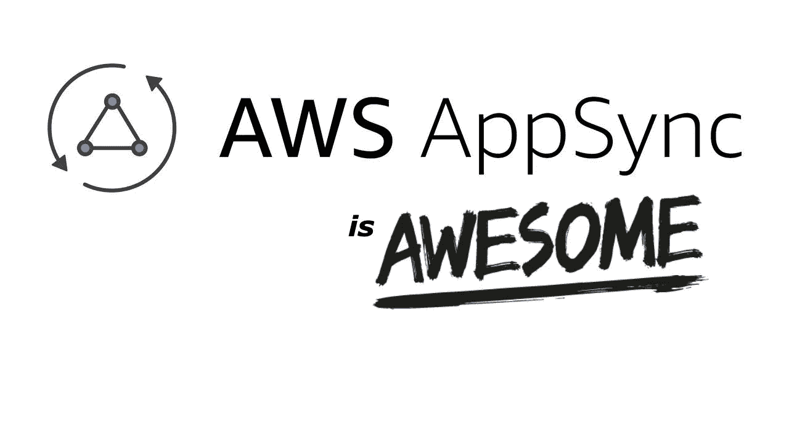
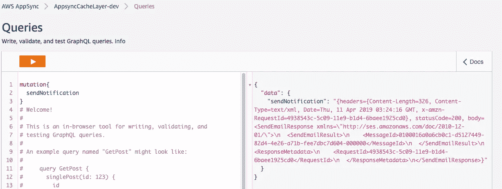
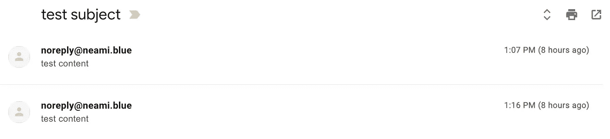

# 从 AppSync HTTP 解析器调用 AWS 服务

> 原文：<https://medium.com/hackernoon/invoking-aws-services-from-appsync-http-resolvers-4e2c54784204>



AWS 最近发布了用于HTTP 解析器的数据类型[**authorization config**](https://docs.aws.amazon.com/appsync/latest/APIReference/API_AuthorizationConfig.html)**。**

> ***HTTP 端点需要授权时的授权配置。***

**这意味着您可以调用 AWS 服务**而无需调用 Lambda 函数**。**

> ***AWS AppSync 现在已经扩展到支持通过 HTTP 数据源调用 AWS 服务。为了让 AWS 识别和授权 HTTP 请求，它们必须用* [*签名版本 4 流程*](https://docs.aws.amazon.com/general/latest/gr/signature-version-4.html) *进行签名。否则，这些请求将被拒绝。AWS AppSync 现在可以根据作为 HTTP 数据源配置的一部分提供的 IAM 角色，代表您计算签名。*出自乔希·卡恩**

**在这篇文章中，我展示了一个从 HTTP resolvers 直接发送 SES 电子邮件的例子。**

# **无服务器框架入门**

**示例项目基于 [**无服务器框架**](https://serverless.com/) ，需要添加两个插件: [**无服务器-appsync-plugin**](https://github.com/sid88in/serverless-appsync-plugin) 和 [**无服务器-伪参数**](https://github.com/svdgraaf/serverless-pseudo-parameters) **。****

***更新于 2019 年 4 月 25 日***

***n̵o̵t̵e̵̵t̵h̵a̵t̵̵s̵e̵r̵v̵e̵r̵l̵e̵s̵s̵-̵a̵p̵p̵s̵y̵n̵c̵-̵p̵l̵u̵g̵i̵n̵̵d̵o̵e̵s̵n̵'̵t̵̵s̵u̵p̵p̵o̵r̵t̵̵a̵u̵t̵h̵o̵r̵i̵z̵a̵t̵i̵o̵n̵̵c̵o̵n̵f̵i̵g̵̵f̵o̵r̵̵h̵t̵t̵p̵̵r̵e̵s̵o̵l̵v̵e̵r̵s̵̵y̵e̵t̵.̵̵f̵o̵r̵̵t̵e̵m̵p̵o̵r̵a̵r̵y̵̵s̵o̵l̵u̵t̵i̵o̵n̵,̵̵y̵o̵u̵̵c̵a̵n̵̵g̵e̵t̵̵p̵l̵u̵g̵i̵n̵̵f̵r̵o̵m̵̵m̵y̵̵f̵o̵r̵k̵e̵d̵̵g̵i̵t̵̵r̵e̵p̵o̵.̵***

```
$npm install serverless-pseudo-parameters
$npm install serverless-appsync-plugin
```

**编辑`serverless.yml`文件并将插件添加到**插件**部分:**

```
**plugins**:
  - serverless-appsync-plugin
  - serverless-pseudo-parameters
```

## **定义 AWS AppSync 模式**

**让我们来看看模式。模式文件是文本文件，通常命名为`schema.graphql`，在这个例子中我只添加了发送电子邮件的变体:**

```
type Mutation {
  sendNotification: String
}
```

## **定义 HTTP 数据源**

**接下来让我们定义 AWS AppSync HTTP 数据源和 sendNotification 变异，将以下配置添加到`serverless.yml`中的**自定义**部分。**

## **为 HTTP 数据源定义 IAM 角色**

**在本例中，HTTP resolver 调用 **Amazon 简单电子邮件服务** ( **SES)** 来发送电子邮件，您需要创建一个 IAM 角色 **AppSyncSESserviceRole** ，它允许 HTTP resolver 访问 SES 并发送电子邮件，将以下配置添加到`serverless.yml`中的**资源**部分。**

## **创建映射模板**

**现在我们已经配置了 yml，我们需要添加解析器，映射模板文件应该位于与 serverless.yml 文件相关的名为 mapping-templates 的目录中。**

**让我们在一个名为`mapping-templates/Mutation-sendNotification-reques.vtl`的文件中创建发送通知变异的请求模板。**

```
{
  "**version**": "2018-05-29",
  "**method**": "GET",
  "**resourcePath**": "/",
  "**params**":{
    "**query**":
      {
       "**Action**":"SendEmail",
       "**Source**":"noreply@neami.blue",
       "**Destination.ToAddresses.member.1**":"[test1@email.com](mailto:test1@email.com)",
       "**Destination.ToAddresses.member.2**":"[test2@email.com](mailto:test2@email.com)",
       "**Message.Subject.Data**":"test subject",
       "**Message.Body.Text.Data**": "test content"
      }
  }
}
```

**然后创建响应模板`mapping-templates/Mutation-sendNotification-request.vtl`。**

```
#if($ctx.error)
  $util.error($ctx.error.message, $ctx.error.type)
#end#if($ctx.result.statusCode == 200)
    $util.toJson($ctx.result)
#else
    $utils.error("Delivery failed")
#end
```

## **让我们部署服务**

```
$ sls deploy --stage dev
```

# **一切准备就绪，尝试一下吧！**

**您可以使用 [AWS AppSync 控制台](https://console.aws.amazon.com/appsync/home)来测试我们刚刚部署的 sendNotification 变异。**

****

**然后检查电子邮件是否已经发送和接收。**

****

**就这些，希望你觉得这篇文章有用，你可以在我的 [**GitHub repo**](https://github.com/yai333/AppsyncDax) 中找到完整的项目。**