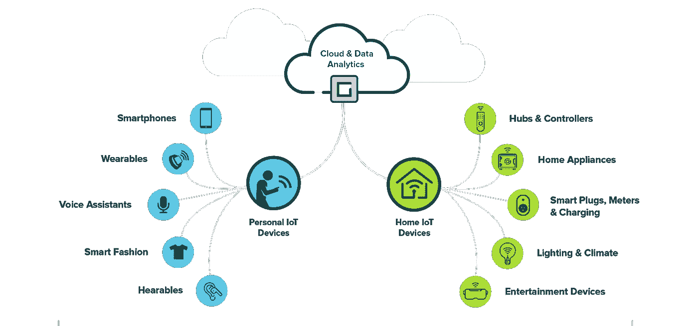

# 物联网和可再生能源—欢迎来到未来

> 原文：<https://medium.com/hackernoon/iot-and-renewable-energy-welcome-to-the-future-a088d9480a44>

随着关注点从理论转向实际发展，智慧城市的理念正在步入现实。可再生能源——风能、太阳能和水能——是未来的希望之光，因为像化石、煤和石油燃料这样的传统能源是有限的，并且由于需求的增加而即将结束。

为了建造智能医院、建筑、工厂、交通和运输；拥有可靠、有弹性、高效和顺畅的能源流动至关重要。所有这些数字服务预计将通过使用电网和智能能源不间断地运行，电网和智能能源被视为这些城市的支柱。

为了保持智慧城市服务的互联和同步，物联网和云计算发挥了关键作用。在这篇文章中，我们将讨论[物联网和可再生能源](https://www.digiteum.com/iot-green-energy)来源的作用。让我们开始吧

# 物联网在可再生能源中的作用

在过去的几年里，销售可再生能源的公司在全球范围内稳步增长。然而，随着该行业在全球范围内的扩展，他们面临着提高利润和生产率的压力。也就是说，你不能仅仅通过物理和机械工程应用更多的改进来区分能源业务。

获得这些智能设备或连接的小工具可以与高科技传感器联系在一起。这些传感器收集大量数据，并将其传输到电网。产生的数据被收集并上传到云上进行处理。

下一批创新将由数据和传感器驱动，因此是物联网。为了满足不断增长的需求，这些公司一直在增加产能。风能领域的累积容量已经从 2001 年的 24 吉瓦增加到 2014 年的 370 吉瓦。

也就是说，稳定的增长会带来挑战性的形势，并保持盈利能力。公司希望改进方法来管理更大的容量和更多的物理属性，广泛分布在偏远地区，这是一个非常复杂的场景。

这就是物联网分析拯救世界的地方。今天，您可以以大约实时的速度分析物联网数据。这要归功于复杂事件处理系统的发展。事实上，物联网可以说是可再生能源行业下一个增长阶段的主要赢家之一。

# 可再生能源公司如何从中受益？

可再生能源行业将在以下 4 个方面得到改善——

*   *大数据分析和更快的传感器输出分析*
*   *非技术人员的分析数据分解*
*   *人工智能、机器学习、自学习机器*
*   *数据分散*

# 包装东西

因为世界正在更多地转向可再生能源；为了在全世界推广可再生能源，我们需要快速、正确地接受物联网数据。

如果我们能够正确使用这些技术，物联网、云计算、智能计量、无线连接传感器可以帮助我们生产和使用自己的电力。更重要的是，它可以为将电力输出到中央电网打开大门，同时也能赚大钱。