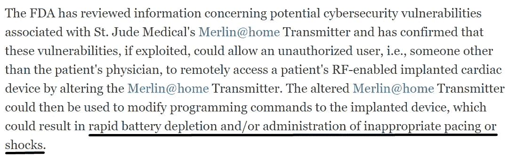
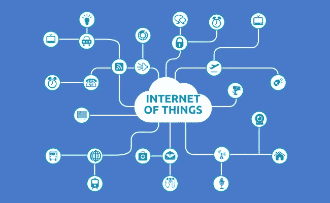
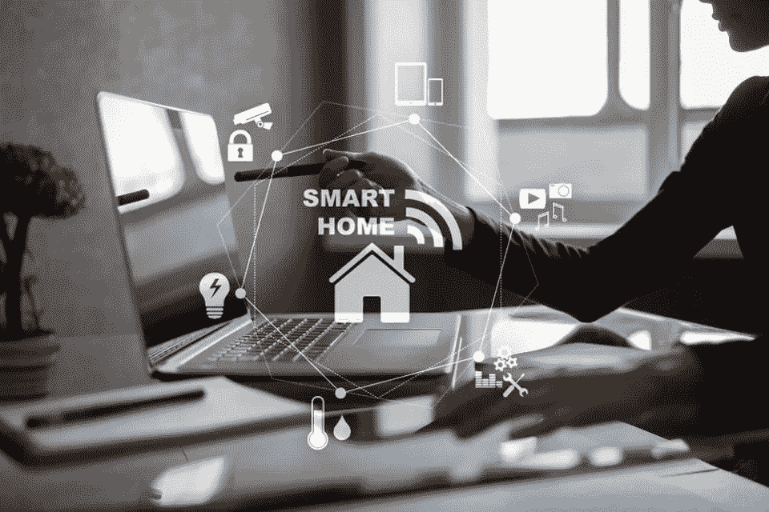
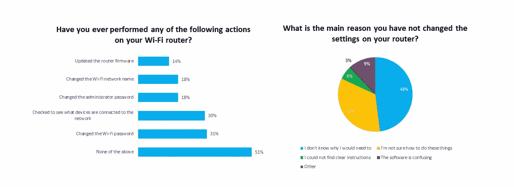

# 物联网时代:物联网用户面临的网络安全挑战

> 原文：<https://medium.com/hackernoon/iot-time-cyber-security-challenges-for-iot-users-ce5a6a7b9ac0>

2016 年 10 月 21 日，落叶不是唯一落下的东西。Dyn 公司控制着互联网 DNS 基础设施的重要部分，眼睁睁地看着他们的服务器因大规模 DDOS 攻击而一个接一个地关闭。后果是可怕的:对 Reddit、网飞、CNN 和其他热门网站的访问几乎中断了一天。某一天可能听起来没那么糟糕，但从商业角度来看，这是一场灾难。

让我们看另一个例子。2017 年 1 月 9 日，FDA(美国美国食品药品监督管理局)不得不做出[声明](https://www.fda.gov/medical-devices/safety-communications/cybersecurity-vulnerabilities-identified-st-jude-medicals-implantable-cardiac-devices-and-merlinhome)，让上面的 DDOS 攻击看起来像是抓伤。

[https://www.fda.gov/medical-devices/safety-communications/cybersecurity-vulnerabilities-identified-st-jude-medicals-implantable-cardiac-devices-and-merlinhome](https://www.fda.gov/medical-devices/safety-communications/cybersecurity-vulnerabilities-identified-st-jude-medicals-implantable-cardiac-devices-and-merlinhome)

换句话说，黑客可以让某人心脏病发作——这是一个可怕的场景，可悲的是，这比以往任何时候都更接近现实。这两起事件有一个共同点:利用物联网设备。在第一种情况下，服务器受到打印机、摄像头和婴儿监视器的攻击，它们被用作僵尸网络，向服务器发送大量请求，直到它们崩溃。入侵发射器以获取心脏植入物是物联网入侵的另一个例子。

## IoT 是什么？

物联网是互联设备的网络，这些设备可以相互共享数据。互联网离不开人类的交流，互联网的发展就是人类之间全球光速交流的发展。

[https://picswe.net/pics/security-and-privacy-1f.html](https://picswe.net/pics/security-and-privacy-1f.html) img: internet-of-things-security-and-privacy

另一方面，物联网 ***主要是由相互连接的机器之间的通信定义的，这些机器单独在线的目的很少甚至没有*** (这就是平板电脑和智能手机不被视为物联网设备的原因)。

第一个物联网设备可以追溯到 1980 年初。卡内基梅隆大学计算机科学系的研究生大卫·尼科尔斯(David Nichols)将一台可口可乐自动售货机连接到他所在系的主计算机上，主计算机又连接到 ARPANET(互联网的早期版本)。这样，他就可以从电脑上远程了解饮料的状态(满的/空的/温的/冷的)。自动售货机和主计算机交换信息，大卫可以随时查看状态。

## 2019 年物联网

自第一台物联网设备问世以来，已经过去了将近 30 年，据预测，到 2020 年，我们将拥有超过 500 亿台物联网设备。这大约是世界人口的六倍。已经被称为第四次工业革命，它在各个方面都提出了新的挑战。

最大的问题之一是设备安全。在过去的三十年里，我们见证了互联网的扩张，手机向智能手机的演变，金钱的虚拟化。每一个发展阶段都伴随着新的风险:网络传播被用于宣传；用于追踪的智能手机；不用枪就能清空银行账户。

毫无疑问，将各种设备连接到互联网并为用户提供远程访问会让生活更加舒适。然而，对于网络安全专家来说，安慰是一个诅咒语。在线安全和隐私保护频繁地被用来换取易用性，物联网也不例外。让我们仔细看看物联网发展的背后隐藏着哪些危险。

## 物联网的安全挑战

物联网与智能家居概念紧密融合。提醒你没有牛奶的冰箱，你可以在回家的路上点击智能手机加热的烤箱，以及婴儿相机等。那很舒服。

[https://www.forbes.com/sites/forbestechcouncil/2018/01/12/14-predictions-for-the-future-of-smart-home-technology/#52d300032e21](https://www.forbes.com/sites/forbestechcouncil/2018/01/12/14-predictions-for-the-future-of-smart-home-technology/#52d300032e21)

然而，如果这些设备中的任何一个没有得到足够的保护，那么它可能会适得其反。婴儿摄像头黑客已经成为精通技术的青少年的恶作剧，你可以在这个视频中检查不知情的母亲[的反应。](https://www.youtube.com/watch?v=w_aKU0cVN2w)

另一个威胁是 DDOS 攻击。到目前为止，最常见的情况是用恶意软件感染尽可能多的计算机，将它们变成僵尸网络。尽管电脑相对来说很难被黑。物联网设备就不是这样了。尽管这些设备确实有一些计算能力，但它远没有达到维持高质量自我保护系统所需的能力。然而，这足以实施 DDOS 攻击。

这就给我们带来了第三个挑战——获取物联网设备。目前，大多数物联网设备的销售和发货都采用了极其薄弱的安全实现，相当于“admin/root”路由器登录组合。设备 IP 经常被曝光，甚至有一个针对物联网设备的[搜索引擎](https://securitygladiators.com/what-is-shodat/)。大多数用户没有足够仔细地阅读手册，制造商也没有尽力让他们的客户至少更改登录/密码组合，这意味着简单的暴力攻击可以授权访问大量的物联网设备。

## 第一道防线

物联网不可避免地要来到我们的生活中，提高安全性是用户的责任。幸运的是，有像 OWASP(开放 Web 应用安全项目)这样的网络安全组织，他们在 2014 年推出了[物联网安全项目。安永会计师事务所发布了一份名为“](https://www.owasp.org/index.php/OWASP_Internet_of_Things_Project)[网络安全和物联网](https://www.ey.com/Publication/vwLUAssets/EY-cybersecurity-and-the-internet-of-things/%24FILE/EY-cybersecurity-and-the-internet-of-things.pdf)”的报告，详细阐述了物联网可能存在的危险。教育是第一道防线，既然一切都在变聪明，你也应该变聪明。

第二，黑客不找硬目标。他们寻找“轻松赚钱”为每台设备使用强登录/密码组合[是必要的](https://hackernoon.com/strong-password-dilemma-tips-on-securing-your-data-online-f853784f2bdf)。

第三，大多数物联网设备通过家用路由器连接互联网。

[https://www.bleepingcomputer.com/news/security/survey-reveals-users-have-no-clue-about-router-security/](https://www.bleepingcomputer.com/news/security/survey-reveals-users-have-no-clue-about-router-security/) img: survey-reveals-users-have-no-clue-about-router-security

如果您的设备以未加密的形式发送数据，通信可能会被拦截、修改并感染恶意软件和病毒。在设备带有硬编码的安全应用程序之前，强烈推荐路由器上的 VPN。它对连接到路由器的物联网设备之间的所有通信进行加密，并屏蔽 IP 地址，使恶意利用您的网络变得更加困难。

最后，但同样重要的是，网络安全是一场马拉松，而不是短跑。如果你打算在家里使用物联网，你至少需要一些关于物联网安全的知识。就像锁门不是一蹴而就的事情一样，保护不断扩大的网络也不是一蹴而就的，而是需要不断的警惕和改进。