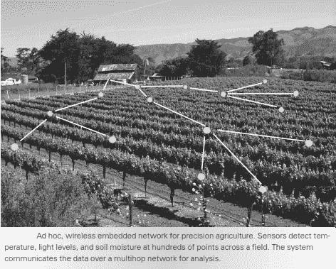

# 没有互联网的物联网…这对其功能有什么影响？

> 原文：<https://medium.com/hackernoon/iot-without-internet-how-does-it-affect-its-functionality-275cff90a018>


**物联网** ( **物联网**)是车辆、家电等设备的网络，包含[电子](https://en.wikipedia.org/wiki/Electronics)、[软件](https://en.wikipedia.org/wiki/Software)、[传感器](https://en.wikipedia.org/wiki/Sensors)、[执行器](https://en.wikipedia.org/wiki/Actuator)和[连接](https://en.wikipedia.org/wiki/Internet_access)，允许这些东西连接、交互和交换[数据](https://en.wikipedia.org/wiki/Data)。(感谢那个定义，维基百科！)

大多数人或多或少都知道 ***IoT*** 的意思及其重要性。它已经成为 ***的最新趋势*** ，随着 5G 和其他技术在不久的将来到来，物联网设备的数量不断增加。今天，我们可以找到越来越多的“智能”设备(除了我们的笔记本电脑和智能手机之外)，它们可以通过互联网连接，被远程控制和监控，在大多数情况下，使我们的生活变得更轻松，并连接到(几乎任何东西)。

虽然首字母缩写物 IoT 的第一个词是“互联网”(连接全球设备的互联计算机网络的全球网络)，但 ***并非所有物联网设备都需要连接到互联网，或者——至少不总是*** 。



来自 ***农业区*** 的*示例*是 ***传感器*** 的(本地)网络，其中 ***测量温度和湿度水平*** 并将收集的数据通过某种协议(即 802.11(通常称为 WiFi))发送到附近的基站。在本例中，**系统不需要连接到互联网**。如果我们假设基站是员工团队的本地办公室，我们也可以假设他们会定期将数据收集到另一个设施，甚至在现场进行处理。当然，基站可以连接到互联网，但这不一定会影响其功能。


另一方面，有一些设备，如 ***IP 摄像机*** ，几乎 ***都需要互联网连接*** 才能真正受益于物联网设备的全部潜力。假设我们想通过安装一个带有运动和声音检测设置的 IP 摄像头来保护我们的家庭，当检测到某些东西时，它会通过通知和/或电子邮件来提醒我们。**如果**由于某种原因(技术原因或恶意原因)**我们在家失去互联网连接**会发生什么？我们会**误以为一切都是安全的**，因为我们不会收到电子邮件，并且**一旦有人试图入侵我们的房子，我们的物联网设备就会提醒我们**，而我们的摄像头会在没有任何警告的情况下停止工作。

**我不知道任何物联网设备**(如果你知道的话，请在下面的评论中通知我)实际上**通知**用户他的物联网设备已经变成“ot”，这意味着它已经**失去互联网连接**(正如我们之前讨论的那样，这在某些情况下可能非常重要)。

这就是为什么我提议连接到互联网的物联网设备都应该包括一个基本功能。该功能是**在设备**失去互联网连接时发出通知。如果物联网设备没有互联网接入，当然就没有任何发送警报的手段。这就是为什么我建议在客户端应用程序的 ***处应该有对设备和控制器应用程序*** 之间的连接的 (速率将由设备任务的严重性和需要在线的程度来确定) ***。***

在我们之前的 *IP 摄像头示例*中，即**智能手机应用**将**检测到家庭路由器的互联网连接**丢失，用户将**发送通知**，从而采取适当的措施**解决问题**(呼叫 ISP，派人检查等)。

现在来看看一些独立的**解决方案**！对于那些拥有覆盆子馅饼(或者可以整天运行的 Linux 机器)的人，我有一些代码，你也可以看看。


Pinger application

首先，我做了一个 ***的智能手机应用*** 、 ***Pinger*** ，那个**监控你家路由器**的互联网连接，当连接断开时通知，从而避免让你的物联网设备“我”少了。

[https://play.google.com/store/apps/details?id=appeiro.pinger](https://play.google.com/store/apps/details?id=appeiro.pinger)

其次，我写了一个简单的 BASH **脚本**。例如，当您在局域网之外时，您可以在您的**覆盆子馅饼**中运行 shell 脚本(将其连接到外部电源，例如电源组),并再次使用它来**检查您的**互联网连接**。**

```
#!/bin/bash
# Pinger: Receive a message/email when your host is downecho "Enter the IP address or host name."
read ipaddrecho "Enter the refresh rate of ping checking (in minutes)."
read rateminrate=$((rate * 60))ping -c 1 $ipaddr >/dev/null
response=$?while [ $response -eq 0 ]
do
        echo "Your internet connection seems to be UP"
        ping -c 1 $ipaddr >/dev/null
        response=$?
        sleep $minrate
doneecho "Attention! Your internet connection seems to be DOWN"
# send an email alert via ssmtp, see how at [https://www.youtube.com/watch?v=QT-6NbjqjDM](https://www.youtube.com/watch?v=QT-6NbjqjDM)
```

> 因此，总而言之，了解我们的物联网设备何时以及是否连接到互联网非常重要。在我看来，提醒用户他的设备不再连接互联网应该是依赖在线连接的物联网和智能设备的一个基本功能。

## 学到了什么？按住👏来支持和帮助别人找到这篇文章。感谢阅读！！

**在推特上关注我**[**@ konpap 1996**](https://twitter.com/konpap1996)