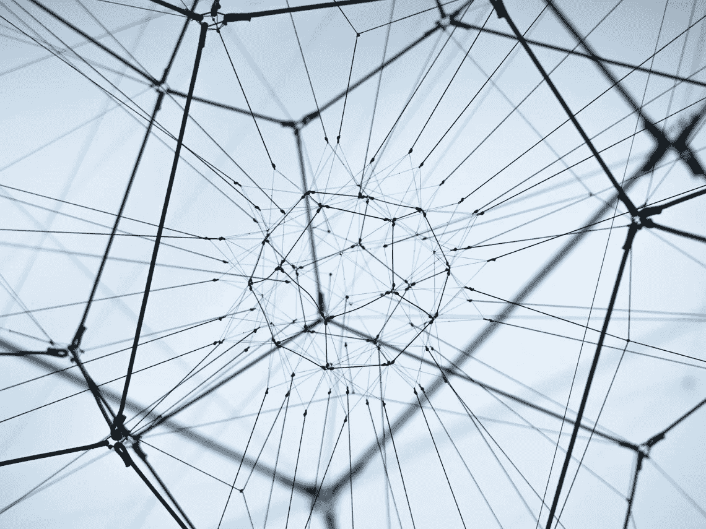
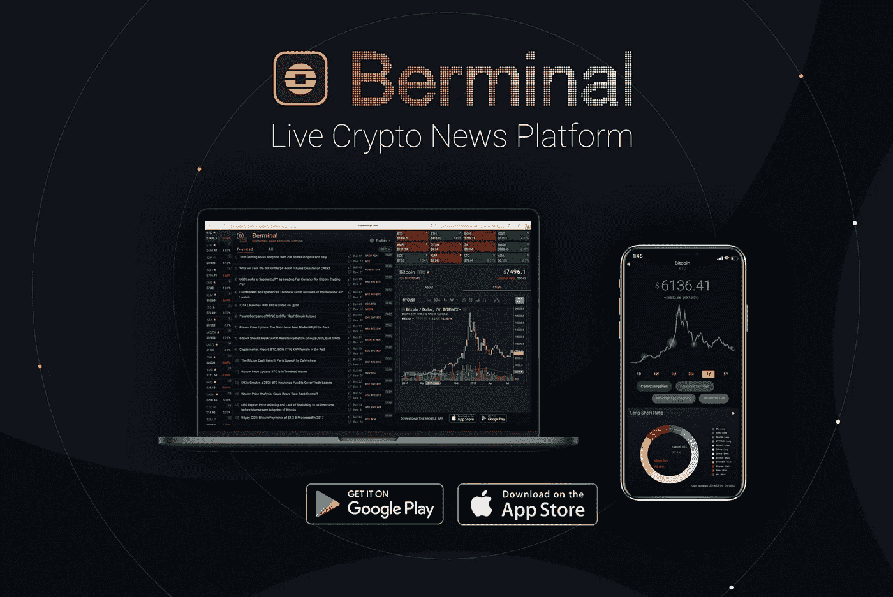

# 伊朗银行将现实世界资产令牌化，Blockstream 发布新的闪电网络软件

> 原文：<https://medium.com/hackernoon/iranian-bank-to-tokenize-real-world-assets-and-blockstream-releases-new-lightning-network-software-b5e475730bd8>

**行情状态—2019 年 3 月 4 日** [**BTC**](https://berminal.com/coins/Bitcoin-BTC)**:3759.67 美元(-2.65%)** [**ETH**](https://berminal.com/coins/Ethereum-ETH)**:126.80 美元(-5.53%)** [**XRP**](https://berminal.com/coins/XRP-XRP)**:0.304842 美元(-2.96%)**

整个周末市场保持稳定。然而，今天早些时候，有一个实质性的崩溃，近 50 亿美元已从加密市场抹去。比特币已经跌破 3800 美元，还可能进一步跌至 3400 美元。所有排名前 20 的加密货币现在都在闪烁红色，以太坊和 EOS 等主要加密货币遭受了更大的损失。

在其他新闻方面，周日， [Verge (XVG)意外上涨 11%，此前采矿代码发生故障，隐私硬币的开发者开始考虑转向股权证明(PoS)](https://berminal.com/news/189212/Verge-XVG-Gains-11-After-Mining-Code-Malfunction) 。目前，价格上涨的原因尚不清楚，Verge 社区的成员认为，Verge 创始人兼首席开发者 Sunerok 的一条推文可能是价格上涨的原因。此外， [MyCrypto 首席执行官 Taylor Monahan 最近谈到，在首席开发人员 Afri Schoedon rage 大约两周前退出该项目后，她认为以太坊社区的毒性越来越大。莫纳汉说，以太坊社区的一些成员表现出的有毒的“以太坊或什么都不是”的态度是可耻的，对整个项目是有害的。根据莫纳汉的说法，Schoedon 是唯一一个可以将以太坊简化为大众可消化的小知识的人，他作为事实上的领导者的地位只会在人们觉得他偏离了“以太坊或什么都没有”的意识形态时激怒他们。](https://berminal.com/news/189279/MyCrypto-CEO-Speaks-About-Growing-Toxicity-within-the-Ethereum-Community)

**1)伊朗最大的几家银行透露了在基于 Stellar 协议的私人区块链平台上对多种资产进行令牌化的计划。**PayMon(PMN)平台由 30 毫克 24k 黄金支撑，每枚 PMN 币价值 156，581 里亚尔，约合 3.72 美元。根据银行的说法，PMN 的总供应量上限为 10 亿英镑，其中 15%将向公众提供，20%将提供给寻求购买至少 30 万 PMN 的机构“锚”。剩下的 60%按月发放，5%由创始团队持有。伊朗政府官员此前的报告显示，令牌化资产和加密货币可能被用作规避美国制裁的一种方法，但对话现在已经转向关注该技术刺激伊朗科技行业经济增长和创新的能力。([阅读更多](https://berminal.com/news/189246/Irans-Banks-Reveal-Plans-to-Tokenize-Gold-Real-Estate-and-Other-Assets-on-Blockchain))

**2) Blockstream 发布了最新版本的 c-lightning，版本 0.7，这是该公司专有的闪电网络(LN)实现。**这是过去 8 个月中的第一个主要版本，包括多项性能改进、软件错误修复、附加隐私选项和更详细的文档。新功能是由来自世界各地的 50 名不同贡献者组成的团队开发的，他们向 c-lightning 的代码库发布了 1，300 个提交。目前有 6，963 个 LN 节点，在过去 30 天内增加了 18.88%，总网络容量为 740 BTC，价值约 283.5 万美元。([阅读更多](https://berminal.com/news/189406/Blockstream-Releases-New-Lightning-Network-Software))

北海巨妖首席执行官 Jesse Powell 最近通过以下推文对比特币基地最近收购中微子进行了抨击:“我问了我们的合规团队对中微子的看法。幸运的是，他们刚刚完成了评估。中微子在产品上排名最后(满分 5 分)，但由于存在风险，还是被取消了资格。然而，并购中其他因素也很重要:成本、文化契合度。这可能会进一步推动当前的#delete coinbase 运动，该运动是在交易所宣布有争议的收购后激发的。([阅读更多](https://berminal.com/news/189394/Kraken-CEO-Says-Neutrino-Came-in-Last-Place-on-Product-Out-of-the-Companies-They-Looked-At))

[***订阅百慕大简讯***](https://visitor.r20.constantcontact.com/d.jsp?llr=myyhdl6ab&p=oi&m=1131022639884&sit=9ar6aztmb&f=776989ec-8460-43a4-b86a-bcf8f2f1bca7)

[***免费下载百慕大 App***](https://berminal.app.link/medium-post)

*[***百慕大官方电报***](https://t.me/berminal)*

*[***伯明纳尔推特***](https://twitter.com/berminalapp)*

**