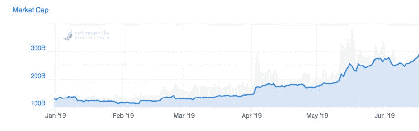
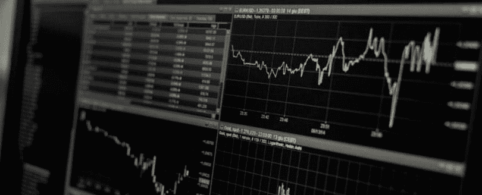

# 2019 年是密码交易员有史以来最好的时光吗？

> 原文：<https://medium.com/hackernoon/is-2019-the-best-time-ever-for-crypto-traders-2d56c4146890>

对于许多交易者来说，最近的加密货币环境在过去两年中相当不受欢迎。这些交易员已经对交易密码失去了兴趣，或者只是在一旁谨慎地观察事情的发展。尽管被许多人忽视，密码交易市场仍然在向前发展。

即使经历了两年的低迷，现在加密领域的情况又开始好转了。经过急需的喘息之后，密码交易市场已经准备好再次繁荣起来；这一次(感谢 [Volentix](https://volentix.io/) 、[比特币基地](https://www.coinbase.com/)和 [0x](https://0x.org/) )有了比以往更多的选择、更安全的基础设施和更好的技术工具。

# 交易员们对此表示怀疑是有道理的

在过去的几年里，大多数交易者已经退居二线，这种犹豫是完全可以理解的。

毕竟，这是市场中的一个混乱时期，你只需快速浏览一下[加密货币总市值图](https://coinmarketcap.com/charts/)就可以看出这一点:长达一年的疯狂市场调整，损失了 88%的价值。当然，这些都是危险的交易条件。这是一个交易所关门、机构倒闭、关键影响者离开、人们恐慌、市场极度不可预测的市场。

[https://coinpaprika.com/overview/](https://coinpaprika.com/overview/)

除了市场动荡之外，加密交易的技术前景仍处于初级阶段，即使开始交易加密货币，你也必须弄清楚如何使用和组合复杂、不同的工具。即使是能够成功应对市场动荡的交易者，也很难快速、稳定、有效地执行他们的交易。这些都是为许多交易者创造这种不良环境的因素。

# 密码交易再次兴起，这是一个大时代

虽然更谨慎的交易者已经选择跳过加密，但市场肯定没有停滞不前。许多交易者一直愉快地交易。事实上，现在交易的加密货币比以往任何时候都多。多得多。

如果你看看过去几年每天交易的加密货币总量，你会发现在 2018 年 1 月加密歇斯底里的高峰期，交易量达到了 600 亿美元的 24 小时峰值，当时比特币价格飙升至 2 万美元。

然而，自那以后，价格就没有恢复，但令人惊讶的是，加密货币的交易量大幅回升。[总交易量](https://coinmarketcap.com/charts/)在 2019 年年中达到历史最高水平。今年 5 月 16 日，*的 24 小时交易量是 2018 年峰值的两倍。*

这里的故事是，价格可能还没有回到它的峰值，但现在交易的密码数量是我们见过的最高水平。这直接转化为高流动性的市场和密码交易员在 2019 年获利的机会增加。

# 市场终于为交易做好了准备

今年加密货币交易量爆炸式增长的关键原因是整体交易环境的成熟。工具，基础设施，技术和组织正在迅速到位，以创造一个伟大的密码交易体验。我们谈到的所有这些复杂和不同的交易工具和平台现在开始合并成功能齐全的集成生态系统。

[https://www.pexels.com/photo/black-and-white-business-chart-computer-241544/](https://www.pexels.com/photo/black-and-white-business-chart-computer-241544/)

# 生态系统中工具的融合

为了有效地交易加密货币，您需要三个关键工具:

1.  存放您的密码的钱包
2.  与他人进行交易的交易所
3.  市场数据为你的交易提供信息

到目前为止，结合这些标准一直是一个手动和混乱的过程。交易员需要使用交易所、开源工具和钱包的某种组合，以及市场数据和评级的资源目录。这增加了交易的复杂性，大大减慢了你的交易过程。在移动加密货币时，使用多种不同的工具也会增加风险。

此外，使用分散的工具更难使用。当你需要使用许多复杂的工具，而这些工具之间又不能很好地配合时，你很难快速地利用交易机会。

现在，新的集成平台正在为交易者提供更加完整的加密货币交易体验。这些工具包括:

1.  volentix——一个完全分散的交易生态系统
2.  比特币基地/专业/托管——一个集中的交易生态系统
3.  0x —用于分散令牌交换的协议

这三种解决方案分别代表了加密货币交易格局演变的三种截然不同的方式。

# volentix——分散交易生态系统

[Volentix](https://volentix.io/) 是一个“数字资产生态系统”，为交易者提供所有必要的工具。它的开发者将其描述为一个软件工具的集合，旨在增强加密货币的使用。这五个关键工具是:

1.  VDEX——用于直接点对点交易的分散式交易所
2.  VERTO——用于存储加密货币的多币种、多区块链钱包。连接到 VDEX
3.  VESPUCCI——交易者的排名和指标仪表板，使用深度学习算法收集信息，为交易者提供每个加密货币项目的评级和排名
4.  VENUE——一个基于社区的平台，用于整体发展和维护 Volentix 项目
5.  VTX——整个平台的本地货币。

Volentix 是一个开源项目，旨在提供去中心化的治理、去中心化的利润和社区透明度。Volentix 真正独特的地方在于，它将所有这些工具整合到一个系统*中，而不是*将它们集中起来。该团队通过平衡开源开发、展示[强大的核心价值观](/@VolentixLabs/volentix-an-overview-6b08649534b9)、拥有去中心化的治理模式，以及将一切与 VTX 货币捆绑在一起，实现了这一目标。

对于交易者来说，这意味着一种独特的交易体验，在传统的交易世界中几乎没有类似的体验。

# 比特币基地——一个集中的交易生态系统

与 Volentix 分散生态系统相反的例子是[比特币基地](https://www.coinbase.com)试图用它的集中生态系统做的事情。比特币基地现在为那些想要更传统交易体验的人提供一些高级服务，以配合其购买/销售平台。

首先，他们整合了自己的交易平台[比特币基地专业版](https://pro.coinbase.com/)，用户可以使用他们在经纪平台上购买的比特币或以太坊来交易所有其他种类的加密货币。它配有实时订单簿、图表工具和数据导出功能。基金也投保额外的一块心。

比特币基地甚至为用户提供他们自己的加密货币持有服务，名为[托管](https://custody.coinbase.com/)。它的设计本质上是一个保险的，安全的银行保险库，供机构存储他们的密码。

比特币基地和 Volentix 的核心区别在于它是高度集权的。用户必须将资金托付给比特币基地，并管理游戏规则。好处是资金有保险。

# 分散式令牌交易改进

像比特币基地这样的集中交易生态系统牺牲了隐私和安全，但它们带来了速度和流动性。

如果你过去使用过分散式交易所(例如 IDEX,),你就会知道它们可能会笨重、缓慢、缺乏流动性。这对交易者来说不是好事，这就是为什么许多人坚持集中期权。但是现在 Volentix 配备了 [VDEX](https://volentix.io/vdex) 和其他项目，如 [0x](https://0x.org/) ，现在也开始改变这种情况。

[0x](https://0x.org) 是一个开放的、无许可的协议，允许 ERC20 令牌比以往任何时候都更顺利地进行交易。它本质上是一种分散的基础设施技术，允许链外订单广播、共享流动性池和订单匹配。0x 让开发者和商家可以轻松地将交易嵌入到他们的应用中。使用像 [Instant](https://blog.0xproject.com/introducing-0x-instant-7314c786d743) 、 [Connect](https://blog.0xproject.com/introducing-0x-connect-67471fb45c94) 或 [Launch Kit](https://0x.org/launch-kit) 这样的解决方案，现在只需几分钟就可以启动您自己的分散式交换。

我们应该期待更多的交易者考虑更快、更具流动性、无缝使用的分散交易平台。

# 现在是加密货币交易有史以来最激动人心的时刻

在过去的几年里，对于许多交易者来说，加密货币交易的环境不太理想。但是 2019 年事情真的又开始升温了。加密货币仍然活跃而强劲，市场经历了 2017 年开始的急需的路线调整。市场情绪高涨，交易量打破新纪录。

[https://dilbert.com/](https://dilbert.com/)

你在不久前放弃加密货币交易当然可以被原谅，但我们现在正在进入一个先进的加密货币交易的全新时代。这一次，你不会想错过。