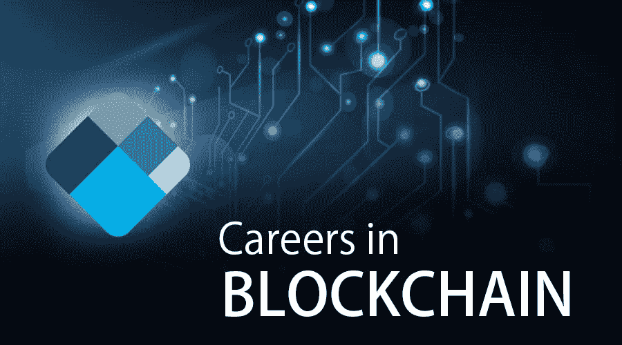

# 区块链作为职业选择好吗？

> 原文：<https://medium.com/hackernoon/is-blockchain-good-to-choose-as-a-career-4f8323ec97a1>

Source : Google

区块链最初是为了比特币而开发的，但现在它是充满活力的技术之一。在过去的几个月里，[区块链](https://hackernoon.com/tagged/blockchain)已经跃上了世界舞台，并且是几个技术领域问题的伟大解决方案之一。它获得了领先政府部门、行业领袖以及企业家的各种有影响力的认可，这是对其技术能力的独特认可。

这种热情发展了对各种基于区块链的工作的滚动需求。它现在是劳动力市场上快速增长的工作之一。当然，区块链是一个新的就业领域，有一条已知的成功之路。没有听过这项技术的人现在雄心勃勃地致力于这项新技术。所以，如果你在思考选择区块链作为职业到底好不好，那么答案当然是肯定的。区块链职业生涯的道路当然是新的，也是创新的，但它肯定有一个光明的未来。

**让我们讨论一下为什么要选择区块链工作？**

区块链工作的需求很高，因为

高薪:由于区块链是一个发展中的领域，可用的人才非常少，因此技术和非技术职位的薪酬都比其他正常工作高得多。除此之外，区块链工作的收入分成模式也要好得多，激励也很高。

远程工作的灵活性:现在远程工作有了很大的增长，人们更喜欢避开办公室的概念，而更喜欢地点的灵活性。这是区块链公司超越竞争对手的一个原因。加密公司也提供在家工作的选择，只需要你来办公室几天。

员工流动性:这是一项仅限于代币公司的福利。在大多数创业公司中，员工获得股权，并不得不在流动性事件中出售股票并获得现金。这是一个复杂的过程，在大多数情况下，授予的权限非常严格，通常会阻碍二级业务。但在区块链公司，员工会收到一个令牌，作为类似股权的补偿。反过来，这些代币是天生的流动股票。

所以，现在你一定已经明白为什么你应该在区块链领域寻找职业生涯。

**现在让我们来看看区块链提供的各种职业岗位。**

区块链开发者:[区块链开发者](https://hackernoon.com/tagged/blockchain-developer)是要求很高的岗位之一。这是一个高度援助的职位，也取决于工作场所。甚至超过了一个硬件开发者的水平，令人印象深刻。

非技术岗位:区块链领域并不是所有岗位都需要技术专长。非技术职位也很少。一些非技术职位与运营、设计以及其他区块链业务相关。但所有这些非技术职位都需要持续的学习热情，因为区块链领域一直在发展，并且需要对区块链技术有很强的了解。如果有人想进入客户服务领域，那么你应该知道这项技术实际上是如何工作的。

现在，对于那些想在区块链领域寻求职业生涯的人来说，必须遵循一个与之前的其他科技企业家完全不同的剧本。

**那么，刻意在区块链立业的最佳路径是什么？**

区块链行业总是需要那些不断提高技能并跟上所有最新进展的人。区块链狂热者可以遵循几个步骤来发展自己的事业。

开发基础:区块链知识的重要组成部分之一是对其价值主张有深刻的理解。一些重要的事情，如 [Dapps](https://hackernoon.com/tagged/dapps) 、[分权](https://hackernoon.com/tagged/decentralization)比仅仅是流行词汇更重要。它们是区块链的核心，精通区块链的专业人士必须了解它们。区块链开发者还需要一些其他技术技能，如网站开发和稳固的 java 脚本。

密码术:现在可以在线获得资源，从而使密码术变得不那么重要。区块链以其提供保护和节省这些资源的能力而闻名，它依赖于[密码术](https://hackernoon.com/tagged/cryptography)。不理解加密技术会给依赖它的公司带来危险的后果。因此，在密码学方面进行适当的训练是非常重要的。

正确理解分布式计算理论及其应用:良好分布式计算不再被认为是一种理论，而是一种区块链解决方案。它被认为是比精细化实践更重要的东西。一个想从事区块链职业的人需要适当地学习这些东西，以便他们可以在以后找到适当的解决方案。

因此，我们只能说，区块链就业市场正在蓬勃发展，那些想参与其中的人应该走一条正确的道路。区块链市场正在蓬勃发展，它提供了很多机会。所以，我们可以得出结论，选择区块链作为职业绝对是一个正确的决定。