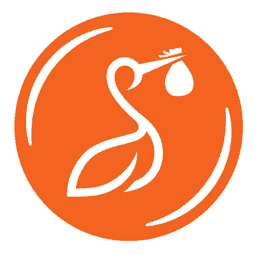

# 区块链是受够了这个行业的音乐人的答案吗？

> 原文：<https://medium.com/hackernoon/is-blockchain-the-answer-for-musicians-fed-up-with-the-industry-4226aa8b8f6d>

## 音乐家们受够了当前行业如何控制和利用他们的音乐。这就是为什么许多人涌向区块链平台，希望让这个行业变得更加公正和透明

在 20 世纪 90 年代之前，唱片公司严格控制着音乐产业的方方面面，从音乐人的资金到发行，甚至版税的收取。

随着互联网和文件共享平台如 Napster 和 Limewire 的兴起，这一切都改变了，他们让音乐随时随地可用，最重要的是，免费的*。*

*文件共享平台的兴起削弱了唱片公司对音乐行业的控制，因为它们不再控制新音乐的分销网络，也没有时间随着消费者转向数字音乐分销而恢复过来。*

**

*数字音乐发行的增长导致该行业因实体发行渠道的销售损失而损失了数百万美元的收入，非传统公司也纷纷出现，想从中分一杯羹。*

*许多人认为文件共享平台的兴起，我们认为*是“第一波颠覆”，会导致音乐人重新控制这个行业，因为他们不再需要依靠唱片公司来推广和发行。**

**然而，这并没有发生，相反，音乐产业仍然由唱片公司控制，尽管比 20 世纪 90 年代以前的比例要小。**

**音乐人并没有感受到第一波颠覆带来的全部好处，因为分销渠道的变化损害了唱片公司的实体音乐销售，但并没有消除他们对该行业其他领域的控制。**

**为了应对第一波颠覆留下的问题，许多人将区块链技术吹捧为音乐产业变革的潜在催化剂，我们称之为*“第二波颠覆”***

****

**除了与区块链技术相关的炒作之外，该技术还有在现实世界中的应用，从而彻底改变了音乐产业，我们敢说，音乐产业正在向以音乐人为中心的生态系统转变。**

**在音乐行业推动区块链的先锋包括来自音乐行业和区块链行业各个领域的成员。**

**不过，随着任何过渡，都将有一些问题必须得到解决，以帮助当前的参与者转移到基于区块链的系统(“传统到区块链”)。**

**传统到区块链先驱将面临的问题不仅来自当前的音乐行业，还来自区块链技术和相关社区的固有限制。**

**在这份报告中，我们确定了我们预计传统到区块链先驱将面临的主要问题，以及缓解或解决这些问题的可能策略。**

**此外，我们还研究了适用于音乐行业的区块链干预措施。**

# **结论**

**感谢您阅读《区块链在音乐行业的初步回顾》的简短总结！**

**报告全文如下，供您浏览。**

**你可以下载关于 [**Scribd**](https://www.scribd.com/document/392646592/A-Preliminary-Review-of-Blockchain-in-the-Music-Industry) 和 [**SSRN**](https://papers.ssrn.com/sol3/papers.cfm?abstract_id=3280838) 的完整报告。**

**有关本报告的任何问题或疑虑，请发邮件至 hello@ledgerback.coop 或回复。**

# **作者**

****

**Scout Stork.**

**[Ledgerback](https://medium.com/u/6fc419b1c386?source=post_page-----4226aa8b8f6d--------------------------------) 是一家研究合作机构，为区块链网络(用例、链上/链下智能)、在线治理、分散社区和技术提供研究、咨询和宣传。**

**总的来说，我们的重点是去中心化的技术和社区，目标是为未来去中心化(希望是 P2P)经济的增长创造、管理和分配资源。**

**我们的主要研究活动包括:**

*   **研究(主要是发表研究报告和总结评论)，**
*   **调查和民意测验(一般涉及社会对区块链教的接受或区块链社区内的特定主题)，**
*   **咨询(协助项目解决问题)，以及**
*   **宣传(促进内华达州当地的区块链社区)。**

**作为一个合作社，我们是一个由社区驱动的组织，由我们的成员拥有、管理和运营，以实现他们的共同目标。**

**如果你对我们的兴趣或作品充满热情，我们恳请你加入我们，为新的数字前沿创造一个更加光明的明天。**

## **连接[支架背部](https://medium.com/u/6fc419b1c386?source=post_page-----4226aa8b8f6d--------------------------------)**

**您可以通过填写 [**会员协议表**](https://forms.gle/acxbSkcnY111PURP8) 或在我们的网站上下载 [**会员文件来加入我们。**](https://www.ledgerback.coop/downloads)**

## **联系信息**

**欲了解更多信息，请访问我们的 [**网站**](http://www.ledgerback.coop) ，网址为 [www.ledgerback.coop.](http://www.ledgerback.coop.)**

**您也可以在我们的 [**空闲工作区**](http://www.ledgerback.coop) 与我们聊天。**

**如果您想给我们发电子邮件，请发送邮件至 hello@ledgerback.coop。**

**在这些网站上找到我们:**

*   **[推特](https://twitter.com/ledgerback)**
*   **[脸书](https://www.facebook.com/Ledgerback/)**
*   **[所有权互联网目录](https://ioo.coop/directory/)**
*   **[钢模](https://steemit.com/@ledgerback)**
*   **[Github](https://github.com/LedgerbackCoopAssn)**
*   **[中等](/@ledgerback)**
*   **[领英](https://www.linkedin.com/company/ledgerback/)**