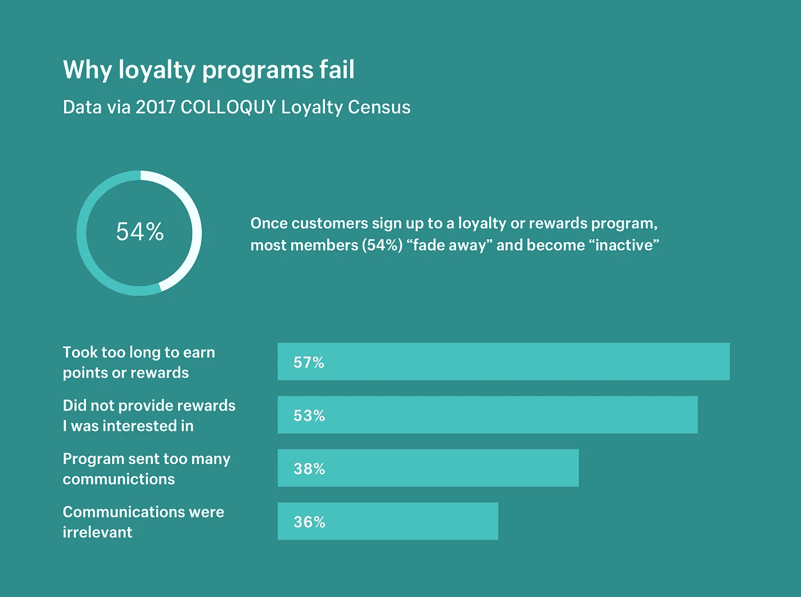

# 区块链是忠诚度计划的答案吗？

> 原文：<https://medium.com/hackernoon/is-blockchain-the-answer-to-loyalty-programs-61a66ee24168>

> “忠诚不是一天就能赢得的。你每天都在赢得忠诚度。”杰弗里·吉托梅尔

客户忠诚度和参与度可能是公司的决定性差异，因此，忠诚度奖励计划对所有类型的组织来说都是一项非常重要的投资。我们猜测，你周围的每个人都可能参加了某种形式的忠诚度计划。

那么，为什么我们认为所有行业的忠诚度奖励计划都是“[失败](https://blog.smile.io/why-customers-abandon-your-loyalty-program)”？

答案很简单，忠诚度和奖励计划没有实现其全部潜力的一些原因是由于账户不活跃、低赎回率、时间延迟以及高系统管理和客户获取成本。

效率低下的主要原因是忠诚度和奖励计划的所有权和兑换规则缺乏统一性，这导致会员缺乏积极性。

一个很好的解决方案是在一个互联的忠诚度网络中整合不同的计划，但这种合作并不容易，特别是因为该行业在基础设施和保护竞争专有信息(如客户的个人身份信息)的义务方面不一致。

协作通常还会导致引入中介，这增加了信息泄露的风险，同时增加了更多层的其他活动部分。

此外，计划之间普遍缺乏足够的数字化排除了许多相互关联的计划，并且是以向客户提供使用它们的合适时刻的方式提供奖励积分之间的时间延迟的主要原因。

# 为什么使用区块链有意义？

使用区块链从根本上说是一种以安全、无信任、分布式的方式处理和维护记录的新方法，它将消除许多低效之处。

让我们来讨论它将如何降低成本，同时满足不同类型和规模的忠诚度奖励计划的需求，同时通过允许客户在一个数字钱包中访问大多数(如果不是全部)忠诚度奖励计划来显著改善客户体验。

如果你仔细想想，忠诚度奖励也是一种数字货币，因此让比特币在多方之间交易的技术自然也可以对忠诚度奖励积分产生同样的影响。

## 连接支离破碎的世界

区块链将允许即时和安全地创建、兑换和交换忠诚度积分，跨项目和行业，通过使用加密技术而不是任何可信的第三方的无信任环境。

## 忠诚令牌

在发起可以是发行、兑换或交换的忠诚度交易时，区块链协议创建忠诚度令牌，忠诚度令牌是包括积分在内的所有类型的奖励的基础。忠诚度令牌的唯一标识符在每个参与者的分类账中更新，并在整个网络中可用。一些在线协议和限制控制着这些令牌背后的点的工作方式。

## 降低成本

许多忠诚度奖励计划经理的犹豫是可以理解的，因为他们被要求对交易、客户获取和系统管理的执行方式进行根本性的改革。然而，尽管区块链促进了根本性的变化，但它是一个附加层，而不是现有系统的替代品。

区块链的一个吸引人的方面是，它通过智能合约与遗留系统进行交互，智能合约将交易记录传输给获得许可的用户，这些用户将交易记录集成到他们的遗留系统中，同时从长期来看降低了成本。

## 无摩擦系统

基于区块链的忠诚度网络使得添加和删除计划合作伙伴和供应商变得非常容易。当用户使用她/他从购买机票中获得的忠诚度令牌来升级他们的酒店房间时，这些令牌可以跨供应商无缝地工作。尽管这已经存在于今天的一些忠诚度奖励计划中，并且在互连的网络中，但区块链可以使其无处不在，并在更多的计划中更接近实时。

## 近实时过程

有几个原因可以解释为什么忠诚度奖励计划不能及时记入客户账户。例如，在授权释放“待定”积分之前制定的特定政策，然而，许多是逻辑原因，例如忠诚度奖励计划发行者和忠诚度奖励计划提供者之间缺乏协调。

区块链可以让交易被多个参与方近乎实时地记录和访问，增加了忠诚度奖励计划提供商更快地突破协调惯性获得积分的机会。

## 提供安全的环境

区块链为每一笔交易创建了一个不可变的带时间戳的分布式数据库条目，使每一笔交易及其记录都易于追溯，但也使它们不可变，从而防止双重支出、欺诈、滥用和任何其他类型的交易操纵。

基于区块链的忠诚度计划不仅更难被黑客攻击，而且可以在多个层面上提供安全性，这在以前是不可能的。例如，所有的点都被标记化，这赋予它们独特的身份，极难伪造、访问或破坏记录在区块链上的信息，超过 51%的节点必须受到攻击。

因此，我们知道，效率低下主要是由于分散的系统，这些系统依赖于需要通过可信中介进行多方协调的集中管理。然而，我们可以看到区块链通过将信任从过程中取出并去中心化来解决这个问题。

通过设计，区块链可以简化忠诚度奖励计划的执行和管理，在计划提供商的许可限制内，为所有参与者提供实时透明度。