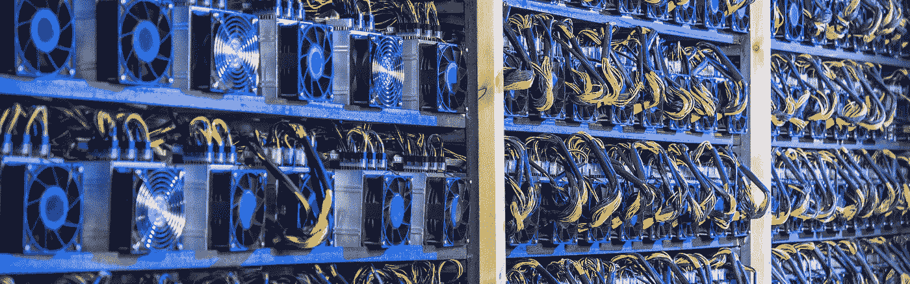

# 密码挖掘还赚钱吗？Block Operations 创始人 Rolf Versluis 访谈

> 原文：<https://medium.com/hackernoon/is-crypto-mining-still-making-money-interview-with-block-operations-founder-rolf-versluis-57d029b9bb06>

比特币刚推出的时候，解决单个区块的挖矿奖励是 50 比特币。这在当时只值几分钱，但最初的矿工对加密货币的未来潜力持乐观态度。

他们是对的。在随后的几年里，比特币的价格稳步上升，使得采矿成为一项越来越有利可图的风险投资。随后的许多其他加密货币也是如此。价格攀升得越高，就有越多的人蜂拥而至建立自己的采矿平台。

但当价格在去年年底开始下跌时，情况开始发生变化。令人羞愧的全面价格调整极大地降低了矿业利润以及对矿业的整体兴趣。

今天，许多问题— *加密采矿仍然有利可图吗？如果不是，这对这个行业意味着什么？*

为了深入了解当今采矿业的状况，我联系了 Block Operations 的所有者、Horizen 的联合创始人 Rolf Versluis。我问了他 10 个当今矿工面临的最相关的问题。以下是他与我分享的内容:

Rolf Versluis

# 1.鉴于加密价格的下降，采矿在今天仍然有利可图吗？

采矿业今天仍然有利可图。采矿利润在很大程度上取决于采矿成本保持在多低的水平。成本是电力、工资、冷却、设施租赁和任何企业为了继续经营和遵守当地监管机构而支付的其他持续费用的组合。

必须进行的最大投资之一是采矿基础设施本身。对于例如有 500 名矿工要操作的小型商业采矿操作来说，获得配备有适当数量的配电、冷却和数据网络的建筑物是非常昂贵的。

下一步是购买在采矿设施内运营的矿工。通过低价收购高效矿商，利润率肯定能得到提高。

如果采矿组织能够保持低成本，就采矿设备做出明智的采购决策，并选择合适的时机将采矿奖励转换为当地货币支付电费，采矿仍有两位数的年盈利能力。

它可能有利可图，但也有风险，需要通过经验获得广泛的特定领域知识，并需要比预期更多的现金储备。

# 2.密码价格的下降是否改变了你对采矿的看法？

密码价格的下降正如我刚入行时所预测的那样。我的想法是，只要在加密市场价格下降时保持尽可能低的成本，成本较高的矿商就会拔掉他们无利可图的设备，总体杂凑率就会下降，每个继续采矿的矿商的报酬就会上升，低成本矿商就能够继续采矿并保持盈利。

在大约四个月的时间里，许多采矿作业都在亏本开采，但这取决于他们出售采矿收益的时间。

一些矿工开采并立即出售开采所得。对于那些矿商来说，当价格和哈希率处于不利或负面的情况下，他们最好关掉自己的装备。其他矿商保持现金储备余额，这些矿商仅在加密价格较高时出售其开采收益。

出售矿业收益的时机非常重要。对于这项活动，负责销售的人员了解价格图表和趋势会有所帮助。例如，在最近一次比特币价格下跌时，经验丰富的矿商应该已经预见到了这一点，并出售了可以为他们提供一年本币银行运营成本的收益。然后，他们将能够在整个低谷期进行开采，而不必出售任何加密货币来支付费用。

通过保持较高的现金储备，并且在加密货币价格较低时不会被迫出售，有经验的矿工可以在经济低迷期间开采更多的加密货币，并持有开采收益，直到价格较高。例如，如果一名矿工在比特币价格约为 3500 美元/美元时开采了大量加密货币，并持有至未来某个时候比特币价格为 7000 美元/美元时，回头看他们会非常有利可图。

# 3.你之前提到过，一枚硬币要想长期存在，就必须有能够通过处理交易赚钱的矿工。为什么？

在遵循比特币发射曲线的加密货币存在的前 20 年左右，矿商通过新的大宗奖励和交易费赚钱。在大部分新币被创造出来后，以比特币为例的 2100 万，矿商维持盈利的唯一途径就是来自交易费用。预计到有很多交易的时候，加密货币的价格会高得多，因此矿工仍然会操作他们的机器，以便从交易费用中获得报酬。

如果在特定加密货币的大部分硬币被创造出来之后，价格仍然很低，没有很多交易，并且区块没有满，没有太多的交易费竞争，那么大多数矿工将无法赚钱，并将关闭他们的采矿机器。这将影响加密货币的安全性，因为它将受到拥有许多闲置机器的矿工对区块链完整性的攻击。

# 4.如果采矿变得越来越无利可图，我们可以期待这些硬币的未来？

对于拥有低成本和最新最高效采矿硬件的采矿组织来说，采矿总是有利可图的。总有一个过程，机器效率较低、运营成本较高的矿商被迫停止开采某种特定的加密货币，因为他们的成本超过了他们的收入。

硬币的未来不是由矿工决定的，而是由致力于加密货币技术以及用户采用和使用的组织决定的。在加密货币的生命周期中，对特定加密货币的需求由不同的原因驱动。在其早期，需求来自投机者和投资者，他们期待未来的技术进步和用户对加密货币的采用。在以后的生活中，需求是由用户驱动的，他们希望获得加密货币，以便实际使用它的功能。

矿工将他们的采矿机器指向对他们来说最有利可图的加密货币进行开采。无论一种加密货币的散列值是多还是少，每天创造的新加密货币的数量都不取决于矿工。

如果一种加密货币的使用量下降如此之多，以至于没有新的硬币被创造出来，并且网络上的所有交易都是零成本完成的，因此没有交易费用，那么矿工们将停止开采这种区块链。在这一点上，我预计加密货币不会有太多的未来。

# 5.核心团队应该做些什么来准备和/或应对这种可能性？

在所有加密货币被创造和发行之后，为了让矿工继续在网络上操作他们的机器，他们必须得到一些奖励。一些加密货币实际上具有较低的年通货膨胀率，因此总是会创造新的硬币来抵消每年丢失的硬币，这确保了矿工将总是在网络上。其他加密货币应该展望未来，以确保矿商有足够的交易费。

# 6.如果采矿业的盈利能力下降，你是否会看到矿商转向其他类型的加密相关业务？

矿工有一套自己开发的特殊技能，包括技术工程工作。他们必须在电力不足的地方建造设施，建造大型电力和冷却装置，并开发操作成百上千台采矿机器并保持其运行的能力。

还有其他与加密相关的业务，如运行托管 masternode 节点的服务器，致力于用户和企业采用，以及开发新的加密货币，但这些技能与矿工雇佣的技能非常不同。至于是否将他们的经营转向其他方面，这将取决于各个采矿组织的能力。

# 7.给加密矿工报税有多复杂？

为秘密采矿者报税是非常困难的。加密货币矿工是少数几个在完全加密货币收入环境中运营的企业之一，并且已经运营了多年。他们所有的收入都是加密货币，然后被转换成支付账单的当地货币。

我的经验是，会计师和簿记员希望获得采矿和交易操作的详细程度，这很难获得，因为许多为银行传统业务开发的簿记工具在加密货币领域尚不存在。

我给大多数矿商的建议是，对待他们从采矿中获得的收益，就像资源开采公司对待从地下开采出来的资源一样。

采矿企业必须与能够帮助他们计算收入、利润、损失、报税和纳税的会计师合作。

# 8.你认为哪些国家对矿工有最有利的规定？

政策最优惠的国家是那些拥有允许低电价、在建设有大量电力和冷却系统的设施时价格低廉以及低营业税的法规的国家。

在许多情况下，最重要的法规涉及发电设施的建设和设施允许收取的电费价格。住宅和小型企业用电协议的电价通常受到严格监管，这些电价对矿工来说通常没有竞争力。

随着每月用电量的增加，电价下降。在用电率较高的情况下，监管很少，电力供应商和消费者可以协商对他们有利的费率。这是大型采矿作业设施往往更有利可图的原因之一。这因地区而异，但基本上，如果一个设施每月用电量超过 100 万千瓦时，他们将处于可以与当地电力公司协商费率的水平。

# 9.展望未来，在矿业法规方面，你希望看到更多什么？

已经有相当多的法规影响到了矿工。电价受到监管，建筑法规得到执行，采矿利润和其他商业利润一样被征税。

我希望看到加密货币开采仍然合法。

由于监管的不确定性，采矿设施被剥夺了银行关系，保险单也被取消。银行和保险公司似乎在其自身发展的合法领域内运营，这很不幸，但由于采矿仍然合法，我预计银行和保险公司将适应为优秀的运营商提供服务和政策，就像他们为任何其他业务提供服务和政策一样。

# 10.环境保护主义者认为，由于大量的电力消耗，地下采矿作业正在加剧气候变化。你对这些指控怎么看？

有许多不同类型的环保主义者，他们有着各种各样的观点。与其他行业相比，采矿业没有消耗大量的电力。对于消耗的电力，矿工们倾向于将他们的作业转移到任何有最低成本电力供应的地方。在过去的几年里，这是在中国的一个地区，中国政府在那里修建了水电站，以应对人口增长。否则，那里用于采矿的电力将被浪费掉。

有许多关于废物的潜在目标需要环保主义者集中精力和注意力。在浪费能源的大计划中，加密货币是次要的。

*原载于 2019 年 4 月 4 日*[*【cryptolawinsider.com】*](https://cryptolawinsider.com/is-crypto-mining-still-profitable/)*。*