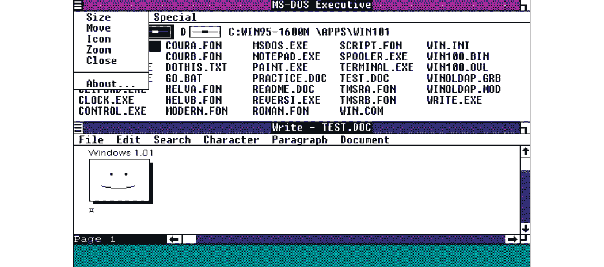
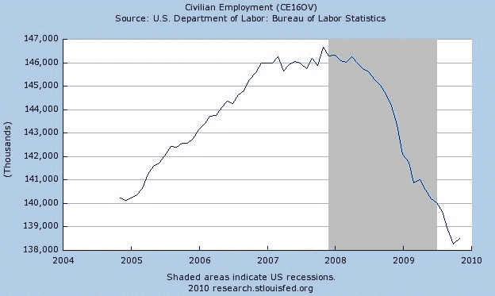
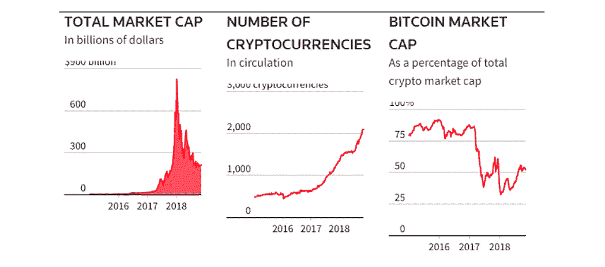
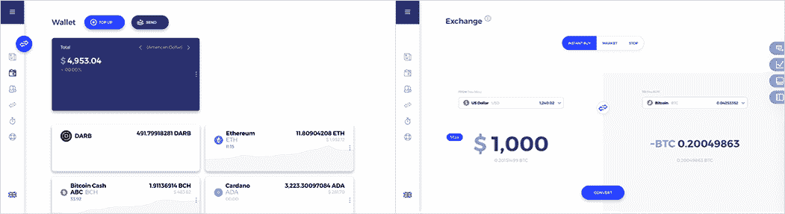
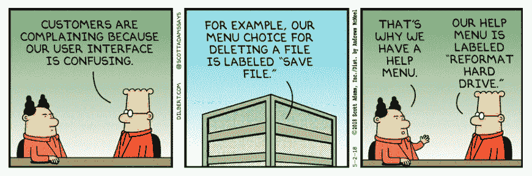

# 加密货币真的是为所有人制造的吗？

> 原文：<https://medium.com/hackernoon/is-cryptocurrency-really-made-for-everyone-83e69800184>

“忘记过去的人注定要重复过去”，这是哲学家乔治·桑塔亚纳的一句名言，他坚信历史会重演。他有很多证据来支持他的理论，然而，你不需要成为哲学家或技术奇才，就能看出加密货币世界正在重复计算机公司在互联网早期犯下的错误。

在这篇文章中，你将了解为什么我们今天离不开的技术，即计算机，在进入人们的家庭之前已经存在了几十年，如果没有像 [Darb](https://darbfinance.com/) 这样的项目来尝试和解决让普通人远离这项技术的错误，加密货币将如何重复这一不幸的历史。

# 电脑是给极客用的

作为第一批发明的计算机之一，[批处理计算机](https://www.oreilly.com/library/view/design-build/9780470257630/9780470257630_batch.html)从用户界面的角度来看是一个彻底的失败。不可能进行实时交互，用户必须输入一张硬纸(一张包含他们命令的穿孔卡片),并等待数小时甚至数天才能得到输出。

[https://en.wikipedia.org/wiki/Batch_processing#/media/File:CDC_NOS_batch_file.jpg](https://en.wikipedia.org/wiki/Batch_processing#/media/File:CDC_NOS_batch_file.jpg)

下一个最大的升级是引入了[命令行界面(CLI)](https://searchwindowsserver.techtarget.com/definition/command-line-interface-CLI) ，它允许用户输入他或她的请求。键盘并不是一个大发明，就像我们以前在打字机上看到的那样，但是它在做它的工作。而且，通过取消打孔卡的需要，它还节省了一些树木。

在这两种情况下，你可以看到，如果你没有对技术的深刻理解，你就不知道如何实际使用计算机来为自己造福。对于当时的大多数人来说，这个不可思议的创新毫无用处。

这是因为第一批开发者认为用户界面是不必要的花费。

这发生在 20 世纪 60 年代中期，CLI 在 20 世纪 70 年代和 80 年代一直被使用。

第一台完全集成的计算机是 1981 年发布的施乐之星，带有数字用户界面和指示系统(计算机鼠标的前身)。然后又推出了苹果 Lisa Office System 1，VisiCorp Visi On，Mac OS System 1，Amiga Workbench 1.0 等等。

无论如何，直到 1985 年比尔·盖茨发明的第一个 Windows 操作系统 [Windows 1.0](https://www.pcmag.com/encyclopedia/term/54605/windows-1-0) ，人类与计算机的交互才从控制台世界转移到更简单、更丰富多彩、更高分辨率的界面。

[https://www.pcmag.com/encyclopedia/term/54605/windows-1-0](https://www.pcmag.com/encyclopedia/term/54605/windows-1-0)

那是计算机[成为主流](https://forums.anandtech.com/threads/when-did-pcs-become-common-in-the-home.27999/)并开始在人们家中占据一席之地的时刻。

# 加密货币是为谁而生的？

今天，加密货币是极客和技术专家的工具，就像当时的计算机一样。为了获得创新的区块链技术并将其用于你的利益，你应该知道编译器如何工作，如何使用命令行界面，自己设置交易费用，以及[等等](https://www.telegraph.co.uk/technology/0/cryptocurrency/)。

如果你不够专业，如果你不是能够轻松处理访问数字钱包、转移资金、在交易所交易和保护你自己的代币的详尽过程的一小撮人的一部分，你就出局了。区块链技术对你来说几乎不存在。

对大多数人来说，区块链和它的数字硬币看起来像是计算机技术早期的第一次用户界面尝试。

除非我们得到一个简单而清晰的界面，否则大规模采用不会发生。

你可能已经知道，在无障碍界面设计出来之前的几十年里，大多数人都无法接触到计算机技术。自区块链发明以来，十年已经过去了，那么加密货币世界会重复这个周期，再等几十年才最终进入主流吗？

# 梦想

尽管比特币是在 10 年前发明的[，但区块链的旅程始于 1991 年，当时哈伯和斯托纳塔在一篇题为“](https://edition.cnn.com/2019/01/14/investing/bitcoin-prices/index.html)[如何给数字文件](https://www.anf.es/pdf/Haber_Stornetta.pdf)加时间戳”的研究论文中提到了第一个类似于区块链的数字结构。涉及到一个“时间戳”服务器，它会用当前时间戳签署一个数字文档，并且(这非常重要)将该文档链接到前一个文档。使用指针是可能的，但是我们不会在这里讨论技术细节。这个概念和区块链一样:它确保没有人能够篡改通过服务器的数据。

这些年来，这项技术一直在升级；该系统整合了 [Merkle 树](https://coincentral.com/merkle-tree-hashing-blockchain/)，与当前区块链技术基于的结构相同。然而，直到 2009 年中本聪[发布了](https://bitcoin.org/bitcoin.pdf)第一个数字账本技术的应用，它才获得成功；比特币。

即使在今天，中本聪的身份仍然是个谜。人们相信他可能是一个人或一群人。无论是哪种情况，在 2008 年经济崩溃后不久，他(或他们)就有了创建一个理想的金融体系的想法，从导致工人阶级公民遭受痛苦的机构手中夺走所有权力。

[https://www.conservapedia.com/Recession_of_2008](https://www.conservapedia.com/Recession_of_2008)

我们无法确定 2008 年的经济衰退是否是比特币的灵感来源，但这无疑是比特币腾飞的合适环境。

这就是中本聪的梦想如何成为现实。

# 断开发生在哪里？

在一个拥有超过 [2，000 个代币](https://coinmarketcap.com/all/views/all/)的环境中，超过 [100 个加密货币交易所](https://coinmarketcap.com/rankings/exchanges/)由于基于从外汇和其他传统交易所移植的白标引擎，存在重大的安全性和可扩展性问题。此外，超过 20 亿美元的[资产被盗；我们给加密货币世界注入了过去系统的所有错误。](https://blockonomi.com/bitcoin-theft-skyrocketed-2-billion/)

[https://blockchaintimes.news/2018/11/28/wednesday-november-28-2018-daily-news-digest/](https://blockchaintimes.news/2018/11/28/wednesday-november-28-2018-daily-news-digest/)

比特币只是使用区块链技术的数百个应用程序之一，开源的好处在于任何人都可以决定制作自己的版本。即使在比特币之前就有类似的技术建立，Satoshi 还是写了白皮书，让他的梦想成真。

现在，我们已经意识到阻碍区块链应用的关键问题，我们需要展望下一个项目，它将成为我们技术发展的下一步。

“区块链对于比特币就像互联网对于电子邮件一样。一个大的电子系统，你可以在其上构建应用程序。货币只是一个，”[萨利戴维斯，FT 科技记者](https://www.ft.com/video/2be94381-66dc-3320-a292-6a1cde0a3d5f)。

# 下一步是什么？

在这个叙述中，我们寻找每个人都可以使用的新服务。可以通过增强用户体验来颠覆区块链世界，这将向世界各地的人们介绍这项技术的真正潜力。

所有这一切将我们引向[Darb](https://darbfinance.com/)；一个平台，提供稳定、可扩展和可信的交换，以及可通过卡或直接通过移动指纹支付访问的多币种钱包。听起来像是理想的财务解决方案，对吗？嗯，可能只是。

[https://darbfinance.com/](https://darbfinance.com/)

当复杂的解决方案被引入时，Darb 有着和比尔·盖茨发明 Windows 时一样的梦想:给用户配备一个个人界面，作为通向新技术的便捷通道。Darb 是加密货币世界接口。他们提供:

*   密码到菲亚特的转换
*   可以在几秒钟内处理数百万笔交易的加密到加密的交换
*   多链钱包，从第一次打开应用程序开始，您就可以随时使用它
*   关联借记卡、 [Apple Pay](https://www.apple.com/apple-pay/) 或 [Android Pay](https://www.androidauthority.com/how-to-use-android-pay-678739/) 进行指纹交易
*   投资组合管理和投资组合跟随者计划
*   能够导出到一个[冷钱包](/@stellabelle/cold-wallet-vs-hot-wallet-whats-the-difference-a00d872aa6b1)
*   2FA、reCAPTCHA、电子邮件确认、相同浏览器登录、新设备登录确认、IP 跟踪、反网络钓鱼代码。

该交易所， [DARB 金融](https://darbfinance.com/)，现已投入使用。他们的其他功能仍在开发中，但创建一个具有可访问设计的平台的步骤正在成为现实，该平台可在浏览器中使用，也可作为移动应用程序放在口袋中。

当普通人能够轻松使用加密货币时，才会有真正的进步。加密货币社区已经由早期采用者组成，他们比一般人更懂技术，不介意去 Github 下载、编译和运行一个实验性的钱包，只是为了确保他们的资金安全。对于所有其他人来说，进入这个社区是强加了一个陡峭的学习曲线，需要追求，同时试图在所有的新闻嗡嗡声，骗子和非官方信息中找到正确的信息。有一点是明确的，普通用户不能被忽视太久。没有普通人的接受，进步是不可能的。