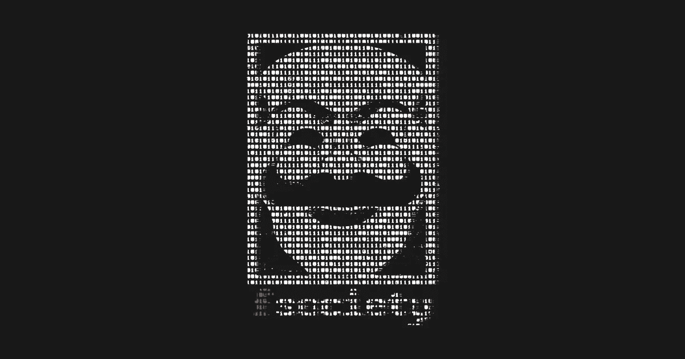

# 脸书的天秤座是赛博朋克的噩梦吗？

> 原文：<https://medium.com/hackernoon/is-facebooks-libra-a-cyberpunk-s-nightmare-379c891a0f91>

## [阅读全文](https://hackernoon.com/libra-a-cyberpunk-nightmare-in-the-midst-of-crypto-spring-5543b6f6e34b)作者[丹尼尔·杰弗里斯](https://hackernoon.com/@dan.jeffries)

*“几年前，一家大公司将发行一种加密货币的想法是可笑的，更不用说一个由大型跨国公司组成的财团发行一种加密货币了，其中包括旧世界金融系统的中坚力量，如 Visa 和万事达卡。*

但是它比那更大。这是货币史上的一个转折点。”

## 阅读丹尼尔·杰弗里斯的完整故事。

以下是一些摘录:

# 《大开眼戒》和《明日帝国》

*“没有一个更好的 UX，crypto 连门都出不了……*

如果加密项目想要获得真正的吸引力，并与这个大型平台竞争，他们需要明智地建立一个真正的商业模式，就像脸书在这里所做的那样。

*如果你无处可花，凭空赚钱是不够的。*

*你需要一个接口、治理、资金和买卖的东西，所有这些都整合到一个庞大的生态系统中。”*

# 荷兰东印度公司的回归

天秤座背后的组织有钱也有影响力来制定和改变法律。当他们的天网平台启动时，随着越来越多的法定货币流入他们的金库，这种力量将与时俱增。任何阻碍他们的国家都将面临一系列的游说者和非政府组织，他们将惩罚监管者，改写有利于他们的法律，或者在其他国家繁荣发展的时候，剥夺政府的全新财富。

这是赛博朋克的真实写照。反对国家权力的大型跨国公司。

如果赛博朋克告诉了我们什么，那就是公司最终会赢。”

# 港口上方的天空是调到一个无效频道的电视的颜色

这给我们带来了天秤座硬币最有趣的副作用之一。

凭借完整的生态系统和推动脸书数十亿用户快速采用的能力，它将成为第一个真正挑战国家资助货币主权、传统银行系统以及国家印刷和分发货币权力的平台。

不在联盟中的人和在联盟中的人一样有趣。

*没有银行。一个都没有。”*

## 阅读全文作者[丹尼尔·杰弗里斯](https://hackernoon.com/@dan.jeffries)。

## [阅读全文](https://hackernoon.com/libra-a-cyberpunk-nightmare-in-the-midst-of-crypto-spring-5543b6f6e34b)。[阅读全文](https://hackernoon.com/libra-a-cyberpunk-nightmare-in-the-midst-of-crypto-spring-5543b6f6e34b)。[阅读全文](https://hackernoon.com/libra-a-cyberpunk-nightmare-in-the-midst-of-crypto-spring-5543b6f6e34b)。[阅读全文](https://hackernoon.com/libra-a-cyberpunk-nightmare-in-the-midst-of-crypto-spring-5543b6f6e34b)。[阅读全文](https://hackernoon.com/libra-a-cyberpunk-nightmare-in-the-midst-of-crypto-spring-5543b6f6e34b)。[阅读全文](https://hackernoon.com/libra-a-cyberpunk-nightmare-in-the-midst-of-crypto-spring-5543b6f6e34b)。[阅读全文](https://hackernoon.com/libra-a-cyberpunk-nightmare-in-the-midst-of-crypto-spring-5543b6f6e34b)。[阅读全文](https://hackernoon.com/libra-a-cyberpunk-nightmare-in-the-midst-of-crypto-spring-5543b6f6e34b)。[阅读全文](https://hackernoon.com/libra-a-cyberpunk-nightmare-in-the-midst-of-crypto-spring-5543b6f6e34b)。[阅读全文](https://hackernoon.com/libra-a-cyberpunk-nightmare-in-the-midst-of-crypto-spring-5543b6f6e34b)。[阅读全文](https://hackernoon.com/libra-a-cyberpunk-nightmare-in-the-midst-of-crypto-spring-5543b6f6e34b)。[阅读全文](https://hackernoon.com/libra-a-cyberpunk-nightmare-in-the-midst-of-crypto-spring-5543b6f6e34b)。[阅读全文](https://hackernoon.com/libra-a-cyberpunk-nightmare-in-the-midst-of-crypto-spring-5543b6f6e34b)。[阅读全文](https://hackernoon.com/libra-a-cyberpunk-nightmare-in-the-midst-of-crypto-spring-5543b6f6e34b)。[阅读全文](https://hackernoon.com/libra-a-cyberpunk-nightmare-in-the-midst-of-crypto-spring-5543b6f6e34b)。[阅读全文](https://hackernoon.com/libra-a-cyberpunk-nightmare-in-the-midst-of-crypto-spring-5543b6f6e34b)。[阅读全文](https://hackernoon.com/libra-a-cyberpunk-nightmare-in-the-midst-of-crypto-spring-5543b6f6e34b)。[阅读全文](https://hackernoon.com/libra-a-cyberpunk-nightmare-in-the-midst-of-crypto-spring-5543b6f6e34b)。[阅读全文](https://hackernoon.com/libra-a-cyberpunk-nightmare-in-the-midst-of-crypto-spring-5543b6f6e34b)。[阅读全文](https://hackernoon.com/libra-a-cyberpunk-nightmare-in-the-midst-of-crypto-spring-5543b6f6e34b)。[阅读全文](https://hackernoon.com/libra-a-cyberpunk-nightmare-in-the-midst-of-crypto-spring-5543b6f6e34b)。[阅读全文](https://hackernoon.com/libra-a-cyberpunk-nightmare-in-the-midst-of-crypto-spring-5543b6f6e34b)。[阅读全文](https://hackernoon.com/libra-a-cyberpunk-nightmare-in-the-midst-of-crypto-spring-5543b6f6e34b)。[阅读全文](https://hackernoon.com/libra-a-cyberpunk-nightmare-in-the-midst-of-crypto-spring-5543b6f6e34b)。