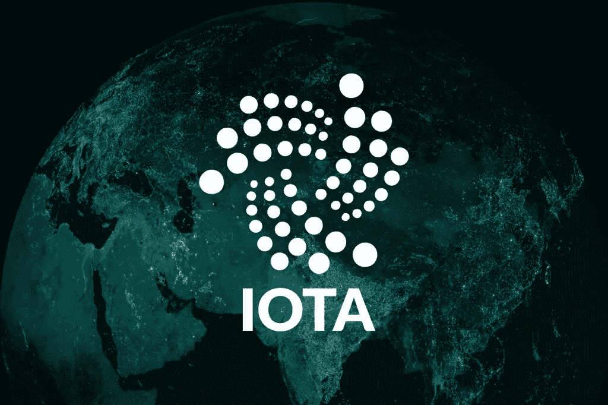

# IOTA 正在被大规模采用吗？

> 原文：<https://medium.com/hackernoon/is-iota-on-its-way-to-mass-adoption-b187d5eeadc7>

> 在加密货币市场中，每枚硬币都有一点点创新的性质，彼此之间有所区别。IOTA 提供了一些超越区块链架构的东西，它也不专注于建立一种高效的资金转移模式。那么 IOTA 到底提供了什么让它成为如此有前途的模型呢？

OTA 的创新主要体现在两个方面:首先，它旨在全面支持物联网设备提供的潜力。到 2020 年，预计将有大约 10 亿个对象连接到物联网，IOTA 已经创建了一种可以帮助物联网的加密货币。其次，它使用有向无环图(DAG)系统 Tangle，而不是区块链架构——为加密货币实现的主要系统。

## **物联网和 IOTA**

物联网(IoT)基本上是**机器之间单独的通信和交互，即没有人类干预**。任何在线连接的对象都可以相互通信，最终提高了便利性。IOTA 是一个**开源分布式账本，旨在促进物联网设备之间的安全支付和通信**

## **一丝纠结**

IOTA 决定选择 DAG 系统，而不是区块链模型。这个 DAG 系统被称为“ ***IOTA 纠结*** ”。Tangle 本质上是一串相互关联的独立事务，通过分散的节点网络存储。如果我们详细地看一个交易过程:发送方*需要执行一个工作证明(PoW)——在发送一个新的交易进行批准之前，批准 2 个先前的交易。这意味着 DAG 系统是完全去中心化的，因为' ***矿工*** '的角色已经被去掉了。如前所述，由于该模型中不再有矿工，因此不再需要为 PoW 付费。这意味着交易不再收费。“免费”、“分散”和“可扩展”是 DAG 系统与区块链模式的区别。*

## *未来的挑战？*

*然而，不同的模式带来了新的障碍。为了完全安全，整个 IOTA 分类帐将必须由分散式网络不断验证。因此，随着无限量的可能的未来交易，DAG 分类帐将变得无限大，并且验证起来非常耗时。*

## *好消息*

*从积极的方面来看，IOTA 最近通过乐观的消息将其界限推向了主流。**捷豹路虎的目标是使用 IOTA 系统实现“智能钱包”，用于数据共享和收集**，例如交通状况，IOTA 货币的 r **eward 模型**——然后可以用于通行费、停车费或其他驾驶费用。事实上，仅在美国，IOTA 就已经在汽车行业建立了重要的合作伙伴关系。例如与奥迪、大众和捷豹的合作，不用说它们是全球最大的汽车制造商之一。*

*另一条最近的新闻是**由 IOTA 基金会**发起的 IOTA 学院，旨在通过在线项目教育大众。这种做法在币安学院和比特币基地学院等学校中被证明是成功的，都是为了教育目的。*

> *将 IOTA 融合成我们日常生活不可或缺的一部分还有很多潜力，而这仅仅是它的开始。然而，随着这种创新技术而来的是巨大的风险，所以让我们拭目以待 IOTA 在未来的发展，无论是看跌还是看涨。*

**这不是也不应被解释为(a)任何形式的要约、邀约或促销；(b)任何投资或其他决定的依据；建议以任何方式购买、销售或交易任何货物、产品或服务，也不参与任何投资或其他交易或活动；或(d)提供或涉及任何咨询服务或活动，包括任何投资、税务、法律、金融、会计、咨询或任何其他相关服务。**