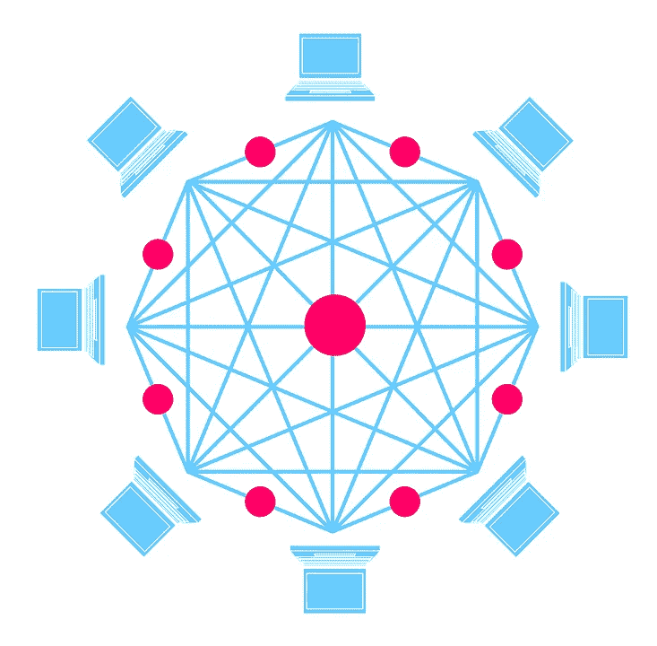

# 有没有可能为你的比特币(或其他密码)创建一个无法破解的加密网站/银行？

> 原文：<https://medium.com/hackernoon/is-it-possible-to-create-an-un-hackable-crypto-website-bank-for-your-bitcoin-or-other-cryptos-e53a8a8e9df1>

那些购买了大量比特币(或任何其他密码)的人面临着一个有趣的困境。放在哪里，如何安全保管？

Is it possible to have an unhackable crypto bank? Is it even needed?

一个相关的问题是:有可能保证你的密码安全吗？

自 2008 年比特币问世以来，黑客攻击一直是加密货币领域的一个主要问题。即使在最近一波对加密货币的兴趣(发生在 2017 年)之前，也存在众所周知的黑客攻击和问题。例如，2014 年，当时最大的比特币交易所 Mt. Gox 被黑了 74 万比特币，当时的价值超过 4.6 亿美元(按 2017 年甚至 2018 年的价格计算，将超过 10 亿美元)。

被黑客攻击的不仅仅是交易所——2017 年，领先的矿业服务公司之一 Nicehash 被黑客攻击了超过 7000 万美元。2018 年，coindesk 报告称，超过 10 亿美元的资金被黑客从各种服务中窃取！

随着 Mt. Gox 将在不久的将来重新上线，一个好问题是，你应该在 Mt. Gox、比特币基地或其他在线网站上存储任何比特币或密码吗？

另一方面，存在着将你的密码存储在“冷存储”或“硬件钱包”中的困境。这也有一些不利之处——也就是说，如果你不去冷库就不能得到它，那么拥有电子货币首先有什么意义？？

最近，就在 2019 年初，加拿大加密交易所 QuadrigaCX 在其创始人意外去世且他是唯一知道“密码”的人后，无法偿还其客户持有的 1.9 亿美元！

## 那么把你的密码存放在哪里呢？

让我们快速浏览一下你可能存放密码的地方:

*   你在哪里买的——比特币基地还是交易所。在许多方面，对许多人来说，这是理想的，因为你可以在任何地方登录并访问它。然而，这有着**明显的**可被黑客攻击的问题，就像迄今为止所有主要的黑客攻击一样。你用的网站还没被黑不代表不会被黑！
*   笔记本电脑/台式机上的钱包——这显然存在问题——如果你的硬盘没电了，或者你只是忘记了。我知道有人在他的笔记本电脑上有一些 2014 年的比特币，他已经忘记了，当价格在 2017 年开始上涨时，他意识到他的笔记本电脑上有几十万美元的比特币。等他去找的时候，发现他在用的比特币客户端太旧了，已经不能用了！幸运的是，他能够获得私钥，并将其放入一个新的钱包中，但显然个人笔记本电脑不是很安全，可能会被黑客攻击！
*   硬件钱包—一个流行的选择是硬件钱包，如 Nano ledger。在这个插入笔记本电脑的小 USB 设备中，私钥只存储在硬件钱包中，实际上根本不会存储在笔记本电脑中。问题在于没有冗余—如果您忘记了密码或丢失了种子短语来获取您的私钥，那么您就完蛋了。当然，您可以将密码和/或私钥存储在某个地方，但是这样会使它们被黑客攻击！
*   冷库(在办公室或银行)。我认识许多加密公司的创始人，其中一种方法是将你的以太存储在一个硬件钱包或 seed 短语中，并将其存储在物理保险箱或银行的物理保险箱中。当然，硬件钱包和冷存储都有严重的缺点——当你旅行或从多个地方旅行时，你不能访问它们。如果你是一家公司，可能需要多个人能够访问它(首席财务官、首席执行官等)。)而且每次你想做加密的时候都得跑一趟银行，这变得非常麻烦。在富国银行或美国银行存钱的一大好处是，你可以走进任何地方的分行进行交易(或使用你的借记卡)。
*   将它分散到不同的交易所/站点。这是我曾经使用过的一个选项，因为我不想把我的密码放在我的笔记本电脑上，而且因为我经常旅行，所以我想使用它。这并不能阻止任何特定的交易所/网站被黑，但它减少了你的损失。这里明显的缺点是需要记住不同网站上的所有密码。如果你使用相同的密码，那么你又一次被黑客攻击了！

## 冗余和可攻击性——有折衷吗？

正如我们在上面看到的，几乎任何你存放密码的地方，看起来都是好的建议，都有优点和严重的缺点。

QuadrigaCX 创始人的死亡表明，如果你打算在任何地方存储比特币，你需要冗余。当然，冗余越多，被黑的可能性就越大！当然，如果你把它存储在任何在线交易所或网站上，它们总是有被黑客攻击的可能性！

也有(虽然我不得不说这可能是非常罕见的)，人们在枪口下把他们的密码输入到一个硬件钱包的故事。这与在你的保险箱里存放任何东西没有什么不同，比如现金，或者如果你是在昆汀·塔伦蒂诺电影中，不记名债券！如果你是一家拥有数百万美元密码的公司，你会在办公室的保险箱里存放这么多现金吗？没有吗？那你为什么要存放硬件钱包呢？

## 一种存储密码的新方法

看起来冗余性、可访问性和可攻击性是决定在哪里存储你的密码的关键考虑因素。越安全越不容易接近。越容易接触，越容易被黑！

几年前，我在寻找将 crypto 分散到不同网站的方法，这样我就可以随时登录其中一个网站。正如我所说的，这有严重的缺点，因为你必须记住密码，任何网站都可能被黑客攻击——你不可能在足够多的网站上安装密码来真正降低风险。

如果，我想，我可以储存我的比特币(或者以太等等。)跨越 100 个不同网站的 100 个不同钱包？这样的话，如果他们中的任何一个被黑了，我最多会损失 1%的股份。虽然这对一些人来说可能很多，但这比冒着黑客丢失 99%或 100%密码的风险要好得多！

这似乎不切实际。首先，我甚至不知道 100 个不同的网站。其次，我可能会忘记其中的一些。等等，包括交易费用等等。

## ***一个新奇的想法:期待被黑***

我开始想知道这种方法是否可以自动化，以创建一种不同的预期会被黑客攻击的加密银行或网站？关键不是不可攻击，而是要有足够的冗余，这样任何攻击都会降低您的潜在风险！

这是一个想法的萌芽，可用于一种新型的加密银行或存储，这种银行或存储完全电子化，不需要依赖冷存储或对比特币的物理访问。

基本想法是将风险分散给所有顾客，就像任何银行可能做的那样。您可以使用多签名钱包的组合，并动态地移动加密，同时提供从任何地方访问您的一些加密。

## ***能行吗？一些想法***

我开始思考这是否会是一个银行的有效模型，并提出了如何创建加密银行(由子银行组成)的以下算法/伪代码。

让我们以 BTC 为例，暂时忽略交易费用。

假设您要存储 1 个 BTC。假设有 100 个人，每个人都有 1 个 BTC 要存储。

现在假设你可以设置 100 个钱包，每个钱包有 1 个 BTC，但每个人在每个钱包中拥有 1%的比特币(而不是每个人在单个钱包中拥有 100%的 BTC)。

所以，如果一个钱包被黑了，那么每个人都剩下 99%的财产了！1%的损失可能是可以接受的。

现在，你必须让黑客攻击这些钱包变得足够困难，这样就不太可能有人从同一个地方攻击 1 个以上的钱包(同样，建立冗余)。

假设每个钱包都需要多重签名，每个人有一个私钥，银行有另一个私钥。你可以设置一个钱包(至少在理论上对某些密码是这样的)，每个钱包本身只能提取钱包中 1%的钱，即使有两把钥匙，你最多也只能提取 x%的钱。

因此，即使有人从银行得到了所有的私钥，他们也只能从 100 个钱包中各得到 1%,或者黑掉总数的 1%。如果他们能够黑掉一个人，他们只能得到 1 个钱包的 1% = . 01%。

如果他们黑了银行并得到了个人的一个私钥，那么他们只能黑掉一个钱包的 x%!

## ***其他一些注意事项***

每当一个人决定提取一些 BTC，你就必须调整每个人拥有的数量。

假设我提取了全部金额(1 BTC)，我将需要我的私钥和银行的密钥，但我真的会“逻辑上”从每个人的钱包中提取 1%，所以如果我真的是黑客(而不是“我”)，那么理论上每个人(包括我)仍将拥有我们的 BTC 的 99%(假设我可以报告或指出这是黑客)。

理论上，每当一个人的钱包被掏空，无论是被黑客攻击还是被取款，每个人的所有权百分比都会减少。假设一个人提取了全部 BTC，那么你可以将所有 100 个钱包的金额减少 1%，或者扔掉一个钱包，而其他人仍然拥有其余 99 个钱包的相同比例。

一个缺点是你不能一次取出 100%的密码。理论上，即使在普通银行，每个人也不能在任何给定时间提取 100%的资金(这被称为银行挤兑，导致了大萧条和联邦存款保险公司的成立，等等)。).

通过设置提现限额，你可以设置提现限额，这样就不会有人被黑客攻击到 100%，而且任何提现都可以在从钱包中提取更多 BTC 之前得到验证。如我所说，这将会限制取款，但这也是银行对 ATM 卡等的做法。就像美国银行一样，它有允许你不经批准就汇出的阈值，这也可以用同样的方式设置。

Could redundancy and distributed architecture be the key?

这行得通吗？有很多细节需要解决，包括区块链是否更适合以太坊或 EOS 这样的智能合约，而不是拥有非常简单的智能合约功能的 BTC。如果你在钱包和优化之间转移东西，你还必须考虑交易费用，这样你就不会在 100 个不同的钱包上支付交易费用。

例如，ERC20 智能合约(和 ERC721)在内部跟踪钱包之间的转账，它不一定需要有 100 个不同的交易，您可以在一个智能合约中更新内部会计。

当然，这里使用的数字是任意的——你可以有 1000 个钱包或 99 个或 9 个，这取决于阈值，并且可能需要越来越多的签名，比如一个密钥 1%到一次 99 个密钥，等等。

你怎么想呢?这是一个真实或想象的问题的平凡或非平凡的解决方案吗？将密码分散到这么多钱包中的成本会使它变得难以管理吗？

风险管理在任何类型的投资管理或投资组合中都是一个公认的领域，为什么加密不一样呢？