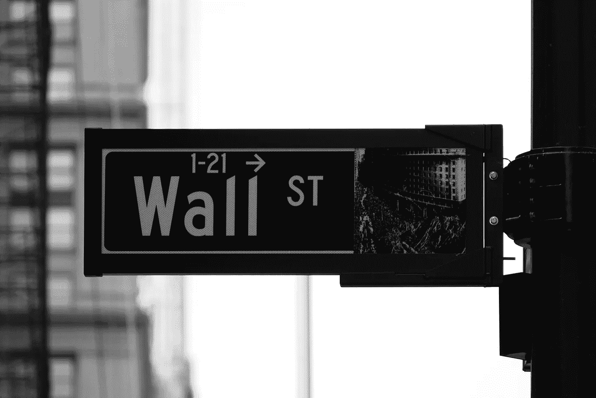
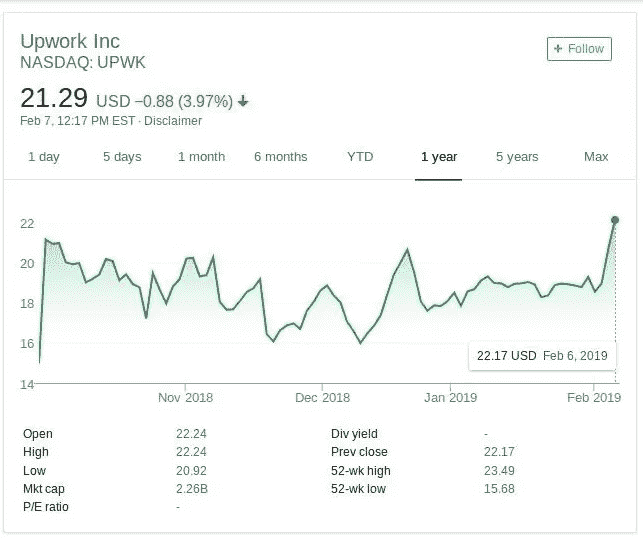
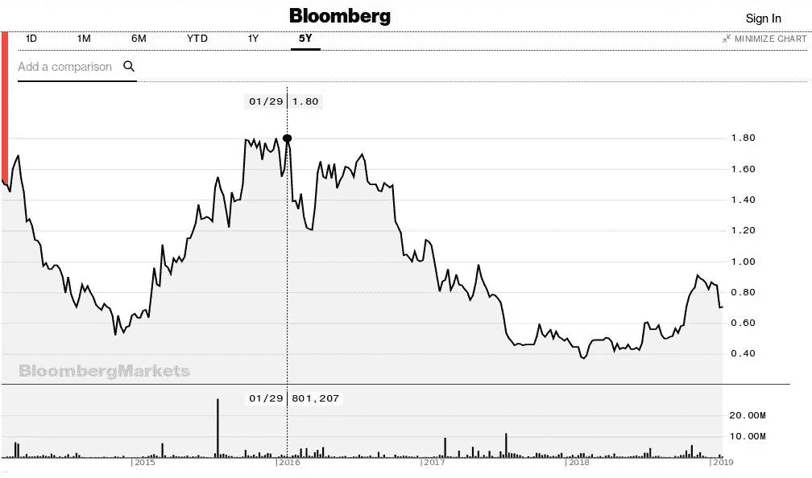

# 现在是投资 Upwork (UPWK)股票的好时机吗？

> 原文：<https://medium.com/hackernoon/is-now-a-good-time-to-invest-in-upwork-upwk-stocks-6e4c5e15d5bf>

Photo by [Rick Tap](https://unsplash.com/photos/uJhgEXPqSPk?utm_source=unsplash&utm_medium=referral&utm_content=creditCopyText) on [Unsplash](https://unsplash.com/search/photos/wall-street?utm_source=unsplash&utm_medium=referral&utm_content=creditCopyText)

对于投资者和自由职业者来说，这都是一个合理的问题。

当你考察 Upwork 在纳斯达克的表现时，你会看到一种被称为“股市过山车”的现象。如果这能让你感到安慰的话，这是华尔街的一种“自然”现象。股票价格一直上下波动。默认情况下，它们会波动。

NASDAQ: UPWK

现在，问题是如果这些波动失控。所以，你最终会在高价和低价之间产生巨大的差异。如果你是一个已经拥有 Upwork 股票或计划在某个时候购买这些股票的投资者，这些涨跌可能对你的健康不利。不幸的是，你对此无能为力，是吗？

Upwork 并不是第一个上市的自由职业平台。自由职业者网络公司已经在这个股市过山车上坐了几年了。有传言称，Fiverr 也计划申请 IPO。

**所以，长话短说，如果你想了解更多关于 Upwork 的纳斯达克未来，你应该看看自由职业者的 ASX 过去。**

Bloomberg FLN:AU

自 2016 年以来，自由职业者的股价一直试图恢复，但几乎没有成功。

这是许多拥有独角兽梦想的科技公司的问题。在一家公司上市之初，你会情不自禁地被炒作所迷惑。所以，你带着对未来利润的可疑承诺，冲动地购买了股票。很快，你就会意识到事情已经被夸大到任何合理的程度。在一家公司公开上市一年后，真实的市场价格会“稳定”下来。

**早期投资者是遭受损失最大的人。**

我的建议是再等一会儿。你应该至少等六个月再进行投资。

很明显，股票价格的波动意味着很多钱。如果你今天或一周后买入上涨股，情况肯定不一样。你不必是华尔街大师，也能自己得出这个结论。

我个人的观点是，自由职业者的平台不适合这些过山车。

这是我相对较新的自由职业平台 goLance 永远不会上市的主要原因之一，至少只要我是它的所有者。

所以，再等几个月吧。否则，恐怕你会后悔的。

*关注我的* [*LinkedIn*](https://www.linkedin.com/in/michaelabrooks/) *和* [*Quora*](https://www.quora.com/profile/Michael-Brooks-94) *来了解更多自由职业者和企业家可以互相帮助和学习的方式。*