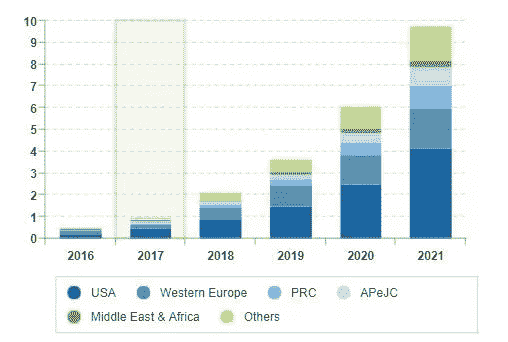

# 区块链投资的广泛指南

> 原文：<https://medium.com/hackernoon/is-now-the-best-time-to-invest-in-blockchain-business-raising-millions-in-seconds-9fe4a4cb204f>

数字货币已经席卷全球！我们正处在一场描绘了权力下放前景的革命中。一旦投资者和交易员理解了数字货币背后的技术是如何工作的，金融的未来就在眼前。此外，市场上有超过 2000 种加密货币。

***目录***

1.  **简介 **
2.  ***投资区块链前的潜在风险***

*2.1。如何在没有加密货币的情况下投资区块链？*

*2.2。你如何用加密货币投资区块链科技？*

*2.2.1 投资区块链时加密货币的重要性*

*2.3 现在是投资的好时机吗？加密货币会对我的业务产生重大影响吗？*

***3。为什么要投资区块链最好的创业公司来获取利润？***

*3.1。那么，投资什么样的区块链科技公司呢？*

***4。*结论**

**1。简介**

我们进行的几乎每一笔交易都是由中间人管理的。如果你用借记卡在商店买东西，你实际上是依靠银行来完成交易。如果你想发送消息，你依赖于网络或消息提供者。

在最简单的层面上，区块链是一个复杂的分布式数据库，由使用它的每个人控制，而不是像银行或支付处理器那样的一个中央机构。有了区块链，就没有这样的入侵者可以监控你所有的交易了！

让我们马上开始用区块链推动您的业务吧！！

**2。投资区块链前的潜在风险**

值得注意的一个有趣事实是，2020 年**区块链技术的预计市场价值似乎约为 600 亿美元！！此外，预计区块链在 2024 年的全球市场价值将达到 2000 万美元！**

不管怎么说，在把你的钱投资到区块链之前，你需要知道相关的潜在风险！

**安全**

数据隐私法正在改变，以赶上共享用户数据的技术。除了安全还有什么至关重要的因素吗？虽然在传统的信息系统中很难同时实现安全性和隐私性，但区块链可以通过“公钥基础设施”实现机密性，防止恶意更改数据的企图，并保持分类帐的大小。网络越大越多，相信越安全！

对区块链的其他担忧包括可扩展性有限、数据隐私不足以及缺乏统一的行业标准！

例如，即使使用区块链中的加密技术，交易也可以在整个网络节点中看到。

**可扩展性**

在分布式分类帐协议中，每个节点存储和处理交易，并维护帐户余额、合同、存储等整个状态的副本！运行一个完整的节点允许用户拥有隐私和安全，但随着事务数量的增加，这很麻烦，使可伸缩性变得困难！

如果开发人员增加块的大小来容纳更多的事务，那么需要存储的数据量也会增加！因此，当每个节点达到容量时，只有少数区块链软件公司将有资源运行它们，这将集中化和可扩展性置于矛盾之中。

**隐私**

为了解决隐私问题，区块链运营商可能会将个人数据和对该数据的引用与信息散列一起离线存储，这是将数据信息转换为不可读信息的一种方式。

此外，存储外链数据会降低透明度和不变性，并增加个人信息在其他网络上传播时丢失或被盗的风险。

**密码劫持**

黑客已经找到了充分利用加密挖掘过程的可能方法，其中包括通过您的网络浏览器接管智能手机的处理能力来挖掘数字货币。一旦恶意软件被安装在设备上，黑客就可以获得前所未有的控制，迎接巨大的网络安全蠕虫！

那么，区块链的潜在利益是否大于风险呢？简而言之，是的，但只要处理和执行得当！

任何系统都有漏洞。在当今技术驱动的金融领域，监管和咨询公司需要促进创新，同时确保稳定、消费者保护和竞争。

这实际上意味着新数字服务的设计必须从一开始就将网络安全和数据隐私合规性结合起来。

嗯，考虑到所有这些潜在的风险，市场上有现成的区块链公司来克服所有这些问题！

因此，在投资前确保这些风险！如果你打算投资，可以通过几种方式:

*   投资没有加密货币的区块链。
*   用加密货币投资区块链。

让我们更深入地了解更多的东西！

**2.1。如何在没有加密货币的情况下投资区块链？**

**没有加密货币的区块链有意义吗？**这是一个值得问的问题！你可能知道货运跟踪，这是区块链在运输和物流领域的一个应用。智能合约是另一个例子，因为区块链有基本代码，可编程，当某些事件被散列到链上时会自动执行动作。

也可以使用区块链代币进行支付，而不是处理浮动的加密货币，这些货币的价值固定为美元。令牌控制交易，并根据智能合约的条款在上执行。一旦触发事件发生，价值从付款人转移到收款人。这些资金由一家价值为美元的银行担保。

区块链分类账用于记录交易活动、历史以及结算过程中即时转换的 tokes。代币具有价值，可以转让。这意味着提供结算服务的银行可以交易具有有限价值的代码。其价值基于令牌在其整个生命周期中预期产生的现金流。

现在不用加密货币就可以投资区块链技术了！

**区块链财团**

区块链联盟或开源项目中的组织。这里的两个主要角色是:

**总账 **

Hyperledger 由 Linux 基金会于 2016 年创立，是一个开源的协作效应，旨在推进跨行业的区块链技术。他们与 30 多家不同领域的创始公司进行全球合作。

Hyperledger 会员分为高级会员、普通会员和准会员。高级会员包括英特尔(纳斯达克股票代码:INTC)、IBM(纽约证券交易所股票代码:IBM)、百度(纳斯达克股票代码:BIDU)、美国运通(纽约证券交易所股票代码:AXP)、空中客车(环保局股票代码:AIR)和摩根大通(纽约证券交易所股票代码:JPM)

***【企业以太联盟(EEA)***

EEA 将企业、创业公司、学者和技术供应商与以太坊主题专家联系起来！

通过这些策略，人们可以在没有加密货币的情况下投资区块链。

还有其他方式包括:

*   库存过剩
*   万事达信用卡
*   国际商业机器公司
*   伊士曼·柯达
*   英伟达
*   现实股票纳斯达克 NexGen 经济交易所交易基金
*   放大转换数据共享 ETF
*   灰度比特币投资信托

**2.2 如何用加密货币投资区块链科技？**

coin gate er 的创始人 Marc Kenigsberg 说**“区块链就是技术。比特币仅仅是其潜力的第一个主流体现。”**区块链的足迹遍布每一个领域， **69%的银行正在尝试获得许可的区块链**2017 年亚洲科技展。

毫无疑问，这将是一个伟大的战略，如果你正在寻找无缝利润。此外，区块链由于其作为比特币底层技术的作用而受到欢迎。

现在来谈谈你的问题，如何在区块链投资赚钱，有很多相关的方法。

想用区块链赚钱，可以按照下面的巷道走！

**投资最佳区块链公司**

雇用完美的人可以为你提供出色的业务。如果您需要同样的建议，我们将在接下来的章节中讨论

**投资众筹平台**

处于起步阶段的区块链初创公司通常会寻找众筹策略来起步。如果你听说过一个名为 BnkToTheFuture 的平台，它可能会允许投资者将他们的资金投入到几家比特币和区块链初创公司中。

**首次发行硬币**

区块链公司通过首次发行硬币发行加密货币或其他代币来筹集资本。

那么，我可以投资的热门加密货币有哪些呢？

在计划投资加密货币时，有几种途径可以选择，但其中一些肯定会帮助你提升交易。

*   比特币
*   以太坊
*   利特科伊
*   涟漪
*   ZCash

比特币涨价已经在统治世界。**随着美元飙升至 5239.55**，现在是投资者进行交易的最佳时机！然而，如果你下定决心选择其他人，那么你可以！！

**2.2.1。投资区块链时加密货币的重要性**

以下是选择加密货币和区块链技术投资将为您的交易带来利润的最佳理由！

***分散支付系统***

与高端隐私相关的分散系统可能是投资的潜在因素。

由于道路上没有中间人或入侵者，您完全有责任立即监控或跟踪付款！此外，保持了透明度。

***防骗***

创建加密货币时，所有确认的交易都存储在公共账本中。硬币所有者的所有身份都被加密，以确保记录保存的合法性。由于货币是去中心化的，你完全拥有它。

***技术上的无缝发展***

我们已经知道比特币处于波动状态，这同样适用于这项技术。如果你寻找投资区块链科技的最佳公司，可能的成功因素是背后的开发商！

随着每次技术的更新，每一个增强的功能都被添加到网络上。

***比特币稀缺但需求高***

由于比特币是全球最受欢迎的加密货币，市场需求非常高！但是一个非常棘手的问题是，只有 2100 万枚比特币，其中 1700 万枚已经被开采。所以我们只剩下 400 万，比预期刷新得快。因此，投资比特币是明智的。

***高采用率***

与其他加密货币相比，比特币的采用率高居榜首。原因是它建立了信誉。如果你看看电子商务的支柱，如苹果，亚马逊，他们已经选择了区块链技术！

这将是聘请区块链公司投资的绝佳时机，因为已经有一批初创公司是区块链技术提供商的大师！

现在是投资的好时机吗？加密货币会对我的业务产生重大影响吗？

随着比特币价格上涨，投资者在投资区块链技术方面陷入两难境地。这里有几个原因，为什么投资区块链可能是更好的方式！

国际数据公司(IDC)有很多关于区块链行业和使用区块链技术的公司的信息。IDC 是营销情报、电信、咨询服务等方面的主要提供商。

在这里你可以找到 2006 年**到 2021 年**的合并数据。

据 IDC 预测，2021 年全球区块链预计将达到 97 亿美元，而 2017 年为 9.45 亿美元！

补充说，这背后有许多至关重要的原因:

*   高投资回报率
*   增长潜力增强
*   自负的权利

还有更多！

因此，你可以估计未来几年这种谈论技术的重要性。从区块链创业公司到企业，企业将快速发展！

**3。为什么要投资区块链最好的创业公司来获取利润？**

区块链已经带来了功能丰富的好处，选择正确的人和 [*区块链开发公司*](https://www.zabtechnologies.net/blockchain-developers) 可以帮助你达到更高的高度！

好吧，说到如何投资区块链科技的问题，购买比特币的难度取决于你的国家。发达国家有更多的选择和流动性。

即使区块链可以说是目前新兴的技术之一，你认为雇佣区块链公司可以成为盈利的替代方式吗？如果是的话，很难找到拥有合适的人员和技能的理想公司。由于加密货币的概念有些新，所以在招聘时需要一个重要的人物！

在挑选区块链公司名单时，寻找他们的高端专业知识、从事的类似产品、客户的推荐、团队和更多因素。选择开发区块链的公司可以帮助你获得一系列好处，如降低成本、技术更新、利润等！！

**3.1** 。**那么，区块链的科技公司应该投资什么呢？**

谷歌已经提出了一大堆关于如何投资区块链 2020 的问题。谁是最好的供应商？还有更多！！这背后的原因是区块链开发中所做的增强！

雇佣区块链公司不仅能带来利润，还能增强信任。如果你寻找 2019 年投资的最佳[区块链发展公司](https://www.zabtechnologies.net/blockchain-developers)，有太多的初创公司已经揭示了加密领域的潜在挑战和前景。

如果您有任何建议或疑问，我们随时可以帮助您完成工作！！凭借我们的高端专业知识，您可以 [**雇用区块链开发人员**](https://www.zabtechnologies.net/blockchain-developers) ，因为我们已经向全球客户交付了定制应用！！

**4。结论**

进一步来说，区块链的发展有可能改变所有的运作方式，特别是操作候选人和来源的验证方式。区块链带来了不可撤销证据的概念，以及证明某件事情在确切发生时发生的能力。

这将是进入密码行业的绝佳时机！！

希望你喜欢这篇文章！！

请留下您的意见和反馈，以便我们改进！！

谢谢:)