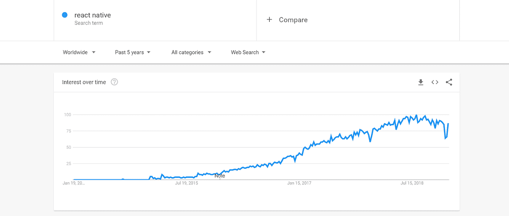

# React Native 值得用吗？

> 原文：<https://medium.com/hackernoon/is-react-native-worth-using-fc69f98b6683>

React Native 提供了一个为 IOS 和 Android 构建跨平台应用的机会。这就产生了一个想法，你可以开发一个可以在两个平台上运行的应用，这样你就可以降低两倍的成本。然而，围绕这个框架有很多误解，你应该知道的第一件事是——它不是所有应用程序的完美选择。让我们深入主题，了解这项技术的优缺点，以及使用 React Native 是否值得。

# 对 React Native 的兴趣正在增加

React Native 是由脸书在 2015 年开发的，从那时起，人们对该框架的兴趣迅速增长:

这并不令人惊讶，因为当企业考虑构建一个应用程序时，他们会立即选择 React Native，因为它具有吸引人的特性。

# React Native 的优点

React Native 的创建是为了让公司有机会更快地构建产品，更容易地扩展并降低开发成本。由于这些特性，某些类型的应用程序实现了这一点:

*   **开发过程更快。**这是 React Native 的一个超能力。“热重新加载”功能使开发人员能够在几秒钟内看到代码中所做的更改，而不是像使用原生技术那样需要几分钟。
*   **跨平台代码共享。**根据应用的复杂程度，多达 80%的代码库可以跨平台共享。但是要记住，React Native 使用平台的原生组件，这些组件用得越多，可以共享的代码就越少。
*   **借助代码推送等工具缩短部署时间**，将变更直接推送到用户界面。
*   **优于混合应用。**还有像科尔多瓦、爱奥尼亚等混合技术。，但是 React 原生框架不是那样的。它工作在所谓的 WebView 上，WebView 是一系列放在移动应用程序中的网络组件。该解决方案不允许使用原生 UI 以及通过 API 可用的一些移动设备功能。相反，[开发者](https://hackernoon.com/features-and-benefits-of-a-dedicated-software-development-team-model-2016fdef33d8)可以使用相当多的 API 和原生接口组件。

# 与原生技术相比，反应原生的缺点

不管所有的优势，React Native 有一些弱点，在开发过程中会非常痛苦:

*   **反正有原生代码。**尽管 React Native 不断开发，但它并没有现成的组件来提供对 Android 或 iOS APIs 的访问。要使用相机或加速度计等功能，你必须使用原生组件，因此 Android 和 IOS 将有单独的代码。是的，您可以使用第三方库，但它们还没有涵盖所有本机功能。
    此外，必须开发所谓的“桥梁”来链接 JavaScript 组件和本地组件，这严重增加了软件开发时间。所有这些导致雇佣 3 个开发人员而不是 2 个，增加了开发时间和成本而不是减少。
*   **性能。**使用上述第三方库和桥降低了移动应用程序的性能。此外，智能手机内存和处理器使用原生组件，也影响性能。
*   **更长时间的调试**。还有发展方面的问题。正如开发人员所提到的，React Native 提高了开发速度，但也增加了调试过程的持续时间，尤其是在 Android 上。
*   **不开源**。React Native 由脸书开发并归其所有。这一事实带来了一些风险。脸书可以停止对 React Native 的支持和发展，谁也无能为力。此外，他们会因为某些原因拒绝你在你的项目中使用他们的框架。
    在开源的情况下，技术是由社区开发的，而不是由一只手控制的。

[http://bit.ly/relevant-software](http://bit.ly/relevant-software)

# 何时使用 React Native

## 在短期博弈中

得益于 Android 和 IOS 平台的开发速度和共享代码，React Native 广受欢迎。许多公司在小型应用程序中利用它，比如用于促销活动的应用程序。没有复杂的代码或功能，应用程序不会存在很长时间，所以没有必要担心未来的支持和规模。

## 将网站转换为应用程序

React 在 JavaScript 和网站上的原生作品使用相同的技术。这就是为什么，如果您需要创建一个简单的应用程序来显示来自您的网站的数据(如博客或统计数据)，您可以很容易地使用 React Native。[雇佣 React.js 开发者](https://relevant.software)将减少开发的成本和时间。

# 何时不使用 React Native

## 在单平台应用上

React Native 是为了优化跨平台开发而开发的。如果要开发单平台应用，最好使用 Java 或 Swift 之类的原生代码。

## 在长期项目中

如果你计划[开发](https://relevant.software)一个强大、复杂和长期的产品，React Native 将是一个有风险的选择。你可以借鉴 Airbnb 的[经验，不要重蹈覆辙。
开发原生应用程序会让你对未来充满信心，并避免从零开始重建整个产品的损失。](/airbnb-engineering/react-native-at-airbnb-f95aa460be1c)

# 规划复杂功能时

如果您打算使用以下功能:

*   QR 码扫描
*   OCR(光学字符识别)从图像中读取信息并在以后使用
*   AR(增强现实)或 VR(虚拟现实)
*   语音助手

只有本机应用程序可以支持这些功能。此外，如果将来有新的很酷的特性发布，你需要等到它被 React Native 支持。

# 包扎

那么，React Native 真的降低成本了吗？这取决于项目的类型和规模。如前所述，React Native 在小而简单的应用程序中非常有用。

> 如果您仍然不确定是否在您的产品上使用 React Native，请填写免费的[咨询相关的](https://relevant.software/contact-us)软件开发公司。我们将帮助您选择满足您需求的最佳解决方案。