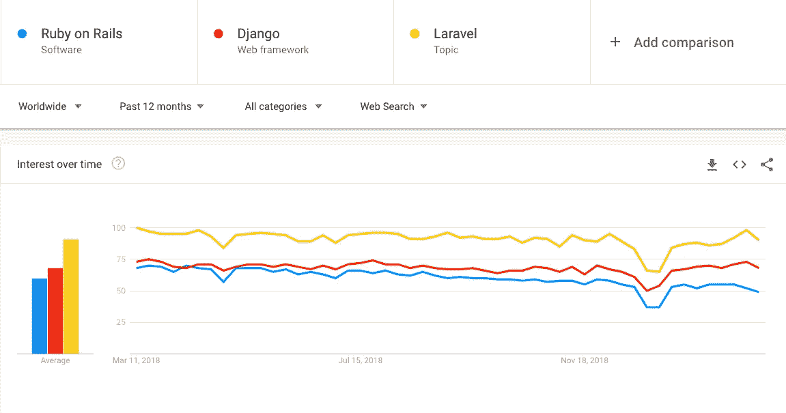

# 2019 年 Ruby on rails 死了吗？

> 原文：<https://medium.com/hackernoon/is-ruby-on-rails-dead-in-2019-b462e9a65b22>

Photo by [Christina Morillo](https://www.pexels.com/@divinetechygirl) on [Pexels.com](http://www.pexels.com)

**Ruby on Rails 编年史**

[Ruby](https://en.wikipedia.org/wiki/Ruby_(programming_language)) 由日本的 Yukihiro“Matz”Matsumoto 于 1995 年发明并发布(Ruby 0.95)，和任何语言一样，它的化身也经历了几次变化，最新版本是 2.6.1。

[Rails](https://en.wikipedia.org/wiki/Ruby_on_Rails) 于 2003 年由 David Heinemeier Hansson 创建，当时他正在为 37signals 开发项目管理工具 Basecamp 的代码库。David 提取了 Ruby on Rails (RoR)并于 2004 年 7 月将其作为开源代码正式发布。RoR 没有自己的语言，但却是一个红宝石宝库。与 Ruby 类似，最新的版本是 RoR 5.2.2。

**为什么选择 Ruby on Rails？**

Ruby on Rails 是初创企业生态系统中的巨头和高价值技能之一。Rails 框架基于 [*约定优于*](http://en.wikipedia.org/wiki/Convention_over_configuration) 配置的原则。

Ruby on Rails 的一些优秀品质据 **Tanmaya Gupta，Github:**[**vibhor 94**](https://github.com/VIBHOR94)

*   易于入门 Rails 给你的主要优势之一是它有很好的文档。你可以从盒子里得到很多东西。rails 社区为您提供了许多精彩而丰富的宝石，让您的工作变得如此简单，以至于对开发人员来说感觉就像是魔术一样。一些流行的 gem 是——device(身份验证)、CanCanCan(授权)、Sidekiq(后台作业)、Rspec(测试工具)等。

*约定优于配置原则 Rails 最基本的概念就是使用约定优于配置。它明确指出，如果 rails 社区有规定的做事方式，那么就严格使用它。这很有帮助，因为开发者之间的差异通过使事情尽可能快和顺利地工作而减少了。同样，它帮助你长期维护代码*。

Rails 是开发人员友好的

*   **MVC 架构** —模型、视图和控制器模式对于 web 应用来说是一种非常常见且广泛使用的架构。开发人员即使以前有过使用 MVC 模式的其他 web 框架的经验，也会很容易使用 Rails。MVC 模式有助于分离不同关注点的代码，即数据层、表示层和处理资源层。
*   **Active Record** —一个强大而健壮的库，它帮助开发人员以一种非常简单的方式编写数据库交互查询，就像开发人员自己在用 Ruby 编写一样。它自动将您的 Ruby 代码转换为 SQL 查询，获取结果并将其作为对象返回。rails 开发人员很少使用直接的 SQL 查询来获得某些结果，因为活动记录库完成了大部分任务。
*   **简单的测试工具** — Rails 也提供了像 RSpec 这样的单元测试宝石，它本身非常容易上手。它是普通的 Ruby，你可以用它来检查你的应用程序中使用的函数，方法是独立地调用它们。它有助于您自信地展示您的应用程序，因为一切都已经过适当的测试。
*   **自动化部署**——有一些库可以帮助你用最少的努力和时间让你的代码投入生产。这是一次性的设置，您所做的每一项更改都可以通过一行命令部署到生产环境中。有很好的文档和教程可以帮助你毫不费力地设置你的项目，即使你以前没有部署的经验。
*   **一种简单的编程语言**:首先，Ruby on Rails[的一个优点在于 Ruby](http://rubyonrails.org/)[语言本身。语法简单，简洁，接近英语，非常灵活。对于有经验的开发人员来说，Ruby 独一无二地开辟了元编程的道路(编写代码以便服务自动生成其他代码的行为)。从智力上来说，用这种语言构建一个人的思维和编写代码是一种乐趣。](http://www.ruby-lang.org/)
*   **灵活性**:任何开发都需要像数据库、前端和后端这样的元素。事实上，融合和组织所有元素是 Rails 的一大优势。

> Ruby on Rails 仍然受到追捧的原因之一是，它有助于初创公司更快地将产品推向市场，因为它减少了开发时间。

*   **开发原则:** Ruby on Rails 将最佳实践吸收到框架中。这使得开发周期和测试的每个阶段都可以分散时间。这使得在进入下一个阶段之前能够进行微调，交付一个更好的应用程序，具有更少的缺陷和错误。
*   **开源**:除了上面列出的所有好处，Ruby on Rails 最好的一点就是它是开源的。软件许可成本可能非常昂贵，能够使用像 Ruby on Rails 一样好的开源解决方案是初创公司节省成本的一个好方法。
*   社区:Ruby on Rails 是程序员使用的最流行的开源编程平台之一，它有一个非常大和活跃的在线社区。通过众多的 Ruby on Rails 专用网站、聊天室和论坛，您可以从已经经历过您的问题并解决了它的人那里获得即时的答案。( [ruby-lang](https://www.ruby-lang.org/en/community/) 、 [deccanruby](https://www.deccanrubyconf.org/menu) 、[Bangalore-Ruby-Users-Group](https://www.meetup.com/Bangalore-Ruby-Users-Group/))

***如今拥有如此超越同行的优势，为什么 Ruby on Rails 现在被认为奄奄一息？***

事实是 Ruby 还在这里，它不会消亡，而是会成熟，这与其他编程语言的模式相似。人们不能忘记这样一个事实:编程语言是解决特定问题的工具，没有最好的编程语言。

Google trends: Comparison of Ruby with its contemporaries

当项目变大时，编程自由人对 Ruby 扩展应用程序的能力提出了质疑。“通过转向更面向服务的架构并隔离系统中的瓶颈，Ruby 仍然可以成为项目的核心”。- ***哈曼索汉帕尔(Github:*** [**索汉帕尔**](https://github.com/sohanpalh) **)**

> 凭借其简单直观的代码，Ruby 简化了软件开发并节省了时间:平均而言，使用 Ruby on Rails 的开发人员构建应用程序的速度比使用其他技术的团队快 30-40%。福布斯

同事们对 RoR 为什么会留在这里的看法，

**Vinoth，(Github:**[**avi noth**](https://github.com/avinoth/)**)**:在其他框架中工作过，我有信心 RoR 会留下来。几乎没有其他语言/框架有工具可以让 RoR 快速启动并运行一个基本的应用程序。

RoR 是建立在 Ruby 之上的框架。这种语言和框架都旨在对程序员友好。
*同类最佳工具
*吸收到框架中的最佳实践
*已经有很多资源可供初学者使用

活跃社区:我订阅了 [rubyweekly](https://rubyweekly.com/) &潜伏在 [reddit](https://www.reddit.com/r/ruby) 和 [Reddit](https://www.reddit.com/r/rails) 周围

由于 Airbnb、GitHub、Hulu 等绝大多数大型初创公司仍在使用 Ruby 作为核心。认为 RoR 会随着时间的推移而消失，不会成为编程语言的刚玉是一种短视的观点。

 [## 雇佣 Ruby 开发者|美国印度 Ruby on Rails 公司

### Railsfactory 是一家 Ruby on Rails 开发公司，在过去 12 年多的时间里为许多初创企业和企业提供服务

railsfactory.com](https://railsfactory.com/) 

鲁比万岁！