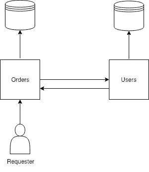
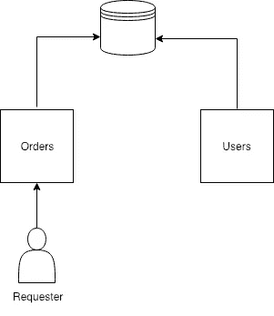

# 微服务中的共享数据库实际上是反模式吗？

> 原文：<https://medium.com/hackernoon/is-shared-database-in-microservices-actually-anti-pattern-8cc2536adfe4>

我曾经参与过几个利用微服务理念的项目。一直存在的一个问题(除了部署，但是有足够的 DevOps 资源，这个问题基本上是可以解决的)是关注点的分离。

如果你看看关于微服务架构的书籍、博客帖子和推文(已经有几百万了)，你会发现每个人都声明了几乎相同的想法——微服务必须是独立的。这完全说得通。但是在文字上。

实际上，如果你想构建精确的微服务，而不仅仅是带有一些辅助服务的整体，你必须考虑拆分你的业务领域。在这里你不太可能找到任何好的建议。首先，在许多情况下，这是无法完全解决的，其次，在与项目经理会面后，你的业务领域将会改变，打破所有现有的架构。你可能知道经理们对重构的态度。

所以人们通常所做的，最终都是妥协。好吧，我们的服务会有点耦合，但是我们有我们的交叉服务 API，为什么不利用它呢。

# 应用程序接口

让我们考虑一下经典的例子，我们有两个服务:用户和订单。我们决定遵循*信息隐藏*模式，其中每个服务封装自己的数据库(或者是数据库的一部分)。

显然，我们的*订单*服务需要来自*用户* one 的一些信息。例如，我们有 API 端点*报告*，它给出了某一天用户所有订单的扩展信息。在报告中，我们需要用户的名字，姓氏和联系人。这样的端点是关注点分离的一个很好的例子。我们需要两个微服务的数据。但是没有回头路，服务是分的，有任务，需要做。我们有哪些选择？

## 同步 API

一般都是 HTTP。大多数情况下是 REST，但可以是任何基于 HTTP 的 API 框架，比如 GraphQL、OData 甚至 gRPC。所以流程非常简单，*订单*服务从数据库中获取数据，它可以访问数据库。然后，它向用户服务发送请求，以获取缺失的用户信息。

因此，在*订单*服务从*用户*服务获得数据之前，我们的请求者不会获得响应。如果*用户*失败，*订单*也失败。

这就是同步 API 的问题，是直接依赖。

## 异步 API

因此，我们可以将 API 改为异步传输，例如流。

但现在唯一的区别是，我们不会收到任何来自用户服务的响应，而不是立即失败。因此，请求者可能会以超时结束。

# 为什么我们要分割数据库

我们分开访问数据的原因是旧的好的**封装**。我们降低了一些奇怪的服务对数据进行意外修改的风险。这就是为什么我们在 OOP 中将类变量私有，并使用容器来运行我们的服务。问题是数据不属于我们微服务。它属于数据库，是完全不同的服务。用用户微服务封装数据库数据，我们基本上把它作为数据库的**代理**。当然，也有服务对数据进行充分转换的情况，但在这种情况下，它已经是新数据，属于该微服务。这样的数据肯定可以通过服务 API 请求。

但是当我们的服务只是一个数据库的 CRUD 接口时，我们做了大量额外的工作，增加了复杂性和网络负载(因此我们看到有人试图使用像**服务网格**这样的技术来解决这个问题),只是因为我们想要遵循规则。

# 有什么解决办法？

所以让我们暂时抛开偏见，建立一个共享的数据库。

除了偏见，我们还消除了额外的 API、网络负载(可以通过一次查询从数据库中连接和检索数据)以及应用程序的充分改进的性能。

但是当然也有新的问题:

1.  订单服务必须知道用户服务表
2.  *用户*可以改变其表的模式
3.  *订单*服务可以写给用户并修改它的数据
4.  我们必须为两种微服务使用一个数据库

看起来我们又一次打破了关注点的分离。但是让我们考虑所有的问题。

1.  是的， *Orders* 基本上必须知道所有的表和数据库模式。但是在信息隐藏设计的情况下，服务必须知道 API 方法，这仍然是同类的额外知识。
2.  改变模式是一个真正的问题。但是基本上改变 DB 模式和服务 API 没有太大区别。在这两种情况下，你可以使它向后兼容，在这两种情况下，你可以打破一切。所以这纯粹是纪律问题。当然，你的服务团队分离得越多，那么你可能应该更多地转向 API 的方向。
3.  是的，默认情况下，我们的 *Orders* 服务可以修改数据库中的所有表。但是如果您的数据库允许，您可以利用 DB ACL 来实现这一点。大多数主流数据库都支持表级 ACL。因此，您可以像对待私有变量和方法一样避免意外修改的风险。
4.  是的，你必须使用一个数据库。但是我们只考虑拆分业务域的情况。如果您的服务需要一种特殊类型的数据库，那么使用 API 与它通信无疑是一个很好的例子。

此外，开发人员达成了共识(如果可能的话),在最开始你可能不需要微服务。从 monolith 开始，看看你将来是否真的需要它们。

因此，当您这样做时，更容易保持共享数据库，只需为每个微服务创建单独的用户以限制数据访问。

我希望这是有用的，我真的很感谢任何关于您的经验的反馈。

在 [Twitter](http://twitter.com/@raxpost) 中找到我