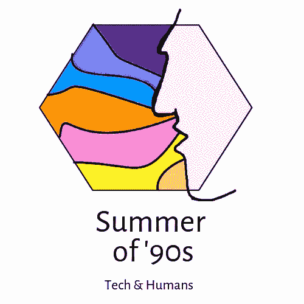

# 你的意见真的是你的吗？

> 原文：<https://medium.com/hackernoon/is-your-opinion-really-yours-64a44ff29d6b>

还记得你毕业的学校或者现在所在的学校吗？这么多不同种类的人:一些疯狂的，一些知识分子，一些愚蠢的，怪异的，一些好奇的，一些令人毛骨悚然的。这里充满了各种各样的人，他们有着不同的观点、言论和想法。

事实上，这是任何大学最有价值的方面之一。最好的大学聘用了来自不同背景的优秀人才，相互讨论成为他们学习的重要组成部分。这就是这种曝光如此重要的主要原因。

> 你走在一个充满不同观点的房间里，刺激脑电波和思维列车，让你质疑你的信念集，学习和成长。

真正的学习就是这样发生的。这就是为什么每天花六个小时和 T2 人在一起很重要。现在，让我们把这与我们在数字社交媒体上的经历联系起来。

假设你的社交媒体是你每次登录时进入的一个房间。环顾四周，观察你的饲料，你找到什么样的信息？有多少是质疑你现有的信仰体系，又有多少是重新建立你已经知道的事实？

花点时间注意一下。有规律吗？确实有。

你，我的朋友，被困在我们所谓的“过滤泡沫”中。对于那些已经知道它的人，请随意跳过这里的几行。

Your “personalized” news feed, your world

# 过滤气泡

名词:**滤镜泡泡**；复数名词:**过滤气泡**

> 一种情况，其中互联网用户只遇到符合并加强他们自己信念的信息和观点，这是由个性化个人在线体验的算法引起的。
> 
> *“网络的个性化可能会逐渐将个人用户隔离到他们自己的过滤气泡中”*

为了给你提供更多“相关”和“个性化”的内容，网站的新闻提要会显示你感兴趣的内容和你喜欢的内容。将它映射回我们开始的教室例子，这意味着，除去所有与你意见不同的人，只有那些你喜欢或同意的人被允许留在教室里。

所以讨论变成了对现存信仰和观点的再次确认，所有的都在房间里回响。想象一下，由于算法在起作用，你碰巧错过了各种各样的思维列车。花几个小时在这上面不会让你变得聪明，反而会让你成为一个对某个观点高度两极分化的人，当任何矛盾的观点出现时，你宁愿表现得沉默或被冒犯。在频道上发表长篇评论捍卫自己的观点，听起来很熟悉吧？这就把人们分成了一群极端的团体，他们坚信自己的观点。为什么他们如此坚信？让我们再深入一点。

你是如何开始学习的，或者说人类的大脑一般是如何学习的？当我们开始学习任何东西时，都会有很多确认偏见。如果我们不断地以不同的方式或形式获得相同的信息，解析成相同的意思，我们开始相信它是真的。这有点类似于强化学习如何与机器一起工作。

当我们使用社交媒体时，这类事情就会发生。我们会说一个帖子说“**橙子是酸的**”，另一天我们会看到其他人评论其他人的帖子，“**如果你想尝点酸的，就去买些橙子**”，还有一天我们看到有人给一个讨厌酸味的人贴上标签，评论“**不要尝橙子**”。三次这样的相互作用，我们的头脑就会把它当作“橘子是酸的”这一事实来购买。我们不断地寻求对已知事物的确认和保证，这就是它们如何转化为信念的。我们得到的保证越多，我们的信念就越坚定。

所以你看到这里的问题了，嗯？社交媒体可以非常容易地植入甚至不是我们自己的信念，通过显示冗余的帖子，以不同的方式证实我们的第一印象，因为这是我们唯一看到的东西，我们的媒体从未向我们显示过“橙子是甜的”的帖子，这一事实在我们的“世界”中不存在。我们只知道一件事，橘子是酸的，任何说不酸的人要么是愚蠢的，要么需要纠正。

现在，这更是一个问题，尤其是政治问题，因为社交媒体在很大程度上已经取代了我们的本地新闻、报纸和其他媒体，这些媒体是真实的，用来为我们提供不同的观点。

除了在思想上造成两极分化，它的另一个可悲的方面是在我们的思想中引入了“同质性”。人们思想的独创性确实值得怀疑。我们已经变成了嘴巴不同，但说着同样的事情，谈论着同样的内容的人。这只是一群分成不同派别的人找到了一个相关的迷因(双关语)。我们的想法变得很普通，我们在餐桌上谈论的事情最终都围绕着我们分享的迷因或我们最近看的网飞系列。

> 新的、原创的想法在哪里？思想和行动上的创造力在哪里？

病毒迷因如何影响我们的思维需要一个完全不同的博客帖子。但是，模因或任何在媒体上传播的东西不仅仅是一个笑话，它带来了一种观点、神话或事实，而是我们作为用户下意识接受的观点。它们是传播大量偏见和主义*-主义*的一种非常有效的方式，你在这里发现了哪一种？

This is no where true, a troll face makes it funny but not true

> 然而，当我们笑的时候，我们会下意识地记录下来并接受这个信念。不要让这些想法轻易进入你的大脑。在你消费或接受信息是真实的之前处理。在提出你的观点之前，先问自己，这真的是你所相信的吗？

> 因为有很多人想让你相信你不相信的东西，让你购买你不会购买的产品，让你选择一个你有意识不会选择的政治领袖。

> 这篇文章是在 90 年代夏天的概念下撰写的。
> 
> “90 年代的夏天”是一个有意识地分析我们对技术的使用，并传播对它带来的问题的认识的倡议，如数字隐私，安全，技术成瘾和设计道德。
> 
> 欢迎你加入我们的行列！
> 
> 在媒体上关注我们，在[脸书](https://www.facebook.com/summer.of.90s)或者在 Instagram 上关注[@ 90 年代的夏天，因为我们需要传播消息。](https://www.instagram.com/summer.of.90s/)

 [## 90 年代的夏天(@ summer . of . 90)* insta gram 照片和视频

### 查看 90 年代夏天的 Instagram 照片和视频(@ Summer . of . 90)

www.instagram.com](https://www.instagram.com/summer.of.90s/) 