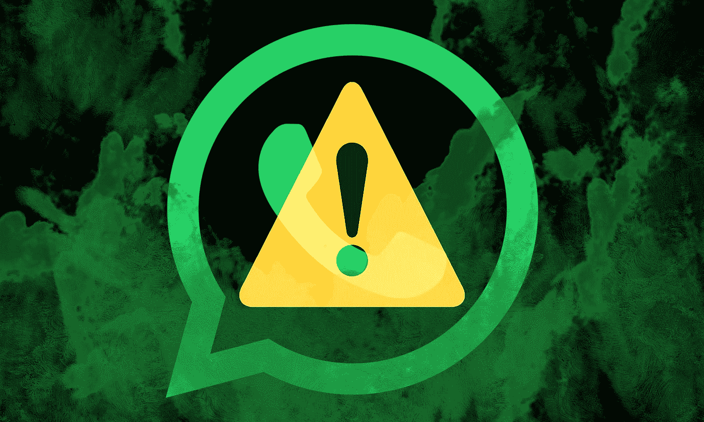
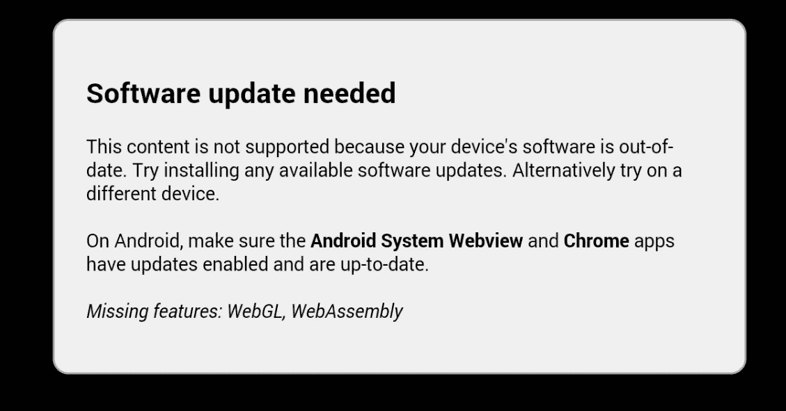

# 你的智能手机是黑客的中枢吗？

> 原文：<https://medium.com/hackernoon/is-your-smartphone-a-hackers-hub-9b987e54b8b6>

智能手机是您移动中的一切，从金融交易到专业通信再到娱乐——这就是智能手机成为黑客频繁攻击目标的原因，甚至超过了电脑。你的智能手机可能被黑客攻击，而你可能没有意识到。

安全研究人员正在目睹黑客行为的重大转变，以及他们在智能手机社区中不断演变的品味。当然，此时你的智能手机拥有更多关于你的信息，比你想象的要多。

在任何时候，你的手机都知道你在哪里，你可能在和谁通话，你所有的银行应用程序密码，你的电子邮件，你的个人照片等等。所有这些数据都集中在一个地方，这使得智能手机成了开发者的阿拉丁神灯。

Check Point 进行的一项研究得出结论:超过 100 万部智能手机受到影响。据推测，黑客已经获得了超过 130 万个谷歌账户的访问权限；包括个人文档、照片、电子邮件等等。

**你的智能手机有多脆弱**

Android 是世界上使用最多的操作系统，也是第二大操作系统，它需要大约 1200 万行代码来创建 Android 操作系统。这种复杂性甚至在多次检查后也给了漏洞通过的空间。这些漏洞可以被进一步利用来操纵你的智能手机和你存储的数据。

最近， [WhatsApp 发现了](https://www.theguardian.com/technology/2019/may/14/whatsapp-hack-have-i-been-affected-and-what-should-i-do)一个严重漏洞，让黑客在未经用户许可的情况下加载间谍软件。用户会收到来自未知来源的 WhatsApp 呼叫，无论用户是否接听，他们的电话都会被攻击者接管。他们安装间谍软件，绕过谷歌对所有应用程序的安全检查，并打开手机的摄像头或麦克风来进行我们的有害活动。

很多人喜欢定制；他们会下载第三方修改的应用程序，而不知道其中的危险。就像任何其他应用程序或官方应用程序一样，修改后的应用程序也需要特定的权限才能访问相机、位置、存储和其他内容。这意味着你可以把你的智能手机交给一个完全陌生的人，让他们访问他们想要的任何东西。

智能手机的另一个漏洞来自访问不安全的网站。今年 2 月初，黑客在不安全的网站上植入了恶意软件。恶意软件通过一段代码隐藏在图片中。PNG 格式。如果用户选择下载并打开文件，代码就会自动执行，从而让黑客无所不用其极。

Lookout 的研究员安德鲁·布雷克(Andrew Blaich)和 EFF 的网络安全主管伊娃·加尔佩林(Eva Galperin)一起展示了他们对一场针对智能手机的全球恶意软件运动的发现。[根据他们的研究](https://www.cnet.com/news/your-smartphones-are-getting-more-valuable-for-hackers/)，该恶意软件已经影响了 20 多个国家的数千名用户。攻击者使用官方的类似应用程序并安装它们，以智能手机社区为目标。一旦该应用程序被安装，它将获得手机的 root 访问权限，从而完全控制黑客。

Galperin 说，“进入某人的个人设备是非常私人的，就像进入他们的思想一样。”

**错过固件更新**

并非每部智能手机都会频繁更新。如果市场趋势说明了什么的话，超过 10 年的手机面临着更多的安全风险。安卓升级程序的可怕一面让数百万部智能手机面临网络攻击。此外，与最新的智能手机相比，老年智能手机用户更倾向于下载修改后的应用程序。固件的限制限制了新的趋势应用程序在早期的 android 版本上工作。一些原始设备制造商甚至削减了对他们最新智能手机的支持，即使是在谷歌全心全意支持之后。

尽管开发人员社区确实试图通过引入定制 ROM 和固件来提供帮助。这也不安全，因为设备需要根访问。

**如何保持安全**

**了解你的权利**——自从 GDPR 的出现，消费者权利得到了加强。用户现在可以要求删除他们的数据，如果他们觉得不安全的供应商与他们的个人信息。

**不要使用第三方应用** —建议不要加载正版以外的应用，因为它们可能包含恶意元素。您可能需要在定制或视觉方面做一些调整，但是您将拥有适当的安全性。

**永远不要点击可疑的广告或弹出窗口**——无论广告看起来多么诱人或诱人，都不要点击它。一些网站，如[博彩网站](https://whalebets.com)，变得容易受到恶意代理的攻击，因为他们没有适当的[网站维护](https://www.exai.com/blog/website-maintenance-services-costs)。维护不善的网站会隐藏有害的弹出窗口。通常，弹出窗口和广告都带有病毒代码，可以冻结整个系统，并欺骗用户安装恶意应用程序，这样做弊大于利。

**让您的固件保持最新** —更新固件或安全补丁不是用户自己可以完成的事情，滚动更新取决于智能手机制造商，所以一旦有固件更新的通知，就开始更新。你正在使用的应用程序也是如此。新版本带来了错误修复和应用程序中任何漏洞的桥梁，通过[更新](https://appsaraby.com/blog/%d8%aa%d8%ad%d8%af%d9%8a%d8%ab-google-chrome-%d9%84%d9%86%d8%b8%d8%a7%d9%85-%d8%a7%d9%84%d8%a3%d9%86%d8%af%d8%b1%d9%88%d9%8a%d8%af-%d9%8a%d8%b6%d9%8a%d9%81-%d9%85%d8%b2%d8%a7%d9%8a%d8%a7-%d8%ae%d8%b7/)，您可以最小化任何风险。

**避免打开不想要的电子邮件或信息**——即。PNG 恶意软件也通过电子邮件攻击人们。用户会收到一封带有图片附件的邮件，一旦用户打开它，代码就会执行并接管智能手机。

**硬重置** —如果有一天你在你的应用抽屉里发现了一个以前不存在的应用，并且你不记得安装过这样的应用，立即删除它。如果一天后该应用程序仍然存在，建立一个强大的防病毒软件，如 Malwarebytes，并对你的智能手机进行彻底扫描。如果问题仍然存在，请进行硬复位。

**使用好的虚拟专用网** —现在有很多虚拟专用网，但并不是所有的都提供适度的匿名。你可以研究一下，用付费计划下载 VPN，在网上冲浪而不必暴露你的个人信息。

**结论**

安全漏洞越来越严重，智能手机现在比以往任何时候都更危险。苏黎世保险集团和大西洋理事会的一个智囊团[报告](https://theweek.com/articles/730439/have-almost-certainly-been-hacked)网络产业将使全球经济增长 8 %,然而，安全和管理安全业务的支出将大大超过收益。

这份报告揭示了科技的阴暗面，让所有领域黯然失色。你可以始终保持警惕，远离危险，如果你选择从第三方下载应用程序，请从知名商店下载。