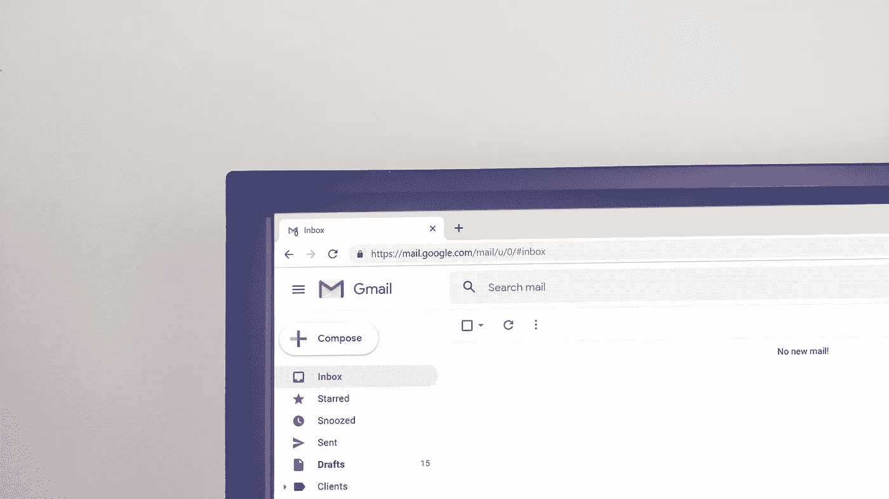

# 当我的助理搜索我的电子邮件时，我很紧张。所以我想出了一个解决办法。

> 原文：<https://medium.com/hackernoon/it-makes-me-nervous-when-my-assistant-searches-my-email-so-i-came-up-with-a-fix-251507da5dfb>

你的助理在偷看你的收件箱吗？我以前确实对此感到疑惑。

在典型的一周中，我经常需要团队中的一名助手来查找我的电子邮件帐户中的信息。

到目前为止，我有两个选择:

1.  我可以自己把它挖出来(这会占用我的时间)，或者
2.  我必须让那个人访问我的电子邮件账户(这让我很紧张)。

例如，我会让助理帮我从亚马逊购物。为此，助手需要登录我的亚马逊账户，但他们没有用户名和密码。因此助理发送了一个“密码重置”请求。

如何将密码重置链接返回到助手？

我必须自己把它发送给助理(又要花时间)，或者分享我的密码，让助理访问我的收件箱。我只是不太喜欢这个选择。我用一个主要的电子邮件地址处理工作和个人事务。让某人不受约束地访问我的收件箱只会让我紧张。

去年春天，我想出了总体思路，并开始着手解决问题。

通过构建我的另一个产品 [GMass](http://gmass.co) ，我已经成为了 Gmail API 的专家，所以我使用。NET 和 Gmail API 在后端，HTML 和 JavaScript 在前端。

我把它建成了一个标准的网络应用，与我最近选择的应用类型 Chrome extensions 不同。

几个月后，【SearchMyEmail.com】的诞生了！

基本想法是:它允许任何人(在许可的情况下)搜索你的 Gmail 账户，这样你就能确切地知道他们在搜索什么。

Here’s me explaining SearchMyEmail.com

它是这样工作的:

*   一个“老板”指定的“助理”可以通过 SearchMyEmail.com(你不需要给任何人你的邮箱密码)搜索他/她的邮箱账户。
*   一旦助手被授予访问权限，搜索到的所有内容都会报告给老板。通过这种方式，你可以确保他们不是在搜索诸如“性”或“员工工资”之类的淫秽内容。
*   助理知道，他/她搜索的所有内容都会反馈给老板。

目标是为你的助手提供一种更有效的工作方式，这样你就不会担心是否有人在窥探你的收件箱。