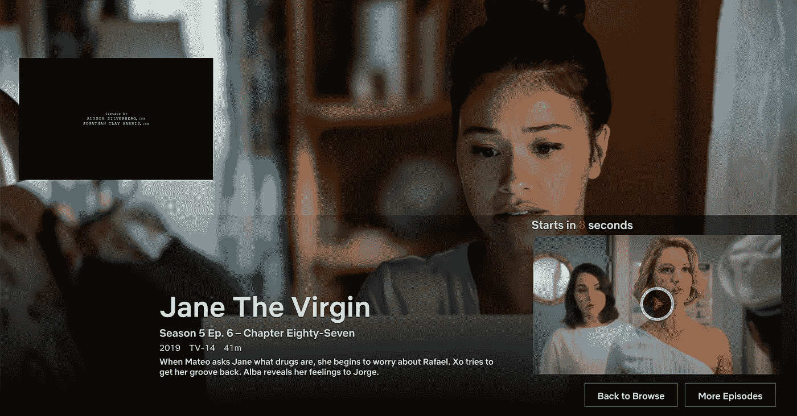
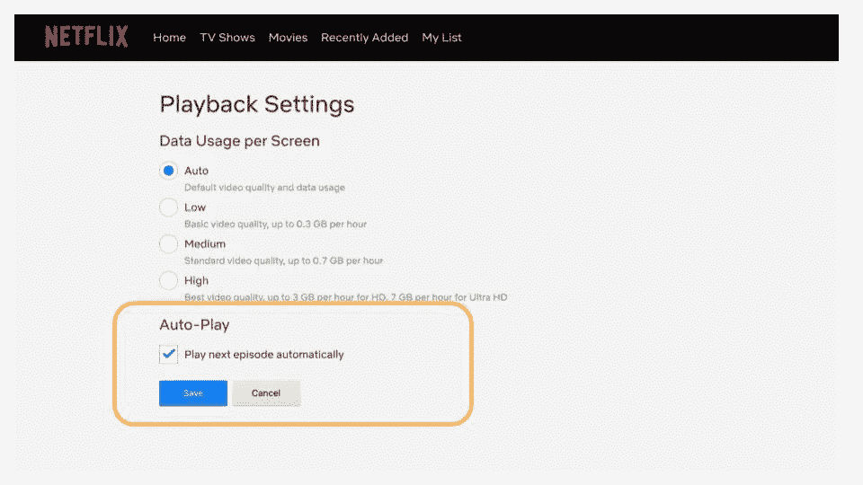
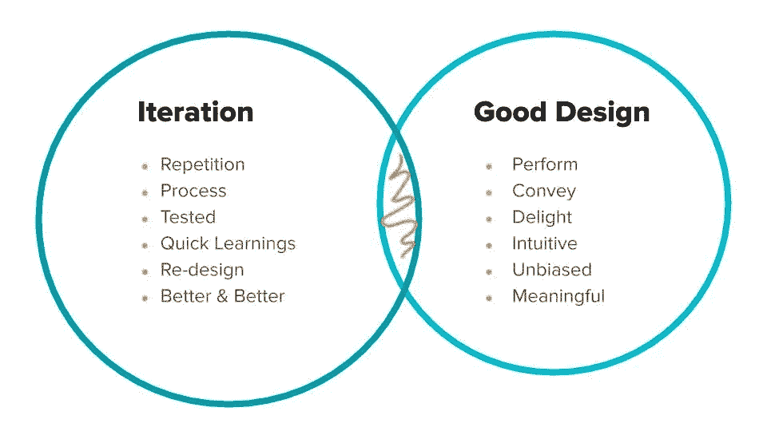

# 迭代优秀的设计

> 原文：<https://medium.com/hackernoon/iterating-on-good-design-ba9d077c664b>

## 更少，但更好——迪特·拉姆斯

我最近在温哥华的一个素描聚会上谈到了什么是好的设计。在我之前发言的 [Spark](https://spark.re/) 联合创始人([科迪·柯利](https://medium.com/u/82acd1d25321?source=post_page-----ba9d077c664b--------------------------------))引用了[迪特·拉姆斯的 10 项原则](https://hackernoon.com/dieter-rams-10-principles-of-good-design-e7790cc983e9) ( [Hackernoon](https://medium.com/u/4a8a924edf41?source=post_page-----ba9d077c664b--------------------------------) )，这让我很容易理解，因为我提出了一个问题，即人们*(*设计师)是否会思考后果。我们如何为“好”而设计？在开始下一次冲刺之前，问正确的问题和设计正确的东西一样重要。

以网飞的自动播放功能为例:有多少人知道在你的设置中有一个复选框可以取消勾选，这样这个夜晚的妖妇就不会自动播放下一集电视剧《简·处女》了？我没想到 90%的 Meetup 用户会怀疑这个功能的存在。

Deadly cliffhangers — but quirky writing good in small doses

## 网飞的自动播放功能的设计者是否考虑过它会如何影响人们在凌晨的睡眠，或者他们只关心满足参与度 KPI？

A possible ‘dark pattern’ ([https://www.darkpatterns.org/](https://www.darkpatterns.org/)). Want to sleep? Turn that Auto-Play off!

如果你是设计师，请记住，在客户批准之前，每个人都有某种形式的时间限制，你会考虑让人们在推出时选择使用这一功能，或者你会有目的地将其分层到更深的播放设置菜单中，以便人们在让下一个节目自动播放时不会三思而行？

## “看情况。”

# 定义:好

在我开始演讲之前，我问了每个人他们认为迭代意味着什么，以及‘好的设计’意味着什么。结论:**有意义的**、直观的、简单的设计(又名“好的”)与**越来越好的重新设计**交叉，这些重新设计来自合理的可用性测试和 UX 研究。我的最爱！

# 定性研究的好处

一旦我们都以相同的视角作为起点，我们就讨论如何到达那里。我分享了一些关于实时可用性测试的案例研究，使用定性的方法，如墙上观察、阴影、经验取样法、卡片分类、纸上原型和认知走查，帮助确定正确的研究问题。不管我们做了多少年，我们都有自己的偏见。将我们自己从我们的假设中解放出来，并(重新)沉浸在我们为之设计的人们的鞋子中，往往会产生新的想法。

曾经有利益相关者对花钱进行定性研究持怀疑态度吗？每当我们让他们直接接触与他们的产品或服务互动的最终客户时，这比任何视频记录或逐字引用都要好，在验证产品策略之前，怀疑转化为对用户研究的自信支持。

当然，我们总是尽可能地用定量数据对定性见解进行三角分析。

# 为什么要问五个为什么

*好的设计非常符合我们的需求，它们是无形的。*——*唐纳德·诺曼*

当我与屯门护士学校分享我的交互设计硕士项目([体验取样法](http://www.priscillaho.com/esm))的一个例子时，这个例子出现在[杜代尔夫特的 Pick-A-Mood](http://studiolab.ide.tudelft.nl/diopd/library/tools/pick-a-mood/) 产品手册中，我还记得当我在香港与唐纳德·诺曼()一起上大师课时，他曾发誓说五个为什么是他最喜欢的设计方法。

无论是在开始发现阶段、中间综合阶段，还是在设计过程的结论性设计和测试部分(不需要按顺序进行)，问“为什么”在任何好的设计中都很重要。例如:

1.  **为什么客户希望人们观看此视频？**
    因为我们想让人们学习视频要说的内容。
2.  **为什么我们希望人们了解视频的内容？因为这就是创建这个工具的全部意义。**
3.  **我们为什么要开发这个工具？**
    因为人们都在抱怨这种变化。
4.  **为什么会发生这种变化？**
    因为越来越多的人不了解它。
5.  **为什么大家不理解？我们不确定为什么人们不理解它…**

这是回答原始问题的一个很好的问题，也是询问主要研究问题的一种方式:*人们目前如何理解正在发生的变化？*

# 不要害怕问“为什么”。原因如下。

你可能想知道为什么这个话题会在素描聚会上讨论。**为什么不呢？作为设计师，我们在任何影响人们的 UX 和 UI 草图文件中做出有意义的决定。**每一个原子、分子、有机体、组件、设计系统、网页、网站、产品或服务都会引发一场互动(阅读[布拉德·弗罗斯特](http://atomicdesign.bradfrost.com/table-of-contents/))。我目前设计的每一个交互都是在人和计算机之间，时间是一个常数，尽管是一个常数的变化。如果时间总是在流逝，我们该如何和对我们最重要的人一起度过呢？我希望你好好利用你的时间(见 [Humane Tech](https://humanetech.com/) ，也就是好好利用时间)阅读这篇反思，并把它当作你一天中的一个休息，回到你一天剩下的事情中去。