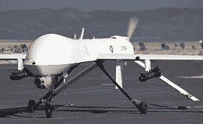

# 是炸弹！人工智能武器我们的天定命运

> 原文：<https://medium.com/hackernoon/its-the-bomb-ai-weapons-our-manifest-destiny-a072471d79b8>

Photo by [Sebastian Spindler](https://unsplash.com/photos/yJygeDcirWI?utm_source=unsplash&utm_medium=referral&utm_content=creditCopyText) on [Unsplash](https://unsplash.com/search/photos/collage-bomb?utm_source=unsplash&utm_medium=referral&utm_content=creditCopyText)

## 除了洛克希德·马丁公司，没有人喜欢战争，因为在过去的几千年里，战争已经足够吓跑任何人。然而，一个转变正在发生:常规武器正在消失，由人工智能控制的弹头开始控制

> “战争是当语言失效时发生的事情。”
> 
> ***—玛格丽特·阿特伍德***

# 和平时代

我们生活在一个前所未有的时代——至少在欧洲和西方是这样:除了 20 世纪 90 年代中期巴尔干半岛的战争之外，我们自 1945 年以来就没有冲突。好吧，所以冷战是一场威胁、拖延和猜测对方实力的“战争”，更不用说在古巴导弹危机期间差点爆发全面核战争了。但是忽略这一切——以及中东、黑暗大陆和亚洲持续不断的战争——我们应该感到非常幸运。

> 我们意识到，我们都要幸运得多，我们通常能得到我们想要的——或者差不多
> 
> **–罗尔德·达尔**

暴力总是发生在其他地方，在一些贫穷的非洲人的家门口——或者更糟，至少对美国人和英国人来说——干涉主义者在伊拉克和阿富汗的战争。

然而，近年来，战争更多地以恐怖袭击、爆炸的形式出现，谁能忘记 2001 年 9 月那个悲痛的日子呢？

> 可能没人。

然而，在所有这一切中，在所有这些痛苦和折磨中，我们人类似乎擅长创造，所以创造更多。

从我们自我宣扬的沙文主义中渗出。

我们是战争的天然蒸馏者，暴行的工匠。

> 你知道吗，截至 2016 年，全球武器贸易接近 900 亿美元大关。

令人震惊，不是吗？

> “听着——没有一场战争会结束所有的战争。”
> 
> ***—村上春树***

# 时代在改变

但是听听这个:高级军事官员和将军们预测自主武器系统(AWS)将在未来几年内被普遍使用，而到 2020 年全球的花费将超过 1800 亿美元，是 2016 年花费的两倍多。

Microdrone, no longer a boy’s toy, it seems. Source: Amazon.com

尽管令人遗憾的是，面对来自朝鲜和伊朗等流氓国家的威胁，各国都在逐年增加国防预算来应对这一威胁。在未来，尤其是随着更好的技术的出现，这些技术不仅比当前的技术更便宜，而且更有效，花费的钱将攀升到令人难以置信的高度。

这就是人工智能技术在未来几年将在国防领域发挥巨大作用的地方。

> 不管是好是坏。

毫不奇怪，世界各地的政治家和军队参谋长一直在关注机器人是如何发展的，以及以目前的速度，它们将能够在未来的战争中以何种方式帮助他们的军队。

目前，人工智能技术在冲突地区做了很多好事，在那里它们被用作空中监视设备和炸弹处理机器人，拯救了无数士兵的生命，并协助情报机构获得关于敌人位置和潜在战场战略的重要信息。

> *“有时候你必须拿起枪，才能放下枪。”*
> 
> ***—马尔科姆·Ⅹ***

然而，不知何故，自主武器系统，或者更令人不安的许多人喜欢称之为“致命自动化武器”(LAW)，将被设计用于更险恶的目的。

Autonomous plane. Source: Wikicommons

**美国国防部的报告称，一旦完全整合到军队中，AWS 将拯救许多生命，因为一旦选择并指定了目标，就不需要人工干预。减少军队人员在战区的积极参与，降低死亡率。**

如果英国、法国、德国和俄罗斯的将军们以及在第一次世界大战期间作战的其他勇敢的军队拥有这样的技术，那么人类的代价可能会低得多。

目前，中国、美国、俄罗斯和以色列正在以自动喷气式飞机、船只甚至机器人坦克的形式，竞相开发和实施自动预警系统。

# 反对运动

所有这些的支持者说，当 AWS 全面运行时，将违反日内瓦公约，因为他们认为将人类的生死决定权交给机器人内部的人工智能技术在道德上是令人反感的。

AI 的学者和其他有影响力的活动家已经向联合国提交了他们的案件，以阻止 AWS 发展成为军事发展的主流。到目前为止，他们看到的结果有限:2018 年，美国和少数其他国家阻止了关于全面禁止 AWS 的谈判。英国谢菲尔德大学的人工智能教授 Noel Sharkey 是“停止黑仔机器人运动”的主要活动家，他是反对扩大自动机器人系统的人之一。他说:

*“我来这里是为了抵制人工智能和机器人技术的应用，这些应用完全是基于经济原因，而没有考虑人类责任和社会影响。”*

一项国际条约，如果在未来几年取得成果，只会在军事冲突地区生效。对于特定国家境内的警务和其他内部控制系统，仍然允许使用预警系统。对于那些在监管和监视公民方面记录不佳的国家，如中国、伊朗、朝鲜和前苏联加盟共和国，这确实令人担忧。

> **‘战争有时可能是一种不可避免的邪恶。但无论多么必要，它永远是恶，永远不是善。我们不会通过杀死彼此的孩子来学会如何和平共处。**
> 
> ***—吉米·卡特***

如果这些国家的政府仍然能够获得这些技术，无论是用于监控还是用于杀戮，那么这些国家的人民会怎么样？

# 独裁者之地&一条中间道路

仅仅三十年前，萨达姆·侯赛因在伊拉克屠杀了成千上万的库尔德人。如果有一点点机会，朝鲜的金正恩或吉尔吉斯斯坦的苏龙贝·杰延别科夫会对他们自己的人民使用自主武器系统做些什么呢？

还是委内瑞拉尼古拉斯·马杜罗(Nicolás Maduro)的专制政府？

这不值得去想。

其他人，既不支持也不反对，有一个折中的解决方案，就是所谓的“非致命武器”。不出所料，这些公司做到了它们在广告上所说的。已经有公司生产这种混合人工智能武器技术，如配备彩弹和泰瑟枪的无人机。

**这一切都很好，但如果这种技术，无论是法律、AWS 还是听起来无害的“非致命武器”落入坏人之手，会发生什么？然后呢？**

难道我们只是以毒攻毒，用这些自主武器系统对付自己？

> 机器对机器。机器人对机器人。AI contra AI。

战场象棋。历史上规模最大的军事演习。

# 恐怖组织

几十年来，像 Al Kheida、ISIS、爱尔兰共和军、埃塔甚至哥伦比亚革命武装力量这样的恐怖组织的阴影已经给成千上万的人造成了伤害和心痛，可以肯定的是，如果这些组织通过偷窃或通过黑市技术交易获得 AWS，大多数愤世嫉俗者会毫不犹豫地使用它们来促进他们疯狂的事业。

**无论这一切激起了什么样的角度和观点，有一点是肯定的——未来将由 AWS 主导。我们如何使用这项技术完全取决于我们自己。**

请记住:

> 战争，哈，耶！
> 有什么好处？
> 绝对没有！