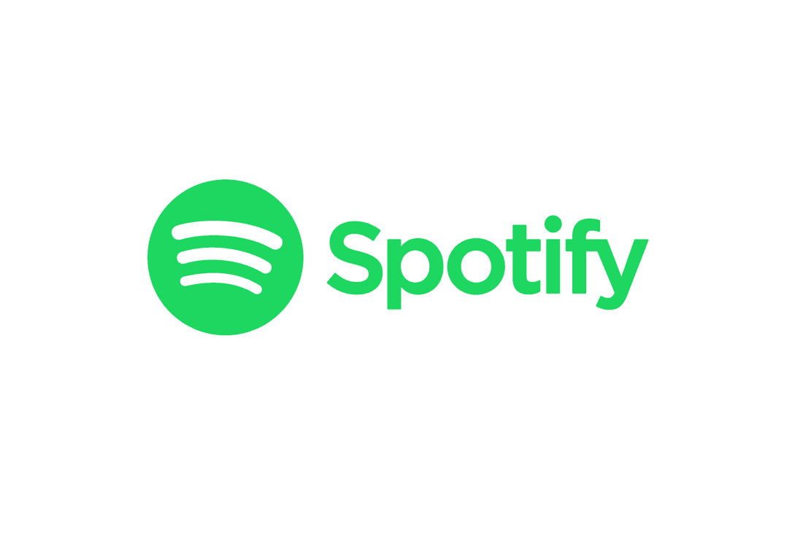
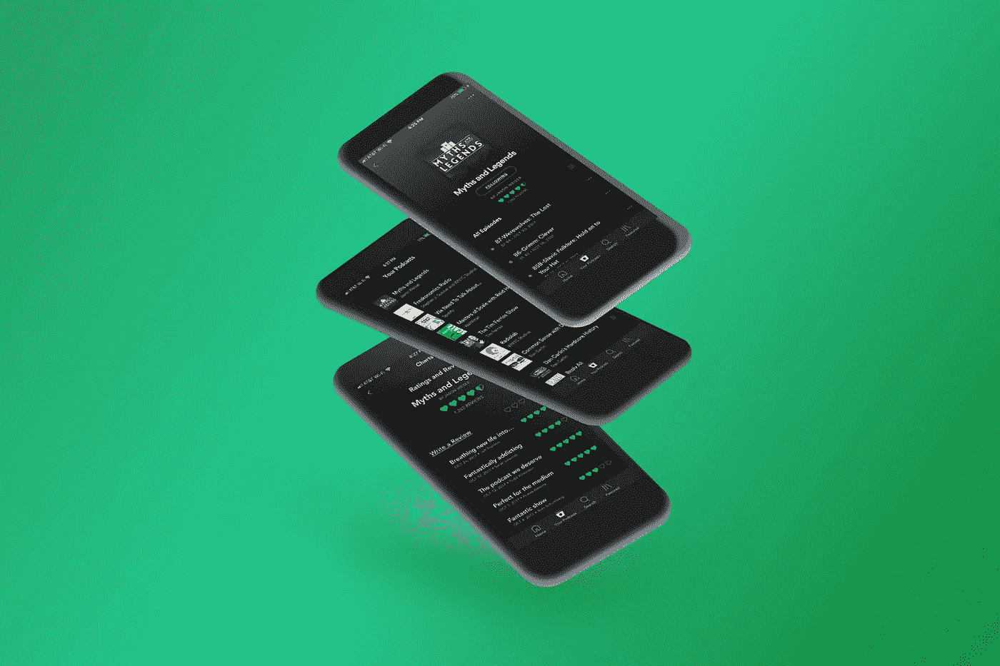

# 我来自未来，来拯救 Spotify

> 原文：<https://medium.com/hackernoon/ive-come-from-the-future-to-save-spotify-f69bea631ee4>

*免责声明:我必须通知你，我并没有真正的***来自未来。**

*在瑞典划船，我有机会坐在前排观看 Spotify 的发展。就像我们君主制的新成员一样，Spotify 一直是我们骄傲地看着成长为拥有 1.7 亿用户的皇冠公主的皇室孩子。*

*然而加冕女王的道路并不平坦。当 Spotify 开始通过流媒体让音乐听众为音乐付费这一看似不可能的任务时，它基本上是独自一人这样做的，主要是与自己竞争。令人难以置信的是，流媒体公司实现了这一壮举，无可争议地证明了很多人是错的。然而今天，它不仅仅是在与自己竞争，因为一些严重的竞争对手已经出现，对 Spotify 构成了外部威胁。*

# ***自举公司***

*营销大师塞思·戈丁(Seth Godin)将“创业者”描述为这样的公司/个人/品牌，他们的心态是用尽可能少的钱变得最足智多谋。bootstrapper 将会成功，因为它的努力和专注将会击败规模更大、资金更充足的竞争对手。*

*在我看来，创业者最重要的资产不是钱，也不是短期目标成就，而是在创新方面领先竞争对手三步的能力。这是让用户来找你的资产，而不是你去追他们。因此，由于你得到了免费的市场营销，缺钱就不那么是个问题了。*

*不过，成为一名创业者也有一些不利之处，主要是你永远不能满足于现有的成就，因此你永远不能停止冒险。这当然很可怕，但你别无选择。你只需要把不承担风险视为最大的风险。*

## *音乐行业的创业公司*

*在当今绝对最大的音乐流媒体服务中，Spotify 是真正的创业者。其最大的竞争对手是苹果、谷歌和亚马逊。伙计，这太残酷了。当 Apple Music 在 2015 年推出时，他们有超过 8 亿张信用卡记录在案，试图转化为用户。因此，在功能上没有太大区别的情况下，苹果很快就获得了 Spotify 付费用户的一半。*

*这是创业者永远不会处于的境地，因此冒险是必要的。由于 Spotify 是最大的音乐流媒体服务的唯一启动者，实际上其服务的差异化必须是首要目标。当 Spotify 开始变得过于舒适时，它就有麻烦了。*

*那么 Spotify 实际上是如何区分自己的呢？事实证明，答案在音乐之外。*

# *音频革命*

*在过去的几年里，出现了一个巨大的新技术趋势。以前几乎完全由收音机组成的音频行业已经开始以有声读物、语音助手的形式蓬勃发展，最重要的是；**播客**。*

**

*Photo by Pete Souza The White House via marcmeetsobama.com*

*播客行业绝对*爆炸*，2017 年至 2018 年间，苹果播客总下载量和播放量从 170 亿增至 500 亿。这一点的范围也可以在个人播客中看到。到目前为止，播客“你应该知道的事情”已经获得了超过 5 亿次的总下载量。)“乔·罗根体验”现在可以记录超过 1 亿的下载量。*

*音频作为一种通信技术，具有只需要你的耳朵注意的关键优势，因此在许多情况下是一种更合适的媒体。播客填补了人们无聊的火车旅行、洗碗时段，用听众自己选择的节目取代了汽车里的广播电台。*

*此外，不管出于什么原因，音频已经真正征服了长格式。无论是对名人的深度采访，还是与教授长达 3 小时的讨论，都有大量的人在听，而且他们是通过播客来做的。*

## ***难得的机会***

*在上个世纪，我们比以往任何时候都更了解技术革命，当我们看到一场技术革命时，这一场符合所有标准。然而，播客行业是特别独特的，因为对于一项已经变得如此受欢迎并被妥善安置的技术来说，它仍然停留在糟糕的平台上。*

*目前，最大的播客平台是苹果的“播客”。像其他播客平台一样，它很好地完成了基本工作，让用户下载和播放播客。除此之外，没有太多值得欢呼的。听众和创作者在许多领域都得不到充分服务，即:*

***1。社交***

*   *分享播客的体验并不好。当然，播客往往比一首歌或 Youtube 上的一个片段长得多，因此使用起来也更复杂，但播客分享仍然可以做得更好。例如，无法在一个链接中发送多个播客。*
*   *想一想将 Youtube 上的一段视频嵌入到脸书/推特/博客文章中，并在该平台上直接播放是多么容易。唯一为播客做同样事情的平台是 Soundcloud。我们今天分享播客的方式往往是这样的:“嘿，伙计，去播客网站搜索“…”，然后向下滚动到第 670 集，下载它，跳到 1:34 听一个精彩的故事”。*
*   *播客平台几乎没有社交元素。*

***2。发现***

*   *在发现新的播客方面，我们陷入了僵局。很大程度上是因为有限的分享功能，但也因为播客平台不擅长向我们推荐内容。*
*   *搜索功能一塌糊涂。比较你在 Youtube 和苹果的播客上搜索特定内容的体验。在 Youtube 上，你更有可能获得高质量的内容，而在播客上，你会完全迷失。*

***3。数据***

*   *今天，播客从他们的平台上几乎得不到任何数据，这在几个方面是有问题的。当涉及到开发和改进内容时，分析对播客来说非常重要。播客不得不猜测他们的观众连接到什么，并使用其他措施来收集信息，因为数据被锁定在播客平台上。*
*   *缺乏衡量标准和分析在该行业未开发的货币化潜力中发挥了巨大作用。由于播客不能给赞助商提供具体的数据点，广告价格严重偏低。*

***4。创作者-听众关系***

*   *播客们真的没有办法在播客平台上与听众联系。这种关系目前必须完全依赖于其他平台。*

# ***音频流媒体服务***

*与其他音乐流媒体服务不同，Spotify 实际上有播客，并越来越关注它们，但它们仍然被严重地排除在外。或许并不太陌生，它仍然是一个音乐流媒体服务。然而，如果 Spotify 想要抓住这个庞大且仍在增长的用户群，它需要想出如何成为一个 ***音频流媒体服务*** 。*

*由于当前的音频平台有如此多的缺陷，成为一个音频平台的机会比以往任何时候都要大。但要实现这一点，Spotify 需要修复当前的缺陷，并进一步创造新的创新，以构成未来的音频平台。*

*正如 Spotify 在 2000 年代中期在音乐领域所做的那样，它需要按照基本原则进行思考，并问自己一些非常简单的基本问题:*

*   *音频平台应该是什么样的？*
*   *用户和创作者*真正*需要的是什么？*
*   *他们不需要什么？*

*Spotify 的优势在于，它已经有了一些令人印象深刻的工具，他们可以从这些工具开始学习音乐。如果它能够将其目前的优势转化为音频，同时努力彻底重新思考音频平台应该由什么组成的概念，它很可能成为最强的音频平台。*

# *【Spotify 在构建未来音频平台时应该考虑的八件事*

**

*Image by [Spencer Camp](https://blog.prototypr.io/what-if-spotify-made-a-podcast-app-ef8defd5d2dd)*

# ***1。播放列表基础设施***

*播放列表从一开始就是 Spotify 的重要组成部分，他们花了十年时间来完善它们。现在，你能想到的每一种情绪、季节和晦涩难懂的音乐都有播放列表。Spotify 的算法加上人工监督，还会根据你一直在听的内容，以“发现周刊”和“释放雷达”等播放列表的形式，为你带来*个性化*播放列表。*

*普通 Spotify 用户也创建自己的播放列表，其中一些拥有数十万粉丝。这也增强了 Spotify 的社交元素。此外，播放列表现在确实是发掘艺术家的最佳途径之一，有无数的例子可以证明。*

*在我看来，这个基础设施的很大一部分也应该适用于播客。播客听众通常无法从他们的平台获得足够的帮助来找到新内容。Spotify 的主要任务之一是帮助用户根据他们已经听过的内容找到他们可能喜欢的新音乐。令人惊讶的是，我还没有遇到一个平台能在播客上做得这么好。真的没有不应该存在的理由。*

*听众应该能够将他们喜欢的播客分类到播放列表中，就像他们处理音乐一样。还有什么更好的方法可以把多个播客发送给朋友，或者甚至自己跟踪它们。播客播放列表是其中一个非常有意义的想法，你无法相信它已经不存在了，而且目前没有人比 Spotify 更了解播放列表。*

# ***2。数据***

*Spotify 为其艺术家提供了大量数据。如果它能为它的播客做同样的事情，毫无疑问许多创作者会更喜欢它的平台。 [Spotify For Artists](https://artists.spotify.com/) 对于许多艺术家的成功非常重要，因为它可以准确地看到他们的听众喜欢什么类型的音乐。*

*播客们必须做更多的工作来了解他们的观众实际上来自哪里，以及他们在做什么。当内容创作者与赞助商谈判时，他们最大的资产是能够准确地告知他们的观众由谁组成。相反，他们不得不猜测，因为他们对数据的访问权限有限。*

*很难夸大数据对创作者的重要性，而提供谷歌分析的人——分析的质量不会被忽视。*

**(令播客们满意的是，Spotify 实际上已经开始与*[*【Spotify For 播客*](https://podcasters.spotify.com/) *】在这方面进行合作，如果它不辜负人们的期望，很可能会非常有影响力。)**

# ***3。音频-音乐集成***

*这是一块难啃的饼干，也许是最重要的一块。音乐和音频需要共存，不能互相窒息。音乐太多，无法进入巨大的音频市场。音频太多，Spotify 就有失去现有用户、优势和核心身份的风险。*

*今天，天平非常倾向于音乐。许多人甚至不知道 Spotify 有播客，这也难怪，Spotify 真的不能为了让播客流行而冒险以任何方式损害其音乐服务。*

*一个非常有趣的解决方案是独立的播客应用程序，最初是由令人惊叹的设计师斯潘塞·坎普带给我的想象力。这将允许 Spotify 在充分开发不同地区的不同功能的同时，不牺牲其简单而不杂乱的用户界面。*

*在 2014 年的一次现场问答中，脸书首席执行官马克·扎克伯格解释说，拥有独立的消息应用程序的好处远远超过要求用户安装新应用程序的摩擦。双应用解决方案的用户体验要好得多。*

*为人们创建一个全新的应用程序，这无疑是一个巨大的进步，但它可能会被证明是捕捉音频体验的全部价值所必需的。*

# ***4。社交***

*Spotify 并不是最社交化的平台，尤其是在几乎没有社交功能的移动应用上。这并不一定是件坏事，因为还不清楚流媒体服务实际上想要变得多么社会化。[网飞 CPO Neil Hunt 声称](https://www.businessinsider.com/netflix-users-dont-want-social-features-2016-2)其用户不想要任何先进的社交功能，而其他人则渴望 Spotify *的 [*故事等功能。*](https://blog.prototypr.io/what-if-spotify-had-stories-9471a1464bd1)**

*尽管如此，还是有一些社交功能。当 Spotify 与脸书建立长达 6 年多的合作关系时，用户可以选择使用他们的脸书账户注册 Spotify，在桌面版上，听音乐突然变成了一种社交体验。可以分享你在听什么，也可以看到你的朋友在听什么，这让它成为一个更吸引人的平台，让很多人都可以使用。*

*没有任何播客平台有类似的东西。脸书不一定是这里的解决方案，但确实没有理由将播客平台完全排除在社交之外。对许多人来说，他们的播客平台就像是一个秘密的应用程序，从来没有人知道。喜欢这种方式的人应该可以保持这种方式，但今天这是人们唯一的选择。*

***播客与听众的关系***

*说到维护创作者和用户之间的沟通，不同类型的平台有不同的做法。例如，苹果的播客基本上不提供交流方式，而 Youtube 通过评论相当广泛地做到了这一点。对于播客来说，评论可能不是最好的解决方案，因为绝大多数播客听众在移动设备上收听，但新的解决方案应该总是被考虑。*

*与此同时，Spotify 已经为创作者提供了一些非常简洁和流畅的方式来与观众交流，这可以直接用于播客。考虑:*

*a)艺人选择→ **播客选择**；让播客们给粉丝写点什么吧。*

*b)艺术家的播放列表→ **播客的播放列表**；让播客向粉丝展示他们自己的灵感和他们正在听的东西。*

*c)音乐会→ **活动**；让创建者为他们正在进行的活动添加日期。*

*d)汞→ **汞**；让创作者像艺术家一样销售商品。*

# ***5。签约与否***

*Spotify 目前比其他音乐服务更有可能成为新的播客平台的最大原因之一是其免费版本。播客目前在大多数播客平台上是免费收听的，大多数人喜欢这样。*

*无论 Spotify 是在独立的应用程序中提供播客，还是在当前的应用程序中提供，它们都需要对所有人免费，至少在最初是这样。否则，从其他播客平台转移用户将会更加困难。*

*是否应该要求用户注册这个问题很棘手。如果你要求用户注册，你可以为你的创造者和你自己提供更好的数据。但是由于其他播客平台不要求用户注册，你在制造摩擦，而不是让事情变得更容易。*

*也许解决这个问题的最好方法是利用 Youtube 的模式，不需要*注册*,但是如果你注册了，就可以获得所有的功能。*

# ***6。收音机***

*对于无线电究竟衰落到什么程度，似乎有一些不同意见。有人说，与新的音频节目相比，它远远不如，并将在 10 年内消亡。其他人说，它可能已经失去了以前的重要性，但仍将继续是许多人生活中至关重要的一部分，至少只要有汽车存在。*

*Spotify 会成为第一家允许直播世界各地大量已有电台的音乐流媒体服务吗？还是尝试像“Beats 1”一样创建自己的电台？*

*无论如何，可以肯定地说，如果广播想保持相关性，它需要一些重大的创新。现在，听众可以随时选择他们想要的任何歌曲或音频节目，广播既需要找到适合其媒体的新内容，同时也需要更新媒体本身。*

*由于广播是那些还没有搬到网上的稀罕物之一，所以对于试图实现这种转变的人来说，有很多机会。Spotify 比任何人都更适合做这件事。*

# ***7。有声读物***

*有声读物是图书出版业迄今为止发展最快的领域，它提供了播客优于视频的优势；没有手，没有眼睛。亚马逊收购的市场领导者 Audible 在大约 20 年前就已经开始在这一领域开展工作，但由于增长没有放缓的迹象，进入市场的机会仍然存在。*

*由于图书出版业的不同商业模式和有声读物的实际格式，有声读物可能会在 Spotify 的道路上走得更远。但如果我们想象一个场景，用户可以选择不同的订阅选项来访问 Spotify 上的有声读物，它也可以在这一领域提供播放列表和数据功能。*

*如果我们在谈论建立未来的音频平台，我们至少要讨论有声读物。这是音频行业最重要的领域之一。*

# ***8。其他解决方案***

*正如 Spotify 的早期投资者弗雷德里克·卡塞尔(Fredrik Cassel)在一个[媒体故事](https://blog.creandum.com/inside-the-dusty-brains-of-an-early-spotify-investor-looking-at-how-we-were-right-and-wrong-7938abcd36e1)中描述的那样；事后看来，事实证明，吸引顶尖技术人才比为 Spotify 实现个人技术解决方案重要得多。由于这些解决方案比你想象的更快过时，你必须能够不断地*用新的解决方案保持领先。**

**在我们的现代经济中，“人力资本”正日益成为决定性的资产。为了能够在音频领域提出新的创新，Spotify 需要做出真正的努力来吸引业内最优秀的人才，以便所需的重要创新成为持续重复的间接结果。**

**如果 Spotify 在真正进军音频领域方面等待太久，这些人才将会随着创新一起流向其他地方。**

# **【Spotify 如何从这一切中赚钱？**

**反思整个行业不是免费的。这需要在 R&D 进行大量投资，而且我们知道 Spotify 没有堆积如山的现金等着花。但我相信，从用户行为的角度来看，这笔投资是 Spotify 能够做出的最重要的举动，从经济角度来看也是如此。**

**对于许多广告商来说，播客广告比其他任何地方都产生了更好的效果，因为它们是由播客主持人以更加多样和有趣的方式发布的。尽管如此，货币化潜力还远未实现。根据尼尔森的调查，每个活跃播客用户的平均广告收入比平均互联网广告收入少 20 倍以上。**

**如果 Spotify 能够帮助推动数据货币化，那么投资回报可能是值得的。Spotify 的免费用户产生的收入不到其收入的 10%，由于用户群如此之大，如何将他们货币化一直是一大焦点。进军音频领域可能会大幅提升这一比例。**

**播客比音乐有更大的利润空间，因为它们不被唱片公司和出版商以同样的方式拥有。多年来，Spotify 向音乐行业支付了超过 70%的收入。就音频版税而言，这一比例肯定会下降。**

# **自举心态**

**毫无疑问，Spotify 将音频市场视为一个惊人的上升机会，并正在为此分配资源。我只是在这里提醒它，这实际上是一个多么令人难以置信的好机会。数以亿计的播客听众目前正在使用劣质的音频平台，等待被拯救。**

**Spotify 需要继续成为该领域的大创新者，这是它最大和最重要的武器。它需要想象这又是 2006 年，它的使命是从头开始尽可能地建立最好的用户体验。这是一个通过创新赢得战斗的创业公司，而不是通过习惯。只是这一次:**

*   **2006 年是 **2018 年****
*   **Itunes 是**播客****
*   **音乐是**音频****