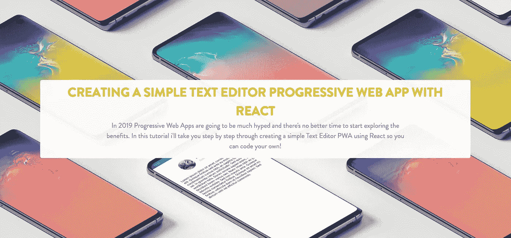
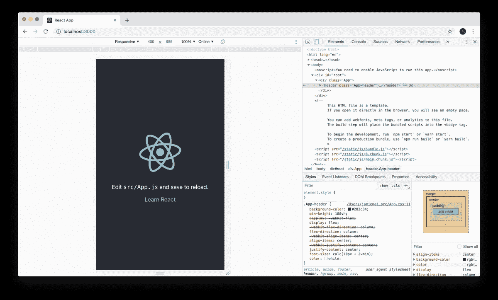
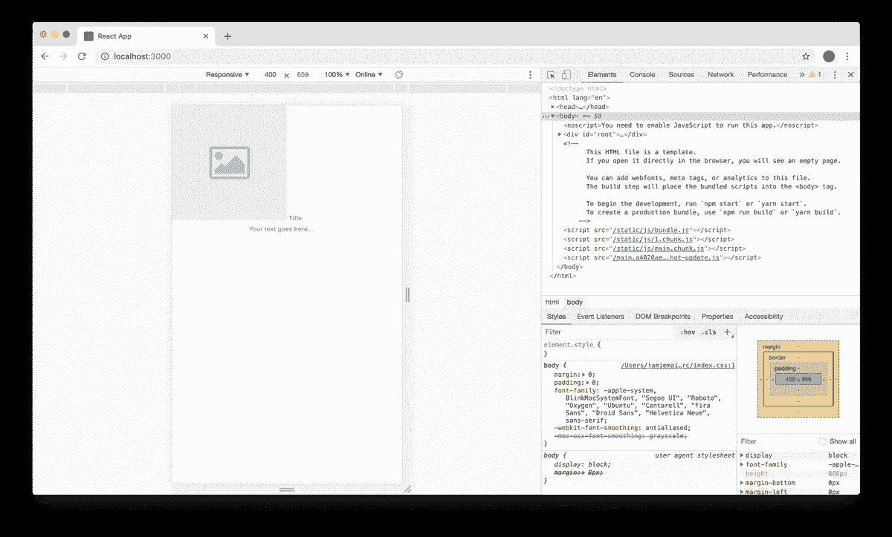
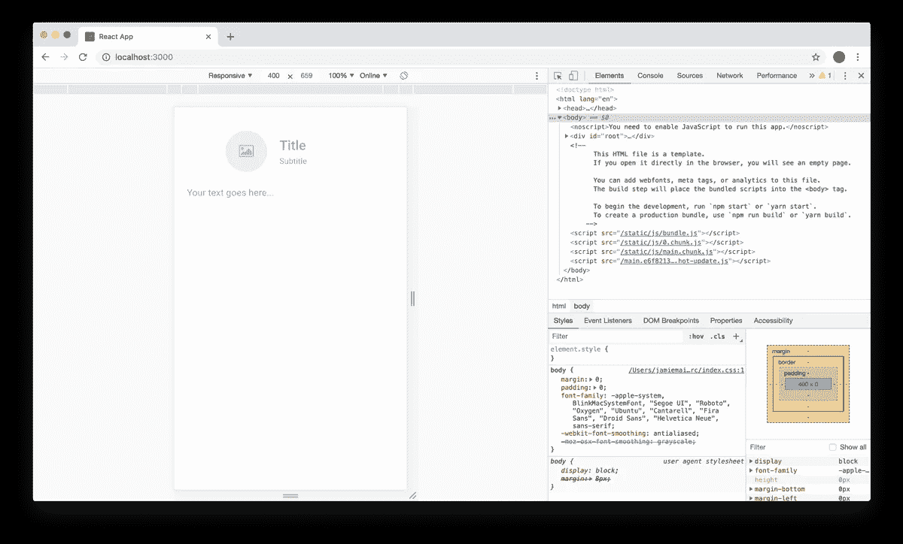
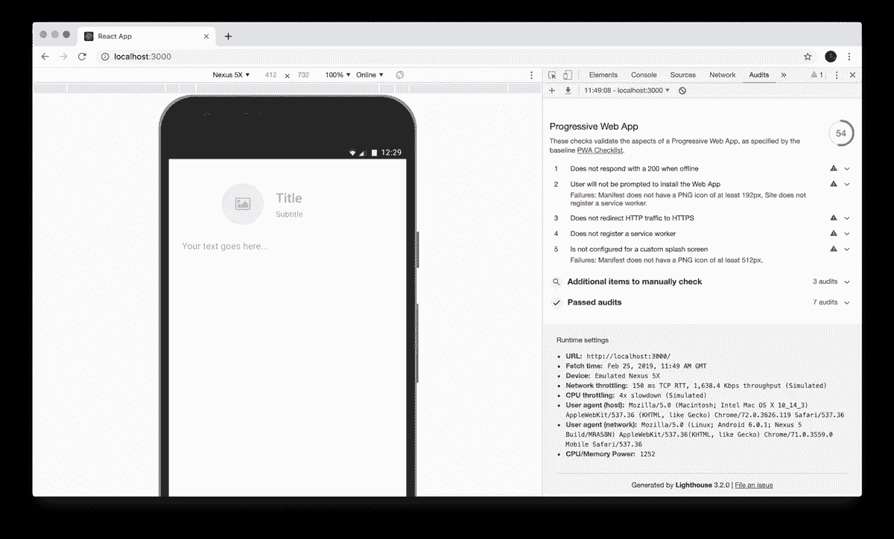
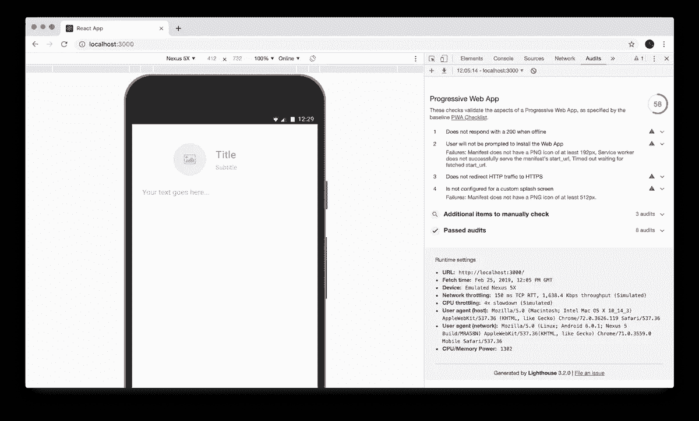
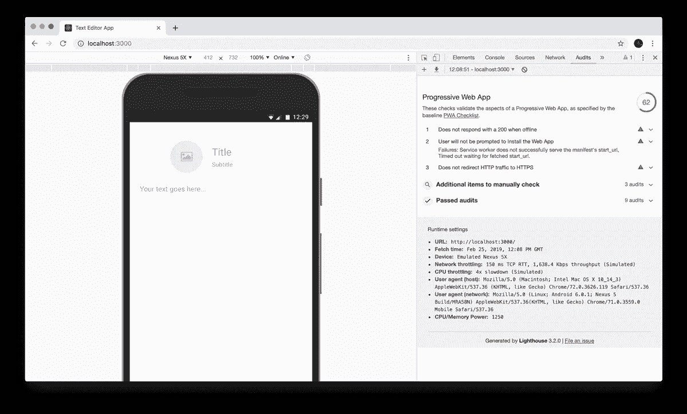
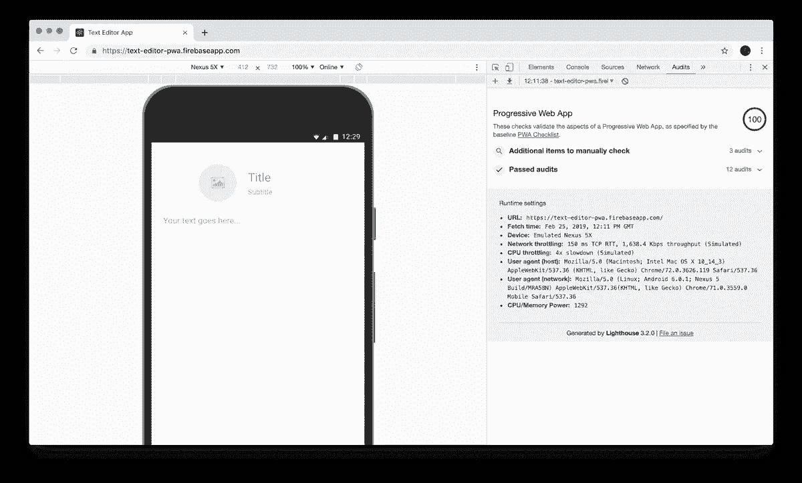

# 如何用 React 创建一个简单的文本编辑器

> 原文：<https://medium.com/hackernoon/jamie-maison-ff7d51058c32>

## 对于您的渐进式 Web 应用程序:

2019 年，渐进式网络应用将被大肆宣传，这是开始探索其好处的最佳时机。在本教程中，我将带你一步一步地使用 React 创建一个简单的文本编辑器 PWA，这样你就可以编写自己的代码了！

> 最初发表于[www.jamiemaison.com](https://www.jamiemaison.com/blog/creating-a-simple-text-editor-progressive-web-app-with-react)。



2019 年，渐进式网络应用(PWAs)将被大肆宣传，这是开始探索其好处的最佳时机。在本教程中，我将带你一步一步地使用 React 创建一个简单的文本编辑器 PWA，这样你就可以编写自己的代码了！

当 pwa 在 2015 年第一次被提及时，谷歌的亚历克斯·罗素将其作为**网络应用**介绍，这些应用具有以下属性:

*   响应迅速:适合任何外形规格
*   独立连接:逐步增强服务人员，让他们离线工作
*   类似应用程序的交互:采用外壳+内容应用程序模型来创建应用程序导航和交互
*   新鲜:由于服务人员的更新过程，始终保持透明的最新状态
*   安全:通过 TLS(服务人员的要求)提供服务，以防止窥探
*   可发现的:由于 W3C 清单和服务工作者注册范围允许搜索引擎找到它们，它们可以被识别为“应用程序”
*   可重新参与:可以访问操作系统的重新参与 ui；例如推送通知
*   可安装:通过浏览器提供的提示显示在主屏幕上，允许用户“保留”他们认为最有用的应用程序，而无需麻烦的应用商店
*   可链接:意味着它们零摩擦，零安装，易于共享。URL 的社会力量很重要。

自从转换到 PWA Pinterest 后，报告称“在 **3 个月**后，与旧的移动网络体验相比，使用该应用的时间增加了 **40%** ，用户生成的广告收入增加了 **44%** ，核心参与度增加了 **60%** ”，因此难怪企业会转向这种应用来获得移动体验。谷歌列出了 PWAs 的主要好处:

*   [**可靠**](https://developers.google.com/web/progressive-web-apps/#reliable) —即时加载，永不显示宕机，即使在不确定的网络条件下。
*   [**快速**](https://developers.google.com/web/progressive-web-apps/#fast) —以丝滑流畅的动画快速响应用户交互，没有笨拙的滚动。
*   [**引人入胜**](https://developers.google.com/web/progressive-web-apps/#engaging) —感觉就像设备上的自然应用程序，具有身临其境的用户体验。

# 入门指南

说了这么多，让我们开始构建一个渐进式 Web 应用程序吧！

首先，让我们使用`create-react-app`来设置项目:

```
npm i -g create-react-app
create-react-app text-editor-pwa
```

完成后，您将拥有一个基础模板 react 应用程序，让我们导航到新创建的`text-editor-pwa`目录并运行:

```
npm start
```

如果你现在打开一个指向`localhost:3000`的 Chrome 窗口，你应该会看到默认的 React 应用。对于本教程，最好在移动视图中工作，只需右击窗口，选择`inspect`，然后切换


图标打开。您的窗口现在应该看起来像这样:



# 基本功能

现在我们已经设置好了环境，我们可以开始开发这个应用程序了！

首先，让我们添加一项我们需要使用的资产。您可以将下图右键保存到您的`/public`文件夹中，命名为`placeholder.png`:


接下来，我们要设置一个基本视图，它只是几个输入和几行 Javascript 技巧，用于在选择``时处理图片上传(而不是输入本身)。将您的`App.js`更改如下:

现在已经添加好了，您可以运行您的应用程序了。应该是这样的…



很美，不是吗！

让我们添加一些样式来使这一切结合在一起。向您的`App.css`添加以下内容:

现在，如果您保存并重新加载您的应用程序，您应该会看到如下所示的应用程序:



瞧啊。我们现在有一个功能的文本编辑器应用程序，允许您指定标题，副标题，图像和内容。这一切都很好，但这还不是一个进步的网络应用程序，所以我们接下来需要做什么？

# 灯塔和渐进式网络应用

介绍灯塔。Lighthouse 是谷歌用来提高网络质量的自动化工具。它可以在 Chrome 中运行任何网页，并对性能、可访问性、渐进式网络应用等进行审计。我们可以使用 Lighthouse 来找出我们需要做什么来使我们当前的应用程序成为一个进步的 Web 应用程序。

Lighthouse 现在内置在 Google Chrome 的开发者工具“审计”部分。让我们导航到那个选项卡(`right-click > inspect > audits`)。要运行我们的审核，让我们选择“移动”作为设备，并取消选中所有审核，确保只剩下“Progressive Web App”。将“节流”保留为默认设置，并点击`Run audits`。



54/100 的分数看起来不太好！但是我们可以很容易地解决这个问题。

让我们先解决“不注册服务人员”的问题。服务工作者是一种技术，它使您的应用程序能够使用 Progressive Web App 的许多已知功能，例如离线工作的能力、推送通知等。幸运的是，`create-react-app`在`/src`中为您创建了一个名为`serviceWorker.js`的服务人员文件。我们只需要在我们的应用程序中注册这个服务人员。为此，我们想在`/src`中编辑我们的`index.js`文件，如下所示:

默认情况下，容易创建的服务人员仅在`NODE_ENV=Production`时工作。为了使我们的服务人员能够进行开发，您只需打开`serviceWorker.js`并将线路`if (process.env.NODE_ENV === 'production' && 'serviceWorker' in navigator)`改为`if ('serviceWorker' in navigator)`。

如果成功了，我们现在有了一个工作服务人员，灯塔现在应该更高兴了。

重新启动应用程序。让我们通过再次运行灯塔审计来检查我们的 PWA 状态。



进步！现在让我们来解决“用户不会被提示安装 Web 应用程序”和“没有为自定义闪屏进行配置”的问题。幸运的是，这很容易解决，只需将正确的细节添加到应用程序清单中。

首先，我们需要一个主屏幕应用程序图标和一个闪屏应用程序图标，你可以复制下面两张图片，并把它们分别放在名为`icon.png`和`icon512.png`的`/public`文件夹中:


现在，让我们将`/public`文件夹中的`manifest.json`更改为以下内容:

并更新我们的`index.html`，使`head`看起来像这样:

让我们再次尝试运行灯塔审计。



看起来我们就要到了！最后一步是解决剩下的问题，我们可以通过将这个应用程序在线部署到 Firebase 这样的服务上来完成。

部署到 Firebase 很简单(而且免费！).只需导航到 [Firebase 控制台](https://console.firebase.google.com/)，创建一个新项目，并将其命名为`text-editor-pwa`。

现在回到您的终端，输入以下命令:

```
npm install -g firebase-tools
firebase login
firebase init
```

登录后，你会被问一系列问题。您将需要以下设置:

```
1) What Firebase CLI features do you want to setup for this directory? => Hosting
2) Select a default Firebase project for this directory => text-editor-pwa
3) What do you want to use as your public directory? => build
4) Configure as a single-page app (rewrite all urls to /index.html)? => n
```

一旦完成，运行`npm run build && firebase deploy`。部署完成后(这可能需要一两分钟)，您应该会得到一个托管项目的 URL。让我们导航到那个 URL，最后一次运行 Lighthouse。



成功！我们现在有了一个进步的 web 应用程序，它通过了所有的 Lighthouse 审计检查。

你现在可以把这个应用程序添加到你的手机主屏幕上，它的感觉和行为就像一个本地手机应用程序——全部由网络驱动。

# 任务完成

恭喜你！现在，您已经成功开发了一个渐进式 Web 应用程序，并且有了继续开发自己的应用程序的良好基础。如果你已经遵循了这个教程，并开始拼凑你自己的 PWA，请随时给我发推特 [@jamiemaison](https://www.twitter.com/jamiemaison) ，我很想看看你创造了什么！

你可以在[https://github.com/jamiemaison/text-editor-pwa](https://github.com/jamiemaison/text-editor-pwa)下载本教程的示例代码

有一个项目，你正在寻找开始，认为你可能需要我的帮助，或者只是想伸出手？[取得联系！](mailto:jamie@jamiemaison.com)