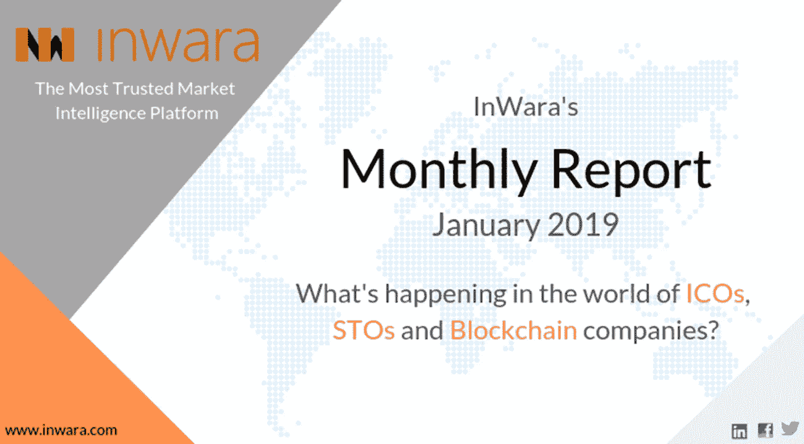
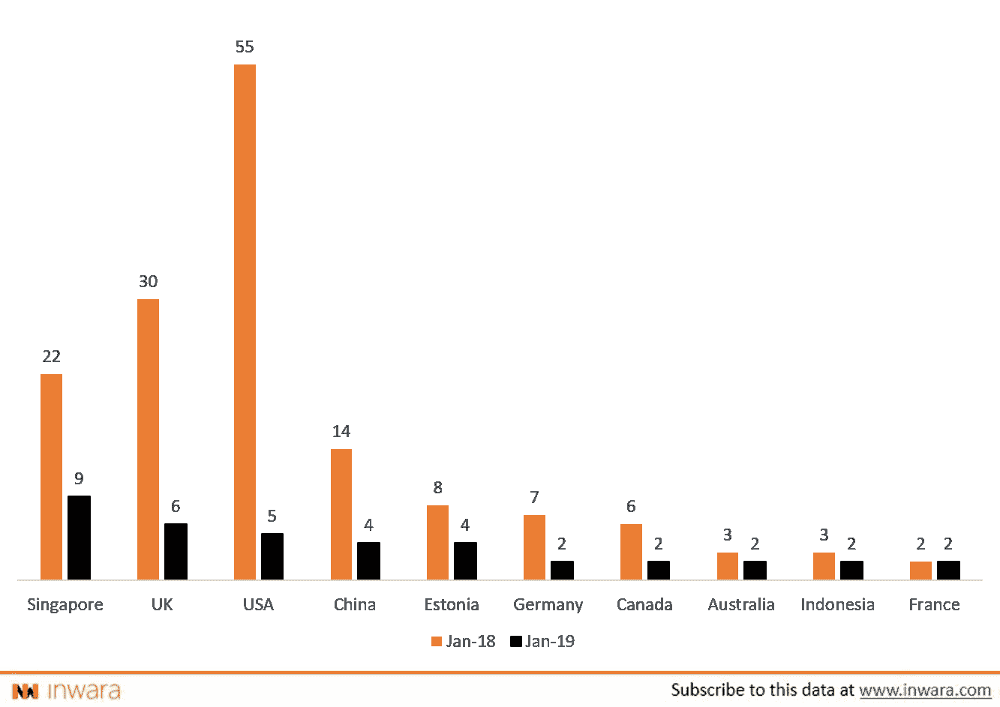
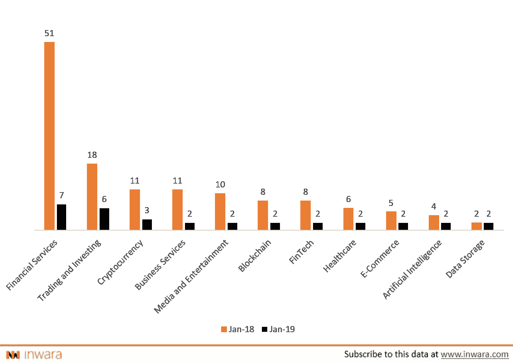
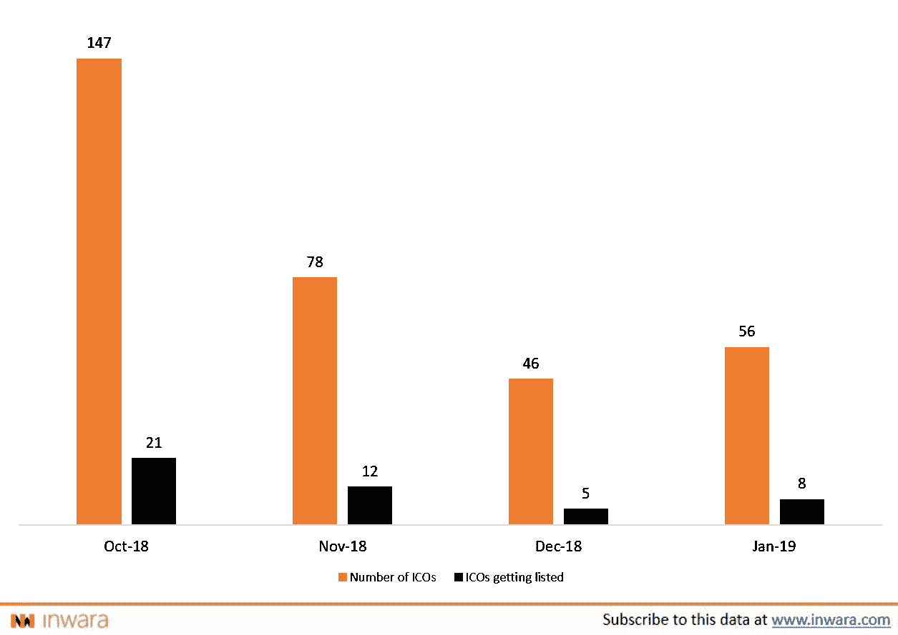
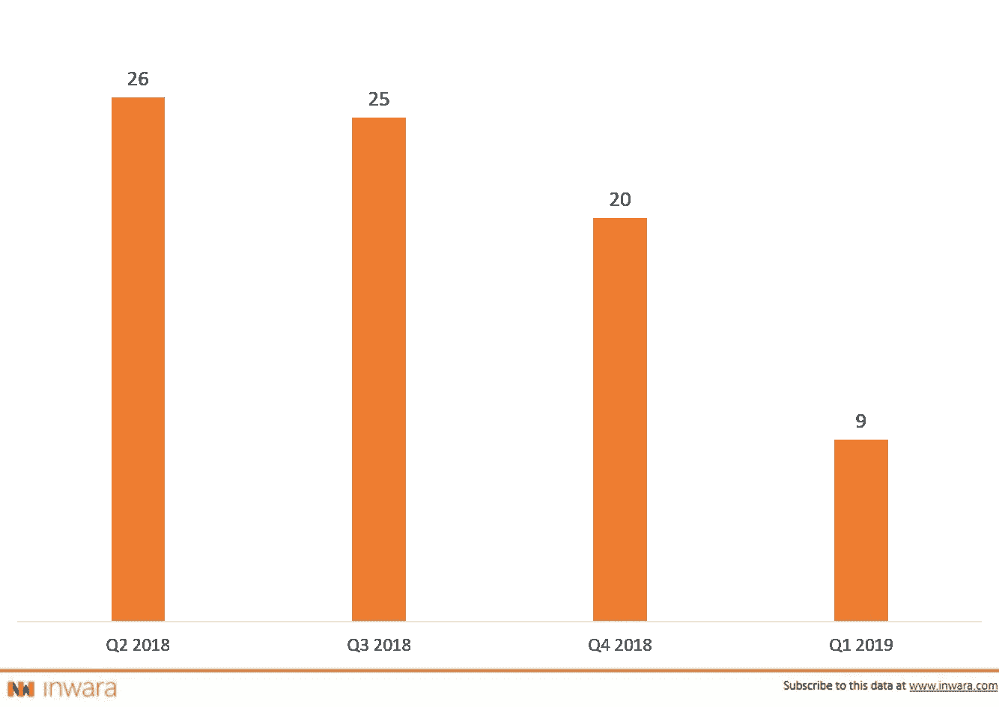
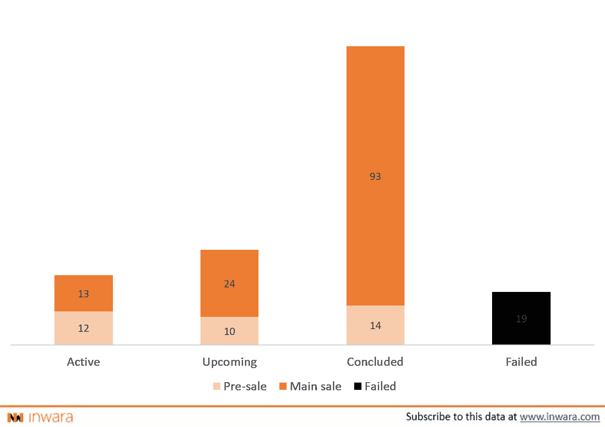
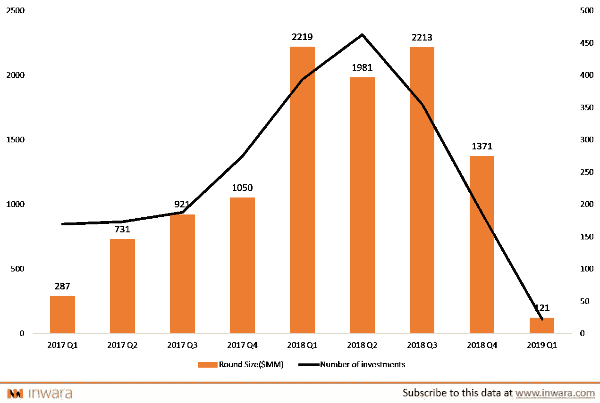
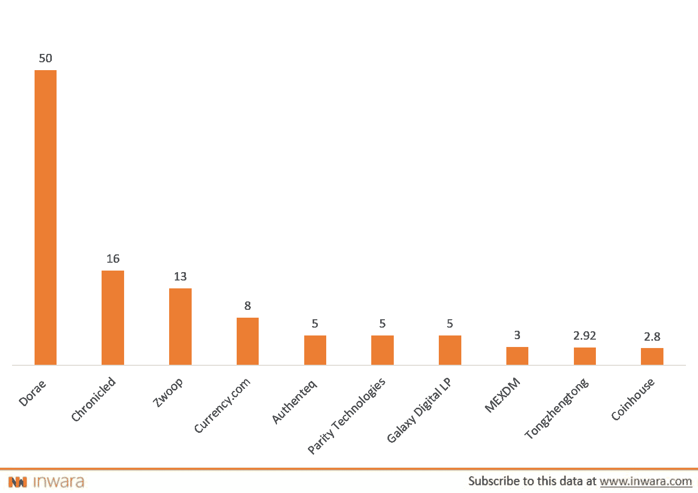
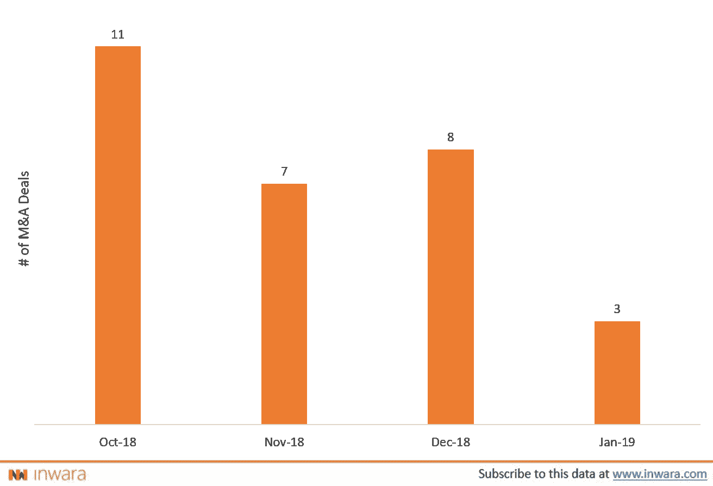
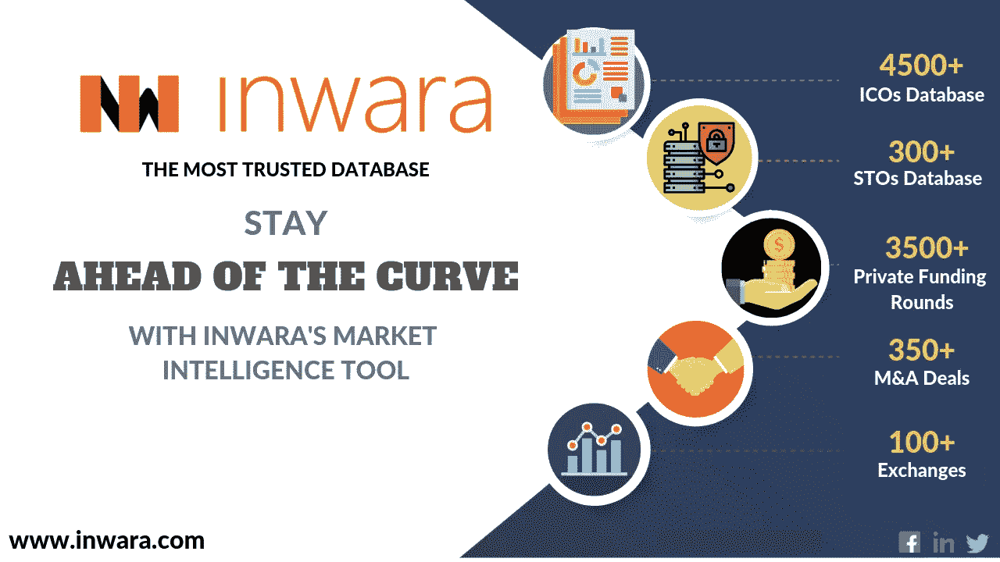

# 2019 年 1 月 ico、sto、区块链公司展望！

> 原文：<https://medium.com/hackernoon/january-2019-outlook-for-icos-stos-and-blockchain-companies-2465af2f44dc>

## 月度报告:看好加密货币市场的几大理由

免责声明:这不是财务建议。文章灵感来自 [*InWara*](http://www.inwara.com/?utm_source=tzerohacker&utm_medium=tzerohacker&utm_campaign=tzerohacker) *。有关更多详情，请访问* [*条款和条件。*](https://www.inwara.com/disclaimer)

这项研究致力于解释 2019 年 1 月的以下趋势

ICO 景观

STO 景观

私人筹资活动

兼并和收购

> [下载完整的 2019 年 1 月报告](https://www.inwara.com/report/monthly-report-january-2019?utm_source=janhacker&utm_medium=janhacker&utm_campaign=janhacker)

# ICO 景观

## **美国不再是 ICO 销售锥形**

与 2018 年 1 月相比，市场观察到 ICO 销售呈贬值趋势，仅观察到 50 多件 ICO 销售。与去年观察到的 150 个 ICO 销售相比，这就相形见绌了。挥之不去的“加密冬天”让区块链企业寻求通过 ico 筹集资金。

## **2019 年各国 ico 数量**

[Source: InWara’s ICO+STO database](https://www.inwara.com/report/monthly-report-january-2019?utm_source=janhacker&utm_medium=janhacker&utm_campaign=janhacker)

有趣的是，新加坡和英国在一月份的 ICO 销量已经超过了美国。SEC 对 ICO 销售的监管力度加大可能是观察到的贬值趋势的原因。

## **行业部门展望**

尽管市场条件不利，但金融服务业的区块链企业以及交易和投资等相关行业继续占据市场主导地位。

[Source: InWara’s ICO+STO database](https://www.inwara.com/?option=com_product&view=products&layout=productdetails&idn=3)

区块链、媒体和娱乐以及金融科技领域的 ico 遭遇了重大收缩，但这完美地反映了整体市场，因为与 2018 年相比，所有行业都出现了负增长。

## **与上市 ico 相比的 ico 数量**

[Source: InWara’s ICO+STO database](https://www.inwara.com/report/monthly-report-january-2019?utm_source=janhacker&utm_medium=janhacker&utm_campaign=janhacker)

在交易所上市的 ico 数量仍然保持在 15%的低水平。2018 年第三季度，不到 20%的 ico 在交易所上市，今年观察到类似的趋势。

> [下载完整的 2019 年 1 月报告](https://www.inwara.com/report/monthly-report-january-2019?utm_source=janhacker&utm_medium=janhacker&utm_campaign=janhacker)

# **STO 风景**

## 尽管加密崩溃，斯托斯的春天还在继续

去年，sto 在加密市场领域似乎风靡一时，sto 的数量在 2018 年稳步增长。sto 在 2019 年以同样的速度前进，在 Q1 2019 年的一个月内将有 9 个 sto。

## **根据财务季度的 sto 数量**

****

**[Source: InWara’s ICO+STO database](https://www.inwara.com/report/monthly-report-january-2019?utm_source=janhacker&utm_medium=janhacker&utm_campaign=janhacker)**

## **斯托斯经受住了隐秘的冬天**

**尽管市场环境不利，STO 的失败率只有 10%左右，最大的 STO 是 Petro 的 7 . 35 亿美元融资。**

****

**[Source: InWara’s ICO+STO database](https://www.inwara.com/report/monthly-report-january-2019?utm_source=janhacker&utm_medium=janhacker&utm_campaign=janhacker)**

# ****私人资助活动****

## ****熊市趋势盛行****

**由于市场在下跌后仍在试图恢复，私人资金今年出现了严重的暴跌。**

****

**[Source: InWara’s private funding database](https://www.inwara.com/report/monthly-report-january-2019?utm_source=janhacker&utm_medium=janhacker&utm_campaign=janhacker)**

## ****投资者看到区块链领域的潜力****

**在筹集的资金方面，区块链行业占据主导地位，五大区块链 ico 在 2019 年 1 月的十大融资轮中占据了一席之地。总部位于英国的 Dorae ICO 在私人融资中独占鳌头，在 B 轮融资中从投资者 Aethel Partners 筹集了超过 5000 万美元。**

## **2019 年 1 月十大私募融资轮次**

****

**[Source: InWara’s private funding database](https://www.inwara.com/report/monthly-report-january-2019?utm_source=janhacker&utm_medium=janhacker&utm_campaign=janhacker)**

> **[下载完整的 2019 年 1 月报告](https://www.inwara.com/report/monthly-report-january-2019?utm_source=janhacker&utm_medium=janhacker&utm_campaign=janhacker)**

# ****并购****

**漫长的“秘密冬天”迫使许多 ico 要么关闭店铺，要么建立战略合作伙伴关系，帮助双方长期生存。**

## ****区块链和加密市场的并购交易数量&****

****

**[Source: Inwara’s M&A database](https://www.inwara.com/report/monthly-report-january-2019?utm_source=janhacker&utm_medium=janhacker&utm_campaign=janhacker)**

**今年 M&A 的一些大手笔交易包括，菲亚特转加密交易所[比特币基地](https://www.coinbase.com/)，收购数据处理初创公司 [Blockspring](https://www.blockspring.com/) 。[Bakkt](https://www.bakkt.com/)收购芝加哥期货商[Rosenthal Collins Group](https://www.rcgdirect.com/)(RCG)的某些资产。EZ Advance 收购印度数字支付初创公司 [Alconomy](http://alconomy.com/) 将其业务扩展到数字银行业务。**

> **[下载 2019 年 1 月报告全文](https://www.inwara.com/report/monthly-report-january-2019?utm_source=janhacker&utm_medium=janhacker&utm_campaign=janhacker)**

****