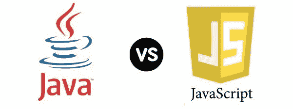
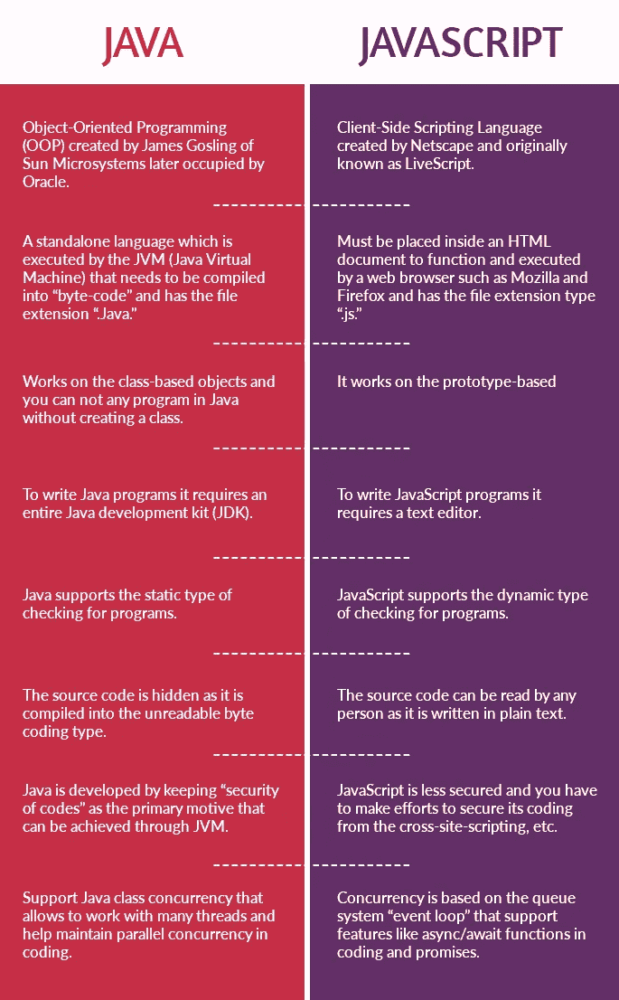
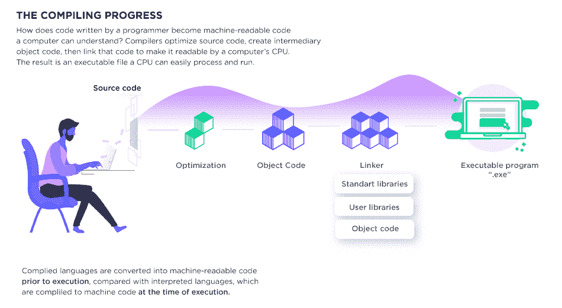
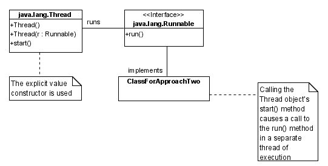
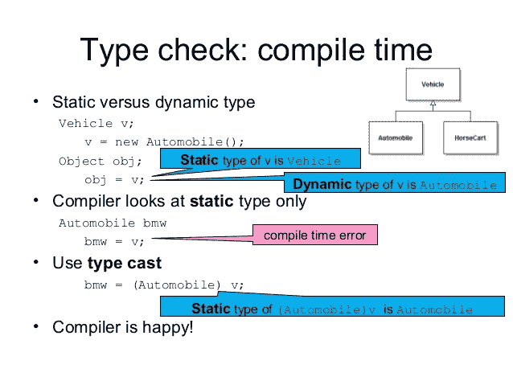

# Java 与 JavaScript:以下是你需要知道的

> 原文：<https://medium.com/hackernoon/java-vs-javascript-heres-what-you-need-to-know-9b1b708394e2>



ava vs Javascript 引发了许多问题。它们是一样的吗？JavaScript 是 Java 的扩展部分吗？它们完全不同吗？我可以混合代码吗？应该先学哪个？哪一个适合创业 web app？让我们找出答案。

> " Java 对于 JavaScript 就像 ham 对于仓鼠一样."
> 
> ——巴鲁克·萨多古尔斯基在接受 [JAX 伦敦](https://jaxlondon.com/blog/java-core-languages/java-is-to-javascript-as-ham-is-to-hamster/)的采访

这曾经是描述这两者关系的最佳方式。

然而，站在 2019 年的中间，场景并不相同。随着时间的推移，这两种语言已经发展到在整个编程和 web 开发领域扮演不同的角色。现在，他们彼此之间没有竞争，而且在编程和 web 开发领域也有突出的表现。

# 让我们仔细看看——Java 与 JavaScript

Java 和 JavaScript 的编写、组装和执行方式不同，甚至两种语言的能力也有很大差异。Java 被广泛用于[服务器端开发](https://en.wikipedia.org/wiki/Server-side_scripting)，而 JavaScript 最适合开发[客户端脚本](https://en.wikipedia.org/wiki/Client-side)用于交互和验证等功能。

在这篇文章中，你会看到更多的关键区别。在此之前，了解程序员应该学习这两种语言来提高他们的编码技能也很重要。此外，您应该[雇佣全栈 Java 程序员](https://www.valuecoders.com/hire-developers/hire-java-developers)，他们可以为您的小型、中型或大型企业呈现以客户为中心的基于 Java 的 web 应用程序。



Java vs JavaScript

# **主要区别是什么？Java vs JavaScript**

## **编译语言 vs 解释语言**

Java 是一种运行在虚拟机上的编译语言，人类无法阅读，而 JavaScript 代码通常以相同的语法运行在 [JavaScript 引擎](https://v8.dev/)上。

用 Java 创建一个编译好的程序需要几个步骤。编译语言被直接转换成机器代码，因此，它们往往比解释语言更快。在 Java 编程中，您需要“重建”程序来进行更改，而在 JavaScript 中，程序逐行运行并快速执行每个命令。

JavaScript 是一种解释语言，曾经被认为比 Java 慢。但是随着实时编译的进步，JavaScript 的性能有了显著的提高。

## **Java 对程序员的优势**



Java 是支持多线程的面向对象编程，因此它有能力同时执行几个任务。在 Java 中，程序可以在编译时被编译成[本机代码](https://www3.ntu.edu.sg/home/ehchua/programming/java/JavaNativeInterface.html)，由于翻译过程的开销，这通常比那些在运行时翻译的程序要快。

多年来，Java 已经开发出了一些开源工具和 ide，比如 [Netbeans](https://netbeans.org/features/java/index.html) 和 [Eclipse](http://www.eclipse.org/downloads/packages/release/kepler/sr1/eclipse-ide-java-developers) 。

Java 提供了各种支持应用程序开发过程的 API。[Java API](https://docs.oracle.com/javase/7/docs/api/)可用作编程中各种活动的命令或通信方法，如 [XML 解析](https://www.tutorialspoint.com/java_xml/java_xml_parsers.htm)、联网、I/O、数据库连接等等。

## **JavaScript 对程序员的优势**

JavaScript 是一种解释型语言，它为应用程序开发人员提供了比 Java 实现更大的灵活性。JavaScript 相对比 Java 快，因为解释器自己执行源程序代码。

JavaScript 支持动态类型和更小的可执行程序等特性。与 Java 不同，JavaScript 语言可以用于各种各样的应用程序。JavaScript 支持许多 transpilers，如 [CoffeeScript](https://coffeescript.org/) 、 [TypeScript](https://www.typescriptlang.org/) 、 [Babel (ES6 到 ES5)](https://babeljs.io/) 和 [Elm](https://elm-lang.org/) 。

CoffeeScript 最棒的地方是它有简单的函数，你可以像写变量一样写，请看例子:

```
hello = (name = “Rebecca”)console.log(“Hello, #{name}!”)hello() # prints “Hello, Rebecca!”hello(“Mary”) # prints “Hello, Mary!”
```

然而，类型脚本文件使用。ts 扩展名创建一个文件，并使用以下代码:

```
var client: string = ‘Mary’, // Stringage: number = 26 // Numericfunction speak(name: string, age: number): void {
  console.log(name + “‘s age is “ + age);
}speak(client, age);
```

程序员还可以使用跨平台的 JavaScript 编写服务器端代码，比如专门为服务器端运行时环境设计的 Node.js。

尽管 JavaScript 是一种解释语言，但它通过允许程序员使用像 AngularJS 和 ReactJS 这样的 JavaScript 库来简化复杂的 web 应用程序开发，这些库可用于创建使 web 浏览器和应用程序交付高质量输出的[影子 DOM](https://gist.github.com/praveenpuglia/0832da687ed5a5d7a0907046c9ef1813) 边界。

# **Java vs JavaScript——并发**

Java 和 JavaScript 对并发的处理非常不同。

Java 类并发性( [java.lang.Thread](https://docs.oracle.com/javase/7/docs/api/java/lang/Thread.html) )的优势在于它允许开发人员使用许多线程，这也有助于保持并行并发性。



Java.lang.thread

而 JavaScript 运行在单个线程上，当事件在编程期间发生时，该线程对事件做出响应。JavaScript 使用一个称为“[事件循环](https://developer.mozilla.org/en-US/docs/Web/JavaScript/EventLoop)的队列系统来处理并发性及其特性——堆、异步/等待、回调、事件循环和承诺。

## **JavaScript 中的 Async/Await—**作为“Promises”编码的语法

假设您有一个 synchronize 函数，它从数据库中取出一些数据，进行某种处理，然后将数据上传到云网络中的某个地方。

## **在 JavaScript 中**

```
export class Synchronizer {
  // … other code elided …
  synchronize = notConcurrent(async () => {
    let data = await this.gatherData();
    // more processing
    await this.sendDataToServer(data);
  });
}
// time A:
synchronizer.synchronize(); // => a promise
// a few seconds later, but before the sync has finished:
synchronizer.synchronize(); // => the same promise as before, no additional sync triggered
```

## 承诺

承诺的行为就像一个序列代码，并提供你需要的序列。

```
readFile("config.json")
  .then()
  .catch();
// This would be very difficult with callbacks
fetchJSON("/user-profile")
  .then(user => {
    return fetchJSON(`/users/${user.id}/relatives`);
  })
  .then(relativeIDs => {
    let promises = relativesIDs.map(id => {
      return fetchJSON(`users/${id};`);
    });
    return Promise.all(promises);
  })
  .then(relatives => console.log(friends));fetchJSON("user-profile")
  .then(user => {})
  .then(relativesIDs => {})
  .then(relatives => {})
  .catch(error => {
    console.error("And error occurred.");
  });function* generatorFunc() {
  let result = fetch("/users");
  // Pause execution by yielding
  yield result;
}
// Later something caused us to resume
console.log(`We're back!`);function* generatorFunc() {
let result = fetch('/users');
// Pause execution by yielding
yield result;
  };
// Later something caused us to resume
console.log(`We're back!`);
```

Java 使用锁来保护几个线程同时执行的代码的某些部分。Java 维护锁和线程之间的同步，这是维护线程之间可靠通信所必需的。

对于 web 开发项目来说，Java 和 JavaScript 都很好。如果你要求最好的，那么 Java 比 JavaScript 工作得更快，因为它的线程间内存共享比 JavaScript 进程间通信更快。

# **Java 与 JavaScript——基于类还是原型**

Java 是一种基于类的语言，它遵循一个蓝图和基于类的关系，其中所有的属性都在一个类中提及，并由该类的实例继承。然而，JavaScript 是一种原型语言，它允许所有对象直接继承其他编码对象。

## **Java 使用构造函数:**

```
class Foo {}
Typeof Foo // ‘function’
```

## JavaScript 使用原型链连接子代码

```
‘constructor.prototype’ to wire a parent code.
```

这些步骤用于创建 JavaScript OO 设计中可用的[父/子层次结构](https://www.w3schools.com/js/js_htmldom_navigation.asp)。

为什么继承很重要？类继承是一种"[重用代码](https://en.wikipedia.org/wiki/Code_reuse)"机制，它为不同种类的对象提供了一种共享代码的方式。让我们看一个例子，当对象被声明并在运行时被添加时,`sayYourName()`并不存在。

```
// name property is added at declaration
var obj = {
  name: "Mary"
};
//this would throw an error - sayYourName() is not declared yet
//obj.sayYourName();
// we add a new property at runtime
obj.sayYourName = function() {
  console.log("My name is " + this.name);
};
// and now it works
obj.sayYourName();
```

在 Java 和 JavaScript 中有许多创建对象和名称的方法和模式。最好的方法是使用 JavaScript 中的原型方法，其中对象应该从对象继承，不需要任何中间人。

# **Java vs JavaScript——静态或动态类型的检查**



Static or Dynamic Type Check in Java and JavaScript

JavaScript 是一种脚本语言，使用动态形式的编码和运行时验证的代码安全性。Java 使用[静态类型的检查](https://www.programcreek.com/2011/12/an-example-of-java-static-type-checking/)，在编译时检查变量。在这两种语言中，程序员指定整数类型、字符串类型、双精度类型等是很重要的。他们为编码而创造的变量。

建议程序员使用 Java 静态类型检查，因为它可以帮助您在应用程序开发的早期指定错误类型。而且，因为这个编译器知道正在使用什么数据类型，所以它们可以以更快的速度编码。通过雇佣业界最好的[外包开发人员](https://www.valuecoders.com/)，自动化您的 JavaScript 开发流程。

JavaScript 动态类型检查的好处是，您可以自由分配函数类型，从而提高程序员的生产率。

## **Java 与 JavaScript —支持选项**

Oracle 为面临 Java 软件问题的用户提供支持。用户可以访问 [Oracle 的高级 Java SE 支持](https://www.oracle.com/java/java-se-support.html)服务，解决与 Java 平台、Java 组件、Java 标准版等相关的问题。Java 开发者也可以使用在线论坛。

当谈到 Java 和 JavaScript 时，我们不能忽视这两种语言之间有一些相似之处。

**支持后端开发** —两种语言都可以在服务器端使用，支持 Node.js、JBoss、Apache 等后端开发技术。

**支持前端开发** — Java 和 JavaScript 都支持前端开发，易于嵌入 HTML 编码。这两种语言都提供了对封装、多态和继承等编码技术的访问。

# **你应该为你的下一个项目选择什么？**

如果你想要一个专门针对 Android 的移动应用，你应该选择 Java。Java 也最适合构建在服务器上运行的 web 和桌面应用程序、企业级软件、大数据分析、构建[服务器端技术](http://www.geog.leeds.ac.uk/courses/postgrad/web/lectures/server-side-technologies/1_introduction/index.html)，如 [GlassFish](https://javaee.github.io/glassfish/) 、 [JBoss](http://www.jboss.org/) 等。

如果您的项目需要开发单页面应用程序(spa)、服务器端技术，如 [MongoDB](https://www.mongodb.com/) 、 [Express.js](https://expressjs.com/) 、 [Node.js](https://nodejs.org/en/) 、React Native 或 [PhoneGap](https://phonegap.com/) 上的移动应用程序开发等，您应该考虑 JavaScript。

> ***必读:***[***2019 年度顶级手机 App 发展趋势***](https://hackernoon.com/top-mobile-application-development-trends-in-2019-5bc1ba19188)

# **关于 Java vs JavaScript 的最后一句话**

我希望你对 Java 和 JavaScript 的区别有一个更清晰的认识。毫无疑问，学习这两种语言 Java 和 JavaScript 将使程序员更有效率，这将导致企业级 web 应用程序的创建，也有助于 Java 软件解决方案的开发。