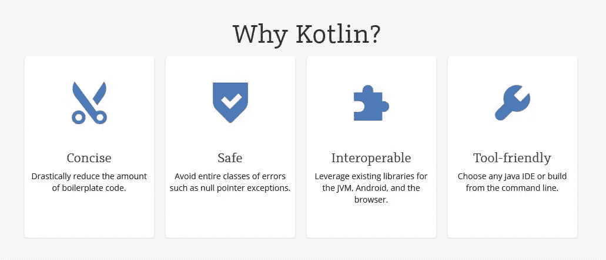
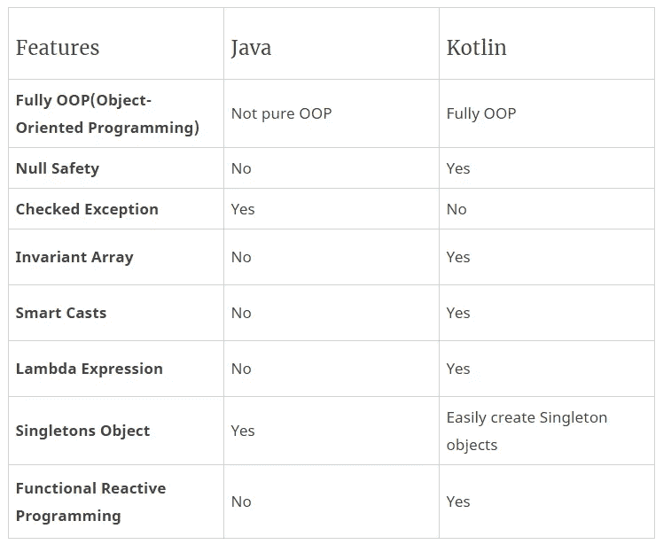

# Java vs Kotlin:是时候扩展 Android 开发了

> 原文：<https://medium.com/hackernoon/java-vs-kotlin-its-time-to-expand-android-development-f08e3d6a72b6>

Java 在 23 年前诞生了。

如此长久的生存表明它有能力应对发展世界的现代挑战。它在 C 和 C++之后的[最受欢迎的编程语言](https://stackify.com/popular-programming-languages-2018/)中占据着至高无上的地位，为数百万开发者和系统创造了最高的可用性记录。

不仅技术界，非技术界也知道 Sun Microsystems 的 Java 编程语言。

Java 被认为是大型企业的首选编程语言。它以其卓越的特性，如互操作性和灵活性，主导着企业应用程序开发领域。

然而，手机的兴起改变了整个模式。Java 已经和 Scala、Groovy 一起成为 Android 应用程序开发的主要语言。现在，科特林扭转了局面。

## 你知道吗？

*詹姆斯·高斯林、迈克·谢里丹和帕特里克·诺顿于 1991 年发起了 Java 语言项目。Java 已经证明了它有能力成为企业界最流行、最强大的编程语言之一。*

它不是“遗留”语言，因为人们仍然在他们的开发环境中使用它。领先的工作门户网站将“Java”语言列为要求最苛刻的编程语言，因为它简单、健壮，并且是一种有影响力的方法。

Java 的面向对象架构范例和大量代码是许多应用程序仍然用 Java 编写的两个主要原因。

随着时间的推移，学习重点已经转移到现代和丰富的语言，但“编程世界入门”仍然涉及 Java、C 和 C++等语言。

随着新兴移动技术的出现，Java 被认为不太面向移动，更新速度较慢。

> 在这里，有一点你需要记住，谷歌的 Android 操作系统使用的是 Java API 包。

Java 与 Kotlin 的争论是大势所趋，但我们的问题有所不同。你认为在 android 应用程序开发中使用 Kotlin 会给你带来成功吗？Kotlin 如何让 Android 开发游戏变得更强大？

## 让我们来寻找答案。

# Kotlin for Android:得分高还是咆哮高？

2017 年，在谷歌 I/O 大会上， [Kotlin 被宣布为 Android 开发的官方语言](https://android-developers.googleblog.com/2017/05/google-io-2017-empowering-developers-to.html)。

众所周知，每一项技术都有不同之处。旧版本的更新和新技术的引入对我们来说并不陌生。

移动语言是当今世界的首要需求。

*优化其次。*

虽然 Java 几乎统治了企业世界，但 Kotlin 正在成为 Android 开发者中最受欢迎的编程语言。当然，它在 Java 上受欢迎背后应该有几个原因。

# Java vs . kot Lin:kot Lin 会取代 Java 吗？这是答案


当然，Kotlin 的广泛使用表明它有能力取代 Java，但 Java 的生态系统相当大，Kotlin 受 Java 的影响更大。截至目前，考虑到 Java 的成熟社区，这似乎不可行。

让我们再深入一点。

Java 是一种面向对象的、广泛使用的、标准的、稳定的编程语言。

# 科特林是什么？

Kotlin 被认为是运行在 JVM(Java 虚拟机)上的静态类型编程语言。它是由 JetBrains 和开源社区开发的。“科特林”这个名字来自圣彼得堡附近的科特林岛。它受到主流 ide 的支持，并兼容 Java 6 或 Java 8。

Android 是用 Java 以及 C 和 C++编写的，这可能是 Android 开发者更倾向于使用 Java 的原因。Java 的“一次编写，随处运行”原则表明，编译后的代码可以在所有支持 Java 的平台上运行，而无需重新编译。这个原则为 Java 在 GitHub 上变得更加流行和成为第二活跃的语言做出了很大贡献。

## 以下是 Java 语言的几个优点:

*   很容易理解和学习
*   更易于执行—在浏览器或虚拟机中运行代码
*   开源、最新、功能丰富的编程语言
*   借助现代工具精确组装大型项目的能力
*   广泛的社区支持使 Java 保持最新
*   归甲骨文公司所有，致力于增强其实力
*   Android 依赖于 Java 语言
*   跨平台应用开发的灵活性
*   自动有效的内存管理使其可移植到从大型网络到最低 PC 的一系列设备上

Java 的许多优点清楚地表明了它在开发人员社区和企业中的认可。

# 科特林对 Java 局限性的回答

毫无疑问，Java 是广泛使用的编程语言之一，但是 Java 的缺点恰好是创造更高级编程语言的原因。看看 Java 的一些缺点，以及 Kotlin 是如何解决这些缺点的。



*Image Credit:* [*https://kotlinlang.org/*](https://kotlinlang.org/)

## 在 Java 中，您需要编写更多的代码:

Java 是一种冗长的语言。您需要编写更多冗长的代码，这些代码通常包含更多的错误和缺陷。

**考虑这个例子，**

# 一个简单的 Java“Hello World”程序:

```
class HelloWorldApp
{
    public static void main(String[] args) {
        	System.out.println("Hello World!");
	}
}
```

# 科特林有一个类似的项目:

```
package hello
fun main() {
println("Hello World")
}
```

就这么简单！Kotlin 使用易于理解和使用的开发人员友好的编码结构和规范。

当你从开发人员的角度考虑这个例子时，你将能够理解为什么 Kotlin 受到全世界开发人员的喜爱。与 Java 相比，它简洁、有效且速度更快。此外，出现错误和缺陷的机会会更少，从而减少成本和时间。

## 在较长代码编译的情况下，Kotlin 比 Java 更受青睐

这似乎很明显。当您有更大的应用程序或一堆文件要执行时，Java 在速度方面就不那么重要了。

> 速度并不是真正重要的比较因素，因为 Kotlin 与 Java 基本相同，都生成字节码。

编译的速度取决于你写的代码，这两种语言在速度上没有任何可测量的差别。

然而，对于 Java 开发人员来说，将大型应用程序组装和分离成不同层的能力是一个优势，它带来了更快编译的额外好处。另一方面，Kotlin 在某些情况下提供了性能提升。

## 专注于优化 Android 代码:

Kotlin 得到了 JetBrains 的支持，该组织还拥有 IntelliJ IDEA、强大的 Java IDE(集成开发环境)和其他几个软件。

这个社区致力于使 android 应用开发比 Java 更流畅、更快速、更有效。

虽然 Java 是在几年前 Android 还没有出现的时候开发的，但在开发过程中，它缺乏一种移动优先的方法。

# Java vs Kotlin:从开发人员的角度看几件事

Kotlin 提供了许多比 Java 更高级的编程特性。

看一下功能对比(开发者视角):



## Kotlin 的其他优势:

**科特林可互操作**

Kotlin 可与 Java 互操作，这意味着您可以利用所有现有的 Java 库、JVM 和框架。

**轻松学习曲线**

懂 Java 的开发人员可以轻松学习 Kotlin。从 Java 转换到 Kotlin 没有太多的开销，采用它也不需要任何成本。

**类似苹果的 Swift**

是的，Kotlin 在语言特性和灵活性上很像苹果的 Swift 语言。

# 谁在他们的开发环境中使用 Kotlin？

*   拼趣
*   Evernote
*   优步
*   科尔达
*   格拉德勒
*   关键的
*   Coursera
*   亚特兰蒂斯人

我们已经讨论了 Kotlin 的优势和特性。现在，我们带着它的缺点前进:

## Kotlin 编程语言的缺点:

*   有限的学习资源，因为它是一个小的新社区
*   对于您的团队来说，从 Java 转换到 Kotlin 可能是一个挑战
*   寻找 Kotlin 开发人员似乎比 Java 开发人员更难
*   有时编译比 Java 慢

## 你应该选择什么来开发你的下一个应用程序？

当然，科特林可以提供竞争优势。它节省了您的开发时间和精力，加快了您的应用上市时间。

## **选择科特林当**

*   你有在 Kotlin 中开发应用程序的经验的 Kotlin 开发者
*   当你想给你的应用程序一个现代的，新鲜的外观
*   当您希望加快应用程序的上市时间时
*   当您的团队对框架和工具有适当的了解时

请记住，Java 仍然存在，完全转移到 Kotlin 似乎是不可能的，因为已经有大量的代码是用 Java 编写的。

**最终想法:**

比较总是主观的。

当我们比较任何语言、框架或工具时，有许多因素和认知非常重要。我们知道 Kotlin 是基于 Java 的，由于一种语言对另一种语言的影响，你实际上无法比较这两种语言。许多人已经采用了 Kotlin，并享受到了它带来的实实在在的好处，还有一些开发人员在 android 应用程序开发中坚持使用 Java。有一点是肯定的，Kotlin 有潜力取代 Java 语言，但这可能需要比我们想象的更多的时间。

这篇文章最初发表在我们的博客[T3 这里 T5](https://www.spec-india.com/blog/java-vs-kotlin-its-time-to-expand-android-development/)