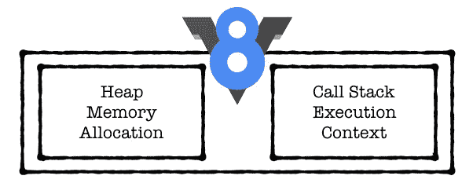
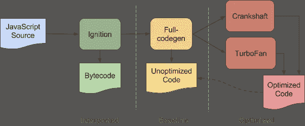
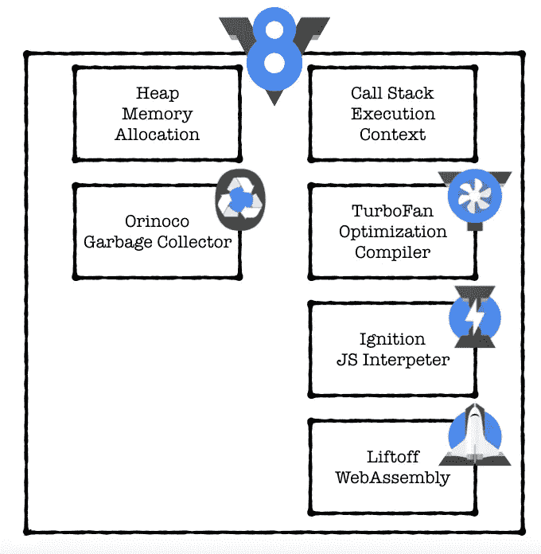

# JavaScript V8 引擎解释

> 原文：<https://medium.com/hackernoon/javascript-v8-engine-explained-3f940148d4ef>

我想我听过 V8 这个名字无数次了。它第一次出现是在 2008 年，当时我团队中的一名工程师向我解释了为什么一些代码的性能会很好——他说:“V8 会解决它的！”——我点点头。虽然我不知道他在说什么，但我仍然想跟上这些天充斥我们的技术前沿术语。然后，当我回到电脑前，我谷歌了一下，心想 chrome 使用的很酷的新 JavaScript 引擎，我猜很棒。

维基百科上的第一行是我们大多数人所知道的 V8，以及许多其他东西。在这里，我将尝试提供一个 V8 实际上做什么的简单解释。至于其他的事情，下一次，只需要阅读维基百科的第一段，什么是黑客，你只能活一次，潜入第二段。

所以没错，“V8 是 Google 开源的高性能 JavaScript 和 WebAssembly 引擎，用 C++写的”( [V8 文档](https://v8.dev/))但是这实际上是什么意思呢？嗯，实际上这意味着，V8 是一个 C++程序，它接收 JavaScript 代码，编译并执行它。

## V8 确实:

1.  编译并执行 JS 代码
2.  处理调用堆栈——以某种顺序运行 JS 函数
3.  管理对象的内存分配—内存堆
4.  垃圾收集—不再使用的对象的垃圾收集
5.  提供所有数据类型、运算符、对象和函数

## V8 可以:

1.  提供事件循环，但这有时也由浏览器实现

## V8 没有:

1.  了解文档对象模型(DOM)吗——它是由浏览器提供的，例如，显然与 Node.js 无关

V8 是一个单线程执行引擎。它被构建为在每个 JavaScript 执行上下文中运行一个线程。你实际上可以在同一个进程中运行两个 V8 引擎——例如 web-workers，但是它们不会像真正的线程一样共享任何变量或上下文。这并不意味着 V8 运行在单线程上，而是意味着它提供了单线程的 JavaScript 流。

在运行时，V8 主要管理堆内存分配和单线程调用堆栈。调用栈主要是一个按调用顺序执行函数列表。每个调用另一个函数的函数都将被直接一个接一个地插入，回调将被发送到最后。这实际上就是为什么调用 setTimeout 为零毫秒的函数会将它发送到当前行的末尾，而不是直接调用它(0 毫秒)。

# 其他关键组件:

## JS 解释器—点火和优化编译器—涡轮风扇和曲轴

就在执行之前，V8 从 JavaScript 到本机代码的实时(JIT)编译中获得速度。首先，代码是由基线编译器编译的，它会快速生成非优化的机器码。在运行时，编译后的代码将被分析，并可以重新编译以获得最佳性能。点火提供第一个，而 TruboFan &曲轴提供第二个。

JIT 编译结果机器码可能会占用大量内存，尽管它可能只执行一次。这可以通过点火来解决，点火以更少的内存开销执行代码。

涡扇项目始于 2013 年，旨在改善曲轴的弱点，曲轴没有针对 JavaScript 功能的某些部分进行优化，例如错误处理。它旨在优化现有的和未来的规划功能。

V8 Dev Blog — [https://v8.dev/blog/ignition-interpreter](https://v8.dev/blog/ignition-interpreter)

## 网络组件—起飞

实现卓越的性能也是浏览器的关键，这就是 Liftoff 的任务——生成机器代码。Liftoff 不使用复杂的多层编译，而是一个更简单的代码生成器，它一次为每个操作码(机器代码的一个部分，指定要执行的操作)生成代码。起飞生成代码的速度比涡扇快得多(约 10 倍)，显然涡扇的性能较低(约 50%)。要了解更多信息，请参见 V8 开发博客。

## 垃圾收集—奥里诺科河

在内存堆上运行，寻找断开的内存分配是 Orinoco。实现分代垃圾收集器，在年轻代内部、从年轻代到老代以及在老代内部移动对象。这些移动留下了漏洞，Orinoco 执行了疏散和压缩来为更多的对象释放空间。

Orinoco 执行的另一个优化是在堆中搜索，寻找包含被移动对象的旧位置的所有指针，并用新位置更新它们。这是使用一种叫做*记忆集的数据结构实现的。*

在这些之上，增加了*黑色分配*，这基本上意味着垃圾收集过程自动用黑色标记活的对象，以便加速迭代标记过程。

# 结论

JavaScript 的目标并不是成为针对高可伸缩性和高吞吐量而优化的服务器端语言。然而，自从 V8 的引入和上面的架构改进以来，web 开发人员可以使用的工具集完全改变了，实现了巨大的改进和新特性。

我希望这个 V8 的快速体验能帮助你获得一些简化的 V8 引擎的基本理解，它在客户机和服务器上运行 JavaScript 代码。

以上是在创建我的[特拉维夫顶级餐厅](https://www.resty.co.il/?locale=en)网站时调查和实现的。