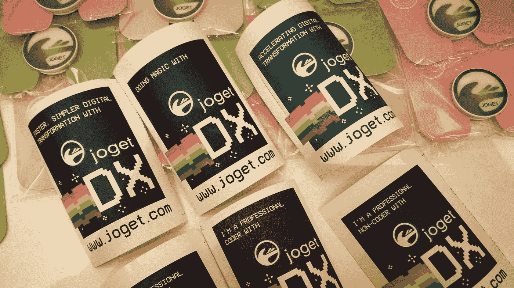
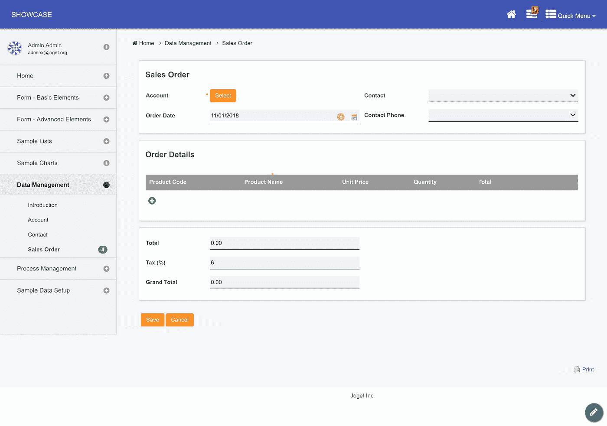
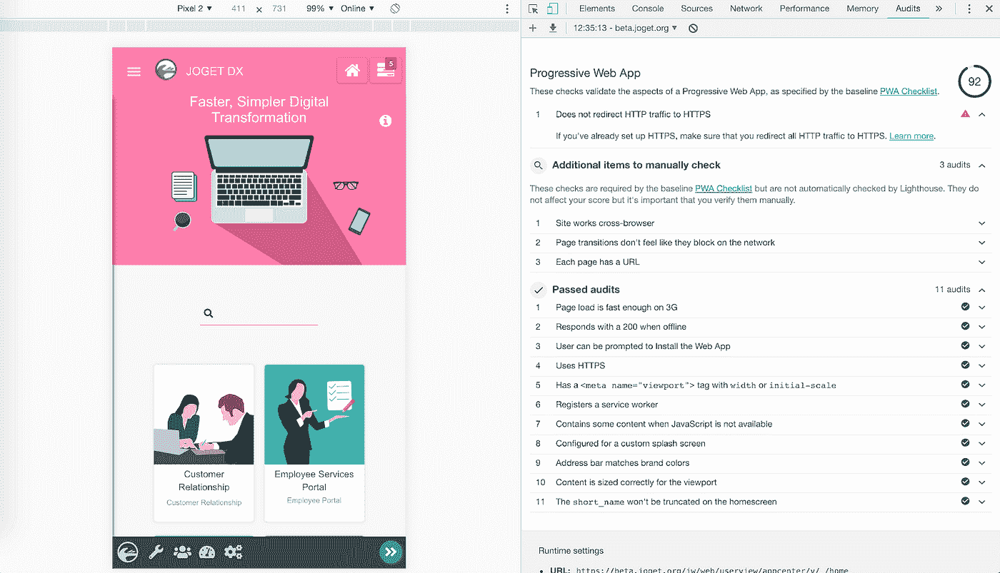
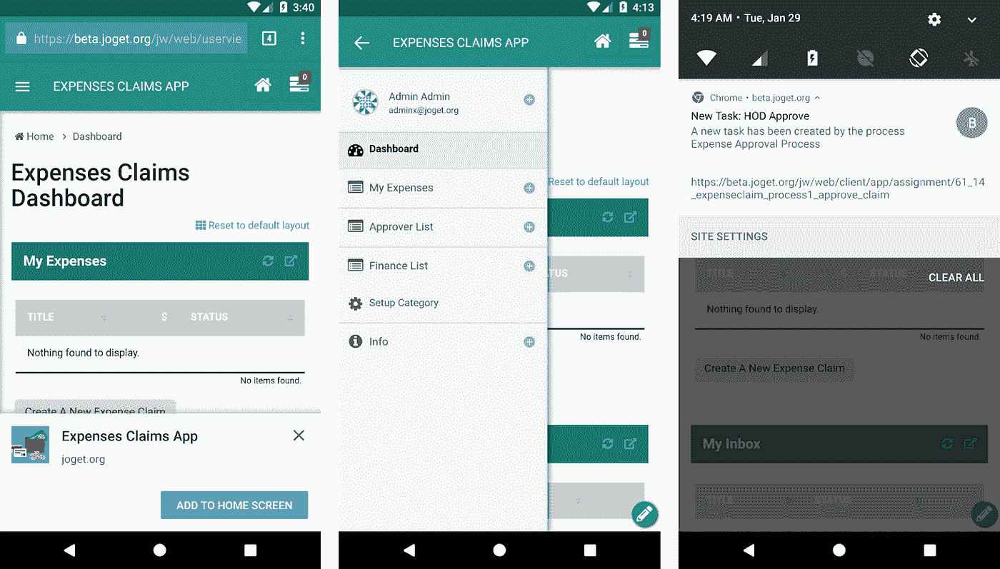
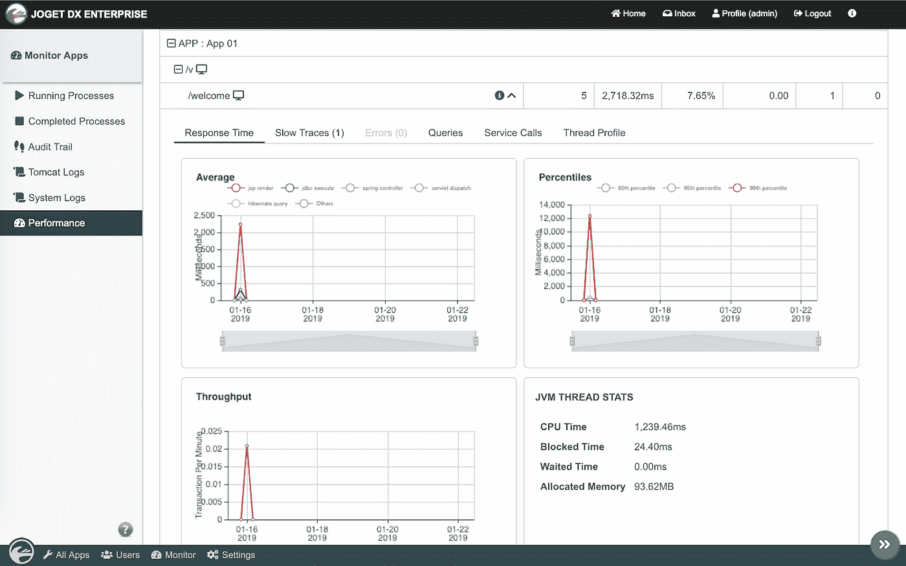
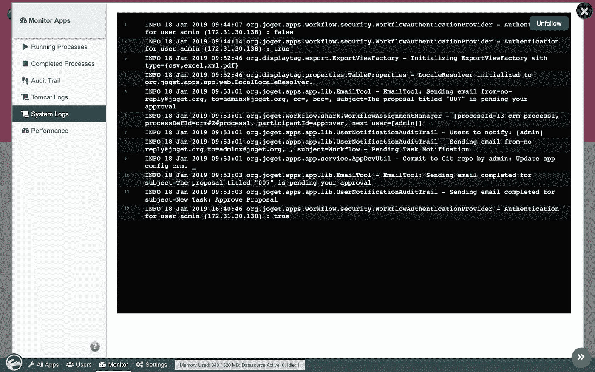
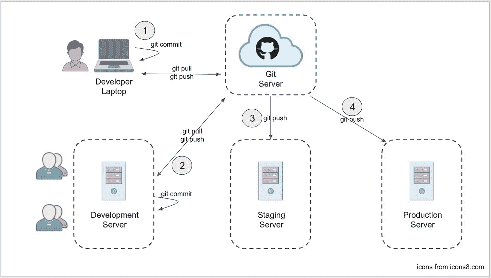
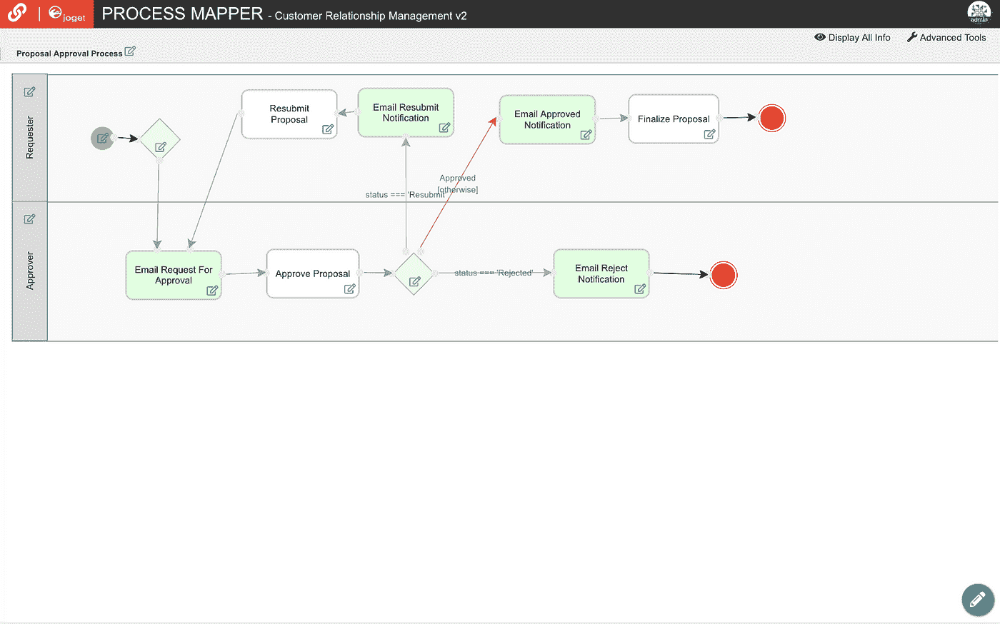
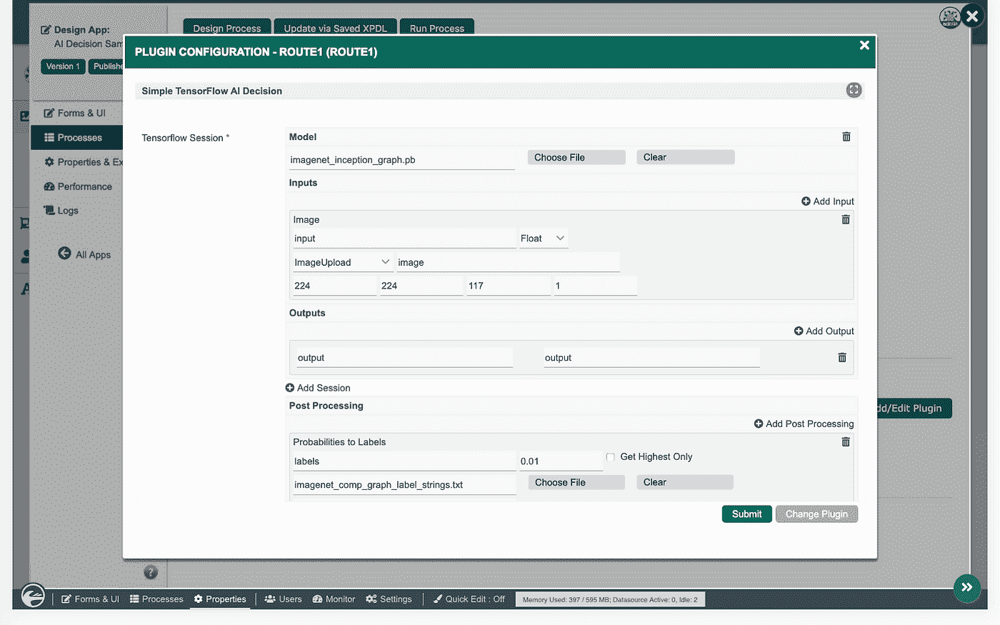
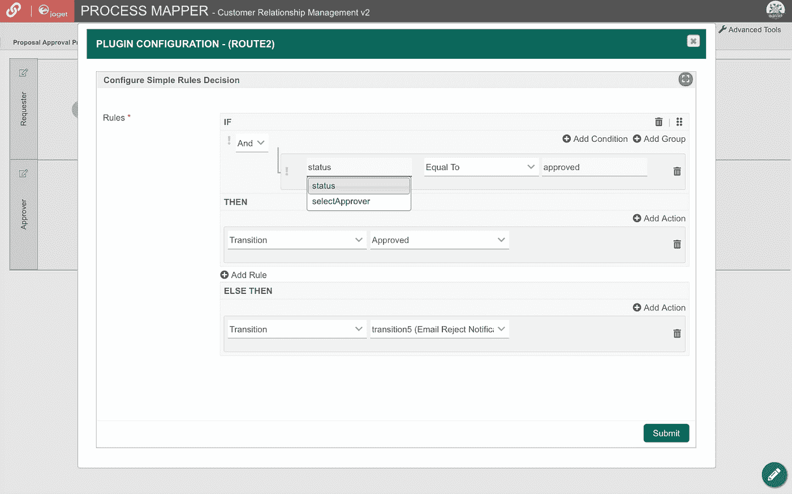

# Joget DX 开源数字转换平台现可预览

> 原文：<https://medium.com/hackernoon/joget-dx-open-source-digital-transformation-platform-now-available-for-preview-eb9f82f30a02>

Joget 团队自豪地宣布, **Joget DX** 的第一个预览版现已可供下载！

# Joget DX 是什么？

**Joget DX** 是下一代[开源](https://hackernoon.com/tagged/open-source)应用[平台](https://hackernoon.com/tagged/platform)用于更快、更简单的数字转换(DX)。Joget DX 将**业务流程自动化**、**工作流管理**和**低代码应用开发**的精华结合在一个简单、灵活、开放的平台上。有了 Joget DX，业务和技术团队可以随时随地以可视化方式协作快速构建成熟的企业应用程序。

Joget 于 2009 年在 SourceForge 上作为开源 [Joget 工作流项目启动。Joget 最初是一个用于业务流程自动化的工作流引擎，在 2011 年的第三个主要版本 Joget Workflow v3 中发展成为一个成熟的应用程序开发平台，这甚至可以追溯到 Forrester 在 2014 年创造“低代码”一词之前。](http://joget%20workflow%20project%20on%20sourceforge/)

自成立以来，已有近 200，000 次开源下载和超过 10，000 名社区成员，最新的主要版本 [Joget Workflow v6](https://www.joget.org/joget-workflow-v6/) 于 2018 年推出，重点关注现代用户体验(UX)以及应用程序可维护性和性能。Joget DX 是 Joget Workflow 的下一代继任者。从工作流到数字化转型(DX)，产品名称的变化反映了该平台提供的完整数字化转型能力。

# Joget DX 有什么新功能？

Joget DX 强调以下重点领域:

1.  用户体验(UX)和渐进式网络应用(PWA)
2.  开发运维与应用性能管理(APM)
3.  人工智能(AI)和智能决策

# 用户体验(UX)和渐进式网络应用(PWA)

# 增强的桌面和移动用户体验

Joget DX 包括一个新的默认渐进式应用主题，灵感来自谷歌的材料设计，以促进美丽的设计和良好的 UX。管理员和应用程序设计者界面也得到了增强，提高了可用性和直观性。

# 渐进式 Web 应用程序(PWA)支持

渐进式网络应用(PWA)是移动应用和网络的未来，由业界重量级人物推动，尤其是谷歌。Joget DX 应用程序自动整合 PWA 功能，因此所有应用程序都将符合 PWA 基线，而无需额外的步骤。

# Web 推送通知和离线支持

通过添加到主屏幕、离线支持、推送通知等功能，PWA 兼容的 Joget 应用程序提供了接近原生移动应用程序的用户体验。

# 开发运维与应用性能管理(APM)

# 内置的应用程序性能管理

Joget DX 集成了内置的[应用性能管理(APM)](https://blog.joget.org/2019/01/application-performance-management.html) 特性，可以自动监控系统和应用性能。监控在运行时完成，可以为包括错误在内的各种指标配置警报，以便在超过阈值时发送电子邮件通知。

# Web 应用程序日志查看器

日志监控仍然是发现和查看错误的重要方式，Joget DX 在 web 控制台中提供了实时的日志流，以便于查看和访问。

# 用于协作开发和部署的嵌入式 Git 集成

Git 是当今最流行的免费开源版本控制系统。Joget DX 在幕后提供了与 Git 的自动集成。所有应用程序定义和组件都存储在文件系统中，并使用 Git 进行版本控制，因此应用程序可以由多个用户或团队协作构建。可以使用标准的 Git 命令自动或手动执行部署，还可以与持续集成和持续交付(CI/CD)管道集成。

# 人工智能(AI)和智能决策

# 流程决策插件

决策是任何业务中最重要的方面之一。作为流程自动化的一部分，Joget DX 提供了对决策插件的支持，这些插件可以映射到流程路线以进行决策。

# 捆绑无代码 TensorFlow AI 插件

TensorFlow 是领先的用于机器学习的开源[人工智能(AI)](https://blog.joget.org/2019/03/a-quick-introduction-to-ai.html) 库。Joget DX 中的人工智能重点是简化预先训练的人工智能模型与最终用户应用程序的集成。捆绑的 TensorFlow AI 插件提供了一种上传和执行预训练 TensorFlow 模型的无代码方法。

# 捆绑的无代码规则引擎插件

捆绑了一个简单的规则引擎决策插件，提供了一种无需代码即可配置的方法来定义流程中的路由和操作。

# 其他值得注意的平台升级

*   App Builder 高级工具中增强的权限管理
*   支持可插拔的应用构建器
*   升级的 JavaScript (JQuery、JQuery UI 和 Bootstrap)库

# Joget DX 入门

下载 [Joget DX 预览版](https://www.joget.org/joget-dx/#download)并在今天进行测试。此预览版旨在展示功能并提供对即将到来的产品创新的早期访问，允许社区测试功能并在开发过程中提供反馈。